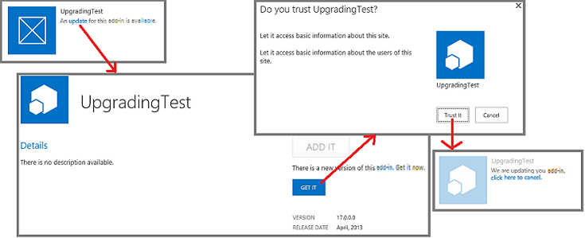
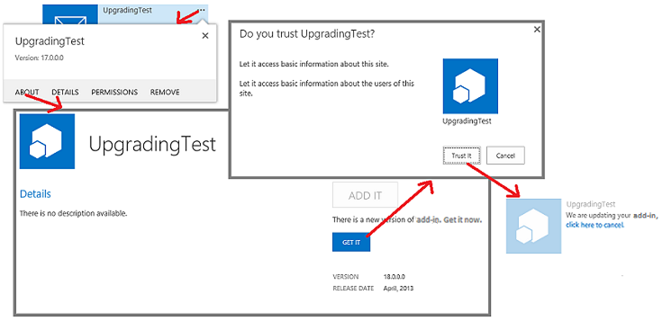

# Update SharePoint Add-ins
Learn how to create and deploy an update for a SharePoint Add-in.
 

 **Note**  The name "apps for SharePoint" is changing to "SharePoint Add-ins". During the transition, the documentation and the UI of some SharePoint products and Visual Studio tools might still use the term "apps for SharePoint". For details, see  [New name for apps for Office and SharePoint](new-name-for-apps-for-sharepoint.md#bk_newname).
 

You can update your SharePoint Add-in by using the updating support built into SharePoint. Within 24 hours after you upload an updated version of the add-in to the organization's add-in catalog or the add-in is accepted at the Office Store, a notification that an update is available appears next to the add-in on  **Site Contents** page of every website where it is installed. As you can see in Figure 1, a link is provided for users to immediately install the update.
 

**Figure 1. Add-in for SharePoint update process**

 

 

 
A user can install the update without first uninstalling the earlier version. The update infrastructure tests the update installation and rolls it back if there are any errors.
 

    
 **Important**  You cannot change the  *add-in type*  using the update system. For example, you cannot change an add-in from SharePoint-hosted to provider-hosted with an update. To make a change of type, you need to [migrate from an old add-in to a new one](sharepoint-add-ins-update-process.md#Major). In particular, since  [the preview program for autohosted add-ins has been closed](http://blogs.office.com/2014/05/16/update-on-autohosted-apps-preview-program/), you should be aware that you cannot update an autohosted add-in to a provider-hosted add-in. You have to convert the add-in as explained in  [Convert an autohosted SharePoint Add-in to a provider-hosted add-in](convert-an-autohosted-sharepoint-add-in-to-a-provider-hosted-add-in.md).
 

## Prerequisites for updating a SharePoint Add-in

 

 

- A test SharePoint installation that is configured for add-in isolation. See  [Set up a development environment for SharePoint Add-ins on Office 365](set-up-a-development-environment-for-sharepoint-add-ins-on-office-365.md) for instructions on how to set up an Office 365 Developer Site.
    
 
- Tools that are used in creating a SharePoint Add-in are usually also used in updating it. For example, most developers use Visual Studio and Microsoft Office Developer Tools for Visual Studio to create SharePoint Add-ins.
    
 

### Core concepts to know to update a SharePoint Add-in

 

 

**Table 1. Core concepts for updating a SharePoint Add-in**

|**Article title**|**Description**|
|:-----|:-----|
| [Choose patterns for developing and hosting your SharePoint Add-in](choose-patterns-for-developing-and-hosting-your-sharepoint-add-in.md)|Learn about the different types of SharePoint Add-ins. The updating process varies depending on the type.|
| [SharePoint Add-ins update process](sharepoint-add-ins-update-process.md)|Learn about the process for updating SharePoint Add-ins.|
| [Upgrading Features](http://msdn.microsoft.com/library/e917f709-6491-4d50-adbe-2ab8f35da990%28Office.15%29.aspx)|Learn how to update Features (SharePoint 2010 SDK).|
| [Deploying and installing SharePoint Add-ins: methods and options](deploying-and-installing-sharepoint-add-ins-methods-and-options.md)|Learn about the methods for publishing, installing, and uninstalling a SharePoint Add-in.|
| [Handle events in SharePoint Add-ins](handle-events-in-sharepoint-add-ins.md)|Learn about remote event receivers in SharePoint.|

## Major steps in updating an add-in

The following are the major steps that may be needed when you create an update for a SharePoint Add-in. Each step is discussed in detail in linked sections or articles. Not all the steps are required in every update project. What you must do depends on what components are already in your add-in and what components you are adding. Only the items marked with  ***** are always required.
 

 

- Update the add-in manifest.
    
      -  ***** Raise the **Version** number in the [App](http://msdn.microsoft.com/library/d5f30dfe-7500-5f85-0f08-f4f220c0c692%28Office.15%29.aspx) element of the appmanifest.xml file. (Add-ins were called "apps" when the schema was first released.) Do *not*  change the **ProductID** number.
    
 
  - Change the  [AppPermissionRequests](http://msdn.microsoft.com/library/4e617622-78d3-3d23-677d-9957eb1fb107%28Office.15%29.aspx) section of the appmanifest.xml file.
    
 
  - Change the  [AppPrerequisites](http://msdn.microsoft.com/library/7622b55f-01a1-2c39-9daa-7cfb1a3c890f%28Office.15%29.aspx) section of the appmanifest.xml file.
    
 

    For more information, see  [Update the add-in version, permission requests, and prerequisites](#UpdateManifest).
    
 
- Add or update the markup for add-in web components. For more information, see  [Update add-in web components in SharePoint](update-add-in-web-components-in-sharepoint-2013.md).
    
 
- Add or update the markup for host web components. For more information, see  [Update host web components in SharePoint](update-host-web-components-in-sharepoint-2013.md).
    
 
- Add custom logic to an  [UpgradedEventEndpoint](http://msdn.microsoft.com/library/09a93d44-d295-47bb-f91c-d243178b0f53%28Office.15%29.aspx) and register it in the appmanifest.xml file. For more information, see [Create a handler for the update event in SharePoint Add-ins](create-a-handler-for-the-update-event-in-sharepoint-add-ins.md).
    
 
- Update the remote components:
    
      - For a provider-hosted add-in, update the remote components using the techniques appropriate for the hosting platform stack.
    
 

    For more information, see  [Update remote components in SharePoint Add-ins](update-remote-components-in-sharepoint-add-ins.md).
    
 
-  ***** Upload the add-in package to the Office Store or the organization's add-in catalog.
    
 

## Best practices for add-in updates

The following sections discuss practices you should follow and important points to consider as you are planning an update.
 

 

### Decide whether you really have to update

For a provider-hosted SharePoint Add-in, improvements to the add-in do not necessarily require updating the add-in. If all the changes are to remote components, and those changes don't have to be reflected in SharePoint components, you can change the remote components without updating the add-in. As long as the URLs and connection strings that the SharePoint components use to access the remote components do not change, the SharePoint Add-in continues to work. For example, suppose that you add a button to a remote web application that reads a column from a SharePoint list that the web application did not previously read. If the column already exists on the list, you do not have to change anything in SharePoint. You can upload the revised webpage, and the revised code behind or JavaScript, to the remote web application. The new functionality is immediately available to users when they start the SharePoint Add-in.
 

 

### Remember that updating is optional for users

When a new version of your SharePoint Add-in becomes available in the Office Store or the organization's add-in catalog, a message appears on the add-in's tile on the  **Site Contents** page informing users that an update is available. It takes no more than 24 hours for this message to appear. But nothing in the SharePoint infrastructure forces users to update. So changes that you make to remote components must not break the older versions of the add-in. A general, but not quite universal, rule is that you should *add*  things to remote components, but avoid deleting, renaming, moving, or changing the schema, connection string, or URL of any existing component.
 

 
If a remote component needs to know the version of the add-in instance that is calling it, you can pass this information from SharePoint. For example, you can add the add-in version as a query parameter on the  [StartPage](http://msdn.microsoft.com/library/3092674c-a6c3-9021-3d7e-e716562a4a4f%28Office.15%29.aspx) URL of the add-in.
 

 

### Create and debug the new version as if it were a brand new add-in

You should separate the development and debugging of the new version of the add-in from the debugging of the update markup and logic. To do this, uninstall the earlier version of the add-in from your development test SharePoint site. Save a backup copy of the add-in package file for the earlier version. Add and change components of the add-in as needed, and then test and debug them against the test site as if it is a brand new add-in you are creating from scratch.
 

 

### Test the update with each earlier version of the add-in

When the new version of the add-in is functioning correctly as a "new" add-in, restructure the code and markup so that the project is an update of the old add-in. For example, increment the add-in version number as indicated in  [Major steps in updating an add-in](#MajorAppUpgradeSteps). For more information about turning the project into an update, see the child topics of this topic.
 

 
When you are ready to test your update, retract the new version from the test site and redeploy the earlier version so you can test update logic. If you have shipped multiple previous versions of the add-in, install each earlier version on a different subweb of your test site. Then upload the latest version of the add-in to your test site's add-in catalog and update every instance of the add-in. Verify that each has the latest add-in version number and the latest version of all components. If there is an add-in web in the add-in, verify that the add-in web components have been deployed using the procedure in  [Verify deployment of add-in web components](update-add-in-web-components-in-sharepoint-2013.md#VerifyDeployAppWebComp).
 

 

### Update an add-in without waiting 24 hours

When developing an update for an add-in on your SharePoint test site, it is impractical to wait 24 hours between updates. You (and users on a production SharePoint site) can update an add-in immediately after it is uploaded to the Office Store or the organization's add-in catalog with these steps:
 

 

### To immediately update an add-in

1. After the latest update is uploaded to the add-in catalog, open the  **Site Contents** page on the website where the add-in is installed and choose the **...** button on the add-in's tile.
    
 
2. On the callout that opens, choose the  **About** tab. On the **About** page that opens, there is a notice that a new version is available.
    
 
3. Choose the  **Get It** button. The **Site Contents** page reopens, and there is a notice on the add-in's tile that the add-in is being updated.
    
 
Figure 2 illustrates these steps.
 

 

**Figure 2. Process of immediately updating a SharePoint Add-in**

 

 

 

    
 **Note**  If you need to see the "update available" notice on the add-in's tile more frequently than every 24 hours, you can use the method described in  [Update process for a SharePoint Add-in](sharepoint-add-ins-update-process.md#Minor) to make the notice appear immediately.
 

## Update the add-in version, permission requests, and prerequisites

After making a backup copy of the Visual Studio project folder, open the add-in project. Open add-in manifest and raise the version number on the  **General** tab of the manifest designer.
 

 
If the updated version of the add-in needs more (or fewer) permissions to components of the host web, make changes as needed to the  [AppPermissionRequests](http://msdn.microsoft.com/library/4e617622-78d3-3d23-677d-9957eb1fb107%28Office.15%29.aspx) section of the add-in. In Visual Studio, use the **Permissions** tab of the manifest designer. When an add-in is updated, the user is always prompted to grant permissions, whether the permissions have changed or not since the previous version. If the new version requests *fewer*  permissions than the preceding version, the additional permissions of the preceding version *are not revoked*  . The only way to restrict the add-in to the permissions that the latest version needs, is for a user to open the page *{SharePointDomain}*  `/_layouts/15/appinv.aspx` after the add-in has been updated, and then manually enter permission markup that conforms to the [AppPermissionRequests](http://msdn.microsoft.com/library/4e617622-78d3-3d23-677d-9957eb1fb107%28Office.15%29.aspx) schema.
 

 
If the updated version of the add-in has prerequisites that the earlier versions did not have (or no longer has some prerequisites that earlier versions had), make changes as needed to the  [AppPrerequisites](http://msdn.microsoft.com/library/7622b55f-01a1-2c39-9daa-7cfb1a3c890f%28Office.15%29.aspx) section of the add-in. In Visual Studio, use the **Prerequisites** tab of the manifest designer.
 

 

## Next steps

Continue with the next bullet in the section  [Major steps in updating an add-in](#MajorAppUpgradeSteps) or go directly to one of the following articles:
 

 

-  [Update add-in web components in SharePoint](update-add-in-web-components-in-sharepoint-2013.md)
    
 
-  [Update host web components in SharePoint](update-host-web-components-in-sharepoint-2013.md)
    
 
-  [Create a handler for the update event in SharePoint Add-ins](create-a-handler-for-the-update-event-in-sharepoint-add-ins.md)
    
 
-  [Update remote components in SharePoint Add-ins](update-remote-components-in-sharepoint-add-ins.md)
    
 

## Additional resources

-  [Develop SharePoint Add-ins](develop-sharepoint-add-ins.md)
    
 
-  [SharePoint Add-ins update process](sharepoint-add-ins-update-process.md)
    
 

