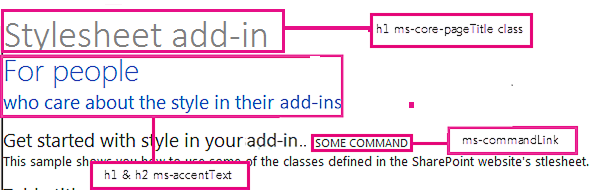
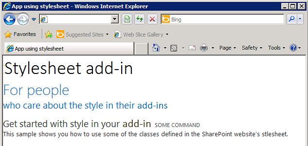

# Use a SharePoint website's style sheet in SharePoint Add-ins
Learn how to use a SharePoint website's style sheet in a SharePoint Add-in.
 

 **Note**  The name "apps for SharePoint" is changing to "SharePoint Add-ins". During the transition, the documentation and the UI of some SharePoint products and Visual Studio tools might still use the term "apps for SharePoint". For details, see  [New name for apps for Office and SharePoint](new-name-for-apps-for-sharepoint.md#bk_newname).
 

You can reference the style sheet of a SharePoint website in your SharePoint Add-in and use it to style your webpages by using the style sheet in SharePoint. In addition, if someone changes the SharePoint website's style sheet or theme, you can adopt the new set of styles in your add-in without modifying the style sheet reference in your add-in.
 

 **Important**  If your webpages use the chrome control or the add-in master page, the styles are already available for you to use, and you don't have to reference the style sheet manually by using the procedure in this article. 
 


## Prerequisites for using the examples in this article
<a name="SP15Usestylesheetcontrol_Prereq"> </a>

You need a development environment as explained in  [Get started creating provider-hosted SharePoint Add-ins](get-started-creating-provider-hosted-sharepoint-add-ins.md).
 

 

### Core concepts to know before using the SharePoint style sheet in a SharePoint Add-in

The following table lists useful articles that can help you understand the concepts involved in a scenario that uses the SharePoint style sheet.
 

 

**Table 1. Core concepts before using the style sheet**


|**Article title**|**Description**|
|:-----|:-----|
| [SharePoint Add-ins](sharepoint-add-ins.md)|Learn about the new add-in model in SharePoint that enables you to create add-ins, which are small, easy-to-use solutions for end users.|
| [UX design for SharePoint Add-ins](ux-design-for-sharepoint-add-ins.md)|Learn about the user experience (UX) options and alternatives that you have when building SharePoint Add-ins.|
| [Host webs, add-in webs, and SharePoint components in SharePoint](host-webs-add-in-webs-and-sharepoint-components-in-sharepoint.md)|Learn about the difference between host webs and add-in webs. Find out which SharePoint components can be included in a SharePoint Add-in, which components are deployed to the host web, which components are deployed to the add-in web, and how the add-in web is deployed in an isolated domain.|

## Code example: Use a SharePoint website's style sheet in a SharePoint Add-in
<a name="SP15Usestylesheetcontrol_Example"> </a>

This code example shows you how to use the SharePoint website's stylesheet. This enables your remote web application pages to match the look-and-feel of the pages in the SharePoint host web.
 

 
To use the style sheet in a SharePoint Add-in, follow these steps:
 

 

1. Create the provider-hosted SharePoint Add-in.. 
    
 
2. Force the add-in web provisioning by creating a blank page.
    
 
3. Add a webpage to the web project, and reference the style sheet.
    
 
4. Edit the element in the add-in manifest.
    
 
Figure 1 shows a SharePoint webpage that is using the style sheet.
 

 

**Figure 1. Webpage using the style sheet**

 

 

 

### To create the SharePoint Add-in and remote web projects


1. Open Visual Studio as administrator. (To do this, right-click the Visual Studio icon on the  **Start** menu, and choose **Run as administrator**.)
    
 
2. Create the provider-hosted SharePoint Add-in as explained in  [Get started creating provider-hosted SharePoint Add-ins](get-started-creating-provider-hosted-sharepoint-add-ins.md) and name itStylesheetAdd-in. 
    
 

### To force the add-in web provisioning by creating a blank page


1. Right-click the SharePoint Add-in project, and add a new module.
    
 
2. Right-click the new module, and add a new item.
    
 
3. Under  **Visual C# items**,  **Web**, choose  **HTML Page**. Rename the page to  **blank.html**.
    
 
4. Delete the contents of blank.html.
    
 

### To add a webpage that references the style sheet in the web project


1. Right-click the web project, and add a new Web Form. Rename the Web Form to  **StyleConsumer.aspx**.
    
 
2. Replace the contents of the Web Form .aspx file with the following code. The code performs the following tasks:
    
      - Loads the blank.html page from the add-in web in an invisible IFrame.
    
 
  - Loads the defaultcss.ashx file from the add-in web.
    
 
  - Uses the available styles.
    
 

```
  <%@ Page Language="C#" AutoEventWireup="true" CodeBehind="StyleConsumer.aspx.cs" Inherits="StylesheetAppWeb.StyleConsumer" %>

<!DOCTYPE html>
<html>
<head>
    <title>Add-in using stylesheet</title>
</head>
<body>

    <!-- The main page title -->
    <h1 class="ms-core-pageTitle">Stylesheet add-in</h1>

    <!-- Some subtitle -->
    <h1 class="ms-accentText">For people</h1>

    <!-- Subtitle comments -->
    <h2 class="ms-accentText">who care about the style in their add-ins</h2>
    <p></p>
    <div>
        <h2 class="ms-webpart-titleText">Get started with style in your add-in... </h2>
        <a class="ms-commandLink" href="#">some command</a>
        <br />
        This sample shows you how to use some of the classes defined in the SharePoint website's style sheet.
    </div>

    <!-- Script to load SharePoint resources
        and load the blank.html page in
        the invisible iframe
        -->
    <script type="text/javascript">
        "use strict";
        var appweburl;

        (function () {
            var ctag;

            // Get the URI decoded add-in web URL.
            appweburl =
                decodeURIComponent(
                    getQueryStringParameter("SPAppWebUrl")
            );
            // Get the ctag from the SPClientTag token.
            ctag =
                decodeURIComponent(
                    getQueryStringParameter("SPClientTag")
            );

            // The resource files are in a URL in the form:
            // web_url/_layouts/15/Resource.ashx
            var scriptbase = appweburl + "/_layouts/15/";

            // Dynamically create the invisible iframe.
            var blankiframe;
            var blankurl;
            var body;
            blankurl = appweburl + "/Pages/blank.html";
            blankiframe = document.createElement("iframe");
            blankiframe.setAttribute("src", blankurl);
            blankiframe.setAttribute("style", "display: none");
            body = document.getElementsByTagName("body");
            body[0].appendChild(blankiframe);

            // Dynamically create the link element.
            var dclink;
            var head;
            dclink = document.createElement("link");
            dclink.setAttribute("rel", "stylesheet");
            dclink.setAttribute("href", scriptbase + "defaultcss.ashx?ctag=" + ctag);
            head = document.getElementsByTagName("head");
            head[0].appendChild(dclink);
        })();

        // Function to retrieve a query string value.
        // For production purposes you may want to use
        //  a library to handle the query string.
        function getQueryStringParameter(paramToRetrieve) {
            var params;
            var strParams;

            params = document.URL.split("?")[1].split("&amp;");
            strParams = "";
            for (var i = 0; i < params.length; i = i + 1) {
                var singleParam = params[i].split("=");
                if (singleParam[0] == paramToRetrieve)
                    return singleParam[1];
            }
        }
    </script>
</body>
</html>

```


    In some cases, the user has to be authenticated to SharePoint before your page will be able to download the CSS and images for styling. Link tags do not automatically authenticate a user who is not already signed in. Consider loading a page resource from the add-in web in your webpage to force the user's authentication before linking to the CSS file. In this example, the blank.html page is loaded in an invisible IFrame.
    
 

### To edit the StartPage element in the add-in manifest


1. Double-click the  **AppManifest.xml** file in **Solution Explorer**.
    
 
2. On the  **Start page** drop-down menu, choose the webpage that uses the style sheet.
    
 

### To build and run the solution


1. Make sure that the SharePoint Add-in project is set as the startup project.
    
 
2. Press the F5 key.
    
     **Note**  When you press F5, Visual Studio builds the solution, deploys the add-in, and opens the permissions page for the add-in.
3. Choose the  **Trust It** button.
    
 
4. Click the  **StylesheetBasic** add-in icon.
    
 
5. Figure 2 shows the resulting webpage using the SharePoint styles.
    
    **Figure 2. Style sheet used in the page**

 

  
 

 

 
6. You can also go to the host web and change the theme. Then reload the add-in webpage to use the new styles.
    
 

**Table 2. Troubleshooting the solution**


|**Problem**|**Solution**|
|:-----|:-----|
|Visual Studio does not open the browser after you press the F5 key.|Set the SharePoint Add-in project as the startup project.|
|Certificate error.|Set the  **SSL Enabled** property of your web project to false. In the SharePoint Add-in project, set the **Web Project** property toNone, and then set the property back to your web project's name.|

## Next steps
<a name="SP15Usestylesheetcontrol_Nextsteps"> </a>

This article demonstrated how to use the style sheet in a SharePoint Add-in. As a next step, you can learn about other UX components that are available for SharePoint Add-ins. To learn more, see the following:
 

 

-  [Code sample: Use the SharePoint style sheet in an add-in](http://code.msdn.microsoft.com/SharePoint-Use-the-7a8684e2)
    
 
-  [Use the client chrome control in SharePoint Add-ins](use-the-client-chrome-control-in-sharepoint-add-ins.md)
    
 
-  [Create custom actions to deploy with SharePoint Add-ins](create-custom-actions-to-deploy-with-sharepoint-add-ins.md)
    
 
-  [Create add-in parts to install with your SharePoint Add-in](create-add-in-parts-to-install-with-your-sharepoint-add-in.md)
    
 

## Additional resources
<a name="SP15Usestylesheetcontrol_Addresources"> </a>


-  [UX design for SharePoint Add-ins](ux-design-for-sharepoint-add-ins.md)
    
 
-  [SharePoint Add-ins UX design guidelines](sharepoint-add-ins-ux-design-guidelines.md)
    
 
-  [Create UX components in SharePoint](create-ux-components-in-sharepoint.md)
    
 
-  [Three ways to think about design options for SharePoint Add-ins](three-ways-to-think-about-design-options-for-sharepoint-add-ins.md)
    
 
-  [Important aspects of the SharePoint Add-in architecture and development landscape](important-aspects-of-the-sharepoint-add-in-architecture-and-development-landscap.md)
    
 

