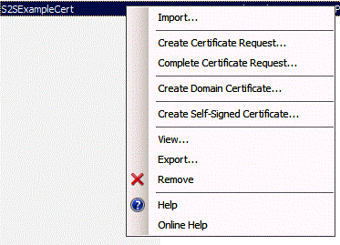

# Use an Office 365 SharePoint site to authorize provider-hosted add-ins on an on-premises SharePoint site
Use an Office 365 SharePoint site to create an environment where you can use ACS to establish trust between a provider-hosted add-in and an on-premises SharePoint 2013 farm, just as you would if you were developing add-ins for an Office 365 SharePoint site.
 

 **Note**  The name "apps for SharePoint" is changing to "SharePoint Add-ins". During the transition, the documentation and the UI of some SharePoint products and Visual Studio tools might still use the term "apps for SharePoint". For details, see  [New name for apps for Office and SharePoint](new-name-for-apps-for-sharepoint.md#bk_newname).
 


## Prerequisites for using ACS with provider-hosted add-ins in on-premises environments
<a name="Prerequisites"> </a>

Be sure that you have the following.
 

 

- An on-premises SharePoint 2013 development environment. See  [Set up an on-premises development environment for SharePoint Add-ins](set-up-an-on-premises-development-environment-for-sharepoint-add-ins.md).
    
 
- An Office 365 SharePoint site. If don't have one yet and you want to set up a development environment quickly, you can  [Set up a development environment for SharePoint Add-ins on Office 365](set-up-a-development-environment-for-sharepoint-add-ins-on-office-365.md).
    
 
-  [Visual Studio 2012](https://www.microsoft.com/en-us/download/details.aspx?id=30682) installed either remotely or on the computer where you installed SharePoint 2013.
    
 
-  [Microsoft Office Developer Tools for Visual Studio 2012](https://msdn.microsoft.com/en-us/office/aa905340.aspx) .
    
 
- The 64-bit edition of  [Microsoft Online Services Sign-In Assistant.](http://www.microsoft.com/en-us/download/details.aspx?id=41950) installed on the computer where you installed SharePoint 2013.
    
 
-  [Microsoft Online Services Module for Windows Powershell (64-bit)](http://go.microsoft.com/fwlink/p/?linkid=236297) installed on the computer where you installed SharePoint 2013.
    
 

## Create a certificate and make it the security token service (STS) certificate of your on-premises installation of SharePoint 2013
<a name="Certificate"> </a>

You'll need to replace the default security token service (STS) certificate of your on-premises installation of SharePoint 2013 with your own certificate. This article gives you an example of how to create and export a test certificate by using the  **Create Self Signed Certificate** option in IIS. You can also use a commercial certificate issued by a certificate authority.
 

 
 [Create a test .pfx certificate file first, and then a corresponding test .cer file](http://msdn.microsoft.com/en-us/library/windows/hardware/ff552299%28v=vs.85%29.aspx). 
 

 
 [You can also use the MakeCert test program to generate a test X.509 certificate](http://msdn.microsoft.com/en-us/library/ms537364%28VS.85%29.aspx). 
 

 

### To create a test .pfx certificate file


1. In IIS Manager, select the  _ServerName_ node in the tree view on the left.
    
 
2. Choose  **Server Certificates**, as shown in Figure 1.
    
    **Figure 1. Server Certificates option in IIS**

 

  
 

 

 
3. Click the  **Create Self-Signed Certificate** link in the set of links on the right side, as shown in Figure 2.
    
    **Figure 2. Create Self-Signed Certificate link**

 

  
 

 

 
4. Name the certificate SampleCert, and then choose  **OK**.
    
 
5. Right-click the certificate, and then choose  **Export**, as shown in Figure 3.
    
    **Figure 3. Exporting a test certificate**

 

  
 

 

 
6. Export the file to a location you choose and give it a password. In this example, the password is  **password**. In a production environment, use a strong password. See [Guidelines for creating strong passwords](http://msdn.microsoft.com/en-us/library/bb416446.aspx) and [Strong passwords](http://msdn.microsoft.com/en-us/library/ms161962.aspx).
    
 

## Make your certificate the STS certificate for your on-premises installation of SharePoint 2013
<a name="STSCertificate"> </a>

Now that you have a certificate, you make it the STS certificate for your on-premises SharePoint farm. 
 

 
Open the SharePoint Management Shell as an administrator and run this Windows PowerShell script.
 

 


```
$certPrKPath = "c:\location of your .pfx file"
$certPassword = "password"
$stsCertificate = New-Object System.Security.Cryptography.X509Certificates.X509Certificate2 $certPrKPath, $certPassword, 20
Set-SPSecurityTokenServiceConfig -ImportSigningCertificate $stsCertificate -confirm:$false

```


 **Note**  The  [Configure a one-way hybrid environment with SharePoint Server 2013 and Office 365](http://download.microsoft.com/download/6/4/4/644BA525-96CB-4739-B08F-18949A9BDADC/sps-2013-config-one-way-hybrid-environment.docx) document that is available for download on the [SharePoint 2013 hybrid resources page](http://www.microsoft.com/en-us/download/details.aspx?id=35593) explains in greater detail how to replace the default STS certificate of your on-premises farm with a certificate from a well-known certification authority or a self-signed certificate.
 


## Configure your on-premises installation of SharePoint 2013 to use ACS
<a name="ConnectAAD"> </a>

Figure 4 shows the four steps to enable the connections you need within the overall architecture of a provider-hosted add-in that runs on an on-premises site. It also shows the flow of OAuth tokens when the add-in is running.
 

 

**Figure 4. Make ACS work with an on-premises installation of SharePoint by using an Office 365 SharePoint site**

 

 

 

 

1. Create an ACS proxy in your on-premises SharePoint 2013 farm.
    
 
2. Install the signing certificate of your on-premises server to your Office 365 tenancy.
    
 
3. Add the fully qualified domain names of the sites on your SharePoint 2013 farm where you want to run add-ins to the service principal name collection in your Office 365 tenancy.
    
 
4. Create an add-in management proxy on your SharePoint 2013 farm.
    
 
The function below does all the work to configure your on-premises SharePoint 2013 site to use ACS. You can also use this function to do some cleanup tasks if you need to remove previous configurations. There are a variety of ways to run the function in PowerShell. The following is one method:
 

 

 

1. On the on-premises SharePoint server, copy the code in the function into a text file and save it with the name MySharePointFunctions.psm1 to one or the other of the following folders (not both). You may have to create parts of the path, if it includes folders that do not already exist. Notice that in both cases, the lowest folder in the path has to have the same name as the file.
    
     **Tip**  The file has to be saved as ANSI format, not UTF-8. PowerShell may give syntax errors when it loads a file with a non-ANSI format. Windows NotePad will default to saving it as ANSI. If you use any other editor to save the file, be sure you are saving it as ANSI.

      -  `C:\users\username\documents\windowspowershell\modules\MySharePointFunctions`, where  _username_ is the farm administrator who will be executing the file.
    
 
  -  `C:\windows\system32\windowspowershell\V1.0\modules\MySharePointFunctions`
    
 
2. Open the SharePoint Management Shell as an administrator and run the following cmdlet to verify that the MySharePointFunctions module is listed.
    
```
  Get-Module -listavailable
```

3. Run the following cmdlet to import the module.
    
```
  Import-Module MySharePointFunctions
```

4. Run the following cmdlet to verify that the Connect-SPFarmToAAD function is listed as part of the module:
    
```
  Get-Command -module MySharePointFunctions
```

5. Run the following cmdlet to verify that the Connect-SPFarmToAAD function is loaded.
    
```
  ls function:\ | where {$_.Name -eq "Connect-SPFarmToAAD"}
```

6. Run the  `Connect-SPFarmToAAD` function. Be sure to provide the required parameters and any optional parameters that apply to your developer environment. See the next section for details and examples.
    
 

 

 

### Connect-SPFarmToAAD function parameters
<a name="parameters"> </a>


|**Parameter**|**Value**|
|:-----|:-----|
| `-AADDomain` (required)|The *.onmicrosoft.com domain that you created when you signed up for your Office 365 site ( _yourcustomdomain_.onmicrosoft.com). When the script prompts you to authenticate, use the user name and password that you created for this domain:  _username_@ _yourcustomdomain_.onmicrosoft.com.|
| `-SharePointOnlineUrl` (required)|The URL of your Office 365 SharePoint site ( _https://yourcustomdomain_.sharepoint.com). Note that parent domain is  *not*  onmicrosoft.com.|
| `-SharePointWeb` (sometimes required)|The full URL (including protocol) of the on-premises SharePoint web application where you'll run provider-hosted add-ins. This function adds only one SharePoint web application from your on-premises farm to ACS. If you don't specify a value for this, the script selects the first web application in your farm. If you're using a Host Name Site Collection (HNSC) that can be defined with a wildcard (such as  _http://*.contoso.com_), you can use that string as the value for this parameter. If the web application has an alternative access mapping (AAM) for the Internet zone, you must use that AAM URL for this parameter. If the SharePoint web application is not configured for HTTPS, you have to use HTTP as the protocol and  *you have to use the -AllowOverHttp switch (see below in this table).* If you want to run provider-hosted add-ins that use ACS on more web applications in your farm, you'll need to add them to the service principal name collection. The Windows PowerShell script that follows the  `Connect-SPFarmToAAD` function below shows you how to add all of the web applications on your farm to the service principal name collection.|
| `-AllowOverHttp` (optional)|Use this switch if you're working with a developer environment and don't want to use SSL with your add-ins. You have to use this switch if the SharePoint web application is not configured for HTTPS.|
| `-O365Credentials` (optional)|The first character is a capital "O", not a zero. If you find yourself repeatedly running the script for debugging purposes, this switch enables to you avoid having to manually enter your O365 name and password each time. Before you can use this parameter, you must create the credentials object that you will assign to it with these cmdlets:```$User = "username@yourcustomdomain.onmicrosoft.com"$PWord = ConvertTo-SecureString -String "the_password" -AsPlainText -Force$Credential = New-Object -TypeName System.Management.Automation.PSCredential -ArgumentList $User, $PWord```Use  `$Credential` as the value of the `-O365Credentials` parameter.|
| `-Verbose` (optional)|This switch generates more detailed feedback which might help if the function is not working and you need to rerun it for debugging.|
| `-RemoveExistingACS` (optional)|Use this switch if you're replacing an existing connection to Microsoft Azure Active Directory. It removes an existing ACS proxy if you've already created one on your farm.|
| `-RemoveExistingSTS` (optional)|Use this switch if you're replacing an existing connection to Microsoft Azure Active Directory. It removes an existing trusted security token issuer that is left over from an earlier connection to ACS.|
| `-RemoveExistingSPOProxy` (optional)|Use this switch if you're replacing an existing connection to Microsoft Azure Active Directory. It removes an existing add-in management proxy if you've already created one on your farm.|
| `-RemoveExistingAADCredentials` (optional)|Use this switch if you're replacing the Office 365 SharePoint site.|
The following are examples:
 

 

```
Connect-SPFarmToAAD -AADDomain 'MyO365Domain.onmicrosoft.com' -SharePointOnlineUrl https://MyO365Domain.sharepoint.com

Connect-SPFarmToAAD -AADDomain 'MyO365Domain.onmicrosoft.com' -SharePointOnlineUrl https://MyO365Domain.sharepoint.com -SharePointWeb https://fabrikam.com

Connect-SPFarmToAAD -AADDomain 'MyO365Domain.onmicrosoft.com' -SharePointOnlineUrl https://MyO365Domain.sharepoint.com -SharePointWeb http://northwind.com -AllowOverHttp

Connect-SPFarmToAAD -AADDomain 'MyO365Domain.onmicrosoft.com' -SharePointOnlineUrl https://MyO365Domain.sharepoint.com -SharePointWeb http://northwind.com -AllowOverHttp -RemoveExistingACS -RemoveExistingSTS -RemoveExistingSPOProxy -RemoveExistingAADCredentials

```


### Connect-SPFarmToAAD function script
<a name="function"> </a>


```

function Connect-SPFarmToAAD {
param(
    [Parameter(Mandatory)][String]   $AADDomain,
    [Parameter(Mandatory)][String]   $SharePointOnlineUrl,
    #Specify this parameter if you don't want to use the default SPWeb returned
    [Parameter()][String]            $SharePointWeb,
    [Parameter()][System.Management.Automation.PSCredential] $O365Credentials,
    #Use these switches if you're replacing an existing connection to AAD.
    [Parameter()][Switch]            $RemoveExistingACS,
    [Parameter()][Switch]            $RemoveExistingSTS,
    [Parameter()][Switch]            $RemoveExistingSPOProxy,
    #Use this switch if you're replacing the Office 365 SharePoint site.
    [Parameter()][Switch]            $RemoveExistingAADCredentials,
    #Use this switch if you don't want to use SSL when you launch your app.
    [Parameter()][Switch]            $AllowOverHttp
)
    #Prompt for credentials right away.
    if (-not $O365Credentials) {
        $O365Credentials = Get-Credential -Message "Admin credentials for $AADDomain"
    }
    Add-PSSnapin Microsoft.SharePoint.PowerShell
    #Import the Microsoft Online Services Sign-In Assistant.
    Import-Module -Name MSOnline
    #Import the Microsoft Online Services Module for Windows Powershell.
    Import-Module MSOnlineExtended -force -verbose 
    #Set values for Constants.
    New-Variable -Option Constant -Name SP_APPPRINCIPALID -Value '00000003-0000-0ff1-ce00-000000000000' | Out-Null
    New-Variable -Option Constant -Name ACS_APPPRINCIPALID -Value '00000001-0000-0000-c000-000000000000' | Out-Null
    New-Variable -Option Constant -Name ACS_APPPROXY_NAME -Value ACS
    New-Variable -Option Constant -Name SPO_MANAGEMENT_APPPROXY_NAME -Value 'SPO Add-in Management Proxy'
    New-Variable -Option Constant -Name ACS_STS_NAME -Value ACS-STS
    New-Variable -Option Constant -Name AAD_METADATAEP_FSTRING -Value 'https://accounts.accesscontrol.windows.net/{0}/metadata/json/1'
    New-Variable -Option Constant -Name SP_METADATAEP_FSTRING -Value '{0}/_layouts/15/metadata/json/1'
    #Get the default SPWeb from the on-premises farm if no $SharePointWeb parameter is specified.
    if ([String]::IsNullOrEmpty($SharePointWeb)) {
        $SharePointWeb = Get-SPSite | Select-Object -First 1 | Get-SPWeb | Select-Object -First 1 | % Url
    }

    #Configure the realm ID for local farm so that it matches the AAD realm.
    $ACSMetadataEndpoint = $AAD_METADATAEP_FSTRING -f $AADDomain
    $ACSMetadata = Invoke-RestMethod -Uri $ACSMetadataEndpoint
    $AADRealmId = $ACSMetadata.realm

    Set-SPAuthenticationRealm -ServiceContext $SharePointWeb -Realm $AADRealmId
    
    $LocalSTS = Get-SPSecurityTokenServiceConfig
    $LocalSTS.NameIdentifier = '{0}@{1}' -f $SP_APPPRINCIPALID,$AADRealmId
    $LocalSTS.Update()

    #Allow connections over HTTP if the switch is specified.
    if ($AllowOverHttp.IsPresent -and $AllowOverHttp -eq $True) {
        $serviceConfig = Get-SPSecurityTokenServiceConfig
        $serviceConfig.AllowOAuthOverHttp = $true
        $serviceConfig.AllowMetadataOverHttp = $true
        $serviceConfig.Update()
    }

    #Step 1: Set up the ACS proxy in the on-premises SharePoint farm. Remove the existing ACS proxy
    #if the switch is specified.
    if ($RemoveExistingACS.IsPresent -and $RemoveExistingACS -eq $True) {
        Get-SPServiceApplicationProxy | ? DisplayName -EQ $ACS_APPPROXY_NAME | Remove-SPServiceApplicationProxy -RemoveData -Confirm:$false
    }
    if (-not (Get-SPServiceApplicationProxy | ? DisplayName -EQ $ACS_APPPROXY_NAME)) {
        $AzureACSProxy = New-SPAzureAccessControlServiceApplicationProxy -Name $ACS_APPPROXY_NAME -MetadataServiceEndpointUri $ACSMetadataEndpoint -DefaultProxyGroup
    }

    #Remove the existing security token service if the switch is specified.
    if ($RemoveExistingSTS.IsPresent) {
        Get-SPTrustedSecurityTokenIssuer | ? Name -EQ $ACS_STS_NAME | Remove-SPTrustedSecurityTokenIssuer -Confirm:$false
    }
    if (-not (Get-SPTrustedSecurityTokenIssuer | ? DisplayName -EQ $ACS_STS_NAME)) {
        $AzureACSSTS = New-SPTrustedSecurityTokenIssuer -Name $ACS_STS_NAME -IsTrustBroker -MetadataEndPoint $ACSMetadataEndpoint
    }

    #Update the ACS Proxy for OAuth authentication.
    $ACSProxy = Get-SPServiceApplicationProxy | ? Name -EQ $ACS_APPPROXY_NAME
    $ACSProxy.DiscoveryConfiguration.SecurityTokenServiceName = $ACS_APPPRINCIPALID
    $ACSProxy.Update()

    #Retrieve the local STS signing key from JSON metadata.
    $SPMetadata = Invoke-RestMethod -Uri ($SP_METADATAEP_FSTRING -f $SharePointWeb)
    $SPSigningKey = $SPMetadata.keys | ? usage -EQ "Signing" | % keyValue
    $CertValue = $SPSigningKey.value
    
    #Connect to Office 365.
    Connect-MsolService -Credential $O365Credentials
    #Remove existing connection to an Office 365 SharePoint site if the switch is specified.
    if ($RemoveExistingAADCredentials.IsPresent -and $RemoveExistingAADCredentials -eq $true) {
        $msolserviceprincipal = Get-MsolServicePrincipal -AppPrincipalId $SP_APPPRINCIPALID
        [Guid[]] $ExistingKeyIds = Get-MsolServicePrincipalCredential -ObjectId $msolserviceprincipal.ObjectId -ReturnKeyValues $false | % {if ($_.Type -ne "Other") {$_.KeyId}}
        Remove-MsolServicePrincipalCredential -AppPrincipalId $SP_APPPRINCIPALID -KeyIds $ExistingKeyIds
    }
    #Step 2: Upload the local STS signing certificate
    New-MsolServicePrincipalCredential -AppPrincipalId $SP_APPPRINCIPALID -Type Asymmetric -Value $CertValue -Usage Verify

    #Step 3: Add the service principal name of the local web application, if necessary.
    $indexHostName = $SharePointWeb.IndexOf('://') + 3
    $HostName = $SharePointWeb.Substring($indexHostName)
    $NewSPN = '{0}/{1}' -f $SP_APPPRINCIPALID, $HostName
    $SPAppPrincipal = Get-MsolServicePrincipal -AppPrincipalId $SP_APPPRINCIPALID
    if ($SPAppPrincipal.ServicePrincipalNames -notcontains $NewSPN) {
        $SPAppPrincipal.ServicePrincipalNames.Add($NewSPN)
        Set-MsolServicePrincipal -AppPrincipalId $SPAppPrincipal.AppPrincipalId -ServicePrincipalNames $SPAppPrincipal.ServicePrincipalNames
    }

    #Remove the existing SharePoint Online proxy if the switch is specified.
    if ($RemoveExistingSPOProxy.IsPresent -and $RemoveExistingSPOProxy -eq $True) {
        Get-SPServiceApplicationProxy | ? DisplayName -EQ $SPO_MANAGEMENT_APPPROXY_NAME | Remove-SPServiceApplicationProxy -RemoveData -Confirm:$false
    }
    #Step 4: Add the SharePoint Online proxy
    if (-not (Get-SPServiceApplicationProxy | ? DisplayName -EQ $SPO_MANAGEMENT_APPPROXY_NAME)) {
        $spoproxy = New-SPOnlineApplicationPrincipalManagementServiceApplicationProxy -Name $SPO_MANAGEMENT_APPPROXY_NAME -OnlineTenantUri $SharePointOnlineUrl -DefaultProxyGroup
    }  
}
```


### Configure the add-in and the SharePoint web application for the Office Store
<a name="function"> </a>

There is an optional configuration step that farm administrators should take on production environments, if they want users to be able to install provider-hosted add-ins that use ACS from the Office Store. (It serves no purpose on your SharePoint development environment unless you plan to install add-ins that use ACS from the store on that environment.) The following cmdlet makes this possible. This code can be added to the function above.
 

 

```
New-SPMarketplaceWebServiceApplicationProxy -Name "ApplicationIdentityDataWebServiceProxy" -ServiceEndpointUri "https://oauth.sellerdashboard.microsoft.com/ApplicationIdentityDataWebService.svc" -DefaultProxyGroup

```

It is also a good practice on production SharePoint web applications to activate the  **Add-ins that require accessible internet facing endpoints** Feature after the configuration steps above have been completed. (See the instructions below.) This Feature does not actually do anything. It simply serves as a flag that tells the Office Store that provider-hosted add-ins that use ACS can be installed on websites in the SharePoint web application.
 

 
This system may have implications for the add-in manifest of your SharePoint Add-in. If you plan to sell your add-in through the store, it is a good practice to add the following  **AppPrerequiste** to the **AppPrerequisites** section of the add-in manifest:
 

 


```
<AppPrerequisite Type="Feature" ID="{7877bbf6-30f5-4f58-99d9-a0cc787c1300}" />
```

The effect of the prerequisite is that when users are browsing the store from an on-premises SharePoint farm, your add-in will be grayed-out and uninstallable when the parent SharePoint web application does not have the  **Add-ins that require accessible internet facing endpoints** Feature enabled. This ensures that you won't get complaints from customers who install your add-in to an on-premises SharePoint website and find that it does not work.
 

 
There are two ways to enable the Feature. The first is to run the following PowerShell cmdlet (which can be added to the end of the function above) on any SharePoint server:
 

 


```
Enable-SPFeature -identity "7877bbf6-30f5-4f58-99d9-a0cc787c1300" -Url http://domain_of_the_SharePoint_web_application
```

The other way to enable the Feature is carry out the following steps in Central Administration:
 

 

1. In  **SharePoint Central Administration**, navigate to  **Application Management | Manage web applications**.
    
 
2. On the  **Manage Web Applications** page, select the web application that you want to change.
    
 
3. On the ribbon, click  **Manage Features**.
    
 
4. In the feature list, next to  **Add-ins that require accessible internet facing endpoints**, click  **Activate**.
    
 
5. Click  **OK**.
    
 

 

 

### Configure additional SharePoint web applications within the farm
<a name="function"> </a>

If you have additional web applications on your SharePoint farm and you want to run provider-hosted add-ins that use ACS trust on them, you can use this Windows PowerShell script (in the SharePoint Management Shell) to add them to the service principal name collection.
 

 

```
$SPAppPrincipal = Get-MsolServicePrincipal -AppPrincipalId 00000003-0000-0ff1-ce00-000000000000
$id = "00000003-0000-0ff1-ce00-000000000000/"

Get-SPWebApplication | ForEach-Object {
    $hostName = $_.Url.substring($_.Url.indexof("//") + 2)
    $hostName = $hostName.Remove($hostName.Length - 1, 1)

    $NewSPN = $id + $hostName

    Write-Host "Adding SPN for" $NewSPN

    if ($SPAppPrincipal.ServicePrincipalNames -notcontains $NewSPN) {
       $SPAppPrincipal.ServicePrincipalNames.Add($NewSPN)
       Set-MsolServicePrincipal -AppPrincipalId $SPAppPrincipal.AppPrincipalId -ServicePrincipalNames $SPAppPrincipal.ServicePrincipalNames
    }
}

```


## Next Steps
<a name="CreateApp"> </a>

Follow the steps in  [Get started creating provider-hosted SharePoint Add-ins](get-started-creating-provider-hosted-sharepoint-add-ins.md) to create a simple "hello world" provider-hosted add-in that uses ACS as the token issuer.
 

 

## Additional resources
<a name="bk_addresources"> </a>


-  [Authorization and authentication of SharePoint Add-ins](authorization-and-authentication-of-sharepoint-add-ins.md)
    
 
