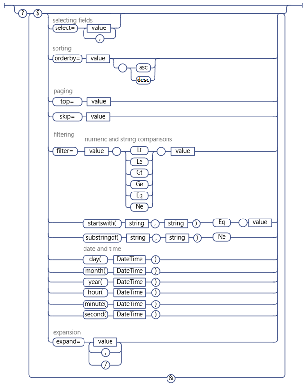

# Use OData query operations in SharePoint REST requests
Learn how to use a wide range of OData query string operators to select, filter, and order the data you request from the SharePoint REST service. 
 

 

 **Before you start**
 

-  [Get to know the SharePoint REST service](get-to-know-the-sharepoint-rest-service.md)
    
 
-  [Navigate the SharePoint data structure represented in the REST service](navigate-the-sharepoint-data-structure-represented-in-the-rest-service.md)
    
 
-  [Determine SharePoint REST service endpoint URIs](determine-sharepoint-rest-service-endpoint-uris.md)
    
 
The SharePoint REST service supports a wide range of OData query string operators that enable you to select, filter, and order the data you request.
 

 **Tip**  The SharePoint Online (and on-premise SharePoint 2016 and later) REST service supports combining multiple requests into a single call to the service by using the OData  `$batch` query option. For details and links to code samples, see [Make batch requests with the REST APIs](make-batch-requests-with-the-rest-apis.md).
 

## Select fields to return

Use the  [$select](http://www.odata.org/documentation/odata-version-2-0/uri-conventions#SelectSystemQueryOption) query option to specify which fields to return for a given list, list item, or other SharePoint object represented by an entity set. You can use `$select=*` to return all available fields.
 
> [!NOTE] 
> In general, if you do not specify the  `$select` query option, the REST service returns all available fields by default. However, in a few cases, some SharePoint objects include properties that are very resource intensive to retrieve; to optimize REST service performance, these properties are not included in the default query, and must be explicitly requested.For example, the  **SPWeb.EffectiveBasePermissions** property is not returned by default, and must be explicitly requested using the `$select` query option.
 

In addition, you can specify that the request returns projected fields from other lists and the values of lookups. To do this, specify the field name in both the  `$select` and `$expand` query options. For example:
 

 
 `http://server/site/_api/web/lists('guid')/items?$select=Title,Products/Name&amp;$expand=Products/Name`
 

 
Bulk expansion and selection of related items is not supported.
 

 

## Select items to return

Use the  [$filter](http://www.odata.org/documentation/odata-version-2-0/uri-conventions#FilterSystemQueryOption) query option to select which items to return. [OData query operators supported in the SharePoint REST service](#bk_supported) lists the filter query comparison options and functions you can use with the SharePoint REST service.
 

 

## Query for single value lookup fields

Single value lookup fields are represented by two separate fields in the SharePoint REST service: one field representing the actual field value, and another representing the field name. You can perform queries against the lookup field value as you would any other field of that data type. For example, if the lookup field value is a string, you can use string comparison options in your query.
 

 

## Query for users

In the SharePoint REST service, users are represented by the user's friendly (display) name, and not their alias or domain\alias combination. Therefore, you must construct user queries against users' friendly names.
 
> [!NOTE] 
> Membership-based user queries are not supported.Usage of the  **Current** operator to do queries using the ID of the current user is not supported.
 

## Query for multi-value lookup fields and users

Because multi-value lookup fields are returned as a string of multiple values, there is no way to query for them (for example, the equivalent of an  **Includes** element or **NotIncludes** element is not supported).
 

 

## Sort returned items

Use the  [$orderby](http://www.odata.org/documentation/odata-version-2-0/uri-conventions#OrderBySystemQueryOption) query option to specify how to sort the items in your query return set. To sort by multiple fields, specify a comma-separated list of fields. You can also specify whether to sort the items in ascending or descending order by appending the **asc** or **desc** keyword to your query.
 

 

## Page through returned items

Use the  [$top](http://www.odata.org/documentation/odata-version-2-0/uri-conventions#TopSystemQueryOption) and [$skiptoken](http://msdn.microsoft.com/library/dd942121.aspx) query options to select a subset of the items that would otherwise be returned by your query.
 
> [!NOTE] 
> The $skip query option does not work with queries for SharePoint list items.
 

The  `$top` option enables you to select the first *n*  items of the return set for return. For example, the following URI requests that only the first ten items in the prospective return set actually be returned:
 

 
 `http://server/site/_api/web/lists('<guid>')/items$top=10`
 

 
The $skiptoken option enables you to skip over items until the specified item is reached and return the rest.
 

 
 `$skiptoken=Paged=TRUE&amp;p_ID=5`
 
> [!NOTE] 
> When using these query options, take into account that paging in OData is ordinal. For example, suppose you are implementing a next page button to display SharePoint list items. You use the REST service to enable the button to return items 1 through 20 when clicked, then items 21 through 40, and so on. However, suppose another user deletes items 4 and 18 between clicks of the next button. In such a case, the ordinal positioning of the remaining items is reset, and displaying items 21 through 40 actually skips over two items.
 

## OData query operators supported in the SharePoint REST service

|**Supported**|**Not supported**|
|:-----|:-----|
|**Numeric comparisons** Lt Le Gt Ge Eq Ne| Arithmetic operators  (Add, Sub, Mul, Div, Mod) Basic math functions (round, floor, ceiling) |
|**String comparisons** startsWith substringof Eq Ne| endsWith replace substring tolower toupper trim concat|
|**Date and time functions** day() month() year() hour() minute() second()| DateTimeRangesOverlap operator Querying as to whether a date time falls inside a recurrent date time pattern|
The figure below shows the supported OData query options.
 

 

**Supported OData query options**

 

 

 

 

 

## See also

- [Get to know the SharePoint REST service](get-to-know-the-sharepoint-rest-service.md)

    
 
-  [Complete basic operations using SharePoint REST endpoints](complete-basic-operations-using-sharepoint-rest-endpoints.md)
    
 
-  [Working with lists and list items with REST](working-with-lists-and-list-items-with-rest.md)
    
 
-  [Working with folders and files with REST](working-with-folders-and-files-with-rest.md)
    
 
-  [Navigate the SharePoint data structure represented in the REST service](navigate-the-sharepoint-data-structure-represented-in-the-rest-service.md)
    
 
-  [Determine SharePoint REST service endpoint URIs](determine-sharepoint-rest-service-endpoint-uris.md)
    
 
-  [REST API reference and samples](http://msdn.microsoft.com/library/rest-api-reference-and-samples%28Office.15%29.aspx)
    
 

 

 
