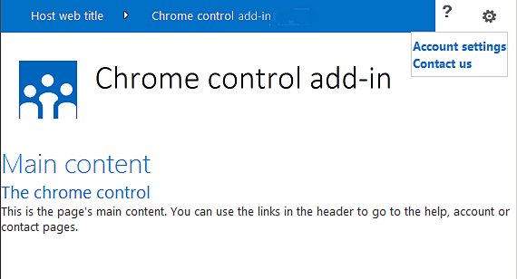
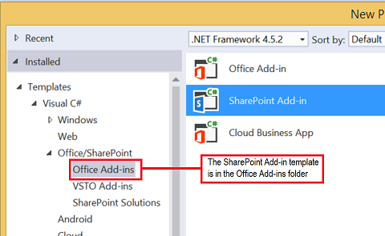
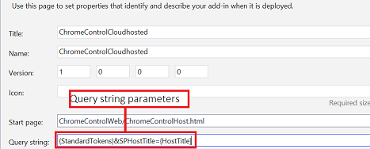
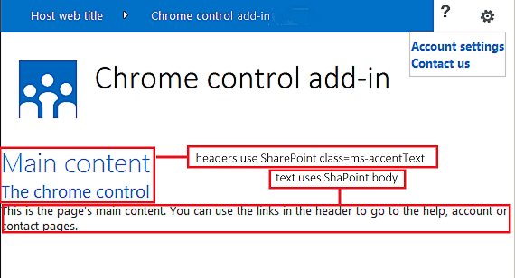

# Use the client chrome control in SharePoint Add-ins

The chrome control in SharePoint enables you to use the header styling of a specific SharePoint site in your add-in without needing to register a server library or use a specific technology or tool. To use this functionality, you must register a SharePoint JavaScript library through a standard `<script>` tag. You can provide a placeholder by using an HTML **div** element and further customize the control by using the available options. The control inherits its appearance from the specified SharePoint website.

<a name="SP15Usechromecontrol_Prereq"> </a>

## Prerequisites for using the examples in this article

To follow the steps in this example, you need the following:

- Visual Studio 2015
- A SharePoint development environment (add-in isolation required for on-premises scenarios)
 
For guidance about how to set up a development environment that fits your needs, see [Two types of SharePoint Add-ins: SharePoint-hosted and provider-hosted](sharepoint-add-ins.md#two-types-of-sharepoint-add-ins-sharepoint-hosted-and-provider-hosted).

### Core concepts to know before using the chrome control

The following table lists useful articles that can help you understand the concepts involved in a scenario that uses the chrome control.

|**Article title**|**Description**|
|:-----|:-----|
| [SharePoint Add-ins](sharepoint-add-ins.md)|Learn about the new add-in model in SharePoint that enables you to create add-ins, which are small, easy-to-use solutions for end users.|
| [UX design for SharePoint Add-ins](ux-design-for-sharepoint-add-ins.md)|Learn about the user experience (UX) options and alternatives that you have when building SharePoint Add-ins.|
| [Host webs, add-in webs, and SharePoint components in SharePoint](host-webs-add-in-webs-and-sharepoint-components-in-sharepoint.md)|Learn about the distinction between host webs and add-in webs. Find out which SharePoint components can be included in a SharePoint Add-in, which components are deployed to the host web, which components are deployed to the add-in web, and how the add-in web is deployed in an isolated domain.|

<a name="SP15Usechromecontrol_Codeexample"> </a>

## Code example: Use the chrome control in your cloud-hosted add-in

A cloud-hosted add-in includes at least one remote component. For more information, see [Choose patterns for developing and hosting your SharePoint Add-in](choose-patterns-for-developing-and-hosting-your-sharepoint-add-in.md). To use the chrome control in your cloud-hosted add-in, follow these steps:

1. Create the SharePoint Add-in and remote web projects.
2. Send default configuration options in the query string.
3. Add a webpage to the web project.

The following figure shows a remote webpage with the chrome control.

**Remote webpage with the chrome control**


 
<br/>

### To create the SharePoint Add-in and remote web projects

1. Open Visual Studio 2015 as administrator. (To do this, right-click the Visual Studio 2015 icon on the **Start** menu, and select **Run as administrator**.)

2. Create a new project by using the **SharePoint Add-in** template.
    
   The following figure shows the location of the **SharePoint Add-in** template in Visual Studio 2015, under **Templates** > **Visual C#** > **Office/SharePoint** > **Office Add-ins**.    

   **SharePoint Add-in Visual Studio template**

   

   <br/>

3. Provide the URL of the SharePoint website that you want to use for debugging.
 
4. Select **Provider-hosted** as the hosting option for your add-in. For a SharePoint-hosted code sample, see [SharePoint-Add-in-JSOM-BasicDataOperations](https://github.com/OfficeDev/SharePoint-Add-in-JSOM-BasicDataOperations).
    
   After the wizard finishes, you should have a structure in **Solution Explorer** that resembles the following figure.
    
   **Add-in for SharePoint projects in Solution Explorer**

   

   <br/>

### To send default configuration options in the query string

1. Open the Appmanifest.xml file in the manifest editor.

2. Add the **{StandardTokens}** token and an additional _SPHostTitle_ parameter to the query string. The following figure shows the manifest editor with the configured query string parameters.
    
   **Manifest editor with query string parameters for the chrome control**

   

   <br/>
 
   The chrome control automatically takes the following values from the query string:
   
   - **SPHostUrl**
   - **SPHostTitle**
   - **SPAppWebUrl**
   - **SPLanguage**
    
   **{StandardTokens}** include **SPHostUrl** and **SPAppWebUrl**.

### To add a page that uses the chrome control in the web project

1. Right-click the web project, and add a new Web Form.

2. Copy the following markup, and paste it in the ASPX page. The markup performs the following tasks:
    
   - Loads the AJAX library from the Microsoft CDN (Content Delivery Network).
   
   - Loads the jQuery library from the Microsoft CDN.
   
   - Loads the SP.UI.Controls.js file using the jQuery function **getScript**.
   
   - Defines a callback function for the **onCssLoaded** event.
   
   - Prepares the options for the chrome control.
   
   - Initializes the chrome control.

    ```HTML
       <!DOCTYPE html>
     <html xmlns="http://www.w3.org/1999/xhtml">
     <head>
         <title>Chrome control host page</title>
         <script 
             src="//ajax.aspnetcdn.com/ajax/4.0/1/MicrosoftAjax.js" 
             type="text/javascript">
         </script>
         <script 
             type="text/javascript" 
             src="//ajax.aspnetcdn.com/ajax/jQuery/jquery-1.7.2.min.js">
         </script>      
         <script 
             type="text/javascript"
             src="ChromeLoader.js">
         </script>
     <script type="text/javascript">
     "use strict";

     var hostweburl;

     //load the SharePoint resources
     $(document).ready(function () {
         //Get the URI decoded URL.
         hostweburl =
             decodeURIComponent(
                 getQueryStringParameter("SPHostUrl")
         );

         // The SharePoint js files URL are in the form:
         // web_url/_layouts/15/resource
         var scriptbase = hostweburl + "/_layouts/15/";

         // Load the js file and continue to the 
         //   success handler
         $.getScript(scriptbase + "SP.UI.Controls.js", renderChrome)
     });

     // Callback for the onCssLoaded event defined
     //  in the options object of the chrome control
     function chromeLoaded() {
         // When the page has loaded the required
         //  resources for the chrome control,
         //  display the page body.
         $("body").show();
     }

     //Function to prepare the options and render the control
     function renderChrome() {
         // The Help, Account and Contact pages receive the 
         //   same query string parameters as the main page
         var options = {
             "appIconUrl": "siteicon.png",
             "appTitle": "Chrome control add-in",
             "appHelpPageUrl": "Help.html?"
                 + document.URL.split("?")[1],
             // The onCssLoaded event allows you to 
             //  specify a callback to execute when the
             //  chrome resources have been loaded.
             "onCssLoaded": "chromeLoaded()",
             "settingsLinks": [
                 {
                     "linkUrl": "Account.html?"
                         + document.URL.split("?")[1],
                     "displayName": "Account settings"
                 },
                 {
                     "linkUrl": "Contact.html?"
                         + document.URL.split("?")[1],
                     "displayName": "Contact us"
                 }
             ]
         };

         var nav = new SP.UI.Controls.Navigation(
                                 "chrome_ctrl_placeholder",
                                 options
                             );
         nav.setVisible(true);
     }

     // Function to retrieve a query string value.
     // For production purposes you may want to use
     //  a library to handle the query string.
     function getQueryStringParameter(paramToRetrieve) {
         var params =
             document.URL.split("?")[1].split("&amp;");
         var strParams = "";
         for (var i = 0; i < params.length; i = i + 1) {
             var singleParam = params[i].split("=");
             if (singleParam[0] == paramToRetrieve)
                 return singleParam[1];
         }
     }
     </script>
     </head>

     <!-- The body is initally hidden. 
          The onCssLoaded callback allows you to 
          display the content after the required
          resources for the chrome control have
          been loaded.  -->
     <body style="display: none">

         <!-- Chrome control placeholder -->
         <div id="chrome_ctrl_placeholder"></div>

         <!-- The chrome control also makes the SharePoint
               Website stylesheet available to your page -->
         <h1 class="ms-accentText">Main content</h1>
         <h2 class="ms-accentText">The chrome control</h2>
         <div id="MainContent">
             This is the page's main content. 
             You can use the links in the header to go to the help, 
             account or contact pages.
         </div>
     </body>
     </html>
    ```

    <br/>
    
3. You can also use the chrome control in a declarative way. In the following code example, the HTML markup declares the control without using JavaScript code to configure and initialize the control. The following markup performs the following tasks:
   
   - Provides a placeholder for the SP.UI.Controls.js JavaScript file.
   
   - Dynamically loads the SP.UI.Controls.js file.
   
   - Provides a placeholder for the chrome control and specifies the options inline with the HTML markup.

    ```HTML
       <!DOCTYPE html>
     <html xmlns="http://www.w3.org/1999/xhtml">
     <head>
         <title>Chrome control host page</title>
         <script 
             src="http://ajax.aspnetcdn.com/ajax/4.0/1/MicrosoftAjax.js" 
             type="text/javascript">
         </script>
         <script 
             type="text/javascript" 
             src="http://ajax.aspnetcdn.com/ajax/jQuery/jquery-1.7.2.min.js">
         </script>      
         <script type="text/javascript">
         var hostweburl;

         // Load the SharePoint resources.
         $(document).ready(function () {

             // Get the URI decoded add-in web URL.
             hostweburl =
                 decodeURIComponent(
                     getQueryStringParameter("SPHostUrl")
             );

             // The SharePoint js files URL are in the form:
             // web_url/_layouts/15/resource.js
             var scriptbase = hostweburl + "/_layouts/15/";

             // Load the js file and continue to the 
             // success handler.
             $.getScript(scriptbase + "SP.UI.Controls.js")
         });

         // Function to retrieve a query string value.
         // For production purposes you may want to use
         // a library to handle the query string.
         function getQueryStringParameter(paramToRetrieve) {
             var params =
                 document.URL.split("?")[1].split("&amp;");
             var strParams = "";
             for (var i = 0; i < params.length; i = i + 1) {
                 var singleParam = params[i].split("=");
                 if (singleParam[0] == paramToRetrieve)
                     return singleParam[1];
             }
         }
         </script>
     </head>
     <body>

         <!-- Chrome control placeholder 
                Options are declared inline.  -->
         <div 
             id="chrome_ctrl_container"
             data-ms-control="SP.UI.Controls.Navigation"  
             data-ms-options=
                 '{  
                     "appHelpPageUrl" : "Help.html",
                     "appIconUrl" : "siteIcon.png",
                     "appTitle" : "Chrome control add-in",
                     "settingsLinks" : [
                         {
                             "linkUrl" : "Account.html",
                             "displayName" : "Account settings"
                         },
                         {
                             "linkUrl" : "Contact.html",
                             "displayName" : "Contact us"
                         }
                     ]
                  }'>
         </div>

         <!-- The chrome control also makes the SharePoint
               Website style sheet available to your page. -->
         <h1 class="ms-accentText">Main content</h1>
         <h2 class="ms-accentText">The chrome control</h2>
         <div id="MainContent">
             This is the page's main content. 
             You can use the links in the header to go to the help, 
             account or contact pages.
         </div>
     </body>
     </html>
    ```

    <br/>

   The SP.UI.Controls.js library automatically renders the control if it finds the **data-ms-control="SP.UI.Controls.Navigation"** attribute in a **div** element.

### To edit the StartPage element in the add-in manifest

1. Double-click the **AppManifest.xml** file in **Solution Explorer**.

2. On the **Start page** drop-down menu, select the webpage that uses the chrome control.

### To build and run the solution

1. Make sure that the SharePoint Add-in project is set as the startup project.

2. Select the F5 key. (Note that when you select F5, Visual Studio builds the solution, deploys the add-in, and opens the permissions page for the add-in.)

3. Select the **Trust It** button.

4. Select the **ChromeControlCloudhosted** add-in icon.

5. When you use the chrome control in your webpages, you can also use the SharePoint website style sheet, as shown in the following figure.
    
   **SharePoint website style sheet used in the page**

   

   <br/>
 
#### Troubleshooting the solution

|**Problem**|**Solution**|
|:-----|:-----|
|Unhandled exception **SP is undefined**.|Make sure your browser loads the SP.UI.Controls.js file.|
|The chrome control does not render properly.|The chrome control only supports document modes Internet Explorer 8 and later. Make sure your browser renders your page in document mode Internet Explorer 8 or later.|
|Certificate error.|Set the **SSL Enabled** property of your web project to **false**. In the SharePoint Add-in project, set the **Web Project** property to **None**, and then set the property back to your web project's name.|

## See also
<a name="SP15Usechromecontrol_Addresources"> </a>

-  [Code sample: Use the chrome control in a cloud-hosted add-in](https://code.msdn.microsoft.com/office/SharePoint-2013-Work-with-089ecc6f)
-  [Code sample: Use the chrome control and the cross-domain library (CSOM)](https://code.msdn.microsoft.com/office/SharePoint-2013-Use-the-97c30a2e)
-  [Code sample: Use the chrome control and the cross-domain library (REST)](https://code.msdn.microsoft.com/office/SharePoint-2013-Use-the-a759e9f8)
-  [Create UX components in SharePoint](create-ux-components-in-sharepoint.md)

 

