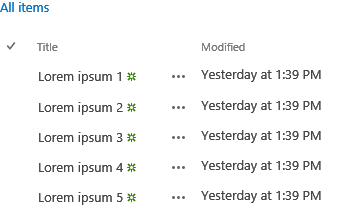

# Use the experimental Desktop List View widget in SharePoint Add-ins
Learn how to use the Desktop List View widget on any web page, even if the page is not hosted in SharePoint. Use the List View widget in your add-ins to display data in lists that are hosted in a SharePoint site.
 

 **Note**  The name "apps for SharePoint" is changing to "SharePoint Add-ins". During the transition, the documentation and the UI of some SharePoint products and Visual Studio tools might still use the term "apps for SharePoint". For details, see  [New name for apps for Office and SharePoint](new-name-for-apps-for-sharepoint#bk_newname).
 


 **Note**  The Office Web Widgets - Experimental are only provided for research and feedback purposes. Do not use in production scenarios. The Office Web Widgets behavior may change significantly in future releases. Read and review the  [Office Web Widgets - Experimental License Terms](office-web-widgets--experimental-license-terms).
 


You can use the List View widget to display the data in a SharePoint list similar to the regular List View widget, but you can use it in your add-ins and websites that are not necessarily hosted in SharePoint.
 


**Figure 1. Desktop List View widget displaying data in a list**

 

 

 

 

 

## Introduction

You can specify the view in the SharePoint list that you want to use to display the data. The List View widget displays the columns and items in the order specified by the view.
 

 
The List View widget uses the cross-domain library to get the list data. For this reason, communication happens at the client level.
 

 

 **Caution**  The Desktop List View widget doesn't enable all the scenarios of the native List View.
 

The following scenarios have not been enabled in the current version of the widget:
 

 

- Use the widget on authentication schemes that aren't natively supported by the cross-domain library.
    
 
- Use the widget with data sources other than SharePoint lists or libraries.
    
 
- Data bind the widget.
    
 
- User touch-friendly views.
    
 
- User inline-editing.
    
 
- Show presence information.
    
 
- Provide custom rendering templates.
    
 
- On-premises scenarios. At this moment, the widget only works on SharePoint Online.
    
 

## Prerequisites for using the examples in this article

To follow the examples in this article, you need the following:
 

 

- Visual Studio 2013
    
 
- NuGet Package Manager. For more information, see  [Installing NuGet](http://go.microsoft.com/fwlink/?LinkId=271465).
    
 
- A SharePoint development environment (app isolation required for on-premises scenarios). 
    
 
- Office Web Widgets - Experimental NuGet package. For more information about how to install a NuGet package, see  [Managing NuGet Packages Using the Dialog](http://docs.nuget.org/docs/start-here/managing-nuget-packages-using-the-dialog). You can also browse the  [NuGet gallery page](http://www.nuget.org/packages/Microsoft.Office.WebWidgets.Experimental/).
    
 

## Use the Desktop List View widget in a provider-hosted SharePoint Add-in

In this example, there is a simple page hosted outside of SharePoint that declares a Desktop List View widget.
 

 
To use the List View widget, you must do the following:
 

 

- Create SharePoint Add-in and web projects.
    
 
- Create a list on the add-in web. This step also ensures that an add-in web is created when users deploy the add-in.
    
     **Note**  The cross-domain library requires the existence of an add-in web. The List View widget communicates with SharePoint by using the cross-domain library.
- Create an add-in page that declares a List View widget instance using HTML markup.
    
 

### To create a SharePoint Add-in and web projects


1. Open Visual Studio 2013 as administrator. (To do this, choose the Visual Studio 2013 icon on the  **Start** menu, and choose **Run as administrator**.)
    
 
2. Create a new project using the  **SharePoint Add-in 2013** template. The SharePoint Add-in 2013 template is located under **Templates**> **Visual C#**,  **Office/SharePoint**> **Add-ins**.
    
 
3. Provide the SharePoint website URL that you want to use for debugging.
    
 
4. Select  **Provider-hosted** as the hosting option for your add-in.
    
     **Note**  You can also use the Desktop List View widget with other hosting options or even with Office Add-ins or your own website.
5. Select  **ASP.NET Web Forms Application** as the type of web application project.
    
 
6. Select  **Windows Azure Access Control Service** as the authentication option.
    
 

### To create a list on the add-in web


1. Choose the SharePoint Add-in project in  **Solution Explorer**. Choose  **Add**> **New Item…**
    
 
2. Choose  **Visual C# Items**> **Office/SharePoint**> **List**. Type  **Announcements** in the **Name** textbox. Choose **Add**.
    
 
3. Choose  **Create a list instance based on an existing list template**.Choose the  **Announcements** template. Choose **Finish**.
    
 

### To add a new page that uses the Desktop List View widget


1. Choose the  **Pages** folder in the web project in **Solution Explorer**.
    
 
2. Copy the following code and paste it in an  **ASPX** file in the project. The code performs the following tasks:
    
      - Adds references to the required Office libraries and resources.
    
 
  - Provides a placeholder for the List View widget.
    
 
  - Initializes the controls runtime.
    
 
  - Runs the  **renderAll** method of the Office Controls runtime.
    
 

```
  <!DOCTYPE html>
<html>
<head>
    <!-- IE9 or superior -->
    <meta http-equiv="x-ua-compatible" content="IE=10">
    <title>Desktop List View HTML Markup</title>

    <!-- Controls Specific CSS File -->
    <link rel="stylesheet" type="text/css" href="/Scripts/Office.Controls.css" />

    <!-- Ajax, jQuery, and utils -->
    <script 
        src=" https://ajax.aspnetcdn.com/ajax/4.0/1/MicrosoftAjax.js.js">
    </script>
    <script 
        src=" https://ajax.aspnetcdn.com/ajax/jQuery/jquery-1.9.1.min.js">
    </script>
    <script type="text/javascript">

        // Function to retrieve a query string value.
        // For production purposes you may want to use
        //  a library to handle the query string.
        function getQueryStringParameter(paramToRetrieve) {
            var params =
                document.URL.split("?")[1].split("&amp;");
            var strParams = "";
            for (var i = 0; i < params.length; i = i + 1) {
                var singleParam = params[i].split("=");
                if (singleParam[0] == paramToRetrieve)
                    return singleParam[1];
            }
        }
    </script>

    <!-- Cross-Domain Library and Office controls runtime -->
    <script type="text/javascript">
        //Register namespace and variables used through the sample
        Type.registerNamespace("Office.Samples.ListViewBasic");
        //Retrieve context tokens from the querystring
        Office.Samples.ListViewBasic.appWebUrl =
            decodeURIComponent(getQueryStringParameter("SPAppWebUrl"));
        Office.Samples.ListViewBasic.hostWebUrl =
            decodeURIComponent(getQueryStringParameter("SPHostUrl"));
        Office.Samples.ListViewBasic.ctag =
            decodeURIComponent(getQueryStringParameter("SPClientTag"));

        //Pattern to dynamically load JSOM and the cross-domain library
        var scriptbase =
            Office.Samples.ListViewBasic.hostWebUrl + "/_layouts/15/";

        //Get the cross-domain library
        $.getScript(scriptbase + "SP.RequestExecutor.js", 
            //Get the Office controls runtime and 
            //  continue to the createControl function
            function () {
                $.getScript("../Scripts/Office.Controls.js", createControl);
            }
        );
    </script>

    <!-- List View -->
    <script 
        src="../Scripts/Office.Controls.ListView.debug.js" 
        type="text/javascript">
    </script>

    <!-- SharePoint CSS -->
    <script type="text/javascript">
        document.addEventListener("DOMContentLoaded", function () {
            // The resource files are in a URL in the form:
            // web_url/_layouts/15/Resource.ashx
            var scriptbase =
                Office.Samples.ListViewBasic.appWebUrl + "/_layouts/15/";

            // Dynamically create the invisible iframe.
            var blankiframe;
            var blankurl;
            var body;
            blankurl =
                Office.Samples.ListViewBasic.appWebUrl + "/Pages/blank.html";
            blankiframe = document.createElement("iframe");
            blankiframe.setAttribute("src", blankurl);
            blankiframe.setAttribute("style", "display: none");
            body = document.getElementsByTagName("body");
            body[0].appendChild(blankiframe);

            // Dynamically create the link element.
            var dclink;
            var head;
            dclink = document.createElement("link");
            dclink.setAttribute("rel", "stylesheet");
            dclink.setAttribute("href",
                                scriptbase +
                                "defaultcss.ashx?ctag=" +
                                Office.Samples.ListViewBasic.ctag
                                );
            head = document.getElementsByTagName("head");
            head[0].appendChild(dclink);
        }, false);
    </script>
</head>
<body>
    Basic List View sample (HTML markup declaration):
    <div id="ListViewDiv"
         data-office-control="Office.Controls.ListView"
         data-office-options='{"listUrl" : getListUrl()}'>
    </div>

    <script type="text/javascript">
        function createControl() {
            //Initialize Controls Runtime
            Office.Controls.Runtime.initialize({
                sharePointHostUrl: Office.Samples.ListViewBasic.hostWebUrl,
                appWebUrl: Office.Samples.ListViewBasic.appWebUrl
            });

            //Render the widget, this must be executed after the
            //placeholder DOM is loaded
            Office.Controls.Runtime.renderAll();
        }

        function getListUrl() {
            return Office.Samples.ListViewBasic.appWebUrl +
                    "/_api/web/lists/getbytitle('Announcements')";
        }
    </script>
</body>
</html>
```


 **Note**  The code example above explicitly specifies the host web and add-in web URLs to initialize the Office controls runtime. However, if the add-in web and host web URLs are specified in the  **SPAppWebUrl** and **SPHostUrl** query string parameters, respectively; you can pass an empty object and the code will attempt to get the parameters automatically. The **SPAppWebUrl** and **SPHostUrl** parameters are included in the query string when you use the **{StandardTokens}** token.
 

The following example shows you how to pass an empty object to the initialize method:
 

 


```
// Initialize with an empty object and the code 
// will attempt to get the tokens from the
// query string directly.
Office.Controls.Runtime.initialize({});
```


### To build and run the solution


1. Press the F5 key.
    
     **Note**  When you press F5, Visual Studio builds the solution, deploys the add-in, and opens the permissions page for the add-in.
2. Choose the  **Trust It** button.
    
 
3. Choose the add-in icon on the  **Site Contents** page.
    
 
You can also download this sample from code gallery, see the  [Use the Desktop List View experimental widget in an add-in](http://code.msdn.microsoft.com/SharePoint-2013-Use-the-c3edb076) code sample.
 

 

## 

This article shows how to use the Desktop List View widget in your add-in by using HTML. You can also explore the following scenarios and details about the widget.
 

 

### Use JavaScript to declare the Desktop List View widget

Depending on your preference, you might want to use the JavaScript instead of HTML to declare the widget. If this is the case you can use the following markup as the placeholder for the widget.
 

 

```HTML
<div id="ListViewDiv"></div>
```

Use the following JavaScript code to instantiate the List View.
 

 


```
new Office.Controls.ListView(
    document.getElementById("ListViewDiv"), {
        listUrl: Office.Samples.ListViewBasic.appWebUrl + "/_api/web/lists/getbytitle('Announcements')"
    });
```

For an example that shows how to perform the tasks, see the  **JSSimple.html** page in the [Use the Desktop List View experimental widget in an add-in](http://code.msdn.microsoft.com/SharePoint-2013-Use-the-c3edb076) code sample.
 

 

### Specify a view to display the data

You can specify an existent view in your SharePoint list, the List View widget displays the data using the view specification.
 

 
If you're using HTML markup to declare the widget, you can use the following syntax to specify a view.
 

 


```
<div id="ListViewDiv"
        data-office-control="Office.Controls.ListView"
        data-office-options="{listUrl: 'list URL',
                            viewID: 'GUID'
                            }">
</div> 

```

If you're declaring the widget using JavaScript, use the following syntax to specify a view.
 

 


```
new Office.Controls.ListView(
    document.getElementById("ListViewDiv"), {
        listUrl: "list URL",
        viewID: "GUID"
    });
```


## Conclusion

You can use the experimental Desktop List View widget to display data in SharePoint lists. The widget displays data in read-only mode. Please provide ideas and comments in the  [Office Developer Platform UserVoice site](http://officespdev.uservoice.com/).
 

 

## Additional resources
<a name="bk_addresources"> </a>


-  [Office Web Widgets - Experimental overview](office-web-widgets--experimental-overview)
    
 
-  [Office Web Widgets - Experimental License Terms](office-web-widgets--experimental-license-terms)
    
 
-  [Office Web Widgets - Experimental NuGet gallery page](http://www.nuget.org/packages/Microsoft.Office.WebWidgets.Experimental/)
    
 
-  [Code sample: Use the Desktop List View experimental widget in an add-in](http://code.msdn.microsoft.com/SharePoint-2013-Use-the-c3edb076)
    
 
-  [Use the experimental Desktop List View widget in SharePoint Add-ins](use-the-experimental-desktop-list-view-widget-in-sharepoint-add-ins)
    
 

