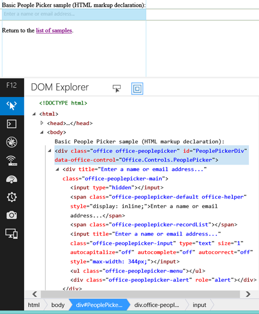

# Use the experimental People Picker widget in SharePoint Add-ins

You can use the People Picker widget on any webpage, even if the page is not hosted in SharePoint. Use the People Picker widget in your add-ins to help users find and select people and groups.

> [!WARNING] 
> The Office Web Widgets - Experimental are only provided for research and feedback purposes. Do not use in production scenarios. The Office Web Widgets behavior may change significantly in future releases. Read and review the [Office Web Widgets - Experimental License Terms](office-web-widgetsexperimental-license-terms.md).

You can use the experimental People Picker widget in add-ins to help your users find and select people and groups in a tenant. Users can start typing in the text box and the widget retrieves the people whose name or e-mail matches the text.

<br/>

**People Picker widget solving a query**


Your add-in can access the selected people by reading the **selectedItems** property of the widget. The selectedItems property is an array of objects that represent people or groups. The following table shows the available properties of the user object.

<br/>

|**Property**|**Description**|
|:-----|:-----|
|**department**|The department of the user or group.|
|**displayName**|The display name of the user or group.|
|**email**|The e-mail address of the user or group.|
|**isResolved**|Indicates if the widget has successfully resolved the text in the widget against a user or group in the tenant.|
|**jobTitle**|The job title of the user.|
|**loginName**|The sign-in name of the user or group.|
|**mobile**|The mobile phone number of the user or group.|
|**principalId**|The principal ID of the user or group.|
|**principalType**|Indicates if the item is a user or a group. It has a value of 1 if it's a user, 4 if it's a group.|
|**sipAddress**|The sip address of the user or group.|
|**text**|The text title of the user or group name.|

<br/>

The People Picker widget has a cache of the most recently used (MRU) entries. The cache stores the five latest entries that the widget resolved.
 
## Prerequisites for using the examples in this article

To use the examples in this article, you need the following:

- Visual Studio 2013 or later.
- NuGet Package Manager. For more information, see [Installing NuGet](http://go.microsoft.com/fwlink/?LinkId=271465).
- A SharePoint development environment (app isolation required for on-premises scenarios).
- Office Web Widgets - Experimental NuGet package. For more information about how to install a NuGet package, see [NuGet Package Manager UI](https://docs.microsoft.com/en-us/nuget/tools/package-manager-ui). You can also browse the [NuGet gallery page](https://www.nuget.org/packages/Microsoft.Office.WebWidgets.Experimental/).
    
## Use the People Picker widget in a provider-hosted SharePoint Add-in

In this example, a simple page is hosted outside of SharePoint that declares a People Picker widget using markup. To keep things simple, this example doesn't declare any options, but you can see an example with options in the [NextSteps](#NextSteps) section.

To use the People Picker widget, you must do the following:

- Create SharePoint Add-in and web projects.

- Create a module on the add-in web. This step ensures that an add-in web is created when users deploy the add-in.
    
    > [!NOTE] 
    > The cross-domain library requires the existence of an add-in web. The People Picker widget communicates with SharePoint by using the cross-domain library.

- Create an add-in page that declares a People Picker widget instance using markup.
    
### To create a SharePoint Add-in and web projects

1. Open Visual Studio as administrator. (To do this, select the Visual Studio icon on the **Start** menu, and select **Run as administrator**.)

2. Create a new project using the SharePoint Add-in template.The **SharePoint Add-in** template is located under **Templates** > **Visual C#** , **Office/SharePoint** > **Add-ins**.
    
3. Provide the SharePoint website URL that you want to use for debugging.
 
4. Select **Provider-hosted** as the hosting option for your add-in.
    
    > [!NOTE] 
    > You can also use the People Picker widget with other hosting options or even with Office Add-ins or your own website.

5. Select **ASP.NET Web Forms Application** as the type of web application project.
    
6. Select **Windows Azure Access Control Service** as the authentication option.
    

### To create a module on the add-in web

1. Select the SharePoint Add-in project in **Solution Explorer**. Select **Add** > **New Item**.
    
2. Select **Visual C# Items** > **Office/SharePoint** > **Module**. Provide a name for your module.
    
    > [!NOTE] 
    > If you're building a SharePoint-hosted add-in, you don't need to create an extra module.


### To add a new page that uses the People Picker widget

1. Select the **Pages** folder in the web project in **Solution Explorer**.
    
2. Copy the following code and paste it in an **ASPX** file in the project. The code performs the following tasks:
    
    - Adds references to the required Office libraries and resources.
    
    - Initializes the controls runtime.
            
    - Runs the **renderAll** method of the Office Controls runtime.
            
    - Declares a placeholder for the People Picker widget.

    ```HTML
    <!DOCTYPE html>
    <html>
    <head>
    <!-- IE9 or superior -->
        <meta http-equiv="X-UA-Compatible" content="IE=9" >
        <title>People Picker HTML Markup</title>

        <!-- Widgets Specific CSS File -->
        <link 
            rel="stylesheet" 
            type="text/css" 
            href="../Scripts/Office.Controls.css" 
        />

    <!-- Ajax, jQuery, and utils --> 
        <script 
            src=" https://ajax.aspnetcdn.com/ajax/4.0/1/MicrosoftAjax.js.js">
        </script>
        <script 
            src=" https://ajax.aspnetcdn.com/ajax/jQuery/jquery-1.9.1.min.js">
        </script>
        <script type="text/javascript">
            // Function to retrieve a query string value.
            // For production purposes you may want to use
            //  a library to handle the query string.
            function getQueryStringParameter(paramToRetrieve) {
                var params =
                    document.URL.split("?")[1].split("&amp;");
                var strParams = "";
                for (var i = 0; i < params.length; i = i + 1) {
                    var singleParam = params[i].split("=");
                    if (singleParam[0] == paramToRetrieve)
                        return singleParam[1];
                }
            }
        </script>

    <!-- Cross-Domain Library and Office controls runtime -->
        <script type="text/javascript">
            //Register namespace and variables used through the sample
            Type.registerNamespace("Office.Samples.PeoplePickerBasic");
            //Retrieve context tokens from the querystring
            Office.Samples.PeoplePickerBasic.appWebUrl =
                decodeURIComponent(getQueryStringParameter("SPAppWebUrl"));
            Office.Samples.PeoplePickerBasic.hostWebUrl =
                decodeURIComponent(getQueryStringParameter("SPHostUrl"));

            //Pattern to dynamically load JSOM and and the cross-domain library
            var scriptbase =
                Office.Samples.PeoplePickerBasic.hostWebUrl + "/_layouts/15/";

            //Get the cross-domain library
            $.getScript(scriptbase + "SP.RequestExecutor.js",
                //Get the Office controls runtime and 
                //  continue to the createControl function
                function () {
                    $.getScript("../Scripts/Office.Controls.js", createControl)
                }
            );
        </script>

    <!--People Picker -->
        <script 
            src="../Scripts/Office.Controls.PeoplePicker.js" 
            type="text/javascript">
        </script>
    </head>
    <body>
        Basic People Picker sample (HTML markup declaration):
        <div 
                id="PeoplePickerDiv" 
                data-office-control="Office.Controls.PeoplePicker">
        </div>

        <script type="text/javascript">
            function createControl() {
                //Initialize Controls Runtime
                Office.Controls.Runtime.initialize({
                    sharePointHostUrl: Office.Samples.PeoplePickerBasic.hostWebUrl,
                    appWebUrl: Office.Samples.PeoplePickerBasic.appWebUrl
                });

                //Render the widget, this must be executed after the
                //placeholder DOM is loaded
                Office.Controls.Runtime.renderAll();
            }
        </script>
    </body>
    </html>

    ```

<br/>

> [!NOTE] 
> The previous code example explicitly specifies the host web and add-in web URLs to initialize the Office controls runtime. However, if the add-in web and host web URLs are specified in the **SPAppWebUrl** and **SPHostUrl** query string parameters respectively, you can pass an empty object and the code attempts to get the parameters automatically. The **SPAppWebUrl** and **SPHostUrl** parameters are included in the query string when you use the **{StandardTokens}** token.
 
The following example shows you how to pass an empty object to the initialize method:

```
// Initialize with an empty object and the code 
// will attempt to get the tokens from the
// query string directly.
Office.Controls.Runtime.initialize({});
```


### To build and run the solution

1. Select the F5 key.
    
    > [!NOTE] 
    > When you select F5, Visual Studio builds the solution, deploys the add-in, and opens the permissions page for the add-in.

2. Select the **Trust It** button.
    
3. Select the add-in icon on the **Site Contents** page.
    
To download this sample from the code gallery, see the [Use the People Picker experimental widget in an add-in](https://code.msdn.microsoft.com/office/SharePoint-2013-Use-the-57859f85) code sample.
 
<a name="NextSteps"> </a>

## Next steps

This article shows how to use the People Picker widget in your add-in by using HTML. You can also explore the following scenarios and details about the widget.

### Use JavaScript to declare the People Picker widget

Depending on your preference, you might want to use JavaScript instead of HTML to declare the widget. If this is the case, you can use the following markup as the placeholder for the widget.

```HTML
<div id="PeoplePickerDiv"></div>
```

<br/>

Use the following JavaScript code to instantiate the People Picker.

```js
new Office.Controls.PeoplePicker(
    document.getElementById("PeoplePickerDiv"), {});
```

<br/>

For a code sample that shows how to perform the tasks, see the **JSSimple.html** page in the [Use the People Picker experimental widget in an add-in](https://code.msdn.microsoft.com/office/SharePoint-2013-Use-the-57859f85) code sample.

### Specify options for the widget

You can specify options for the widget by using the **data-office-options** attribute in the widget declaration. The following HTML shows how to specify options for the PeoplePicker widget.

```HTML
<div id="PeoplePickerDiv"
        data-office-control="Office.Controls.PeoplePicker"
        data-office-options='{
        "allowMultipleSelections" : true,
        "onChange" : handleChange,
        "placeholder" : "Check the count message, it changes when you add names..."
    }'>
</div>
```

<br/>

The following code shows how to specify options when you declare the PeoplePicker widget using JavaScript.

```js
new Office.Controls.PeoplePicker(
    document.getElementById("PeoplePickerDiv"), {
        allowMultipleSelections: true,
        placeholder: "Check the count message, it changes when you add names...",
        onChange: function (ctrl) {
            document.getElementById("count").textContent = 
ctrl.selectedItems.length.toString();
        }
    });
```

You can also specify event handlers for the **onChange**, **onAdded**, and **onRemoved** events. Note in the previous code that the event handler for the onChange event receives a single parameter **ctrl**, which is a reference to the widget.

For an example of how to specify options, see the **MarkupOptions.html** and **JSOptions.html** pages in the [Use the People Picker experimental widget in an add-in](https://code.msdn.microsoft.com/office/SharePoint-2013-Use-the-57859f85) code sample.

### Retrieve the people or groups selected in the widget

To retrieve the people in the widget, you must perform the following tasks:

- Get a reference to the widget.
    
- Access the **selectedItems** property of the widget.
    
You can get a reference to the widget using the following syntax.

```
var pplPicker = document.getElementById("PeoplePickerDiv")._officeControl;
```

<br/>

You can also save a reference when you instantiate the widget.

```
var pplPicker = new Office.Controls.PeoplePicker(
                        document.getElementById("PeoplePickerDiv"), {});
```

<br/>

The **selectedItems** property is an array of objects that represent people or groups. People or groups in the selectedItems array can be either resolved or unresolved, which you can check in the **isResolved** property. The following example shows how to access the element *i*  in the array and use the name of the person or group.

```
var principal = pplPicker.selectedItems[i];
$("#msg").text(principal.text + " is selected in the control.");
```

<br/>

For an example of how to retrieve the selected people or groups from the widget, see the **demo.html** page of the [Office Web Widgets - Experimental Demo](https://code.msdn.microsoft.com/office/SharePoint-2013-Office-Web-6d44aa9e) code sample.

### Customize the style of the widget

As a developer, you might want to customize the look and feel of the widget. The following image shows the HTML hierarchy in the widget after it has been rendered. The widget defines many classes prefixed by **office-peoplepicker**, which you can find and customize in the **Office.Controls.css** style sheet.

**HTML hierarchy in the People Picker widget**



You can use the experimental People Picker widget to select people and groups in your tenant, and your add-in can then use the principals selected by your users. Please provide ideas and comments at the [Office Developer Platform UserVoice site](http://officespdev.uservoice.com/).


## See also
<a name="bk_addresources"> </a>

-  [Use the experimental Desktop List View widget in SharePoint Add-ins](use-the-experimental-desktop-list-view-widget-in-sharepoint-add-ins.md)
-  [Office Web Widgets - Experimental overview](office-web-widgetsexperimental-overview.md)
-  [Create UX components in SharePoint](create-ux-components-in-sharepoint.md)
