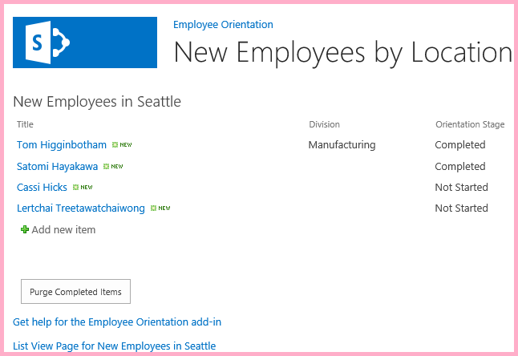
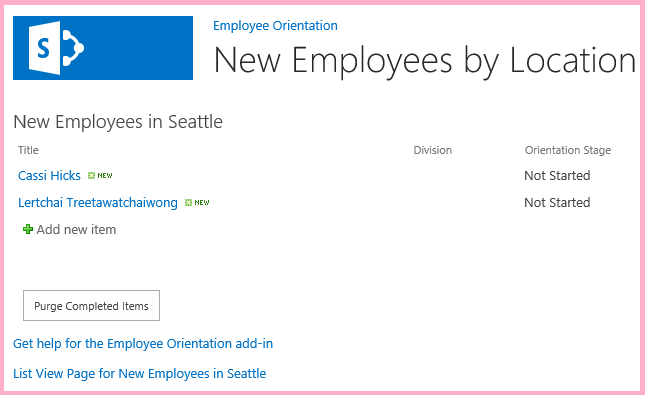

# Use the SharePoint JavaScript APIs to work with SharePoint data

Use the SharePoint JavaScript object model to work with SharePoint data from JavaScript on pages in the add-in web.
 
> [!NOTE]
> The name "apps for SharePoint" is changing to "SharePoint Add-ins." During the transition, the documentation and the UI of some SharePoint products and Visual Studio tools might still use the term "apps for SharePoint." For details, see [New name for apps for SharePoint](new-name-for-apps-for-sharepoint.md#bk_newname).

This is the tenth in a series of articles about the basics of developing SharePoint-hosted SharePoint Add-ins. You should first be familiar with [SharePoint Add-ins](sharepoint-add-ins.md) and the previous articles in this series:

-  [Get started creating SharePoint-hosted SharePoint Add-ins](get-started-creating-sharepoint-hosted-sharepoint-add-ins.md)
-  [Deploy and install a SharePoint-hosted SharePoint Add-in](deploy-and-install-a-sharepoint-hosted-sharepoint-add-in.md)
-  [Add custom columns to a SharePoint-hosted SharePoint Add-in](add-custom-columns-to-a-sharepoint-hosted-sharepoint-add-in.md)
-  [Add a custom content type to a SharePoint-hosted SharePoint Add-in](add-a-custom-content-type-to-a-sharepoint-hosted-sharepoint-add-in.md) 
-  [Add a Web Part to a page in a SharePoint-hosted SharePoint Add-in](add-a-web-part-to-a-page-in-a-sharepoint-hosted-sharepoint-add-in.md)
-  [Add a workflow to a SharePoint-hosted SharePoint Add-in](add-a-workflow-to-a-sharepoint-hosted-sharepoint-add-in.md)
-  [Add a custom page and style to a SharePoint-hosted SharePoint Add-in](add-a-custom-page-and-style-to-a-sharepoint-hosted-sharepoint-add-in.md)
-  [Add custom client-side rendering to a SharePoint-hosted SharePoint Add-in](add-custom-client-side-rendering-to-a-sharepoint-hosted-sharepoint-add-in.md)
-  [Create a custom ribbon button in the host web of a SharePoint Add-in](create-a-custom-ribbon-button-in-the-host-web-of-a-sharepoint-add-in.md)
    
> [!NOTE]
> If you have been working through this series about SharePoint-hosted add-ins, you have a Visual Studio solution that you can use to continue with this topic. You can also download the repository at [SharePoint_SP-hosted_Add-Ins_Tutorials](https://github.com/OfficeDev/SharePoint_SP-hosted_Add-Ins_Tutorials) and open the BeforeJSOM.sln file.

Even though SharePoint-hosted SharePoint Add-ins cannot have server-side code, you can still have business logic and runtime interaction with SharePoint components in a SharePoint-hosted SharePoint Add-in by using JavaScript and the SharePoint JavaScript client object model library. We'll call it JSOM. Note the "M" on the end. Don't confuse this with JSO**N** (JavaScript Object Notation). In this article, you use the JavaScript object model to find and remove old items from the **New Employees in Seattle** list.

## Create the JavaScript and a button to invoke it

1. Verify that the following step from the first tutorial in this series was completed: 
    
   Open the file **/Pages/Default.aspx** from the root of the project. Among other things, this generated file loads one or both of two scripts that are hosted on SharePoint: sp.runtime.js and sp.js. The markup for loading these files is in the **Content** control near the top of the file that has the ID **PlaceHolderAdditionalPageHead**. The markup varies depending on the version of **Microsoft Office Developer Tools for Visual Studio** that you are using. 
   
   This series of tutorials requires that both files be loaded and that they be loaded with ordinary HTML **\<script\>** tags, not **\<SharePoint:ScriptLink\>** tags. Ensure that the following lines are in the **PlaceHolderAdditionalPageHead** control, *just above* the line `<meta name="WebPartPageExpansion" content="full" />`:

    ```
      <script type="text/javascript" src="/_layouts/15/sp.runtime.js"></script> 
      <script type="text/javascript" src="/_layouts/15/sp.js"></script> 
    ```

   Then search the file for any other markup that also loads one or the other of these files and remove the redundant markup. Save and close the file.

2. In the **Scripts** node in **Solution Explorer**, there may already be an Add-in.js file. If there isn't, but there is an App.js file, right-click **App.js** and rename it **Add-in.js**. If there isn't an Add-in.js or App.js, create one with these steps:
    
   1. Right-click the **Scripts** node and select **Add** > **New Item** > **Web**.
   2. Select **JavaScript File** and name it **Add-in.js**.

3. Open Add-in.js and delete its content, if there is any.

4. Add the following lines to the file. 

    ```
      'use strict';

     var clientContext = SP.ClientContext.get_current(); 
     var employeeList = clientContext.get_web().get_lists().getByTitle('New Employees In Seattle'); 
     var completedItems; 
    ```

   Note the following about this code:
    
   - The `'use strict';` line ensures that the JavaScript runtime in the browser will throw an exception if you inadvertently use certain bad practices in the JavaScript.

   - The `clientContext` variable holds an **SP.ClientContext** object that references the SharePoint website. All JSOM code begins by creating, or getting a reference to, an object of this type.

   - The `employeeList` variable holds a reference to the list instance **New Employees in Seattle**.

   - The `completedItems` variable holds the items from the list that the script will delete: the items whose **OrientationStage** field is set to **Completed**.

5. To minimize messages between the client browser and the SharePoint server, the JSOM uses a batching system. Only one function, **SP.ClientContext.executeQueryAsync**, actually sends messages to the server (and receives replies). 

   Calls to the JSOM APIs that come in between calls of **executeQueryAsync** are bundled up and sent to the server in a batch the next time **executeQueryAsync** is called. However, it is not generally possible to call a method of a JSOM object unless the object has been brought down to the client in a previous call of **executeQueryAsync**. 
   
   Your script is going to call the **SP.ListItem.deleteObject** method of each completed item on the list, so it has to make two calls of **executeQueryAsync**; one to get a collection of the completed list items, and then a second to batch the calls of **deleteObject** and send them to the server for execution.
    
   Begin by creating a method to get the list items from the server. Add the following code to the file. 

    ```
      function purgeCompletedItems() {

       var camlQuery = new SP.CamlQuery(); 
       camlQuery.set_viewXml( 
             '<View><Query><Where><Eq>' + 
               '<FieldRef Name=\'OrientationStage\'/><Value Type=\'Choice\'>Completed</Value>' + 
             '</Eq></Where></Query></View>'); 
         completedItems = employeeList.getItems(camlQuery); 
    }
    ```

6. When these lines are sent to the server and executed there, they create a collection of list items, but the script must bring that collection down to the client. This is done with a call to the **SP.ClientContext.load** function, so add the following line to the end of the method.
    
    ```
      clientContext.load(completedItems);
    ```

7. Add a call of **executeQueryAsync**. This method has two parameters, both of which are callback functions. The first runs if the server successfully executes all the commands in the batch. The second runs if the server fails for any reason. You create these two functions in later steps. Add the following line to the end of the method.
    
    ```
      clientContext.executeQueryAsync(deleteCompletedItems, onGetCompletedItemsFail);
    ```

8. Finally, add the following line to the end of the method. 

    ```
      return false;
    ```

   By returning **false** to the ASP.NET button that will call the function, we cancel the default behavior of ASP.NET buttons, which is to reload the page. A reload of the page would cause a reload of the Add-in.js file. That, in turn, would reinitialize the `clientContext` object. 
   
   If this reload completed between the time the **executeQueryAsync** sends its request and the time the SharePoint server sends back the response, the original `clientContext` object is no longer in existence to process the response. The function would halt with neither the success nor the failure callbacks executed. (Exact behavior might vary depending on the browser.)

9. Add the following function, `deleteCompletedItems`, to the file. This is the function that runs if the `purgeCompletedItems` function is successful. Note the following about this code:
    
   - The **SP.ListItem.get_id** method returns the ID of the list item. Each item in the array is an **SP.ListItem** object.

   - The **SP.List.getItemById** method returns the **SP.ListItem** object with the specified ID.

   - The **SP.ListItem.deleteObject** method marks the list item to be deleted on the server when the call of **executeQueryAsync** is made.

   The list items have to be copied from the collection that is sent down from the server to an array before they can be deleted. If the script called the **deleteObject** method for each item directly in the **while** loop, the JavaScript would throw an error complaining that the length of the collection is being changed while the enumeration is underway. 
   
   The error message isn't literally true, because the item isn't really deleted from anything until the **deleteObject** calls are bundled and sent to the server, but the JSOM is designed to mimic the exception throws that would occur on the server (where code should not change a collection size while the collection is being enumerated). However, arrays have a fixed size, so calling **deleteObject** on an item in an array deletes the item from the list, but does not change the size of the array.

    ```
      function deleteCompletedItems() {

        var itemArray = new Array();
        var listItemEnumerator = completedItems.getEnumerator();

        while (listItemEnumerator.moveNext()) {
            var item = listItemEnumerator.get_current();
            itemArray.push(item);
        }

        var i;
        for (i = 0; i < itemArray.length; i++) {
            employeeList.getItemById(itemArray[i].get_id()).deleteObject();
        }

        clientContext.executeQueryAsync(onDeleteCompletedItemsSuccess, onDeleteCompletedItemsFail);
    }
    ```

10. Add the following function, `onDeleteCompletedItemsSuccess`, to the file. This is the function that runs if the completed items are successfully deleted (or there aren't any completed items on the list). 

   The line `location.reload(true);` causes the page to reload from the server. This is a convenience because the list view Web Part on the page still shows the completed items until the page is refreshed. The Add-in.js file is reloaded too, but that doesn't cause a problem because it won't do so in a way that interrupts an ongoing JavaScript function.
    
    ```
      function onDeleteCompletedItemsSuccess() {
        alert('Completed orientations have been deleted.');
        location.reload(true);
    }
    ```

11. Add the following two callback-on-failure functions to the file. 
    
    ```
      // Failure callbacks

    function onGetCompletedItemsFail(sender, args) {
        alert('Unable to get completed items. Error:' + args.get_message() + '\n' + args.get_stackTrace());
    }

    function onDeleteCompletedItemsFail(sender, args) {
        alert('Unable to delete completed items. Error:' + args.get_message() + '\n' + args.get_stackTrace());
    }
    ```

12. Open the default.aspx file and find the **asp:Content** element with the ID **PlaceHolderMain**.

13. Add the following markup between the **WebPartPages:WebPartZone** element and the first of the two **asp:Hyperlink** elements. Note that the value of the **OnClientClick** handler is `return purgeCompletedItems()` instead of just `purgeCompletedItems()`. The `false` that is returned from the function tells ASP.NET not to reload the page.
    
    ```HTML
      <p><asp:Button runat="server" OnClientClick="return purgeCompletedItems()" 
      ID="purgecompleteditemsbutton" Text="Purge Completed Items" /></p>
    ```

14. Rebuild the project in Visual Studio.

15. To minimize the need to manually set the **Orientation Stage** of list items to **Completed** while testing the add-in, open the elements.xml file for the list instance **NewEmployeesInSeattle** (not the elements.xml for the list template **NewEmployeeOrientation**) and add the markup `<Field Name="OrientationStage">Completed</Field>` as the last child to one or more of the **Row** elements.
    
   The following is an example of how the **Rows** element should look.

    ```
     <Rows>
       <Row>
         <Field Name="Title">Tom Higginbotham</Field>
         <Field Name="Division">Manufacturing</Field>
         <Field Name="OrientationStage">Completed</Field>
       </Row>
       <Row>
         <Field Name="Title">Satomi Hayakawa</Field>
         <Field Name="OrientationStage">Completed</Field>
       </Row>
       <Row>
         <Field Name="Title">Cassi Hicks</Field>
       </Row>
       <Row>
         <Field Name="Title">Lertchai Treetawatchaiwong</Field>
       </Row>
     </Rows>
    ```


## Run and test the add-in

1. Enable pop-up windows on the browser that Visual Studio uses when you debug.

2. Use the F5 key to deploy and run your add-in. Visual Studio makes a temporary installation of the add-in on your test SharePoint site and immediately runs the add-in. 

3. The home page of the add-in opens, and there are one or more items on the list with **Orientation Stage** at **Completed**. 
    
   *Figure 1. List before purge of completed items*

   

4. When the start page of the add-in has completely loaded, select the **Purge Completed Items** button. If the operation succeeds (you don't get any failure message), all the **Completed** items are deleted and you'll see a pop-up window that says **Completed orientations have been deleted**. 

5. Close the pop-up window. The page reloads, and the **Completed** items are no longer in the list view Web Part.
    
   *Figure 2. List after purge of completed items*

   

6. To end the debugging session, close the browser window or stop debugging in Visual Studio. Each time that you select F5, Visual Studio retracts the previous version of the add-in and installs the latest one.

7. You will work with this add-in and Visual Studio solution in other articles, and it's a good practice to retract the add-in one last time when you are done working with it for a while. Right-click the project in **Solution Explorer** and select **Retract**.

## Next steps
<a name="Nextsteps"> </a>

In the next article in this series, you'll add JavaScript to a page on the add-in web that works with SharePoint data on the host web: [Work with host web data from JavaScript in the add-in web](work-with-host-web-data-from-javascript-in-the-add-in-web.md).
 

 

