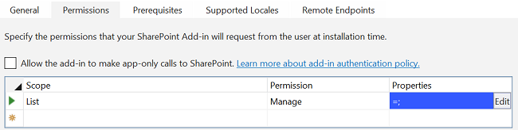
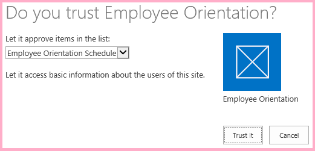
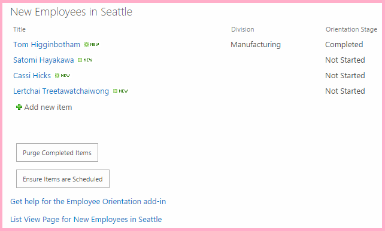

# Work with host web data from JavaScript in the add-in web
Use the SharePoint JavaScript object model (JSOM) to work with SharePoint data in the host web from JavaScript on pages in the add-in web.
 

 **Note**  The name "apps for SharePoint" is changing to "SharePoint Add-ins". During the transition, the documentation and the UI of some SharePoint products and Visual Studio tools might still use the term "apps for SharePoint". For details, see  [New name for apps for Office and SharePoint](new-name-for-apps-for-sharepoint.md#bk_newname).
 

This is the 11th in a series of articles about the basics of developing SharePoint-hosted SharePoint Add-ins. You should first be familiar with  [SharePoint Add-ins](sharepoint-add-ins.md) and the previous articles in this series:
 

-  [Get started creating SharePoint-hosted SharePoint Add-ins](get-started-creating-sharepoint-hosted-sharepoint-add-ins.md)
    
 
-  [Deploy and install a SharePoint-hosted SharePoint Add-in](deploy-and-install-a-sharepoint-hosted-sharepoint-add-in.md)
    
 
-  [Add custom columns to a SharePoint-hostedSharePoint Add-in](add-custom-columns-to-a-sharepoint-hostedsharepoint-add-in.md)
    
 
-  [Add a custom content type to a SharePoint-hostedSharePoint Add-in](add-a-custom-content-type-to-a-sharepoint-hostedsharepoint-add-in.md)
    
 
-  [Add a Web Part to a page in a SharePoint-hosted SharePoint Add-in](add-a-web-part-to-a-page-in-a-sharepoint-hosted-sharepoint-add-in.md)
    
 
-  [Add a workflow to a SharePoint-hosted SharePoint Add-in](add-a-workflow-to-a-sharepoint-hosted-sharepoint-add-in.md)
    
 
-  [Add a custom page and style to a SharePoint-hosted SharePoint Add-in](add-a-custom-page-and-style-to-a-sharepoint-hosted-sharepoint-add-in.md)
    
 
-  [Add custom client-side rendering to a SharePoint-hosted SharePoint Add-in](add-custom-client-side-rendering-to-a-sharepoint-hosted-sharepoint-add-in.md)
    
 
-  [Create a custom ribbon button in the host web of a SharePoint Add-in](create-a-custom-ribbon-button-in-the-host-web-of-a-sharepoint-add-in.md)
    
 
-  [Use the SharePoint JavaScript APIs to work with SharePoint data](use-the-sharepoint-javascript-apis-to-work-with-sharepoint-data.md)
    
 

 **Note**  If you have been working through this series about SharePoint-hosted add-ins, then you have a Visual Studio solution that you can use to continue with this topic. You can also download the repository at  [SharePoint_SP-hosted_Add-Ins_Tutorials](https://github.com/OfficeDev/SharePoint_SP-hosted_Add-Ins_Tutorials) and open the BeforeHostWebData.sln file.
 

By default, SharePoint is designed to prevent JavaScript in an add-in from getting access to data in other SharePoint websites on the farm. This prevents script in a rogue add-in from getting access to sensitive data. But often an add-in needs to have access to the host web, or to other websites within the same site collection as the host web. There are two parts to enabling this scenario in your add-in:
 

- You request permission to the host web in the add-in manifest file of your add-in. The user who installs the add-in is prompted to grant this permission, and the add-in cannot be installed if user does not.
    
 
- Instead of using an  **SP.ClientContext** object to make JSOM calls to the host web, you use a **SP.AppContextSite** object. This object enables the add-in to get a context objects for websites other than the add-in web, but only for websites within the same site collection. (There is also a way to get access to any website in the SharePoint Online subscription [or on-premise SharePoint Web Application], but that is an advanced subject.)
    
 
 In this article you use the JSOM to find the orientations that are not yet started and ensure that they are scheduled on a calendar in the host web.
 

## Prepare the host web calendar

Open the host web -- your developer test website -- and verify that there is a calendar on it named "Employee Orientation Schedule" and it has a single event on it: "Orient Cassie Hicks". If there isn't, take the following steps:
 

 

1. From the home page of the site, choose  **Site Contents** > **add an add-in** > **Calendar**.
    
 
2. On the  **Adding Calendar** dialog, typeEmployee Orientation Schedule for the **Name**, and then choose  **Create**.
    
 
3. When the calendar opens, put the cursor on any date until the  **Add** link appears on the date, and then click **Add**. 
    
 
4. On the  **Employee Orientation Schedule - New Item** dialog, typeOrient Cassi Hicks for the **Title**. Leave the other fields at their defaults and click  **Save**.
    
    The calendar should look similar to the following:
    

    **Custom calendar**

 

     
 

 

 

## Create the JavaScript and a button to invoke it


1. Open the Add-in.js file in the  **Scripts** node in **Solution Explorer**. 
    
 
2. Add the following declarations below the declaration for  `completedItems`. 
    
      - The  `notStartedItems` references the items on the **New Employees in Seattle** list whose **Orientation Stage** is **Not Started**.
    
 
  - The  `calendarList` references the calendar you created on the host web.
    
 
  - The  `scheduledItems` references a collection of items on the calendar.
    
 

  ```
  var notStartedItems;
var calendarList;
var scheduledItems;
  ```

3. When a SharePoint Add-in is run, SharePoint calls its start page and adds some query parameters to the start page URL. One of these is  `SPHostUrl` which is, of course, the URL of the host web. The add-in needs this information in order to make calls to host web data, so near the top of the Add-in.js file, just under the variable declaration for `scheduledItems`, add the following line. Note the following about this code:
    
      - The  `getQueryStringParameter` is a utility function that you create in the next step.
    
 
  - The  `decodeUriComponent` is a standard JavaScript function that reverses the URI-encoding that SharePoint does on the query parameters; for example, an encoded forward slash, "%2F", is changed back to a "/".
    
 

  ```
  var hostWebURL = decodeURIComponent(getQueryStringParameter("SPHostUrl"));
  ```

4. Add the following code to the bottom of the file. This function can be used to read the query parameters. 
    
  ```
  // Utility functions

function getQueryStringParameter(paramToRetrieve) {
     var params = document.URL.split("?")[1].split("&amp;");
     var strParams = "";
     for (var i = 0; i < params.length; i = i + 1) {
         var singleParam = params[i].split("=");
         if (singleParam[0] == paramToRetrieve) {
             return singleParam[1];
        }
     }
 }
  ```

5. Add the following function to the Add-in.js file somewhere above the failure callbacks section. Note the following about this code:
    
      - This is nearly identical to the list query method that gets the  **Completed** items, except that it gets items that are **Not Started** instead of those that are **Completed**. We are interested in only the  **Not Started** items because the script makes the simplifying assumption that if an orientation is past the **Not Started** stage, then it must already be scheduled.
    
 
  -  You create the two callback methods in the **executeQueryAsync** call in later steps.
    
 

  ```
  function ensureOrientationScheduling() {

    var camlQuery = new SP.CamlQuery();
    camlQuery.set_viewXml(
        '<View><Query><Where><Eq>' +
            '<FieldRef Name=\'OrientationStage\'/><Value Type=\'Choice\'>Not started</Value>' +
        '</Eq></Where></Query></View>');
    notStartedItems = employeeList.getItems(camlQuery);
  
    clientContext.load(notStartedItems);
    clientContext.executeQueryAsync(getScheduledOrientations, onGetNotStartedItemsFail);
    return false;
}
  ```

6. Add the following function to the Add-in.js file just below the preceding function. Notice that it uses the  `hostWebContext` object to identify the list that is queried.
    
     **Note**  Notice that no query markup is added to the CAML query. The effect of having no actual query in the query object is to ensure that  *all*  of the list times will be retrieved. If the list was very large this might cause the request to the server to be unacceptably long-running. In that case, we'd want to find some other way of accomplishing our goal. But in this sample situation with a very small list (and calendar lists are almost always small), getting the whole list, so that we can iterate through it on the client will actually help us minimize the number of calls to the server; that is, calls of **executeQueryAsync**.

  ```
  function getScheduledOrientations() {

    var hostWebContext = new SP.AppContextSite(clientContext, hostWebURL);
    calendarList = hostWebContext.get_web().get_lists().getByTitle('Employee Orientation Schedule');

    var camlQuery = new SP.CamlQuery();
    scheduledItems = calendarList.getItems(camlQuery);

    clientContext.load(scheduledItems);
    clientContext.executeQueryAsync(scheduleAsNeeded, onGetScheduledItemsFail);
}
  ```

7. Add the following function to the file. Note the following about this code:
    
      - The method checks to see if the title of a  **Not Started** item in the **New Employees In Seattle** list, which is the name of an employee, is contained in the title of an event in the **Employee Orientation Schedule** calendar. So there is a simplifying assumption that all entries in the calendar are created with the full employee name in the event title.
    
 
  - If none of the events that are already on the calendar matches a  **Not Started** item, the script creates a calendar item for the **Not Started** item.
    
 
  - JSOM uses a light weight  **ListItemCreationInformation** object instead of a **SPListItem** object to minimize the size of the payload that is sent to the SharePoint server.
    
 
  - The two DateTime fields of the new calendar event are set to days in the month when this article was written:  `2015-06`.  *Change these dates to a day in the current month and year, so you don't have to scroll back in your calendar to find the items.* 
    
 
  - If any  **Not Started** items are found to be unscheduled, the first one will be scheduled for the 10th of the month. Each additional unscheduled item will be scheduled for a day later. The simplifying assumption is that there won't be so many that some are scheduled for impossible days of the month, such as "32".
    
 
  - Most of this code is standard JavaScript. There are comments for the lines that use SharePoint JSOM.
    
 

  ```
  function scheduleAsNeeded() {

    var unscheduledItems = false;
    var dayOfMonth = '10';

    var listItemEnumerator = notStartedItems.getEnumerator();

    while (listItemEnumerator.moveNext()) {
        var alreadyScheduled = false;
        var notStartedItem = listItemEnumerator.get_current();

        var calendarEventEnumerator = scheduledItems.getEnumerator();
        while (calendarEventEnumerator.moveNext()) {
            var scheduledEvent = calendarEventEnumerator.get_current();

             // The SP.ListItem.get_item('field_name ') method gets the value of the specified field.
            if (scheduledEvent.get_item('Title').indexOf(notStartedItem.get_item('Title')) > -1) {
                alreadyScheduled = true;
                break;
            }
        }
        if (alreadyScheduled === false) {

             // SP.ListItemCreationInformation holds the information the SharePoint server needs to
             // create a list item
            var calendarItem = new SP.ListItemCreationInformation();

             // The some_list .additem method tells the server which list to add 
             // the item to.
            var itemToCreate = calendarList.addItem(calendarItem);

             // The some_item .set_item method sets the value of the specified field.
            itemToCreate.set_item('Title', 'Orient ' + notStartedItem.get_item('Title'));

             // The EventDate and EndDate are the start and stop times of an event.
            itemToCreate.set_item('EventDate', '2015-06-' + dayOfMonth + 'T21:00:00Z');
            itemToCreate.set_item('EndDate', '2015-06-' + dayOfMonth + 'T23:00:00Z');
            dayOfMonth++;

             // The update method tells the server to commit the changes to the SharePoint database.
            itemToCreate.update();
            unscheduledItems = true;
        }
    }
    if (unscheduledItems) {
        calendarList.update();
        clientContext.executeQueryAsync(onScheduleItemsSuccess, onScheduleItemsFail);
    }
}
  ```

8. Add the following success handler that is called when the previously unscheduled items are added to the calendar.
    
  ```
  function onScheduleItemsSuccess() {
    alert('There was one or more unscheduled orientations and they have been added to the '
              + 'Employee Orientation Schedule calendar.');
}
  ```

9. Add the following failure functions to the Failure callbacks section of the file.
    
  ```
  function onGetNotStartedItemsFail(sender, args) {
    alert('Unable to get the not-started items. Error:' 
        + args.get_message() + '\n' + args.get_stackTrace());
}

function onGetScheduledItemsFail(sender, args) {
    alert('Unable to get scheduled items from host web. Error:' 
        + args.get_message() + '\n' + args.get_stackTrace());
}

function onScheduleItemsFail(sender, args) {
    alert('Unable to schedule items on host web calendar. Error:' 
        + args.get_message() + '\n' + args.get_stackTrace());
}
  ```

10. Open the default.aspx file and find the  **asp:Content** element with the ID **PlaceHolderMain**.
    
 
11. Add the following markup just below the  `purgeCompletedItems` button.
    
  ```HTML
  <p><asp:Button runat="server" OnClientClick="return ensureOrientationScheduling()" 
  ID="ensureorientationschedulingbutton" Text="Ensure all items are on the Calendar" /></p>
  ```

12. Rebuild the project in Visual Studio.
    
 
13. To minimize the need to manually set the  **Orientation Stage** of list items toNot Started while testing the add-in, open the elements.xml file for the list instance **NewEmployeesInSeattle** (not the elements.xml for the list template **NewEmployeeOrientation**) and ensure that the Orientation Stage value for at least three of the  **Row** elements, *including the row for Cassie Hicks*  will have the valueNot Started. Since that is the default value, the simplest way to do this is to ensure that there is no  **Field** element for `OrientationStage` for the three (or more) rows.
    
    The following is an example of how the  **Rows** element should look.
    


  ```
  <Rows>
  <Row>
    <Field Name="Title">Tom Higginbotham</Field>
    <Field Name="Division">Manufacturing</Field>
    <Field Name="OrientationStage">Completed</Field>
  </Row>
  <Row>
    <Field Name="Title">Satomi Hayakawa</Field>
  </Row>
  <Row>
    <Field Name="Title">Cassi Hicks</Field>
  </Row>
  <Row>
    <Field Name="Title">Lertchai Treetawatchaiwong</Field>
  </Row>
</Rows>
  ```


## Specify the permissions to the host web that the add-in needs

Your add-in automatically has full control permission to its own add-in web, so until now you have not needed to specify what permissions it needs. But you must specifically request permissions to the host web to interact with its data. The Employee Orientation add-in needs permission to add items to the calendar in the host web. 
 

 

1. From  **Solution Explorer**, open the appmanifest.xml file. 
    
 
2. In the manifest designer, open the  **Permissions** tab.
    
 
3. In the top row of the  **Scope** column, choose **List** from the drop down.
    
 
4. In the  **Permission** column, choose **Manage**.
    
 
5. If the  **Properties** column is left blank, then the add-in is asking for write permission to every list on the host web. It is a good practice to limit add-ins to only the permissions that they need. There isn't any way, in the add-in manifest, to limit permissions to a specific list instance, but it is possible to limit the add-in to only list instances that are built on a specific base list template. The base list template of a calendar is **Events** whose numeric ID is 106.
    
    Click the  **Properties** cell of the same row to make the **Edit** button appear in the cell. The permissions list should now look similar to the following:
    

    **Permission list with Edit button visible**

 

     
 

 

 
6. Choose  **Edit** to open the **Properties** dialog.
    
 
7. Set  **Name** toBaseTemplateID, set  **Value** to106. The dialog should now look like the following:
    
    **List permission properties dialog**

 

     
 

    Choose  **OK**. The  **Permissions** tab should now look similar to the following:
    

    **Permissions tab of add-in manifest designer in Visual Studio**

 

     
 

 

 

## Run and test the add-in


 

 

1. Be sure the host web calendar is prepared as described earlier in this article. It should have a single event, named "Orient Cassi Hicks".
    
 
2. Enable popups on the browser that Visual Studio uses when you debug.
    
 
3. Use the F5 key to deploy and run your add-in. Visual Studio makes a temporary installation of the add-in on your test SharePoint site and immediately runs the add-in. 
    
 
4. The permission consent form opens where you can grant the add-in the permission it seeks. There is a drop down list on the page where you can choose from among all the calendars on the host web. Choose  **Employee Orientation Schedule**, and then choose  **Trust It**.
    
    **SharePoint Add-in consent prompt**

 

     
 

 

 
5. When the add-in's start page has completely loaded, choose the  **Ensure Items are Scheduled** button.
    
    **Employee Orientation home page with new button**

 

     
 

 

 
6. If any of the failure callback functions is run, you will see the error message alert that your callback functions create. Otherwise, you will see the success message created by the final success callback:  **There was one or more unscheduled orientations and they have been added to the Employee Orientation Schedule calendar.**.
    
 
7. Navigate to the  **Employee Orientation Schedule** calendar on the host web. For example, choose the breadcrumb link to your developer site's home page and choose **Site Contents**. Then choose the  **Employee Orientation Schedule** tile (not the **Employee Orientation** tile).
    
    The calendar should look similar to the following. The script detected that there was already an event for Cassi Hicks, so it did not create a second one for her. It created events for the other two employees whose orientation was in the  **Not Started** state. It also did not create an event for the employee whose orientation was past the **Not Started** state.
    

    **Calendar after two new events added**

 

     
 

 

 
8.  *Be sure you delete the two new events from the calendar before you press the  **Ensure Items are Scheduled** again.* 
    
 
9. To end the debugging session, close the browser window or stop debugging in Visual Studio. Each time that you press F5, Visual Studio will retract the previous version of the add-in and install the latest one.
    
 
10. You will work with this add-in and Visual Studio solution in other articles, and it's a good practice to retract the add-in one last time when you are done working with it for a while. Right-click the project in  **Solution Explorer** and choose **Retract**.
    
 

## 
<a name="Nextsteps"> </a>

Go on to advanced work in SharePoint-hosted SharePoint Add-ins: 
 

 

-  [Design SharePoint Add-ins](design-sharepoint-add-ins.md)
    
 
-  [Develop SharePoint Add-ins](develop-sharepoint-add-ins.md)
    
 
-  [Publish SharePoint Add-ins](publish-sharepoint-add-ins.md)
    
 
-  [Tools and environments for developing SharePoint Add-ins](tools-and-environments-for-developing-sharepoint-add-ins.md)
    
 

