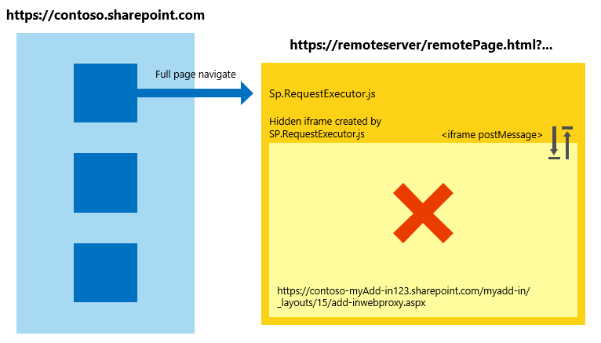

# Work with the cross-domain library across different Internet Explorer security zones in SharePoint Add-ins
Learn how to use the cross-domain library in SharePoint 2013 when the host web and add-in pages are in different security zones in Windows Internet Explorer.
 

 **Note**  The name "apps for SharePoint" is changing to "SharePoint Add-ins". During the transition, the documentation and the UI of some SharePoint products and Visual Studio tools might still use the term "apps for SharePoint". For details, see  [New name for apps for Office and SharePoint](new-name-for-apps-for-sharepoint.md#bk_newname).
 

If you are using the SharePoint 2013 cross-domain library for your add-ins, you should be aware of how security zones work in Internet Explorer. Your add-in may encounter some communication issues if the SharePoint website and the add-in are in different zones. This article explains what happens when you use the cross-domain library in different Internet Explorer security zones.
 

## Cross-zone scenarios in Internet Explorer using the SharePoint cross-domain library
<a name="bk_crosszonescenarios"> </a>

For security reasons, Internet Explorer prevents pages that are on different integrity levels (also known as security zones) to share cookies because each integrity level has its own cookie store. The integrity level of a page is determined by its top-most page, and any frame within that page will share the same integrity level. For more information, see  [Beware Cookie Sharing in Cross-Zone Scenarios](http://blogs.msdn.com/b/ieinternals/archive/2011/03/10/internet-explorer-beware-cookie-sharing-in-cross-zone-scenarios.aspx).
 

 
The SharePoint cross-domain library uses a hidden  **IFrame** and a client-side proxy page hosted on SharePoint to enable client-side communication using JavaScript. The cross-domain library is available when you reference the sp.requestexecutor.js file in your pages. For more information, see [Access SharePoint 2013 data from add-ins using the cross-domain library](access-sharepoint-2013-data-from-add-ins-using-the-cross-domain-library.md).
 

 
When the remote add-in page and SharePoint website are in different security zones, the authorization cookies cannot be sent. If there are no authorization cookies, and the  **IFrame** tries to load the proxy page, it will be redirected to the SharePoint sign-in page. The SharePoint sign-in page cannot be contained in an **IFrame** for security reasons. In these scenarios, the library cannot load the proxy page, and communication with SharePoint is not possible.
 

 
The following diagram shows a cross-zone scenario in which the proxy page cannot be loaded. The top page puts the frame in the same security zone as  `http://remoteserver/remotepage.html`. The proxy page does not load.
 

 

**Figure 1. Cross-zone scenario where the proxy page cannot be loaded**

 

 

 
The following are some examples in which the cross-domain library may not be able to load the proxy page:
 

 

 

- Your customers are using SharePoint Online, and your remote add-in page is hosted on an intranet server. This scenario is prone to the proxy page loading issue because the SharePoint Online URL is not usually in the Local intranet zone. This is a very common scenario during initial development of an add-in because you may be using IIS Express or another local server to host your page without a fully qualified internet domain.
    
 
- Your customers are using SharePoint on-premises with forms-based authentication, and your remote page is hosted on a cloud service (for example, Microsoft Azure).
    
 

## Handling cross-zone scenarios in SharePoint Add-ins
<a name="bk_handlingcrosszone"> </a>

There are a couple of ways to solve this problem during both add-in development (strongly recommended) and add-in run time.
 

 

### Best practice: Use the apphost pattern

To handle a cross-zone scenario, we recommend that you have an apphost page in SharePoint. The apphost page is a SharePoint page that contains the remote page in an **IFrame**. Everything inside the  **IFrame** in the apphost page exists in the same security zone as the add-in web. The cross-domain library in the remote page can receive the authorization cookies and loads the proxy page successfully.
 

 
The following diagram shows a cross-zone scenario being handled by using the apphost page pattern. 
 

 

**Figure 2. Cross-zone scenario handling by using the apphost page pattern**

 

 

 
The code required for the apphost page is simple. The main portion of the apphost page is an  **SPAppIFrame** element. You must use CSS to make the **IFrame** invisible so that it doesn't interfere with your add-in.
 

 
The following markup is an example of a simple apphost page. The markup performs the following tasks:
 

 

 

- Declares directives needed when using SharePoint components.
    
 
- Declares styles to make the  **IFrame** invisible.
    
 
- Declares the  **SPAppIFrame** and sets the target to the add-in start page.
    
 


```HTML
<%@ Page 
    Inherits="Microsoft.SharePoint.WebPartPages.WebPartPage, Microsoft.SharePoint, Version=15.0.0.0, Culture=neutral, PublicKeyToken=71e9bce111e9429c" 
    language="C#" %>
<%@ Register 
    Tagprefix="SharePoint" 
    Namespace="Microsoft.SharePoint.WebControls" 
    Assembly="Microsoft.SharePoint, Version=15.0.0.0, Culture=neutral, PublicKeyToken=71e9bce111e9429c" %>
<%@ Register 
    Tagprefix="Utilities" 
    Namespace="Microsoft.SharePoint.Utilities" 
    Assembly="Microsoft.SharePoint, Version=15.0.0.0, Culture=neutral, PublicKeyToken=71e9bce111e9429c" %>
<%@ Register 
    Tagprefix="WebPartPages" 
    Namespace="Microsoft.SharePoint.WebPartPages" 
    Assembly="Microsoft.SharePoint, Version=15.0.0.0, Culture=neutral, PublicKeyToken=71e9bce111e9429c" %>

<html>
<head>
    <title>Your add-in page title</title>
    <style type="text/css">
        html, body
        {
            overflow:hidden;
        }
        
        body
        {
            margin:0px;
            padding:0px;
        }
         
        iframe 
        {
            border:0px;
            height:100%;
            width:100%;
        }
    </style>
</head>

<body>
    <SharePoint:SPAppIFrame 
        runat="server" 
        src="~remoteAppUrl/StartPage.html?{StandardTokens}" 
        frameborder="0">
    </SharePoint:SPAppIFrame>
</body>
</html>
```

If you want your users to deep link into portions of your add-in, your apphost page and the contents of the  **IFrame** can collaborate to make that possible. One alternative is to use **IFrame** post-message communication and individual URLs per page in the remote add-in. To have individual URLs per page, you can create individual pages in the add-in web or use query string parameters on one page.
 

 

### Alternative approach: Add the sites to the same security zone in Internet Explorer

If an add-in was not designed following the apphost pattern, you can still allow it to work by adding the following domains into the same security zone: 
 

 

- The domain of your SharePoint site (for example,  `https://contoso.sharepoint.com`).
    
 
- The domain of the cloud-hosted add-in ( `http://remoteserver`).
    
 
- The domain of Microsoft-hosted sign-in pages and services ( `*.microsoftonline.com`).
    
 
Administrators can use Active Directory policies to push changes to all computers in the organization.
 

 

## Security implications of using the apphost pattern
<a name="bk_securityimplications"> </a>

It is important to point out that the apphost pattern effectively puts your remote page in the same security zone as the add-in web. Make you sure you understand the implications of adding a site to a security zone. For more information, see  [How to use security zones in Internet Explorer](http://support.microsoft.com/kb/174360).
 

 

## Working in other browsers: Chrome, Firefox, and Safari
<a name="bk_otherbrowsers"> </a>

Other browsers, such as Google Chrome, Mozilla Firefox, and Apple Safari, do not implement the concept of security zone. If a browser does not isolate the cookies in separated storage, it probably will not encounter the difficulties described in this article. We recommend that you follow the apphost pattern in your add-ins. Using the apphost pattern ensures that your add-in works in the mentioned browsers and Internet Explorer, regardless of which security zone SharePoint is in.
 

 

## Additional resources
<a name="bk_addresources"> </a>


-  [Secure data access and client object models for SharePoint Add-ins](secure-data-access-and-client-object-models-for-sharepoint-add-ins.md)
    
 
-  [Access SharePoint 2013 data from add-ins using the cross-domain library](access-sharepoint-2013-data-from-add-ins-using-the-cross-domain-library.md)
    
 
-  [SharePoint Add-ins](sharepoint-add-ins.md)
    
 
-  [Authorization and authentication of SharePoint Add-ins](authorization-and-authentication-of-sharepoint-add-ins.md)
    
 
-  [Three ways to think about design options for SharePoint Add-ins](three-ways-to-think-about-design-options-for-sharepoint-add-ins.md)
    
 
-  [Important aspects of the SharePoint Add-in architecture and development landscape](important-aspects-of-the-sharepoint-add-in-architecture-and-development-landscape.md)
    
 
-  [Host webs, add-in webs, and SharePoint components in SharePoint 2013](host-webs-add-in-webs-and-sharepoint-components-in-sharepoint-2013.md)
    
 
-  [Data storage in SharePoint Add-ins](important-aspects-of-the-sharepoint-add-in-architecture-and-development-landscape.md#Data)
    
 
-  [Create a custom proxy page for the cross-domain library in SharePoint 2013](create-a-custom-proxy-page-for-the-cross-domain-library-in-sharepoint-2013.md)
    
 
-  [Client-side Cross-domain Security](http://msdn.microsoft.com/en-us/library/cc709423%28v=vs.85%29.aspx)
    
 

