# Build an API secured with Azure AD

Securing the access to an API with Azure AD isn't complex and requires just a few steps. The exact process varies depending on the implementation of your API. If you choose to use Azure Functions, you are able to configure the security through the Azure portal. If you built your API by using the ASP.NET Web API and want to host it somewhere else than in Azure App Service, you need to extend the Web API's code to add authentication to it. Following is a step-by-step description of how you would build and configure an API secured with Azure AD by using both Azure Functions and ASP.NET Web API.

## Build the API using an Azure Function

Building APIs using Azure Functions offers you a number of benefits. First and foremost, it significantly simplifies the development and deployment process of the API. Azure Functions offer a rich set of configuration options. The only thing that you need to take care of is the actual API code. For everything else, from authentication to supporting Cross-Origin Resource Sharing (CORS) and documenting the API, you can use the Azure portal.

Azure Functions are hosted in Azure App Service and benefit from many capabilities available in the underlying service. On top of securing the API by using a function or admin key, you can choose to enable Azure App Service security and protect your API by using Azure AD or one of the other available authentication providers. App Service Authentication can be configured via the Azure portal and doesn't require any changes in the API code.

Following is how you would use Azure Functions to create an API secured with Azure AD and capable of being called from a cross-domain origin in a secured way.

### Create a new Azure Function

1. In the Azure portal, go to your Resource Group and add a Function App.

    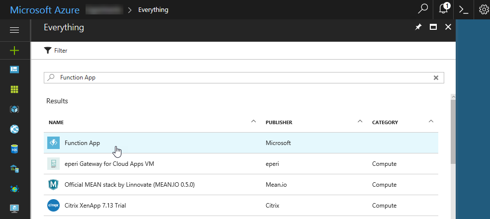

2. After the Function App has been provisioned, open the newly created Function App and add a new function by selecting the plus icon next to the Functions label.

    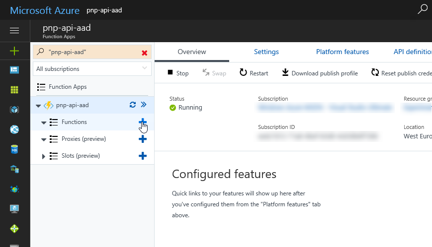

3. On the quick start screen, scroll to the **Get started on your own** section, and select the **Custom function** option.

    

4. From the list of templates, select **HttpTrigger-JavaScript**.

5. For the function name, enter **Orders**, and set the function authorization level to **Anonymous** because you will use Azure AD to secure access to the Azure Function. Confirm your selection by selecting **Create**.

    

### Implement API code

1. Replace the function's code with the following snippet:

    ```js
    module.exports = function (context, req) {
        context.res = {
            body: [
                {
                    id: 1,
                    orderDate: new Date(2016, 0, 6),
                    region: "east",
                    rep: "Jones",
                    item: "Pencil",
                    units: 95,
                    unitCost: 1.99,
                    total: 189.05
                },
                {
                    id: 2,
                    orderDate: new Date(2016, 0, 23),
                    region: "central",
                    rep: "Kivell",
                    item: "Binder",
                    units: 50,
                    unitCost: 19.99,
                    total: 999.50
                },
                {
                    id: 3,
                    orderDate: new Date(2016, 1, 9),
                    region: "central",
                    rep: "Jardine",
                    item: "Pencil",
                    units: 36,
                    unitCost: 4.99,
                    total: 179.64
                },
                {
                    id: 4,
                    orderDate: new Date(2016, 1, 26),
                    region: "central",
                    rep: "Gill",
                    item: "Pen",
                    units: 27,
                    unitCost: 19.99,
                    total: 539.73
                },
                {
                    id: 5,
                    orderDate: new Date(2016, 2, 15),
                    region: "west",
                    rep: "Sorvino",
                    item: "Pencil",
                    units: 56,
                    unitCost: 2.99,
                    total: 167.44
                }],
            headers: {
                "Access-Control-Allow-Credentials" : "true",
                "Access-Control-Allow-Origin" : "https://contoso.sharepoint.com"
            }
        };
        context.done();
    };
    ```

2. Change the URL specified in the **Access-Control-Allow-Origin** header to match the URL of your SharePoint Online tenant from which you are calling this API.

3. Save the changes to the function's code by selecting **Save**.

    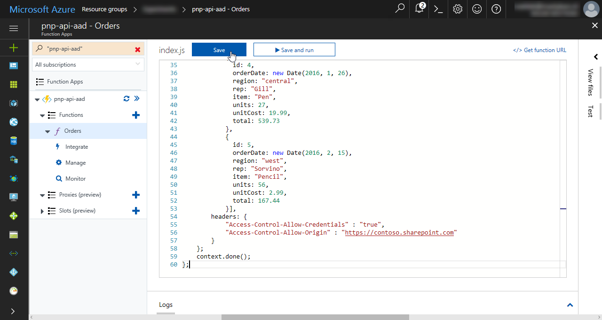

### Change CORS settings

Azure Functions are hosted in Azure App Service, which allows you to configure its Cross-Origin Resource Sharing (CORS) settings through the Azure portal. While this is convenient, if configured through the portal, it cannot be used in combination with the **Access-Control-Allow-Credentials** header, which is required by the API to accept authentication cookies coming from another origin. For the client-side authentication to work correctly, CORS settings of the Azure App Service must be cleared.

> [!IMPORTANT]
> If you're authenticating with the API using the SharePoint Online cookie you have to clear all CORS settings or the authentication process will fail. If you're however authenticating using OAuth, you can use the Azure portal, to configure CORS settings for your API.

1. In the Function App, select your Azure Function, and navigate to the **Platform features** blade.

    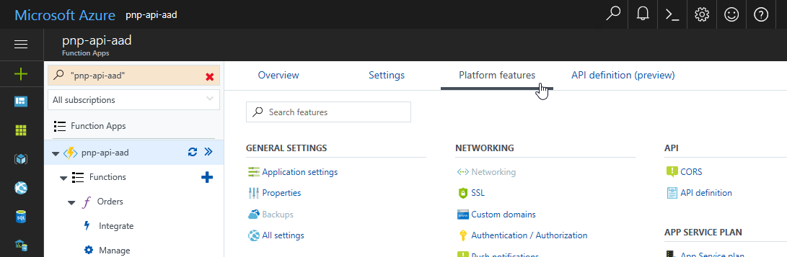

2. In the **API** section, select the **CORS** option.

    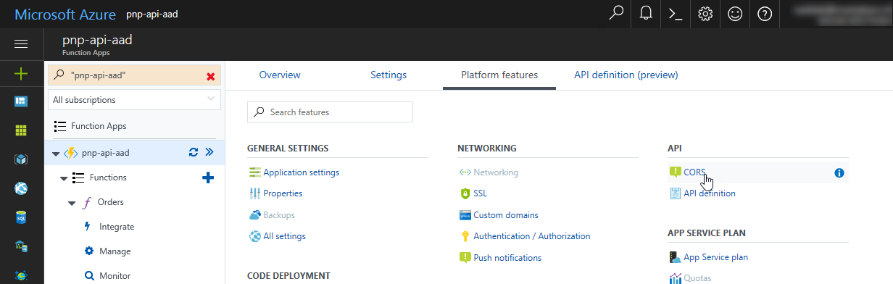

3. On the **CORS settings** blade, delete all entries so that the CORS configuration is empty.

    

4. Confirm the deletion by selecting **Save**.

    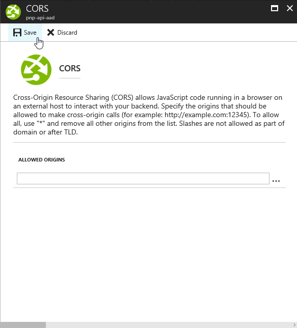

### Enable App Service Authentication

1. In the Function App settings, go back to the **Platform features** blade. 

2. In the **Networking** section, select the **Authentication / Authorization** option.

    

3. Enable App Service Authentication by setting the **App Service Authentication** toggle to **On**.

    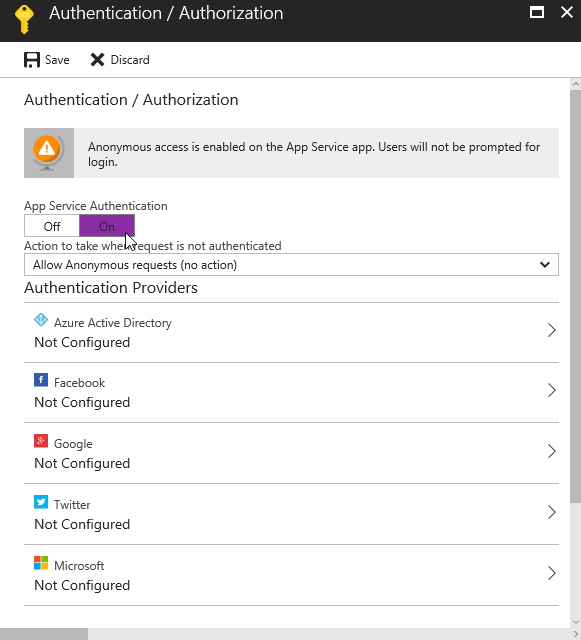

4. To disallow anonymous access to the API and force authentication using Azure AD, set the value of the **Action to take when request is not authenticated** list to **Log in with Azure Active Directory**.

    

5. In the list of authentication providers, select **Azure Active Directory** to configure it.

    

6. On the **Active Directory Authentication** blade, set the **Management mode** to **Express**, and create a new Azure AD app.

    > [!IMPORTANT]
    > When using the Express configuration mode, the Azure portal creates a new Azure AD application from the same directory where the Function App is located. If the Function App is hosted in a different Azure subscription with a different directory, you should use the advanced mode instead, and specify the ID of the directory and application that should be used to secure access to the API.
    >
    > When using existing Azure AD applications, configure the application to accept credentials from a single tenant only. Configuring the application as multi-tenant allows any user with a valid organization or personal account to connect to your API.
    >
    > Using an Azure AD application to secure the access to your API only accounts for authentication. When building your API, you should also authorize requests in your API's code to ensure that only users with sufficient privileges are using the API.

7. Because the app is only meant to secure access to the Azure Function, it doesn't require any additional permissions. Confirm the selection by selecting **OK**.

    

8. When the **Azure Active Directory** blade closes, back on the **Authentication / Authorization** blade, select **Save** to confirm all changes to authentication settings.

    

9. If you try to navigate to your API URL in a new private window, you should be prompted to sign in by using your Azure AD account.

    

At this point, the API is ready to be called securely from a SharePoint Framework client-side web part by using the authentication cookie.

## Build the API by using ASP.NET Web API

Another way to implement the API is by using the ASP.NET Web API. Compared to using Azure Functions to build the API, the ASP.NET Web API requires significantly more work. Not only do you have to set up a complete project for it, but you also have to think about where the API will be deployed. On the other hand, using the ASP.NET Web API offers you more flexibility and allows you to deploy the API to different platforms such as Azure App Service, Docker containers, other cloud providers, or even on your infrastructure.

Following are steps to build an API using the ASP.NET Web API, deploy it to Azure App Service, and secure it by using Azure App Service Authentication. Later, you will extend the API to perform the authentication by itself so that it can be deployed to other platforms as well.

### Create a new ASP.NET Web API project

1. In Visual Studio, on the **File** menu, select the **New / Project** option. 

2. In the **New Project** dialog box, select the Visual C# Web templates, and from the list of available templates, select the **ASP.NET Web Application** template.

    

3. As the type of ASP.NET Web Application project, select **Web API**.

    

4. Because you will use Azure App Service Authentication to secure the access to the API, select the **Change Authentication** button, and then select the **No Authentication** option.

    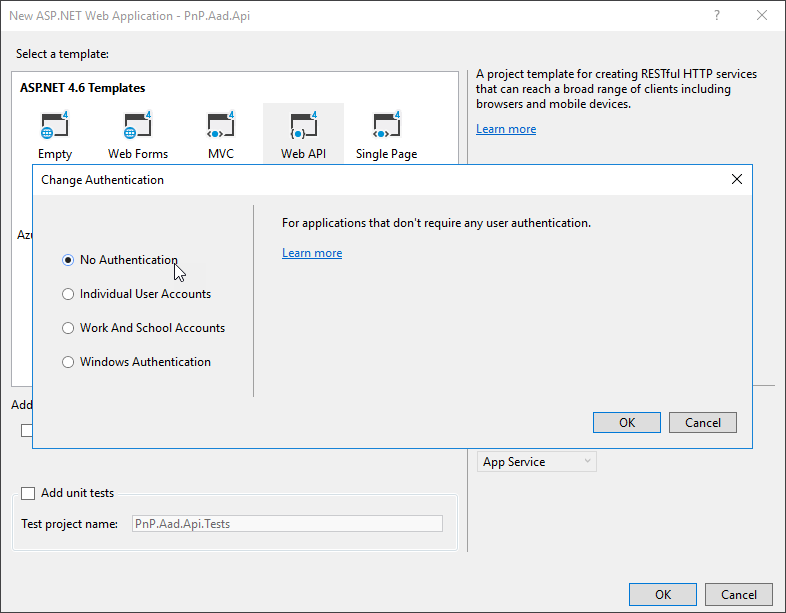

5. Confirm your choice by selecting **OK**.

6. Visual Studio allows you to easily deploy your Web API to Azure App Service. To benefit from this capability, in the **New ASP.NET Web Application** dialog box, in the **Microsoft Azure** section, select the **Host in the cloud** check box, and in the list, select the **App Service** option.

    

7. In the **Create App Service** dialog box, specify the name for the web app to be created, and select the Azure **Subscription**, **Resource Group**, and **App Service Plan** that you want to use for this application.

    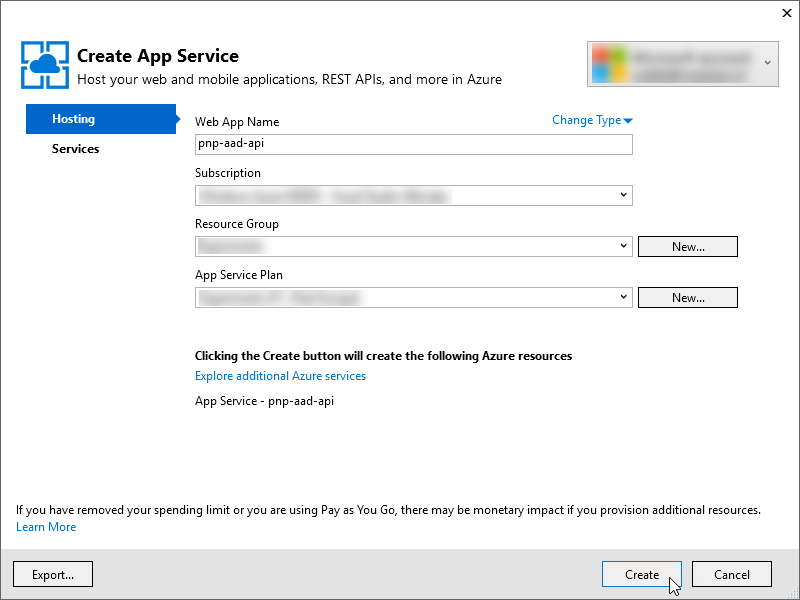

8. Confirm your choice by selecting **Create**. At this point, Visual Studio creates a new Azure Web App to host your web application.

### Add support for CORS

By default, APIs created using the ASP.NET Web Application project template don't support CORS and cannot be called by client-applications hosted on different domains. 

1. To add support for CORS to your Web API, right-click the project, and from the context menu, select the **Manage NuGet Packages** option.

    

2. On the **Manage NuGet Packages** tab, search for a package named **Microsoft.AspNet.WebApi.Cors** and install it in your project.

    

### Add data model

In the project, define a model that represents the data returned by the API. In the **Models** folder, add a new class and name it **Order**. Paste the following code into the newly created file:

```cs
    using Newtonsoft.Json;
    using Newtonsoft.Json.Converters;
    using System;

    namespace PnP.Aad.Api.Models {
        public class Order {
            [JsonProperty(PropertyName = "id")]
            public int Id { get; set; }
            [JsonProperty(PropertyName = "orderDate")]
            public DateTime OrderDate { get; set; }
            [JsonConverter(typeof(StringEnumConverter))]
            [JsonProperty(PropertyName = "region")]
            public Region Region { get; set; }
            [JsonProperty(PropertyName = "rep")]
            public string Rep { get; set; }
            [JsonProperty(PropertyName = "item")]
            public string Item { get; set; }
            [JsonProperty(PropertyName = "units")]
            public uint Units { get; set; }
            [JsonProperty(PropertyName = "unitCost")]
            public double UnitCost { get; set; }
            [JsonProperty(PropertyName = "total")]
            public double Total { get; set; }
        }

        public enum Region {
            East,
            Central,
            West
        }
    }
```

### Add Orders API

Add an API that returns the information about the latest orders. In the **Controllers** folder, create a new class and name it **OrdersController**. Paste the following code into the newly created file:

```cs
using PnP.Aad.Api.Models;
using System;
using System.Collections.Generic;
using System.Web.Http;

namespace PnP.Aad.Api.Controllers {
    public class OrdersController : ApiController {
        private List<Order> orders = new List<Order> {
            new Order {
                Id = 1,
                OrderDate = new DateTime(2016, 1, 6),
                Region = Region.East,
                Rep = "Jones",
                Item = "Pencil",
                Units = 95,
                UnitCost = 1.99,
                Total = 189.05
            },
            new Order {
                Id = 2,
                OrderDate = new DateTime(2016, 1, 23),
                Region = Region.Central,
                Rep = "Kivell",
                Item = "Binder",
                Units = 50,
                UnitCost = 19.99,
                Total = 999.50
            },
            new Order {
                Id = 3,
                OrderDate = new DateTime(2016, 2, 9),
                Region = Region.Central,
                Rep = "Jardine",
                Item = "Pencil",
                Units = 36,
                UnitCost = 4.99,
                Total = 179.64
            },
            new Order {
                Id = 4,
                OrderDate = new DateTime(2016, 2, 26),
                Region = Region.Central,
                Rep = "Gill",
                Item = "Pen",
                Units = 27,
                UnitCost = 19.99,
                Total = 539.73
            },
            new Order {
                Id = 5,
                OrderDate = new DateTime(2016, 3, 15),
                Region = Region.West,
                Rep = "Sorvino",
                Item = "Pencil",
                Units = 56,
                UnitCost = 2.99,
                Total = 167.44
            }
        };

        public IEnumerable<Order> Get() {
            return orders;
        }
    }
}
```

### Extend the API with support for CORS

Even though you have installed support for CORS in your project, it's not being actively used yet. If you call the newly created Orders API from a client application hosted on another domain, you get a CORS error and the request fails.

1. For an API to support CORS, it has to be decorated with the **EnableCors** attribute.

    ```cs
    using PnP.Aad.Api.Models;
    using System;
    using System.Collections.Generic;
    using System.Web.Http;
    using System.Web.Http.Cors;

    namespace PnP.Aad.Api.Controllers {
        public class OrdersController : ApiController {
            private List<Order> orders = new List<Order> {
                // ...
            };

            [EnableCors("*", "*", "GET", SupportsCredentials = true)]
            public IEnumerable<Order> Get() {
                return orders;
            }
        }
    }
    ```

2. Open the **.\App_Start\WebApiConfig.cs** file, and paste the following code:

    ```cs
    using System.Web.Http;

    namespace PnP.Aad.Api {
        public static class WebApiConfig {
            public static void Register(HttpConfiguration config) {
                // Web API configuration and services

                // Web API routes
                config.MapHttpAttributeRoutes();

                config.EnableCors();

                config.Routes.MapHttpRoute(
                    name: "DefaultApi",
                    routeTemplate: "api/{controller}/{id}",
                    defaults: new { id = RouteParameter.Optional }
                );
            }
        }
    }
    ```

At this point, the API is code complete and can be published to the Azure Web App.

### Publish the API to Azure Web App

1. In Visual Studio, right-click the project, and from the context menu, select the **Publish** option.

    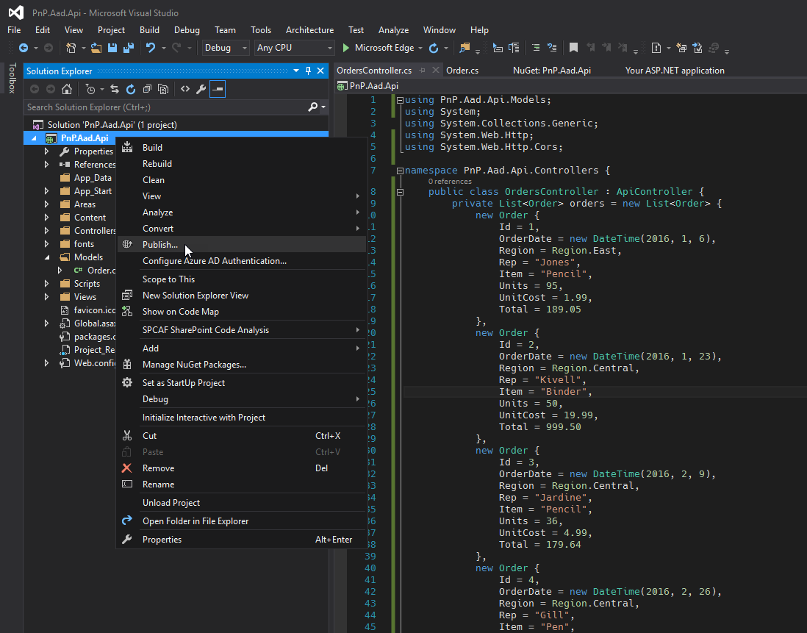

2. In the **Publish** dialog box, verify that all the information is correct, and select **Publish** to start the publishing process.

    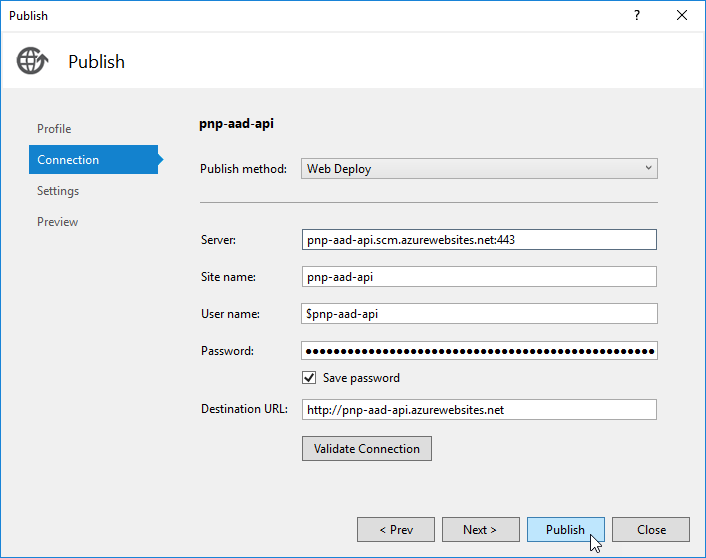

3. After the publishing process completes, navigate in your web browser to the API URL, for example, `http://pnp-aad-api.azurewebsites.net/api/orders`. At this point, the API is not secured and can be accessed by anonymous users.

    

### Secure the API using Azure App Service

1. To secure the API using Azure AD, go to the Azure portal and open the Web App hosting your API. 

2. From the **Settings** group, select the **Authentication / Authorization** option.

    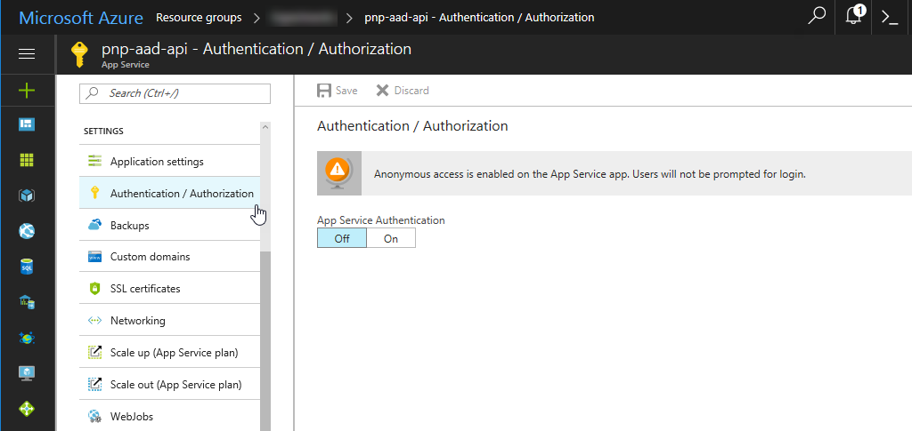

3. To enable authentication for your Web App, set the **App Service Authentication** toggle to **On**.

    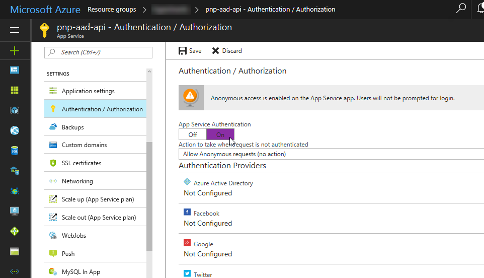

4. To disallow anonymous access to the API, in the **Action to take when request is not authenticated** list, select the **Log in with Azure Active Directory** option.

    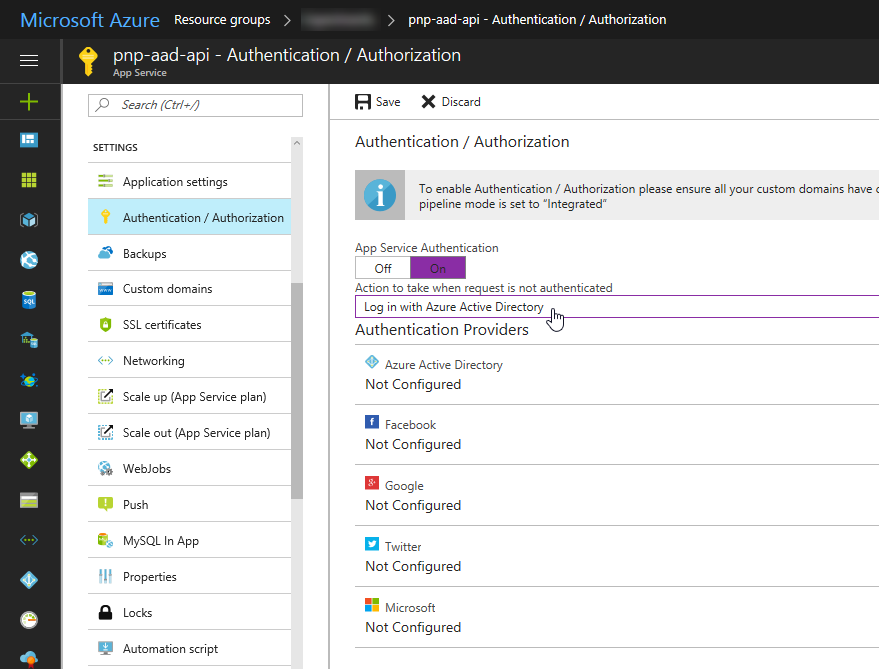

5. Configure Azure Active Directory authentication from the list of authentication providers by selecting **Azure Active Directory**.

    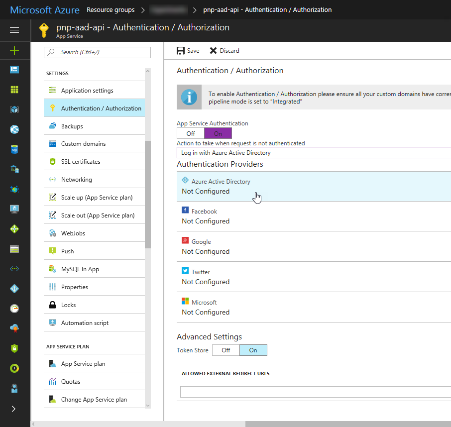

6. On the **Active Directory Authentication** blade, set the **Management mode** to **Express** and create a new Azure AD app.

    > [!IMPORTANT]
    > When using the Express configuration mode, the Azure portal creates a new Azure AD application from the same directory where the Function App is located. If the Function App is hosted in a different Azure subscription with a different directory, you should use the advanced mode instead, and specify the ID of the directory and application that should be used to secure access to the API.
    >
    > When using existing Azure AD applications, configure the application to accept credentials from a single tenant only. Configuring the application as multi-tenant allows any user with a valid organization or personal account to connect to your API.
    >
    > Using an Azure AD application to secure the access to your API only accounts for authentication. When building your API, you should also authorize requests in your API's code to ensure that only users with sufficient privileges are using the API.

7. Because the app is only meant to secure access to the Azure Function, it doesn't require any additional permissions. Confirm the selection by selecting **OK**.

    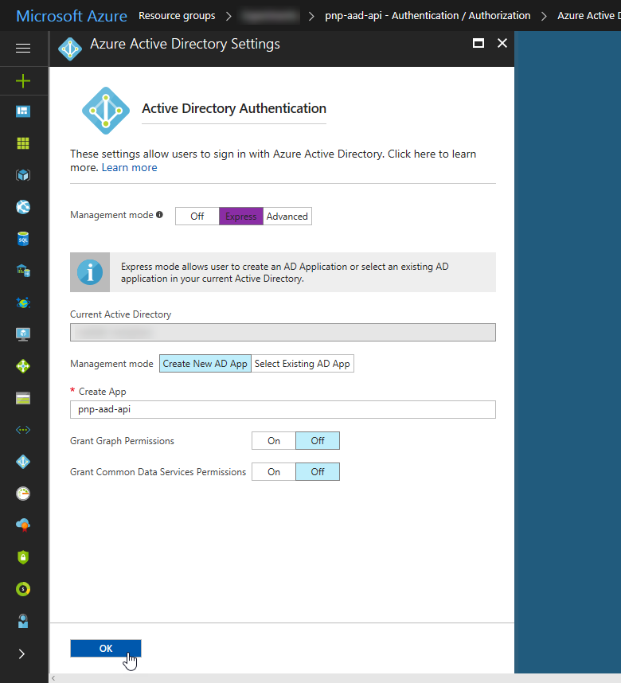

8. When the **Azure Active Directory** blade closes, back on the **Authentication / Authorization** blade, select **Save** to confirm all changes to authentication settings.

    

9. If you try to navigate to your API URL in a new private window, you should be prompted to sign in by using your Azure AD account.

    

At this point, the API is ready to be called securely from a SharePoint Framework client-side web part by using the authentication cookie.

### Secure the API using OpenID

If you want to deploy your ASP.NET Web API project to other location than Azure App Service and want it to be secured with Azure AD, you can't rely on App Service Authentication. Instead, you have to extend the web application to require its users to authenticate before they can use the API.

#### Disable anonymous access to all resources

1. Assuming you want all resources secured, open the **.\App_Start\FilterConfig.cs** file, and paste the following code:

    ```cs
    using System.Web.Mvc;

    namespace PnP.Aad.Api {
        public class FilterConfig {
            public static void RegisterGlobalFilters(GlobalFilterCollection filters) {
                filters.Add(new HandleErrorAttribute());
                filters.Add(new AuthorizeAttribute());
            }
        }
    }
    ```

2. To require authentication for all APIs, open the **.\App_Start\WebApiConfig.cs** file, and paste the following code:

    ```cs
    using System.Web.Http;

    namespace PnP.Aad.Api {
        public static class WebApiConfig {
            public static void Register(HttpConfiguration config) {
                // Web API configuration and services

                // Web API routes
                config.MapHttpAttributeRoutes();

                config.EnableCors();
                config.Filters.Add(new AuthorizeAttribute());

                config.Routes.MapHttpRoute(
                    name: "DefaultApi",
                    routeTemplate: "api/{controller}/{id}",
                    defaults: new { id = RouteParameter.Optional }
                );
            }
        }
    }
    ```

3. If you try to access either the API or any other resource in your web application, you get a 401 Unauthorized response.

    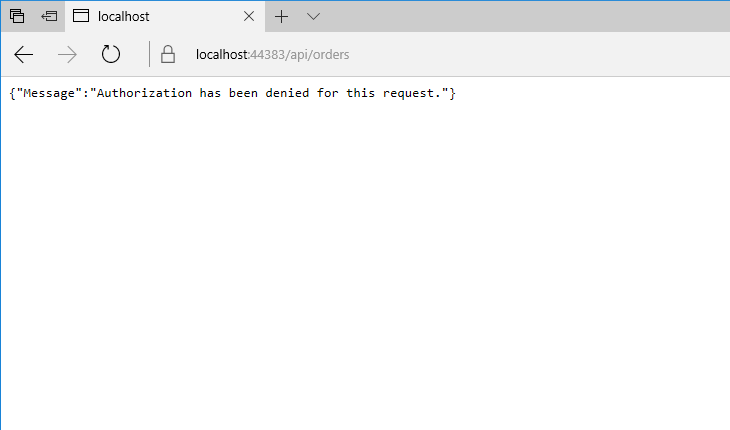

At this point, the web application requires that all requests to its resources are authenticated, but it doesn't start the Azure AD sign-in flow. 

In the following steps, you extend the web application so that it redirects users to the Azure AD sign-in page, if they weren't previously authenticated.

#### Register Azure AD application

To secure an API with Azure AD, you need to register an Azure AD application. This application is then referenced in the web application project and used by the OWIN middleware to secure the access to your API with Azure AD.

1. If you don't have an existing Azure AD application yet, you can create one in the Azure portal, by navigating to the **Azure Active Directory** blade.

    > [!IMPORTANT]
    > The Azure AD application used to secure the API should be created in the same Azure Active Directory that is used by your organization to access Office 365.

    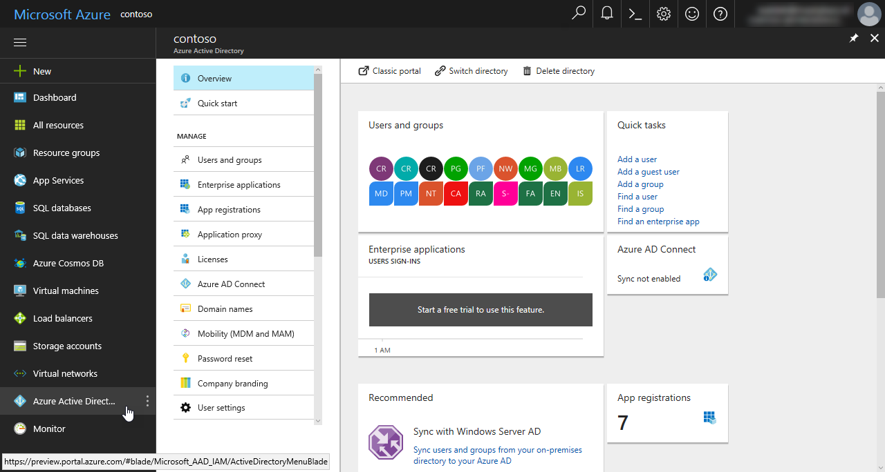

2. On the **Azure Active Directory** blade, navigate to the **App registrations** blade.

    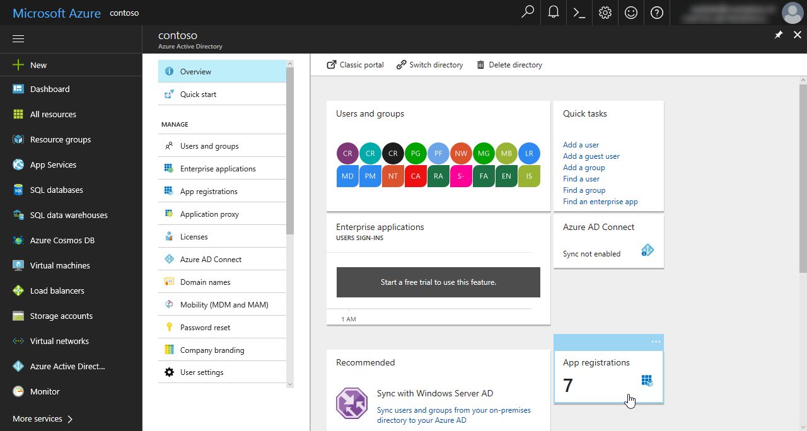

3. On the **App registrations** blade, select the **New application registration** button to register a new Azure AD application.

    

4. On the **Create** blade, provide the information about your application, and confirm the creation by selecting **Create**.

    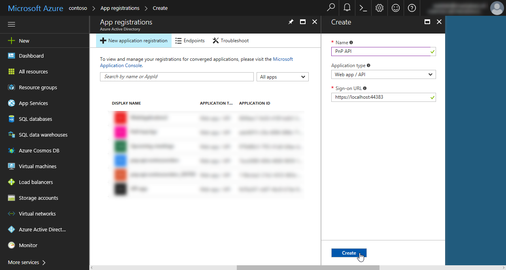

5. After the application registration is successfully created, select it in the list to view its details.

    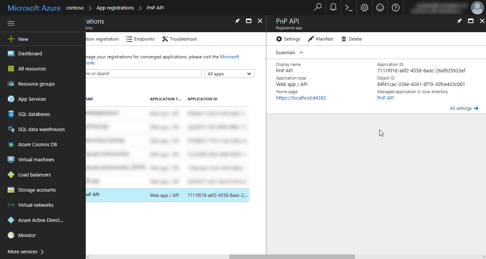

6. From the application registration information, copy the **Application ID** and store it because you will need it when you configure Azure AD authentication for your web application.

#### Redirect anonymous requests to Azure AD sign-in page

1. In Visual Studio, rightclick the project, and from the context menu, select the **Manage NuGet Packages** option.

2. In the **Manage NuGet Packages** window, add the following packages to your project:

    - Microsoft.Owin.Host.SystemWeb
    - Microsoft.Owin.Security.Cookies
    - Microsoft.Owin.Security.OpenIdConnect

3. In the root directory of your project, add a new class named **Startup**, and paste the following code:

    ```cs
    using Owin;

    namespace PnP.Aad.Api {
        public partial class Startup
        {
            public void Configuration(IAppBuilder app)
            {
                ConfigureAuth(app);
            }
        }
    }
    ```

4. In the **App_Start** folder, create a new class named **Startup.Auth**, and paste the following code:

    ```cs
    using Microsoft.Owin.Security;
    using Microsoft.Owin.Security.Cookies;
    using Microsoft.Owin.Security.OpenIdConnect;
    using Owin;
    using System.Configuration;

    namespace PnP.Aad.Api {
        public partial class Startup {
            // For more information on configuring authentication, please visit http://go.microsoft.com/fwlink/?LinkId=301864
            public void ConfigureAuth(IAppBuilder app) {
                app.SetDefaultSignInAsAuthenticationType(CookieAuthenticationDefaults.AuthenticationType);

                app.UseCookieAuthentication(new CookieAuthenticationOptions());

                app.UseOpenIdConnectAuthentication(
                    new OpenIdConnectAuthenticationOptions {
                        ClientId = ConfigurationManager.AppSettings["ida:ClientId"],
                        Authority = $"https://login.microsoftonline.com/{(ConfigurationManager.AppSettings["ida:Tenant"])}",
                        PostLogoutRedirectUri = ConfigurationManager.AppSettings["ida:PostLogoutRedirectUri"],
                    });
            }
        }
    }
    ```

5. In Visual Studio, open the **Web.config** file, and in the **appSettings** section, add the following elements:

    ```xml
    <add key="ida:Tenant" value="contoso.onmicrosoft.com" />
    <add key="ida:ClientId" value="eeb40f1f-c5fa-4096-896b-71c77d459e21" />
    <add key="ida:PostLogoutRedirectUri" value="https://localhost:44320/" />
    ```

    - The value of the **ida:Tenant** key is the name of the Azure AD where the Azure AD app used to secure the API is defined.
    - **ida:ClientId** specifies the ID of the Azure AD application used to secure the API.
    - The URL specified in the **ida:PostLogoutRedirectUri** property is where Azure AD would redirect to after signing out of your application, which isn't used in this case.

This concludes the configuration process. If you start your web application, before you are able to access any of its resources, you are prompted to sign in with your Azure AD account. To ensure that only authorized users are accessing the particular API, you should implement authorization in your custom APIs. You can do that by retrieving the user name from the `RequestContext.Principal.Identity` property, and verifying it against your security matrix.
