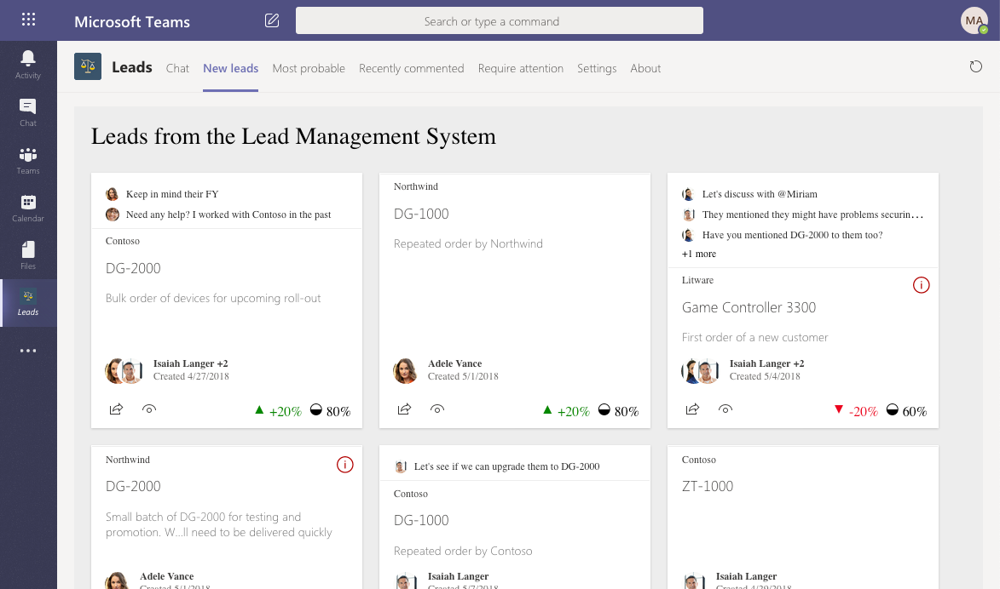
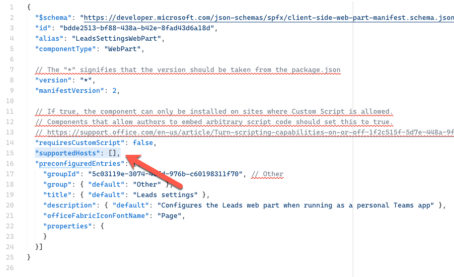
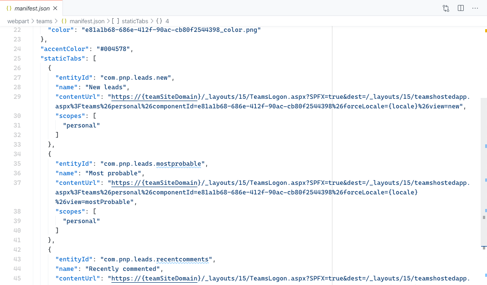
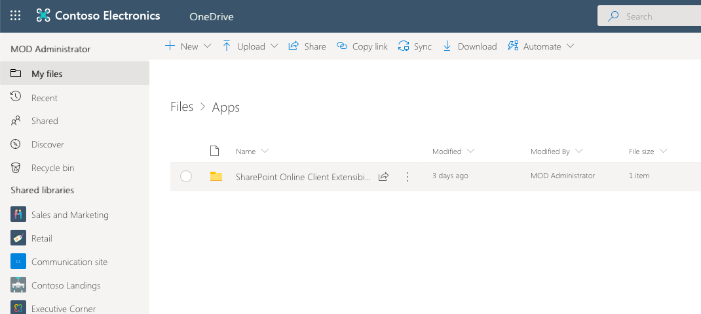

# Configure SharePoint Framework web parts in Microsoft Teams

To accommodate your users' preferences, you can let them configure your web parts when used in Microsoft Teams. Depending if you exposed your web parts as Teams tabs or personal apps, there are different ways to implement configuration capabilities in your web part.

> [!TIP]
> To see how to use the different concepts described in this article, see the sample [Leads application](https://github.com/pnp/sp-dev-solutions/tree/master/solutions/LeadsLOBSolution) on GitHub.

## Configure Microsoft Teams tabs built using SharePoint Framework

Typically, when building Microsoft Teams tab, you need to [build custom UI to allow users to configure your tab](/microsoftteams/platform/tabs/how-to/create-tab-pages/configuration-page). Additionally, you need to write code to store and load configuration values as selected by the user.

When building tabs using SharePoint Framework, the generated tab uses the [web part property pane](web-parts/guidance/integrate-web-part-properties-with-sharepoint.md) to let users configure the tab. This saves you a lot of effort. Not only you don’t need to build and maintain a separate configuration UI but you also don’t need to implement any code responsible for storing and managing the settings. All of that is handled automatically for you by SharePoint Framework.

## Configure Microsoft Teams personal apps built using SharePoint Framework

Microsoft Teams personal apps don’t offer any infrastructure for implementing configuration. Instead, following the pattern recommended by Microsoft Teams, personal app’s [settings should be exposed in a separate tab](/microsoftteams/platform/concepts/design/personal-apps).

Translating this to your SharePoint Framework solution, it means building a separate web part that contains the configuration UI and which will be used only in the context of the personal app, defining a storage for user’s configuration and extending the personal app definition to contain multiple tabs.

### Personal app configuration UI web part

Each tab in a personal app is mapped to a URL. The easiest way to build UI for configuring your SharePoint Framework web part exposed as a personal app, is by building a separate web part with the configuration UI. This will allow you to optimize the UI for use in the context of the personal app and keep this code separate from your web part.

Since the personal app configuration UI web part is not meant to be used outside of the personal app, in its manifest, you should set the `supportedHosts` property to an empty array.

The reason you want the `supportedHosts` property to be empty is to prevent the web part from being used in SharePoint but also not include it in the autogenerated Teams manifest. By default, each web part that contains the `TeamsTab` or `TeamsPersonalApp` value in the manifest is included in the generated Teams manifest as a separate Microsoft Teams app. In this case however, you want the personal app to consist of multiple tab, each pointing to a different web part. This can be done only by manually updating the manifest yourself.

To add a tab to your personal app and have it point to another web part, in the Teams manifest defined in the **teams/manifest.json** file, navigate to the `staticTabs` section and copy the existing entry. In the copied entry, update values of the `entityId` and `name` properties. In the `contentUrl` property, update the value of the `componentId` query string parameter so that it matches the ID of your settings web part as defined in its manifest.

### Choose the location to store user’s configuration

By default, web parts’ configuration is shared and the same for all users. Personal Teams apps are however meant to be installed, configured and used by individuals. As such, you need to have a way to store their preferences.

#### Store user configuration in the User Profile Service

In the past, a common way to store user-specific information in SharePoint, was by adding a custom property to the user profile service and storing the configuration as a serialized string in there. The problem with using the user profile service for this purpose is that you can’t automatically generate new user profile properties which complicates the deployment of your application.

#### Store user configuration in a custom list

Alternatively, you could store user settings in a list. You could create a hidden list in the root SharePoint site and configure it so that users can see only their items. The downside of this approach is that each time your web part starts you need to check if the list and the settings for the current user exist and gracefully handle errors in case they don’t. Additionally, when loading the configuration UI you would need to check if the list exists and provision it, along with all its settings if necessary.

#### Store user configuration in application’s personal folder

One of the less-known options for persisting application- and user-specific configuration is using the [application’s personal folder](/graph/api/drive-get-specialfolder?view=graph-rest-1.0&tabs=http). Application’s specific folder is located in the user’s OneDrive for Business site. Each application gets a designated folder in which it can store any number of files.

You can think of the application’s personal folder as a configuration folder of a desktop application on your disk, but then stored in OneDrive for Business and available on every device you use.

> [!TIP]
> Application’s personal folders are created per Azure AD application, so in the context of SharePoint Framework, all SharePoint Framework solutions will share the root application folder. To avoid collisions with other solutions, you should consider creating a subfolder for your application.

From the technical point of view, the application’s personal folder is a folder in a SharePoint document library, and you can store any number of files and folders inside. When persisting your application’s configuration to the application’s personal folder, you would serialize your settings as configured by the user and write the serialized data to a file in your folder.

What’s convenient about using the application’s personal folder is that it’s automatically created if it doesn’t exist, data for each user is stored in their own OneDrive for Business meaning other users cannot see or tamper with their settings and it doesn’t require you to know any specific URLs because you can conveniently access it using Microsoft Graph. Should anything go wrong, user can navigate to their OneDrive for Business site and delete the application’s configuration to reset its state.
