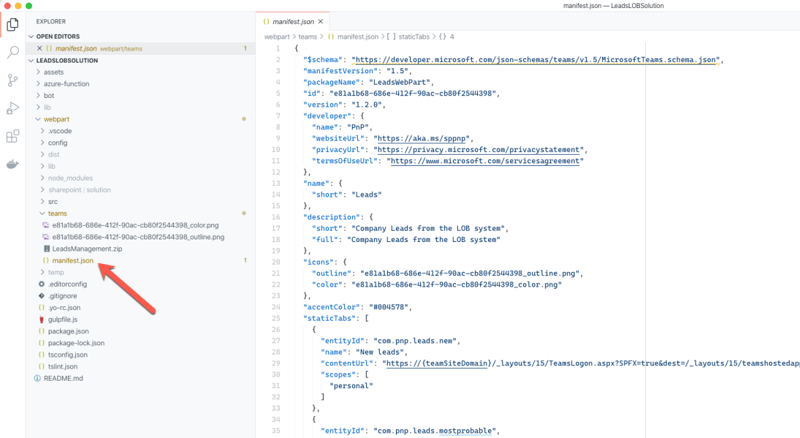
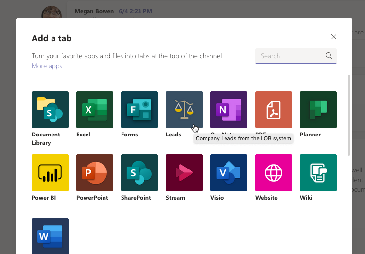
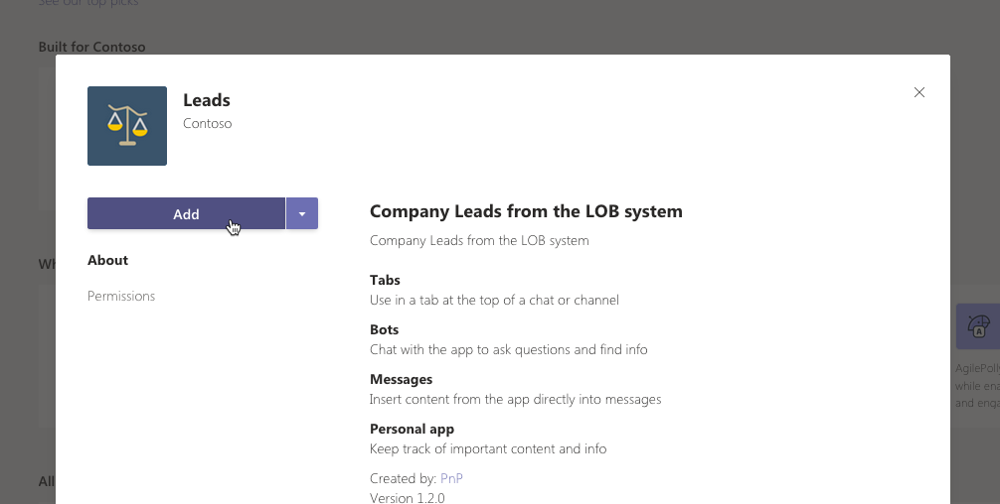

# Expose SharePoint Framework web parts in Microsoft Teams

Using SharePoint Framework, you can build [web parts](web-parts/overview-client-side-web-parts.md) and [extensions](extensions/overview-extensions.md). When building web parts, you can enable them to be exposed as a Microsoft Teams tab or a personal app.

> [!TIP]
> To see how to use the different concepts described in this article, see the sample [Leads application](https://github.com/pnp/sp-dev-solutions/tree/master/solutions/LeadsLOBSolution) on GitHub.

To expose a SharePoint Framework client-side web part as a Microsoft Teams tab, in the web part’s manifest, in the `supportedHosts` property, add `TeamsTab`.

To expose the web part as a Microsoft Teams personal app, in the web part’s manifest, in the `supportedHosts` property, add `TeamsPersonalApp`.

> [!TIP]
> The same SharePoint Framework web part can be exposed as a web part in SharePoint, Microsoft Teams tab and a personal Teams app. The values specified in the `supportedHosts` property decide how users will be able to work with your web part.

When you choose to expose your SharePoint Framework web parts in Microsoft Teams, you have a number of options for how to deploy them to Microsoft Teams.

## Use the autogenerated Microsoft Teams manifest

By default, the SharePoint Framework build toolchain automatically generates a Teams application manifest for you. This manifest includes all web parts that you have configured to be exposed in Microsoft Teams either as tabs or personal apps.

When you package your SharePoint Framework solution, this manifest is embedded in the generated solution package (.sppkg). After deploying the solution package to the SharePoint app catalog, choose the **Sync to Teams** option to make your tabs visible in Microsoft Teams.

> [!IMPORTANT]
> The **Sync to Teams** option will be enabled only for SharePoint Framework solution packages that have one or more web parts that can be exposed as Microsoft Teams tabs or personal apps.

After syncing your solution to Teams, users can add tabs to channels.

If you exposed some of your web parts as personal Teams app, users can install them as well:

## Create your own Microsoft Teams manifest

For advanced scenarios you can use the Teams manifest scaffolded with your SharePoint Framework project as a starting point and extend it to your needs. You might need to do this if you want to use different title or description for your web part and Teams tab, if you want to have separate Teams applications for the different web parts, combine multiple web parts in a single personal app or control the deployment process.

In this case, in your SharePoint Framework solution’s teams folder, edit the contents of the **manifest.json** file as necessary, and package the manifest and both icons in a .zip file.

> [!CAUTION]
> If you package the whole folder rather than just its contents, deploying the package to Microsoft Teams will fail.
