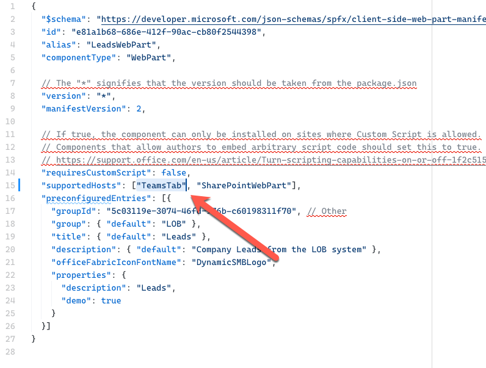
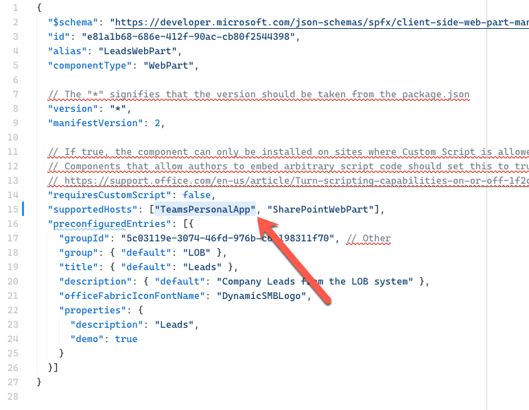
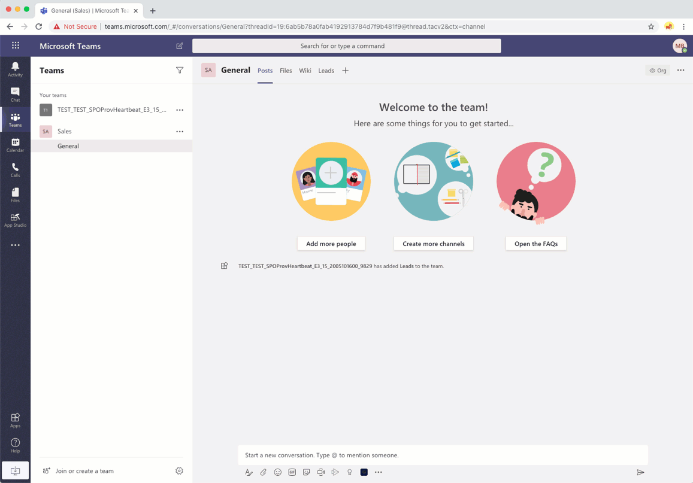

# Expose SharePoint Framework web parts in Microsoft Teams

Using SharePoint Framework, you can build [web parts](web-parts/overview-client-side-web-parts.md) and [extensions](extensions/overview-extensions.md). When building web parts, you can enable them to be exposed as a [Microsoft Teams tab](/microsoftteams/platform/tabs/what-are-tabs), a [personal app](/microsoftteams/platform/concepts/design/personal-apps) or a [messaging extension](/microsoftteams/platform/messaging-extensions/what-are-messaging-extensions).

> [!TIP]
> To see how to use the different concepts described in this article, see the sample [Leads application](https://github.com/pnp/sp-dev-solutions/tree/master/solutions/LeadsLOBSolution) on GitHub.

## Expose web part as Microsoft Teams tab

To expose a SharePoint Framework client-side web part as a Microsoft Teams tab, in the web part’s manifest, in the `supportedHosts` property, add `TeamsTab`.



## Expose web part as Microsoft Teams personal app

To expose the web part as a Microsoft Teams personal app, in the web part’s manifest, in the `supportedHosts` property, add `TeamsPersonalApp`.



> [!TIP]
> The same SharePoint Framework web part can be exposed as a web part in SharePoint, Microsoft Teams tab and a personal Teams app. The values specified in the `supportedHosts` property decide how users will be able to work with your web part.

## Expose web part as Microsoft Teams messaging extension

> [!IMPORTANT]
> Exposing web parts as Microsoft Teams messaging extension is supported with SharePoint Framework v1.11 and newer.


To expose your SharePoint Framework web part as a messaging extension, you don't need to use a specific host in the `supportedHosts` property. Instead, all you need to do, is to extend the teams manifest in your SharePoint Framework solution with a `composeExtension`, for example:

```json
{
  "$schema": "https://developer.microsoft.com/json-schemas/teams/v1.5/MicrosoftTeams.schema.json",
  "manifestVersion": "1.5",
  // trimmed for brevity
  "composeExtensions": [
    {
      "botId": "a349bab7-f895-4d6e-977a-764779833699",
      "canUpdateConfiguration": true,
      "commands": [
        {
          "id": "shareLead",
          "type": "action",
          "title": "Share a lead",
          "description": "Find and share a lead",
          "initialRun": false,
          "fetchTask": false,
          "context": [
            "commandBox",
            "compose"
          ],
          "taskInfo": {
            "title": "Share a lead",
            "width": "1100",
            "height": "665",
            "url": "https://{teamSiteDomain}/_layouts/15/TeamsLogon.aspx?SPFX=true&dest=/_layouts/15/teamstaskhostedapp.aspx%3Fteams%26personal%26componentId=e81a1b68-686e-412f-90ac-cb80f2544398%26forceLocale={locale}"
          }
        }
      ]
    }
  ]
  // trimmed for brevity
}
```

The key piece of information is the URL in the `taskInfo` property, which must match the URL specified in the example and which should have the `componentId` query string parameter set to the ID of the SharePoint Framework web part that should be exposed in the messaging extension.



### Responding to user interaction

When your web part is exposed in Microsoft Teams as a messaging extension, you might want to respond to user interaction, for example by posting an adaptive card to the conversation. This requires using a [task module](/microsoftteams/platform/task-modules-and-cards/what-are-task-modules) and a [bot](/microsoftteams/platform/bots/what-are-bots). The task module notifies the bot of the event that the user triggered, and the bot will post data back to the conversation. First however, you need to check if the web part is used as a messaging extension.

To check if your web part is being used as a messaging extension, check if the `context._host._teamsManager._appContext.applicationName` property is set to `TeamsTaskModuleApplication`:

```typescript
private leadClicked = (ev?: React.SyntheticEvent<HTMLElement>): void => {
  const host: string = this.props.host._teamsManager._appContext.applicationName;
  if (host !== 'TeamsTaskModuleApplication') {
    return;
  }

  // web part used as a messaging extension
}
```

[see full code](https://github.com/pnp/sp-dev-solutions/blob/cd3757ac071e2fb9f90a3f64b43ede8b1de39a0c/solutions/LeadsLOBSolution/webpart/src/webparts/leads/components/Leads/Leads.tsx#L111-L114)

Once you verified that the web part is used as a messaging extension, you use a task module, to pass the data from the web part to the bot:

```typescript
private leadClicked = (ev?: React.SyntheticEvent<HTMLElement>): void => {
  const host: string = this.props.host._teamsManager._appContext.applicationName;
  if (host !== 'TeamsTaskModuleApplication') {
    return;
  }

  // web part used as a messaging extension
  this.props.teamsContext.tasks.submitTask(selectedLead[0]);
}
```

[see full code](https://github.com/pnp/sp-dev-solutions/blob/cd3757ac071e2fb9f90a3f64b43ede8b1de39a0c/solutions/LeadsLOBSolution/webpart/src/webparts/leads/components/Leads/Leads.tsx#L128)

After receiving the notification, the bot can process the retrieved data and post some information to the conversation.

```typescript
protected async handleTeamsMessagingExtensionSubmitAction(context: TurnContext, action: MessagingExtensionAction): Promise<MessagingExtensionActionResponse> {
  const lead: Lead = action.data;
  let leadChangeIcon: string = "";
  if (lead.change > 0) {
    leadChangeIcon = "🔼 ";
  } else if (lead.change < 0) {
    leadChangeIcon = "🔽 ";
  }

  const leadCard = CardFactory.adaptiveCard({
    "$schema": "http://adaptivecards.io/schemas/adaptive-card.json",
    "type": "AdaptiveCard",
    "version": "1.0",
    // trimmed for brevity
  });

  await context.sendActivity({ attachments: [leadCard] });

  return Promise.resolve({});
}
```

[see full code](https://github.com/pnp/sp-dev-solutions/blob/cd3757ac071e2fb9f90a3f64b43ede8b1de39a0c/solutions/LeadsLOBSolution/bot/src/app/leadsBot/LeadsBot.ts#L24)

> [!TIP]
> For more information about building Microsoft Teams messaging extensions see the [Microsoft Teams documentation](/microsoftteams/platform/messaging-extensions/what-are-messaging-extensions). To see an example of how a SharePoint Framework web part is exposed as a messaging extension see the sample [Leads application](https://github.com/pnp/sp-dev-solutions/tree/master/solutions/LeadsLOBSolution) on GitHub.

When you choose to expose your SharePoint Framework web parts in Microsoft Teams, you have a number of options for how to deploy them to Microsoft Teams.

## Deployment options for SharePoint Framework solutions for Microsoft Teams

Developers have multiple options when deploying SharePoint Framework (SPFx) solutions for use within Microsoft Teams.

Refer to [Deployment options for SharePoint Framework solutions for Microsoft Teams](deployment-spfx-teams-solutions.md) for deployment options.
