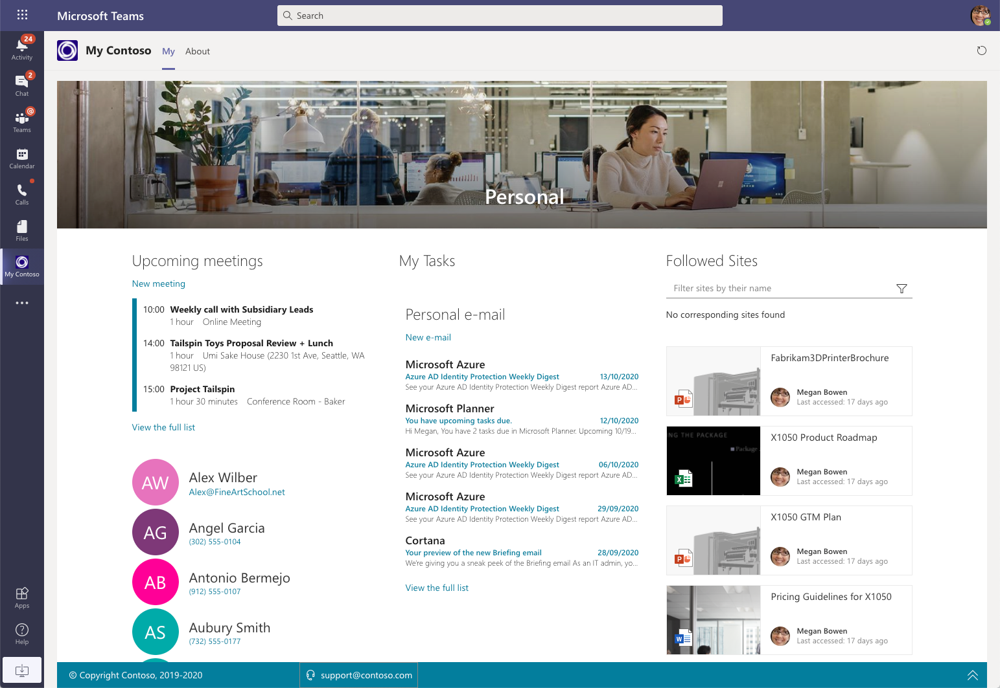
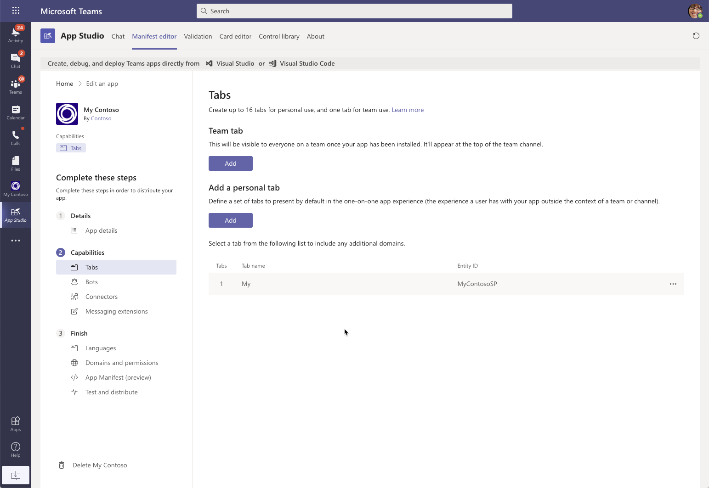

# Build a Me-experience in Microsoft Teams

Microsoft Teams is the hub for collaboration. It's where you meet your colleagues, where you exchange ideas and where you work together on files. It's where you can open your organization's applications without leaving the context of your work. It's also where you meet your business partners.

Microsoft Teams focuses on teamwork. Using its extensibility capabilities, you can extend it to put your colleagues in the center and offer them a central place to start their workday and prepare for the day.

This article presents a sample scenario of how to extend Microsoft Teams using SharePoint Framework to offer your colleagues a Me-experience where they can start their day and see their personal information.



In the following sections, we present a few ways of how you could implement a Me-experience in Microsoft Teams using SharePoint Framework, and for each one, we mention its benefits and considerations for you to consider.

## Embed a modern SharePoint page

Recently SharePoint Online introduced the ability to [embed modern SharePoint pages in Microsoft Teams](/sharepoint/dev/features/embed-pages-to-teams). Using this capability, you can create a modern SharePoint page with several SharePoint Framework web parts that show personalized information for the current user such as recent documents or upcoming meetings.


Once the page is ready, in Microsoft Teams, you would create a personal app pointing to the SharePoint page.



> [!CAUTION]
> When embedding a modern SharePoint page in Teams, you shouldn't use the URL of the page as it won't work in the desktop Teams app. Instead, use a special [URL pointing to the `teamslogon.aspx` page](/sharepoint/dev/features/embed-pages-to-teams#embed-sharepoint-modern-sites--pages-into-microsoft-teams-with-app-studio).

To improve the experience, you would enable showing the page in full screen, which will remove the header and navigation allowing users to focus on the content.

### Advantages of embedding SharePoint pages as tabs

Building the Me-experience in Microsoft Teams using a modern SharePoint page is the easiest way to offer users a personalized dashboard in Microsoft Teams. Following are a few noteworthy benefits of using this approach.

#### No code required

This approach uses standard SharePoint page editing capabilities and, assuming you have the necessary web parts available, doesn't require any custom code.

#### Present information using standard SharePoint page editing capabilities

While creating the dashboard SharePoint page, you can make use of all page capabilities such as vertical or horizontal columns, highlighted sections, or full-width web parts to lay out the different elements on a page in a meaningful way. Additionally, if the web parts that you use are configurable, you can adjust them to your specific needs.

#### Combine information from different sources

By using a mix of web parts, you can combine truly personal information, such as emails, meetings, or the documents the person recently worked on, with other information coming from the organization, but relevant to the person based on their role or region.

It also doesn't matter if the web parts you put on the page are provided by Microsoft or built by your organization and whether they're deployed in a single or multiple solutions.

#### Package and distribute applications in your organization without code

To offer the Me-experience built this way to your users, you would package it as a personal Teams app. Using [App Studio](/microsoftteams/platform/concepts/build-and-test/app-studio-overview), you can create the personal app and publish it to your organizational catalog for everyone else to use.

### Considerations for embedding SharePoint pages as tabs

While using modern SharePoint pages is the easiest way to offer users a personalized dashboard in Microsoft Teams, it comes with some considerations that you should consider before using this approach.

#### Specific to your organization

The personal app offering the Me-experience based on a SharePoint page points to a specific URL in your SharePoint environment. Because it's specific to your tenant, it's not suitable for use by other organizations.

#### The same page for everyone

To keep things simple for your users, you would build a single SharePoint page that would serve as a dashboard and then expose it as a personal Teams app. While the web parts on the page would show personalized information (my emails, my meetings, my documents), the elements on the page would be the same for everyone. Users would not be able to configure for themselves which pieces of information they'd like to see or how many items the different web parts should show. The layout and configuration of elements on the page would be the same for everyone.

### When is embedding SharePoint pages recommended

This approach is ideal for organizations that want to offer their users a Me-experience in Microsoft Teams with as little effort and custom development as possible.

## Build a multi-tab personal Teams app

> [!IMPORTANT]
> When you are planning to embed SharePoint sites in Microsoft Teams, please use the [Viva Connections model](/sharepoint/guide-to-setting-up-viva-connections) for the supported experience.

Another approach to offer your users a Me-experience in Microsoft Teams using SharePoint Framework is by building a multi-tab [personal Teams app](/microsoftteams/platform/concepts/design/personal-apps?WT.mc_id=m365-9762-wmastyka).


Personal Teams apps can consist of one or more tabs. Each tab points to a different URL. When [building personal Teams app using SharePoint Framework](/sharepoint/dev/spfx/integrate-with-teams-introduction), you can make each tab point to a SharePoint Framework web part. By combining relevant web parts in a single personal Teams app, you can offer users a single place to access relevant information.

In this approach, you would start by putting all the web parts that you want to expose in a SharePoint Framework project.


Next, you'd update the Teams manifest, referencing the different web parts as tabs to the personal app, for example:

```json
{
  "$schema": "https://developer.microsoft.com/json-schemas/teams/v1.5/MicrosoftTeams.schema.json",
  "manifestVersion": "1.5",
  "packageName": "MyContoso",
  "id": "e81a1b68-686e-412f-90ac-cb80f2544398",
  // ... trimmed for readability
  "staticTabs": [
    {
      "entityId": "com.contoso.my.meetings",
      "name": "Meetings",
      "contentUrl": "https://{teamSiteDomain}/_layouts/15/TeamsLogon.aspx?SPFX=true&dest=/_layouts/15/teamshostedapp.aspx%3Fteams%26personal%26componentId=e81a1b68-686e-412f-90ac-cb80f2544398%26forceLocale={locale}",
      "scopes": [
        "personal"
      ]
    },
    {
      "entityId": "com.contoso.my.mail",
      "name": "Mail",
      "contentUrl": "https://{teamSiteDomain}/_layouts/15/TeamsLogon.aspx?SPFX=true&dest=/_layouts/15/teamshostedapp.aspx%3Fteams%26personal%26componentId=e81a1b68-686e-412f-90ac-cb80f2544398%26forceLocale={locale}",
      "scopes": [
        "personal"
      ]
    },
    {
      "entityId": "com.contoso.my.files",
      "name": "Files",
      "contentUrl": "https://{teamSiteDomain}/_layouts/15/TeamsLogon.aspx?SPFX=true&dest=/_layouts/15/teamshostedapp.aspx%3Fteams%26personal%26componentId=e81a1b68-686e-412f-90ac-cb80f2544398%26forceLocale={locale}",
      "scopes": [
        "personal"
      ]
    },
    {
      "entityId": "com.contoso.my.settings",
      "name": "Settings",
      "contentUrl": "https://{teamSiteDomain}/_layouts/15/TeamsLogon.aspx?SPFX=true&dest=/_layouts/15/teamshostedapp.aspx%3Fteams%26personal%26componentId=e81a1b68-686e-412f-90ac-cb80f2544398%26forceLocale={locale}",
      "scopes": [
        "personal"
      ]
    }
  ],
  // ...trimmed for readability
}
```

> [!IMPORTANT]
> Ensure that the web parts that you want to expose in the personal Teams app, have in their manifest, in the `supportedHosts` property the `TeamsPersonalApp` value specified.

To let users configure web parts exposed on the different tabs, you could build a separate Settings web part and expose it as a tab.

```json
{
  "$schema": "https://developer.microsoft.com/json-schemas/teams/v1.5/MicrosoftTeams.schema.json",
  "manifestVersion": "1.5",
  "packageName": "MyContoso",
  "id": "e81a1b68-686e-412f-90ac-cb80f2544398",
  // ... trimmed for readability
  "staticTabs": [
    // ... trimmed for readability
    {
      "entityId": "com.contoso.my.settings",
      "name": "Settings",
      "contentUrl": "https://{teamSiteDomain}/_layouts/15/TeamsLogon.aspx?SPFX=true&dest=/_layouts/15/teamshostedapp.aspx%3Fteams%26personal%26componentId=e81a1b68-686e-412f-90ac-cb80f2544398%26forceLocale={locale}",
      "scopes": [
        "personal"
      ]
    }
  ],
  // ...trimmed for readability
}
```

### Advantages of building multi-tab personal Teams apps

Building the Me-experience as a multi-tab personal Teams app requires some development work. In return, it offers more benefits related to the personalization and distribution of the solution.

#### User-specific configuration

Users install personal Teams apps and can configure them to their specific needs. By building the Me-experience as a personal Teams app, and exposing some configuration options, you can allow users to specify what kind of information they'd like to see and how it should be displayed. While the set of tabs, the types of information, displayed in the personal app is fixed, their contents could be configured by everyone to their specific needs.

#### Package as a reusable solution

Personal Teams apps built using SharePoint Framework can be used by multiple different organizations. If the organization has the SharePoint Framework package with web parts deployed in their tenant, they can install the personal Teams app and use it as well. Microsoft Teams will automatically adjust URLs so that they point to the organization's SharePoint tenant.

### Considerations for building multi-tab personal Teams apps

Building multi-tab personal Teams apps offers you more flexibility with regards to personalization and distribution of the solution. It comes however with some considerations that you should consider before using this approach.

#### Requires custom development

In comparison to building a dashboard using a modern SharePoint page and exposing it as a personal Teams app using App Studio, building a personal Teams app using SharePoint Framework requires custom development. The complexity of that effort will depend very much on your solution and what kind of information you choose to expose.

#### Limited to custom web parts

When building multi-tab personal Teams apps, you can point only to custom web parts. Referencing the standard web part provided by Microsoft is not supported.

#### All web parts should be in the same project

While not necessary, having all web parts in the same project will help you simplify the maintenance of your solution. If web parts are stored in multiple projects, it will cost you more effort to maintain their references and configuration over time.

#### Custom web part required for exposing settings

Personal Teams apps don't have a standard UI for configuring settings. Instead, the recommended pattern is to [expose settings on a separate tab](/microsoftteams/platform/concepts/design/personal-apps#help-and-settings). The developer is in control of the user experience of that tab and can adjust it to match the specific application requirements.

Translating this to SharePoint Framework, it means that you would need to build a separate web part that allows users to configure the application. The settings tab can expose configuration for all the other tabs so that users can configure the whole application from one place.

#### Implement storage for user's configuration

Personal Teams apps don't offer any infrastructure for persisting their configuration. Each application must decide for itself how and where it persists user's preferences.

While SharePoint Framework web parts have a standard way of persisting settings when used on SharePoint pages or in Microsoft Teams tabs, when exposed as personal Teams apps, they can't use this infrastructure. Instead, you need to [choose a way to store user's preferences](/sharepoint/dev/spfx/build-for-teams-configure-in-teams). Additionally, you need to ensure that your web parts can retrieve their configuration from this location.

#### Each web part is a separate tab

When building personal Teams apps using SharePoint Framework, each tab in the app corresponds to one web part. Depending on how much information you want to expose in your Me-experience your application could end up having many tabs. Rather than being able to quickly get an overview, users would need to navigate to the different tabs to find all the necessary information.

### When is building personal Teams apps recommended

This approach is suitable for organizations that have professional developers with experience in building SharePoint Framework solutions and want to distribute the Me-experience to other organizations or the marketplace. Additionally, users will be able to use the application as long as it doesn't expose too many types of information (tabs).

## Combine multiple web parts in a single tab of a personal Teams app

Previously, when discussing the idea of building a custom personal Teams app using SharePoint Framework, we mentioned that each tab corresponds to one web part. In the context of a Me-experience this leads to a fragmented experience and many different tabs that users need to switch between to get a complete overview of their data.

If you build your web parts using React, you can address this shortcoming by combining multiple root React components (the React component you reference in the web part class) in a single web part.

To put it in practice, let's say you have a project with the following web parts: Personal calendar, Personal contacts, Personal Email, and Personal tasks. By default, all these web parts would be mapped to separate tabs in a personal Teams app. Instead, what if we could group them into a single tab to provide a more concise view of the information?


To simplify the user-experience, you can build a new web part and have its root React component reference React components of each of these web parts, for example:

```tsx
import { WebPartTitle } from '@pnp/spfx-controls-react/lib/WebPartTitle';
import * as React from 'react';
import { IPlanningProps } from '.';
import PersonalCalendar from '../../personalCalendar/components/PersonalCalendar';
import { PersonalTasks } from '../../personalTasks/components';
import RecentlyUsedDocuments from '../../recentlyUsedDocuments/components/RecentlyUsedDocuments';
import styles from './Planning.module.scss';

export default class Planning extends React.Component<IPlanningProps, {}> {
  public render(): React.ReactElement<IPlanningProps> {
    return (
      <div className={styles.planning}>
        <WebPartTitle displayMode={this.props.displayMode}
          title='Planning'
          updateProperty={this.props.updateProperty} />
        <div className={styles.column}>
          <PersonalCalendar displayMode={this.props.displayMode}
            graphClient={this.props.graphClient}
            title='Upcoming meetings'
            daysInAdvance={4}
            numMeetings={0}
            refreshInterval={5}
            updateProperty={this.props.updateProperty} />
        </div>
        <div className={styles.column}>
          <PersonalTasks displayMode={this.props.displayMode}
            graphClient={this.props.graphClient}
            updateProperty={this.props.updateProperty}
            title='My tasks'
            showCompleted={false}
            userName={this.props.pageContext.user.loginName} />
        </div>
        <div className={styles.column}>
          <RecentlyUsedDocuments context={this.props.pageContext}
            title='My recent documents'
            displayMode={this.props.displayMode}
            graphClient={this.props.graphClient}
            updateProperty={this.props.updateProperty}
            nrOfItems={10} />
        </div>
      </div>
    );
  }
}
```

Such a container web part allows you to reuse your existing code without duplicating it. Additionally, you will improve the user experience by combining related information and decrease the number of different tabs exposed.

### Advantages of combining multiple web parts in a single tab

Combining information from multiple web parts in a single tab allows you to simplify the user experience of your personal Teams app.

#### Group related information together

The ability to rearrange how information is presented in when exposed in a personal Teams app allows you to improve the user experience. By putting related or similar information on a single tab, you help users quickly glance over what's relevant to them.

Grouping related information together also lowers the number of different tabs displayed in the personal app, making it easier for users to navigate between the different sections.

#### Control the user experience

When grouping related information together, you will build a new React component and reference existing components from within. While doing this, you have full control of how the information is presented and can consider different aspects such as importance of the displayed information, its relevance to the user, device, screen size, etc.

#### Reuse existing code

When you build SharePoint Framework web parts using React, the main functionality of the web part is wrapped in a single React component. By referencing that component from another component, you can reuse all the functionality without having to duplicate any code. This ability offers you great flexibility and allows you to build a set of reusable building blocks that can be then composed in larger web parts or Teams apps.

### Considerations for grouping multiple web parts in a single tab

Combining multiple web parts in a single tab allows you to make better use of the available screen estate and provides the user with a comprehensive view of the relevant information. There are however some specific considerations that you should take into account before you choose this approach.

#### Combining web parts requires development effort

To combine multiple React components in a single web part, you need to have a proper understanding of SharePoint Framework. While it's not more complicated than building web parts using React, you need to understand how the different React components, that you want to integrate, work so that you can configure them properly.

#### Only for custom web parts

To integrate multiple React components in a single web part, you need to have access to their source code. At this moment, the source code for first-party web parts is not available, which means that this approach is limited only to third-party web parts.

### When is combining multiple web parts in a single tab recommended

This approach is recommended whenever you want to offer users a rich Me-experience presenting information from many different sources. The information you displayed is fully controlled by the code you own. By following this approach, you can also build a solution that can be distributed to other organizations either directly or via the marketplace.
