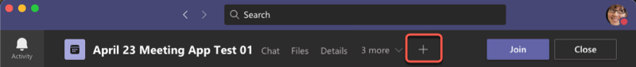
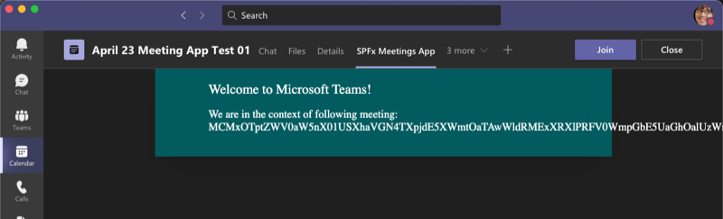

# Build meeting apps for Microsoft Teams with SPFx

The SharePoint Framework (SPFx) v1.8 release introduced the ability to use SPFx web parts to implement Microsoft Teams tabs. Using SharePoint Framework can simplify Microsoft Teams app development as explained in [Build for Microsoft Teams using SharePoint Framework](build-for-teams-overview.md).

Developers can create apps for Microsoft Teams meetings using the same techniques used to create custom tabs. In this tutorial, you'll learn how to implement a custom Microsoft Teams meeting app using a SPFx web part.

Microsoft Teams meeting apps must support configurable tabs in the **[groupchat](/microsoftteams/platform/resources/schema/manifest-schema#configurabletabs)** scope. This enables the [pre-meeting](/microsoftteams/platform/apps-in-teams-meetings/teams-apps-in-meetings#pre-meeting-app-experience) and [post-meeting](/microsoftteams/platform/apps-in-teams-meetings/teams-apps-in-meetings#post-meeting-app-experience) chats. Refer to the following documentation for additional requirements: [Create apps for Teams meetings: Prerequisites and considerations](/microsoftteams/platform/apps-in-teams-meetings/create-apps-for-teams-meetings#prerequisites-and-considerations)

> [!IMPORTANT]
> This tutorial requires SPFx v1.11 or higher.

## Create a Microsoft Teams tab project

1. Create a new project directory in your favorite location:

    ```console
    md teams-meeting-app
    ```

1. Go to the project directory:

    ```console
    cd teams-meeting-app
    ```

1. Create a new solution by running the Yeoman SharePoint Framework Generator:

    ```console
    yo @microsoft/sharepoint
    ```

1. When prompted, enter the following values (*select the default option for all prompts omitted below*):

    - **What is your solution name?**: teams-meeting-app
    - **Do you want to allow the tenant admin the choice of being able to deploy the solution to all sites immediately without running any feature deployment or adding apps in sites?**: Yes
    - **Which type of client-side component to create?**: WebPart
    - **What is your Web part name?**: MyFirstTeamsMeetingApp
    - **What is your Web part description?**: My first Microsoft Teams meeting app
    - **Which framework would you like to use?**: No JavaScript web framework

    At this point, Yeoman creates the folders & files for the project and then installs the required dependencies.

1. Next, enter the following to open the web part project in Visual Studio Code:

    ```console
    code .
    ```

## Update the web part manifest to make it available for Microsoft Teams

Locate the **./src/webparts/\*\*/manifest.json** file for the web part you'll use as the tab for the meeting app solution. Locate the `supportedHosts` property to include `"TeamsTab"`:

```json
{
  "$schema": "https://developer.microsoft.com/json-schemas/spfx/client-side-web-part-manifest.schema.json",
  "id": "..",
  "alias": "MyFirstTeamsMeetingAppWebPart",
  "componentType": "WebPart",
  "version": "*",

  //...

  "supportedHosts": ["SharePointWebPart", "TeamsTab"],

  //...
}
```

## Update code to be aware of the Microsoft Teams context

1. Open **./src/webparts/helloWorld/MyFirstTeamsTabWebPart.ts** for the needed edits to make the solution aware of the Microsoft Teams context, if it's used as a tab.
1. Update the `render()` method as follows.

    Notice how we're rendering different content dependent if the code is rendered as a tab in Microsoft Team or as a web part in SharePoint. We can detect if solution is hosted by Microsoft Teams by checking the `this.context.sdks.microsoftTeams` property.

    ```typescript
    public render(): void {

      let title: string = 'ERR: not in Microsoft Teams';
      let subTitle: string = 'ERR: not in Microsoft Teams';

      if (this.context.sdks.microsoftTeams) {
        if (this.context.sdks.microsoftTeams.context.meetingId) {
          title = "Welcome to Microsoft Teams!";
          subTitle = "We are in the context of following meeting: " + this.context.sdks.microsoftTeams.context.meetingId;
        } else {
          title = "Welcome to Microsoft Teams!";
          subTitle = "We are in the context of following team: " + this.context.sdks.microsoftTeams.context.teamName;
        }
      }

      this.domElement.innerHTML = `
        <div class="${ styles.myFirstTeamsMeetingApp }">
          <div class="${ styles.container }">
            <div class="${ styles.row }">
              <div class="${ styles.column }">
                <span class="${ styles.title }">${title}</span>
                <p class="${ styles.subTitle }">${subTitle}</p>
              </div>
            </div>
          </div>
        </div>`;
    }
    ```

## Prepare the Microsoft Teams app for deployment

When a SPFx solution is used in a Microsoft Teams app, it must be deployed to both SharePoint Online and Microsoft Teams. Refer to [Deployment options for SharePoint Framework solutions for Microsoft Teams](deployment-spfx-teams-solutions.md) for details on the deployment options.

Meeting apps require details in the Microsoft Teams app manifest file that aren't created automatically by SharePoint Online. Therefore, you must use the [Developer-provided Microsoft Teams app manifest & package](deployment-spfx-teams-solutions.md#developer-provided-microsoft-teams-app-manifest--package) option.

This means you'll need to create the app manifest file, and the app package file.

### Create the Microsoft Teams app manifest

Create a new file **./teams/manifest.json**.

Add the following JSON to the file:

```json
{
  "$schema": "https://developer.microsoft.com/json-schemas/teams/v1.8/MicrosoftTeams.schema.json",
  "manifestVersion": "1.8",
  "packageName": "{{SPFX_PACKAGE_NAME}}",
  "id": "{{SPFX_COMPONENT_ID}}",
  "version": "1.0",
  "developer": { .. },
  "name": {
    "short": "{{SPFX_COMPONENT_NAME}}"
  },
  "description": {
    "short": "{{SPFX_COMPONENT_SHORT_DESCRIPTION}}",
    "full": "{{SPFX_COMPONENT_LONG_DESCRIPTION}}"
  },
  "icons": {
    "outline": "{{SPFX_COMPONENT_ID}}_outline.png",
    "color": "{{SPFX_COMPONENT_ID}}_color.png"
  },
  "accentColor": "#004578",
  "configurableTabs": [
    {
      "configurationUrl": "https://{teamSiteDomain}/_layouts/15/TeamsLogon.aspx?SPFX=true&dest=/_layouts/15/teamshostedapp.aspx%3Fteams%26componentId={{SPFX_COMPONENT_ID}}",
      "canUpdateConfiguration": false,
      "scopes": [
        "team",
        "groupchat"
      ],
      "context": [
        "channelTab",
        "privateChatTab",
        "meetingSidePanel",
        "meetingDetailsTab",
        "meetingChatTab"
      ]
    }
  ],
  "validDomains": [
    "*.login.microsoftonline.com",
    "*.sharepoint.com",
    "resourceseng.blob.core.windows.net"
  ],
  "webApplicationInfo": {
    "resource": "https://{teamSiteDomain}",
    "id": "00000003-0000-0ff1-ce00-000000000000"
  }
}
```

With the basic Teams app manifest created, you need to make the following changes to it:

- Locate the values `{{SPFX_COMPONENT_*}}` in the JSON... these values need to be updated. Set the multiple instances of `{{SPFX_COMPONENT_ID}}` to the component's ID. This is found in the `id` property in the **./src/webparts/\*\*/manifest.json** file.
- Replace the `packageName` property with the name of your Teams app.
- Replace the `developer` object with the same object and values set in your **./config/package-solution.json** file.
- Replace the `name` & `description` objects with real values indicate the name and description of the app.

> [!NOTE]
> For information about the properties in the Microsoft Teams app manifest, see [Manifest schema for Microsoft Teams](/microsoftteams/platform/resources/schema/manifest-schema).

> [!IMPORTANT]
> Don't replace the `{teamSiteDomain}` string in the app manifest file. This placeholder is replaced with the tenant's SharePoint Online URL at runtime by Microsoft Teams.

### Create the Microsoft Teams app package

To make your SPFx solution available for use in Microsoft Teams, it must be packaged & deployed to SharePoint Online.

1. Create the Microsoft Teams app package named **TeamsSPFxApp.zip** by compressing the contents of the **./teams** folder.

    > [!IMPORTANT]
    > Don't compress the folder, instead compress the contents of the folder. If you ZIP the folder, it will create a top-level subfolder in the resulting ZIP file which isn't a valid app package for Microsoft Teams.

1. Save the **TeamsSPFxApp.zip** in the SPFx solution's **./src/teams** folder.

## Package and deploy to SharePoint Online

1. Execute the following commands to build bundle your solution. This executes a release build of your project by using a dynamic label as the host URL for your assets.

    ```console
    gulp bundle --ship
    ```

1. Execute the following task to package your solution. This creates an updated **./sharepoint/solution/\*.sppkg** package.

    ```console
    gulp package-solution --ship
    ```

1. Next, deploy the package that was generated to the tenant App Catalog.

    Go to your tenant's SharePoint App Catalog.

1. Upload or drag and drop the **./sharepoint/solution/\*.sppkg** to the tenant's App Catalog.

    

    This deploys the client-side solution package.

    Ensure that the **Make this solution available to all sites in the organization** option is selected, so that the web part can be used by Microsoft Teams.

    

1. Select **Deploy**.

At this point, the solution is deployed to SharePoint Online and is available to all SharePoint Online sites.

## Publish the meeting app to the Microsoft Teams app store

To make your meeting app available in Microsoft Teams, you'll have synchronize your solution with teams.

> [!NOTE]
> During the testing phase, you can sideload your meeting app to Microsoft Teams instead of deploying it to your organization's app store. To do this, you can skip this section and jump to the [Test the meeting app](#test-the-meeting-app) section.

1. Select the package in the SharePoint tenant App Catalog and select the **Sync to Teams** button at in the ribbon in the **Files** tab.

   

    SharePoint Online will detect the **TeamsSPFxApp.zip** file in the **\*.sppkg** package and deploy it to the Microsoft Teams app store instead of automatically creating the app manifest and app package.

1. Confirm that you can see the status message on the top-right corner.

    

## Test the meeting app

The last step is to test the meeting app in Microsoft Teams. To do this, you'll create a meeting that isn't a channel meeting and has at least one person invited to it:

1. Open the Microsoft Teams desktop client.
1. Create a new meeting using the **Calendar** app in the left-hand app bar.
1. Invite someone to the meeting.
1. Save the meeting.
1. From the **Calendar** app, open the test meeting you created.
1. Select the **+** (plus) button to the right of the existing tabs.

    

1. Select your custom meeting app

Once the app has been installed into the meeting, when you go back to the meeting detail page, you'll see the app as a new tab. The tab will load in the pre/post meeting experience as shown in the following screenshot:



> [!IMPORTANT]
> At the current time, the in-meeting experience for an SPFx-based Teams meeting app doesn't work. During a meeting, if you select the app, the meeting app will load in a tab but render a SharePoint Online error page.
>
> This is currently due to a limitation in Microsoft Teams that will be resolved in the first half of 2021.

## See also

- [Building Microsoft Teams Tabs using SharePoint Framework](integrate-with-teams-introduction.md)
- [Deployment options for SharePoint Framework solutions for Microsoft Teams](deployment-spfx-teams-solutions.md)
- [Microsoft Teams: developer platform](/microsoftteams/platform/overview)
- [Microsoft Teams: Apps in Teams meetings](/microsoftteams/platform/apps-in-teams-meetings/teams-apps-in-meetings)
- [Microsoft Teams: Build an app for meetings](/microsoftteams/platform/apps-in-teams-meetings/create-apps-for-teams-meetings?tabs=javascript)
