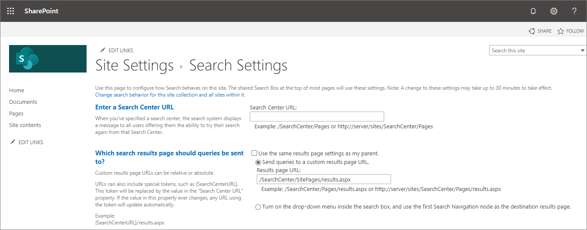

# Modifying Microsoft Search experience using SharePoint Framework extensions

The SharePoint Framework v1.10 release introduces Search Query extensions. These are SharePoint Framework (SPFx) extensions, which can be used to modify search query executed using the search experience.

[!INCLUDE [developer-preview-notice](../../includes/snippets/developer-preview-notice.md)]

> [!IMPORTANT]
> Even thought this extension is available in the SharePoint Framework v1.10 release, it's not supported in the SharePoint Online.

A query extension acts as a normal SharePoint Framework extension, but it will be invoked just before the search query is executed, so that the query can be potentially modified. During **preview**, query extensions have following characteristics:

- Query extensions only work in the context of SharePoint
- You will need to explicitly enable query extensions in site or in site collection scope
- Query extensions only work when site collection is associated to use a custom search results page
- Custom search results page can use new **HeaderlessSearchResults** page layout for reduced header content
- **HeaderlessSearchResults** page layout is only supported for pages which are associated as a custom search result page
- You can provide modern search experience by using [open-source modern search experience solution](https://aka.ms/pnp-search)

## Development process

You can start developing query extensions simply by using the SharePoint Framework v1.10 or later packages. As this feature is on preview status, you'll need to execute the Yeoman generator using the `--plusbeta` switch as demonstrated below.

```console
yo @microsoft/sharepoint --plusbeta
```

You can see a new option called **Search Query Modifier** under the extension selection to scaffold you a query extension component.

## Associating Query Extensions to sites

Query extension by default are associated on a site collection when a solution containing the extension is installed on the site. This happens automatically using the Feature Framework definitions packaged automatically as part of the solution package. Technically this association is done using the `UserCustomAction` collection with `ClientSideExtension.SearchQueryModifier` as the `Location` attribute.

When you create a new solution with the **Search Query Modifier**, following **elements.xml** file is included:

```xml
<?xml version="1.0" encoding="utf-8"?>
<Elements xmlns="http://schemas.microsoft.com/sharepoint/">
    <CustomAction
        Title="QueryModifyer"
        Location="ClientSideExtension.SearchQueryModifier"
        ClientSideComponentId="801f82d5-1a21-4b2c-94b6-f13f6672142c"
        ClientSideComponentProperties="{&quot;testMessage&quot;:&quot;Test message&quot;}">
    </CustomAction>
</Elements>
```

Technically you can also use the Tenant scoped deployment of SharePoint Framework extensions to automatically associate the extension to multiple site collections in a tenant.

## Deployment of your extension

Deployment is a two-step process by default for the **Search Query Modifier** at least during the preview:

1. Deploy solution to SharePoint App Catalog
1. Install solution to the site collection where you want to use the extension
1. Create a custom search results page and configure it to be used in the site collection

You can configure custom search results page for a site collection from the site settings by clicking **Search Settings** and then enabling the custom search experience option.

