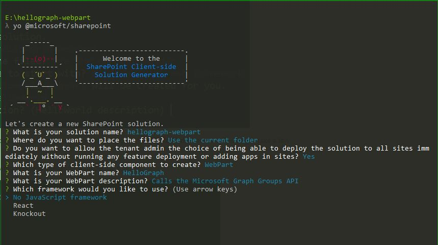
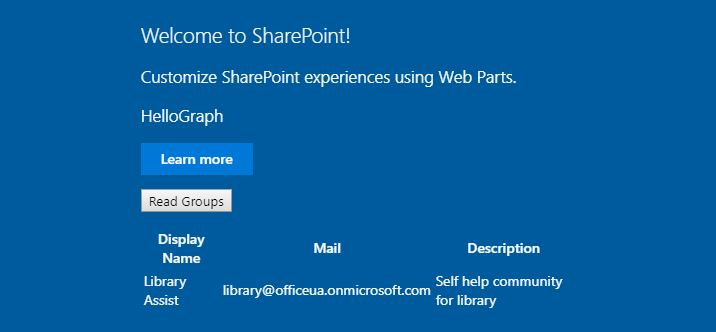
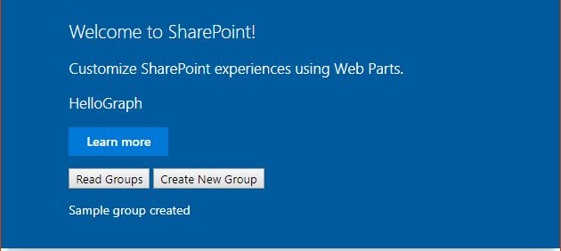

# Use GraphHttpClient to call Microsoft Graph
> [!IMPORTANT]
>The **GraphHttpClient** is currently in preview and is subject to change. It is not currently supported for use in production environments.

Use the **GraphHttpClient** class to make calls to the Microsoft Graph REST API. You can make GET, POST, and PATCH requests using the **get()**, **post()**, and **fetch()** methods. This article shows how to build a web part that uses **GraphHttpClient**, but you can use **GraphHttpClient** in any SharePoint Framework client code.

## Retrieve Office 365 groups using a GET call

You can use the **get()** method to make a REST call to Microsoft Graph. This example shows you how to retrieve a list of Office 365 groups. 

### Create a new web part project

1. Create a new project directory in your favorite location. 

  ```
  mkdir hellograph-webpart
  ```

2. Go to the project directory.

  ```
  cd hellograph-webpart
  ```

3. Create a new web part by running the Yeoman SharePoint generator.

  ```
  yo @microsoft/sharepoint
  ```

4. When prompted:

  * Enter a solution name of **hellograph-webpart**.
  * Select **Use the current folder** for where to place the files.
  * Enter **y** when prompted if you want to allow the tenant admin to deploy the solution to all sites immediately, without running any feature deployment or adding apps in sites.
  * Select **Web Part** as the type of client-side component to create.
  * Enter **HelloGraph** as your web part name.
  * Enter **Calls the Microsoft Graph Groups API** as the web part description.
  * Accept the default **No javascript web framework** as the framework, and choose **Enter**.

  

5. The Yeoman generator will build the web part. When the scaffolding is finished, open your project folder in your code editor. This article uses Visual Studio Code in the steps and screenshots, but you can use any editor that you prefer.

6. Run the gulp serve command and confirm that it runs in the local workbench correctly.

  ```
  gulp serve
  ```

### Add a button and placeholder for results
Next, you'll modify the HTML to provide a button to retrieve Office 365 groups. The HTML also needs a placeholder to display the groups.

1. In your code editor, open the **/src/webparts/helloGraph/HelloGraphWebPart.ts** file.

2. Modify the **render()** method so that it contains a button and a **div** where the code will list the Office 365 groups after they are retrieved.

  Your code should look like the following TypeScript.

  ```typescript
    public render(): void {
      this.domElement.innerHTML = `
        <div class="${styles.helloGraph}">
        <div class="${styles.container}">
        <div class="ms-Grid-row ms-bgColor-themeDark ms-fontColor-white ${styles.row}">
          <div class="ms-Grid-col ms-u-lg10 ms-u-xl8 ms-u-xlPush2 ms-u-lgPush1">
            <span class="ms-font-xl ms-fontColor-white">Welcome to SharePoint!</span>
            <p class="ms-font-l ms-fontColor-white">Customize SharePoint experiences using Web Parts.</p>
            <p class="ms-font-l ms-fontColor-white">${escape(this.properties.description)}</p>
            <a href="https://aka.ms/spfx" class="${styles.button}">
              <span class="${styles.label}">Learn more</span>
            </a>
            <p>
            <input id="readGroups" type="button" value="Read Groups"/> 
            </p>
            <div id="spTableContainer" ></div>
          </div>
        </div>
      </div>
    </div>`;
    this.domElement.querySelector('#readGroups').addEventListener('click',() => {this._readGroups();});
    }
  ```

  You'll define the **_readGroups()** method later.

3. Define an interface to represent each Office 365 group. Add the following code just before the **HelloGraphWebPart** class but after the imports.

  ```typescript
  export interface IOffice365Group {
    // Microsoft Graph has more group properties.
    displayName: string;
    mail: string;
    description: string;
  }
  ```

### Use the GraphHttpClient.get method to retrieve Office 365 groups
Next, you'll call the **GraphHttpClient.get()** method to make a REST call to Microsoft Graph to retrieve a list of Office 365 groups.

1. Import the **GraphHttpClient** class and related types by adding the following import statement near the top of the **HelloGraphWebPart.ts** file.

  ```typescript
  import { GraphHttpClient, HttpClientResponse, IGraphHttpClientOptions } from '@microsoft/sp-http';
  ```

2. Create the **_readGroups()** method by adding the following code to the **HelloGraphWebPart** class.

  ```typescript
  protected _readGroups(){
      // Query for all groups on the tenant using Microsoft Graph.
      this.context.graphHttpClient.get(`v1.0/groups?$orderby=displayName`, GraphHttpClient.configurations.v1).then((response: HttpClientResponse) => {
        if (response.ok) {
          return response.json();
        } else {
          console.warn(response.statusText);
        }
      }).then((result: any) => {
        // Transfer result values to the group variable
        this._renderTable(result.value);
      });
  }
  ```

  In the previous code, the context property has the GraphHttpClient instance. When you call the **get()** method, a REST call is made to Microsoft Graph that passes the specified URL. In this case, the URL is **v1.0/groups?orderby=displayName**. This issues a GET request and Microsoft Graph will return all Office 365 groups in the tenant in order by display name.

  You can issue any GET request by using this technique and entering the correct URL values. To find the URL values, see the [Microsoft Graph documentation](https://developer.microsoft.com/en-us/graph/docs/concepts/overview). For example, you can use URL specified in the [Groups GET request](https://developer.microsoft.com/en-us/graph/docs/api-reference/v1.0/api/group_get) topic to get groups. 

  The **get()** method returns an **HttpClientResponse**, which you can use to determine whether the call was successful. The returned JSON is in the **result.value**. Because you expect multiple groups to be returned, you will pass the value to a **_renderTable()** method, which will build a table of rows for each group.

3. Create a **_renderTable()** method to render the returned groups in a table where each row represent a group. Add the following method to the **HelloGraphWebPart** class.

  ```typescript
  protected _renderTable(items: IOffice365Group[]): void {
    let html: string = '';
    if (items.length<=0){
      html=`<p>There are no groups to list...</p>`;
    }
    else {
      html += `
      <table><tr>
        <th>Display Name</th>
        <th>Mail</th>
        <th>Description</th></tr>`;
      items.forEach((item: IOffice365Group) => {
        html += `
          <tr>
              <td>${item.displayName}</td>
              <td>${item.mail}</td>
              <td>${item.description}</td>
          </tr>`;
      });
      html += `</table>`;
    }
    const tableContainer: Element = this.domElement.querySelector('#spTableContainer');
    tableContainer.innerHTML = html;
    return;
  }
  ```

### Run the web part to call Microsoft Graph
The code needs to call the **GraphHttpClient** application that runs on SharePoint, so you can't run it on the local workbench. You have to package and deploy it to SharePoint.

1. Use gulp to package your solution.

  ```
  gulp package-solution
  ```

2. Deploy the solution to your SharePoint tenant:
  * Go to your site's App Catalog.
  * Upload or drag and drop the **hellograph-webpart.sppkg** to the App Catalog.
  * When prompted, if you trust the **hellograph-webpart-client-side-solution**, select **Make this solution available to all sites in the organization**, and choose **Deploy**.

3. Use gulp serve to host the web part.

  ```
  gulp serve --nobrowser
  ```

4. Add the web part to a web page, or use the SharePoint workbench.

  You should see the following on your page.
  

  When you choose **Read Groups**, you will see a list of all the Office 365 groups on your tenant. If no groups are listed, you'll just see a message that indicates that there were no groups. You will create a new group next.

## Create a new Office 365 group using a POST call

You can issue POST calls to the Microsoft Graph API by using the **GraphHttpClient.post()** method. You'll use the **post()** method to create a new Office 365 group.


### Add a button and placeholder for results
Again, you need to modify the HTML to add a button that will create a new group.

1. In your code editor, open the **/src/webparts/helloGraph/HelloGraphWebPart.ts** file.

2. Modify the **render()** method so that it contains a button and a **div** that will indicate whether the creation was successful.

  Your code should look like the following TypeScript.

  ```typescript
    public render(): void {
      this.domElement.innerHTML = `
        <div class="${styles.helloGraph}">
        <div class="${styles.container}">
        <div class="ms-Grid-row ms-bgColor-themeDark ms-fontColor-white ${styles.row}">
          <div class="ms-Grid-col ms-u-lg10 ms-u-xl8 ms-u-xlPush2 ms-u-lgPush1">
            <span class="ms-font-xl ms-fontColor-white">Welcome to SharePoint!</span>
            <p class="ms-font-l ms-fontColor-white">Customize SharePoint experiences using Web Parts.</p>
            <p class="ms-font-l ms-fontColor-white">${escape(this.properties.description)}</p>
            <a href="https://aka.ms/spfx" class="${styles.button}">
              <span class="${styles.label}">Learn more</span>
            </a>
            <p>
            <input id="readGroups" type="button" value="Read Groups"/> 
            <input id="createGroup" type="button" value="Create New Group"/>                           
            </p>
            <div id="spCreateGroupResults" ></div>
            <div id="spTableContainer" ></div>
          </div>
        </div>
      </div>
    </div>`;
    this.domElement.querySelector('#createGroup').addEventListener('click',() => {this._createGroup();});
    this.domElement.querySelector('#readGroups').addEventListener('click',() => {this._readGroups();});    
    }
  ```

3. Add the **_createGroup()** method to call the Microsoft Graph API and create a new group.

  ```typescript
    protected _createGroup(){
      // Use Microsoft Graph to create a sample group.
      this.context.graphHttpClient.post(`v1.0/groups`,GraphHttpClient.configurations.v1,{
        body: JSON.stringify({"description": "Self help community for library",
        "displayName": "Library Assist",
        "groupTypes": [
          "Unified"
        ],
        "mailEnabled": true,
        "mailNickname": "library",
        "securityEnabled": false
      })
    }).then((response: HttpClientResponse) => {
      const resultContainer: Element = this.domElement.querySelector('#spCreateGroupResults');
        if (response.ok) {
          resultContainer.innerHTML = `<p>Sample group created</p>`;
        } else {
          resultContainer.innerHTML = `<p>Could not create group see console for details</p>`;        
          console.warn(response.status);
        }
      });
    }
  ```

  The previous code creates a simple group using the code example from the Microsoft Graph [Create group](https://developer.microsoft.com/en-us/graph/docs/api-reference/v1.0/api/group_post_groups) article.

  The **post()** issues a POST REST API call to the **v1.0/groups** URL. The third parameter is an **IGraphHttpClientOptions** value in which the JSON body is specified to describe the new group. The **HttpClientResponse** is used to determine whether the call was successful, and to display an appropriate result.

  You can issue a POST call from the Microsoft Graph documentation by using this pattern and specifying the JSON in the body.

### Run the web part to create a new group

1. Use gulp to package your solution.

  ```
  gulp package-solution
  ```

2. Deploy the solution to your SharePoint tenant:
  * Go to your site's App Catalog.
  * Upload or drag and drop the **hellograph-webpart.sppkg** to the App Catalog.
  * Because your solution is already registered, you'll be prompted as to whether you want to replace it. Choose **Replace it**.
  * When prompted as to whether you trust the solution, choose **Deploy**.

3. Use gulp serve to host the web part.

  ```
  gulp serve --nobrowser
  ```

4. Add the web part to a web page, or use the SharePoint workbench.

  You should see the following on your page.
  

5. When you choose **Create New Group**, the code will create a new Office 365 group. 

  > [!NOTE] 
  >If you try to create the same group again, the code will return an error because the group already exists. The error is logged to the console, which you can view in the browser's developer mode.

## Update a group using a PATCH call

By now you should understand the pattern. If you need to call a Microsoft Graph REST API, use the **get()** or **post()** methods along with the URL for your request. The last method to show is the **fetch()** method. This method allows you to issue a PATCH request to Microsoft Graph to update a resource.

The following code shows how to call the **fetch()** method to update an existing group.

```typescript
    this.context.graphHttpClient.fetch(`v1.0/groups/2dfead70-21e4-4f30-bb2b-94b1bbdefdfa`,GraphHttpClient.configurations.v1,{
      method: "PATCH",
      body: JSON.stringify(
        {
          "description": "This is the new description",
          "displayName": "testtest"
        })
  }).then((response: HttpClientResponse) => {
    const resultContainer: Element = this.domElement.querySelector('#spUpdateGroupResults');
      if (response.ok) {
        resultContainer.innerHTML = `<p>Group updated</p>`;
      } else {
        resultContainer.innerHTML = `<p>Could not update group see console for details</p>`;        
        console.warn(response.status);
      }
    });
```

The ID of the group is specified in the URL. Get the ID by using a GET call first. The **method** parameter is set to **PATCH**. The body specifies which group properties to modify.
