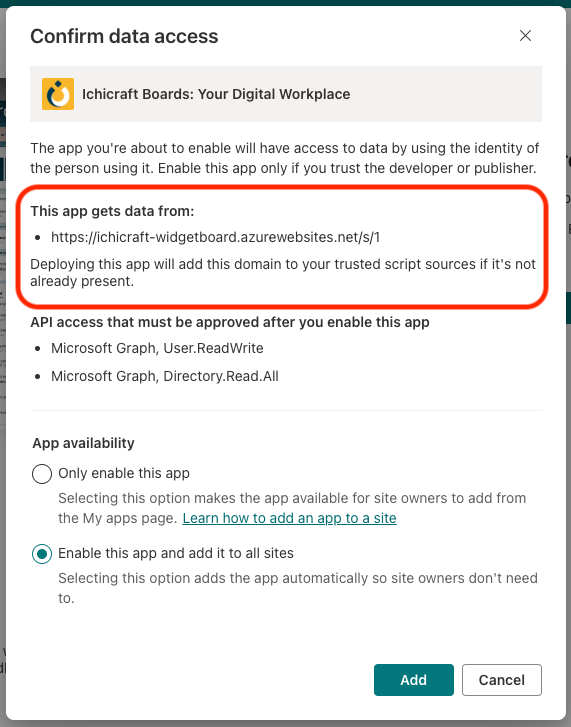
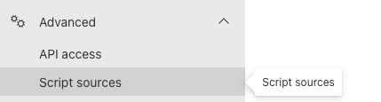
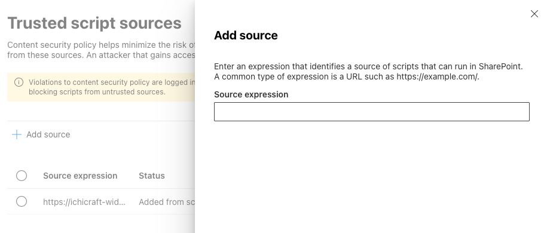
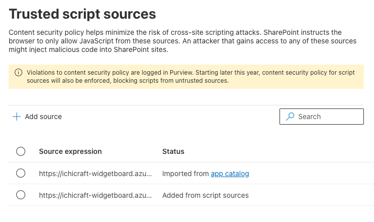
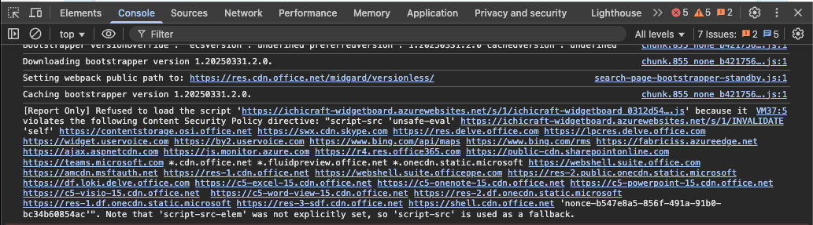
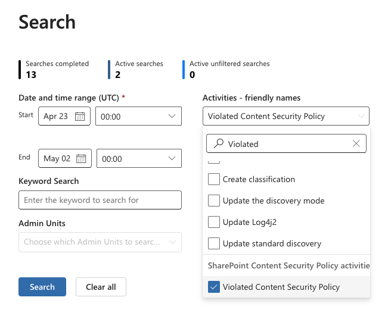
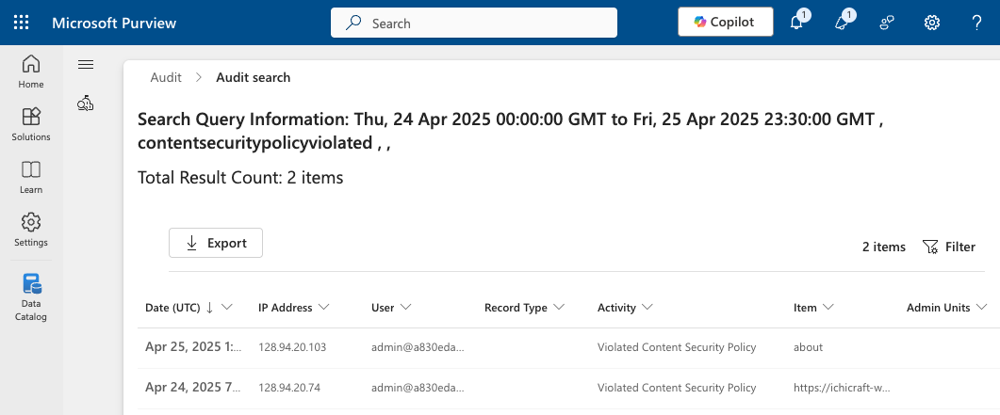
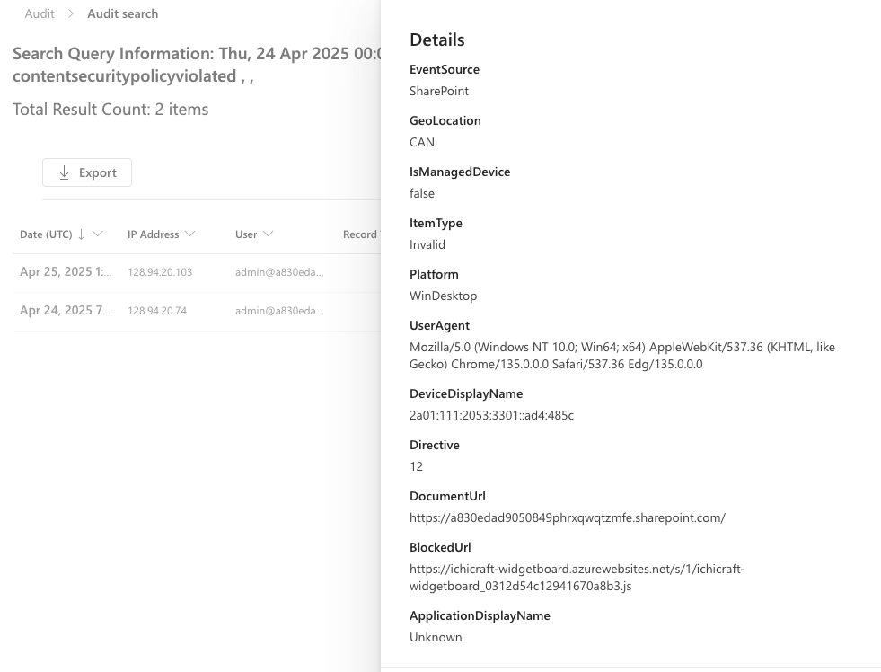

# Support for Content Security Policy (CSP) in SharePoint Online

In web development, Content Security Policy (CSP) is a security feature that helps prevent against various attack vectors, including [cross-site scripting](https://developer.mozilla.org/docs/Glossary/Cross-site_scripting) (XSS), [clickjacking](https://developer.mozilla.org/docs/Web/Security/Attacks/Clickjacking), and other code injection attacks.

CSP enables a site to control which resources a page is allowed to load. It works through a series of instructions to the browser from the website, which instruct the browser what the page is allowed to load.

Learn more about CSP on MDN: [Content Security Policy (CSP)](https://developer.mozilla.org/docs/Web/HTTP/Guides/CSP).

In this article, you'll learn how CSP works with custom SharePoint Framework (SPFx) solutions, how to identify and find CSP violations, and how to configure trusted sources in SharePoint Online.

> [!IMPORTANT]
> Content Security Policy (CSP) is currently rolled out in SharePoint Online in reporting mode and thus not impacting solutions; the **enforcement of Content Security Policy (CSP) will start from March 1, 2026**.

If the enforcement on March 1, 2026, is too soon because you need more time to review and update your existing SPFx solutions, you can delay the enforcement by 90 days, until June 1, 2026, using SPO Management Shell:

```powershell
Set-SPOTenant -DelayContentSecurityPolicyEnforcement $true
```

> [!NOTE]
> The `DelayContentSecurityPolicyEnforcement` option can be set as of February 9, 2026. If you do this before, the setting is not persisted.

## How Content Security Policy Works in SharePoint Online

When a browser requests a script, if CSP is enabled on the site, the browser checks the script location against the CSP rules. If the CSP restrictions allow the location of the script to be loaded by the browser, the browser proceeds with the request. However, if CSP rules to not allow the location, the browser doesn't load the script and logs the error in the browser's Console.

## Content Security Policy and SPFx Solutions

By default, SharePoint Online is configured to allow the browser to load scripts used to implement SharePoint Online. This includes scripts from custom SPFx solutions that include scripts in the **\*.sppkg** deployment packages.

The default setting for new SPFx solutions is to include the JavaScript bundles that implement SPFx components in the package. When an SPFx app is installed, the assets included in the package are deployed to the site's **ClientSideAssets** folder.

SPFx developers have multiple options they can implement to load and use scripts in their solutions for various scenarios. These include:

### Option 1: Deploy SPFx Scripts to an External CDN

SPFx developers can optionally configure their SPFx solutions to not include the JavaScript bundles in the package and instead, deploy these scripts to their own locations. For instance, a vendor might elect to deploy their scripts to their own managed Content Delivery Network (CDN).

When implementing this scenario, the SPFx package is configured to load scripts from a remote domain. The developer then must deploy the scripts to that location in addition to deploying the SPFx package (**\*.sppkg**) to the SharePoint Online App Catalog.

This is done by setting the `cdnBasePath` property in the **./config/write-manifests.json** file.

> [!NOTE]
> Learn more about how to configure SPFx solutions so the JavaScript bundles and other scripts are deployed to a location other than SharePoint Online in the following articles:
>
> - [Deploy your SharePoint client-side web part to Azure CDN](web-parts/get-started/deploy-web-part-to-cdn.md)
> - [Host your client-side web part from Microsoft 365 CDN (Hello World part 4)](web-parts/get-started/hosting-webpart-from-office-365-cdn.md)
> - [Host an SPFx extension from the Microsoft 365 CDN (Hello World part 4)](extensions/get-started/hosting-extension-from-office365-cdn.md)

### Option 2: Pull Script Dependencies from a CDN

Another common scenario is when a SPFx solution takes a dependency on a popular library, but instead of including it in the SPFx component's JavaScript bundle, they configure the solution to exclude it from the bundle and instead instruct the SPFx runtime to pull the library from the remote CDN.

This is done by adding the external script reference to the `externals` property in the **./config/config.json** file.

> [!NOTE]
> Learn more about how to configure the SPFx bundling process to exclude the library from the bundle and instruct the SPFx runtime to load the library from the remote CDN prior to loading the SPFx component's bundle in the following article:
>
> - [Add an external library to your SharePoint client-side web part](web-parts/basics/add-an-external-library.md)

### Option 3: Dynamically Load a Script with the SPComponent Loader

Another option SPFx developers can implement is to conditionally load a script through code. This is done using the [SPComponentLoader](/javascript/api/sp-loader/spcomponentloader).

```typescript
async SPComponentLoader.loadScript('https://some-external-site/script.js');
```

### Option 4: Use Inline Script

While the script in the majority of cases is included via script files, there's also the option to use an inline script. Inline script use cases are:

- Any `<script>` block directly in HTML:

    ```html
    <script>console.log('Hello');</script>
    ```

- Inline Event Handlers (JavaScript embedded in HTML attributes):

    ```html
    <button onclick="alert('Hi')">Click</button>
    <body onload="init()">...</body>
    ```

    ```javascript
    const testDiv = document.createElement('div');
    testDiv.setAttribute('onclick', "alert('Hi')");
    testDiv.click();
    ```

- JavaScript embedded in href or src attributes:

    ```html
    <a href="javascript:alert('Hi')">Click</a>
    ```

- Document.write() with Inline Scripts:

    ```javascript
    document.write("<script>alert('Hi')</script>");
    ```

- Dynamically Created Inline Scripts:

    ```javascript
    const s = document.createElement('script');
    s.textContent = "alert('Hi')";
    document.head.appendChild(s);
    ```

- InnerHTML or insertAdjacentHTML with `<script>`:

    ```javascript
    element.innerHTML = "<script>alert('Hi')</script>";
    ```

## Content Security Policy Impact on SPFx Solutions

As stated above, the CSP settings in SharePoint Online are configured to load scripts hosted in SharePoint Online. This means that if you include the resources in your SPFx package, *the default configuration for new SPFx solutions*, the CSP settings in SharePoint Online will have no impact on your custom solution.

Of the options mentioned above, if you implement [Option 1: Deploy SPFx Scripts to an External CDN](#option-1-deploy-spfx-scripts-to-an-external-cdn) or [Option 2: Pull Script Dependencies from a CDN](#option-2-pull-script-dependencies-from-a-cdn), SharePoint Online will take care of this for you. When the SPFx solution is installed in a site, SharePoint Online will add the value set in the project's `cdnBasePath` and `externals` to the new **Trusted script sources** in the SharePoint Online Admin Center. Notice the new message that appears when adding an app from the SharePoint Store that implements [Option 1: Deploy SPFx Scripts to an External CDN](#option-1-deploy-spfx-scripts-to-an-external-cdn) or [Option 2: Pull Script Dependencies from a CDN](#option-2-pull-script-dependencies-from-a-cdn):



However, if your solution implements [Option 3](#option-3-dynamically-load-a-script-with-the-spcomponent-loader) or [Option 4](#option-4-use-inline-script), the default CSP settings in SharePoint Online will impact your solution.

> [!IMPORTANT]
>
> - When you've configured the `cdnBasePath` without a trailing slash, then the added entry in **Trusted script sources** needs to be updated by adding the trailing slash. In the future, this will happen automatically, but for already added solutions, this update needs to be done manually.
> - If your SPFx solution loads scripts any other way, you'll need to manually add an entry to the **Trusted script sources**. If your SPFx solutions use inline script, then the recommended approach is to move the inline script into a script file, as **inline script will be blocked by the Content Security Policy (CSP)** in SharePoint Online.
> - The community [Script Editor web part](https://github.com/pnp/sp-dev-fx-webparts/tree/main/samples/react-script-editor) and its variations also use an inline script whenever the user adds a script on a page via the web part. Added script will not execute, added HTML will still work.
> - CSP is only enforced for scripts on non-classic pages; for example, a SharePoint SPFx web part hosted on a classic wiki page will not have policies applied.

## Managing the Content Security Policy rules in SharePoint Online

In addition to the default CSP settings, SharePoint Online will append supported locations listed in the **Trusted Script Sources** area of the SharePoint Online Admin Center in the CSP header so that script can be loaded from these locations.

To add an entry, in a browser, go to the **Trusted Script Sources**: **SharePoint Online Admin Center** > **Advanced** > **Script sources**.



Add a new entry by selecting **Add source**, or select and edit an existing entry. The **Source expression** must be a valid CSP expression:



> [!NOTE]
>
> - CSP expressions that are too permissive such as `*`, `*.domain`, `'unsafe-inline'`, `'wasm-unsafe-eval'` and `'strict-dynamic'` are not allowed.
> - The maximum number of entries in the Trusted Script Sources is 300. If you need to go beyond, the recommendation is to use wildcards to consolidate entries.

The **Status** column on the **Trusted Script Sources** indicates how the entry was added to the list. If it was automatically added from a SPFx solution that implements [Option 1: Deploy SPFx Scripts to an External CDN](#option-1-deploy-spfx-scripts-to-an-external-cdn), the column states **Imported from app catalog**.

If the entry was manually added or edited, the column states **Added from script sources**.



## Viewing Content Security Policy Violations

When the browser requests a script that violates the SharePoint Online CSP settings, it will display a message in the browser's console and log it to Microsoft Purview.

> [!IMPORTANT]
> Content Security Policy (CSP) is currently rolling out in SharePoint Online; no scripts are currently being blocked. CSP violations are only being logged at this time.**

### View CSP Violations in the Browser's Console

When the browser detects a CSP violation, it logs it to the console:



The following code is a formatted version of the error in the screenshot with added line breaks to improve readability:

```txt
[Report Only] Refused to load the script 'about:blank#blocked' because it
violates the following Content Security Policy directive: "script-src 'unsafe-eval'

https://ichicraft-widgetboard.azurewebsites.net/s/1/INVALID
'self'
https://contentstorage.osi.office.net
https://swx.cdn.skype.com
https://res.delve.office.com
https://lpcres.delve.office.com
https://widget.uservoice.com
https://by2.uservoice.com
https://www.bing.com/api/maps
https://www.bing.com/rms
https://fabriciss.azureedge.net
https://ajax.aspnetcdn.com
https://js.monitor.azure.com
https://r4.res.office365.com
https://public-cdn.sharepointonline.com
https://teams.microsoft.com
*.cdn.office.net
*.fluidpreview.office.net
*.onecdn.static.microsoft
https://webshell.suite.office.com
https://amcdn.msftauth.net
https://res-1.cdn.office.net
https://webshell.suite.officeppe.com
https://res-2.public.onecdn.static.microsoft
https://df.loki.delve.office.com
https://c5-excel-15.cdn.office.net
https://c5-onenote-15.cdn.office.net
https://c5-powerpoint-15.cdn.office.net
https://c5-visio-15.cdn.office.net
https://c5-word-view-15.cdn.office.net
https://res-2.df.onecdn.static.microsoft
https://res-1.df.onecdn.static.microsoft
https://res-3-sdf.cdn.office.net
https://shell.cdn.office.net

'nonce-mvvlikiedo'".

Note that 'script-src-elem' was not explicitly set, so 'script-src' is used as a fallback.
```

The first URL listed before is the one that triggered the CSP violation. After installing an app from the SharePoint Store, the trusted script source was modified to include `INVALID` in the URL. The requested script didn't include the string `INVALID` in the URL.

### View CSP Violations in Microsoft Purview

In addition to logging CSP violations to the browser's console, SharePoint Online also logs them to Microsoft Purview.

In the browser, navigate to the **Audit** solution in **[Microsoft Purview](https://purview.microsoft.com/)** from the Microsoft 365 Admin Center.

From the **Search** page, search for the **Activity - friendly names** value **Violated Content Security Policy**, or the **Activity - operation names** value **ViolatedContentSecurityPolicy**:





Selecting a search result opens the side panel with the audit details. Take note of the following properties:

- **DocumentUrl**: This indicates the page in the SharePoint Online site where the CSP violation occurred.
- **BlockedUrl**: This indicates the URL of the script that violated the CSP configuration or contains “inline” when the violation came from loading an inline script.



## Testing with CSP Enforced

The enforcement of Content Security Policy (CSP) for SharePoint Online will start from March 1, 2026, but you can already now verify your application's behavior by adding the `csp=enforce` URL parameter to the page containing the SPFx solution you want to test. To enforce CSP in reporting mode, use `csp=report`.

## Frequently Asked Questions

### I need to load the script `https://cdn.jsdelivr.net/npm/jquery@3.6.4/dist/jquery.min.js`, in what ways can I define this as a trusted source?

- The most secure way is to qualify the exact script you want load, as then only the specific version of the script can be loaded: `https://cdn.jsdelivr.net/npm/jquery@3.6.4/dist/jquery.min.js`
- If you want to allow all scripts in a specific domain + folder (so all scripts that are hosted under https://cdn.jsdelivr.net/npm), then use `https://cdn.jsdelivr.net/npm/`. **Note the trailing slash!** Also note that `https://cdn.jsdelivr.net/npm/*` is not working.
- If you want to allow all scripts in a specific domain (cdn.jsdelivr.net), then use `https://cdn.jsdelivr.net`, `https://cdn.jsdelivr.net/` or `cdn.jsdelivr.net`. Note that `https://cdn.jsdelivr.net/*` is not working.
- If you want to allow all subdomains inside a domain, use `*.jsdelivr.net`, which will allow loading anything under `jsdelivr.net`

### I've added a trusted source, but on list view pages (e.g. allItems.aspx) this does not seem to work?

Lists and libraries are performance optimized and heavily depend on local cach,e which can result in new CSP headers not getting applied without a cache refresh. Eventually, the cache will be refreshed, and the new CSP header will get applied, if you want to "force" the reload [refresh the page using SHIFT-F5 or CTRL-F5](https://support.microsoft.com/en-us/microsoft-edge/keyboard-shortcuts-in-microsoft-edge-50d3edab-30d9-c7e4-21ce-37fe2713cfad).

### I'm hitting the 300 max sources limit. What should I do?

When you hit this limit, then the recommendation is to consolidate sources using the model described in the FAQ question above. Note that when the 300 limit is reached, uploading new solutions to your app catalog can be impacted. If you're using an automated deployment system with unique script sources per build, then the 300 limit can be reached soon. Recommended workarounds are:

- Adding script sources in a way that covers all versions (see above)
- Automatically removing the auto added scripts sources using the model described below

Currently, the logic to auto add script sources will always add the source, even though there's already a source listed that qualifies. This is somthing we're evaluating for fixing.

### I want to already enforce CSP today, is this possible?

This is possible via using the [ContentSecurityPolicyEnforcement option](https://learn.microsoft.com/powershell/module/microsoft.online.sharepoint.powershell/set-spotenant?view=sharepoint-ps#-contentsecuritypolicyenforcement) in SPO Management Shell: 

```powershell
Set-SPOTenant -ContentSecurityPolicyEnforcement $true
```

### Can I update the trusted script sources list using script or code?

Yes, you can update the trusted script sources using the SharePoint Online (SPO) Management shell:

```PowerShell
# List current sources
Get-SPOContentSecurityPolicy

# Remove a source
Remove-SPOContentSecurityPolicy -Source "https://cdn.host.com/source/"

# Add a source
Add-SPOContentSecurityPolicy -Source "https://cdn.host.com/source/"
```

The same is also possible using CSOM:

```C#
// cc is the CSOM ClientContext instance you've created for your tenant admin url
Tenant tenant = new Tenant(cc);

// Get trusted sources
var cspTrustedSources = tenant.GetContentSecurityPolicy();
cc.Load(cspTrustedSources);
cc.ExecuteQuery();

// Add trusted source
cspTrustedSources.Add("https://cdn.host.com/source/");
cc.ExecuteQuery();

// Remove trusted source
cspTrustedSources.Remove("https://cdn.host.com/source/");
cc.ExecuteQuery();
```

### Can I still use eval()?

Yes, using `eval()` will stay possible because the 'unsafe-eval' directive is part of the standard CSP header

### Can I get the `nonce` value to 'allow' my inline script snippets?

No, the `nonce` value is not available for use. Recommendation is to move the inline script to script files.

### Does CSP apply to SPFx components hosted on 'classic' pages?

No, when an SPFx web part is hosted on a classic page, CSP will not be enforced

### Does CSP apply to the retired SharePoint Add-Ins?

No, CSP does not apply to Add-Ins. Add-Ins will stop working from April 2, 2026.

### Is auto-populating trusted script sources working when a solution is uploaded to the classic tenant app catalog?

Auto-populating of trusted script sources does also work when the solutions are uploaded via the classic tenant app catalog.

### Is auto-populating trusted script sources working when a solution is uploaded to the classic tenant app catalog?

Auto-populating of trusted script sources does also work when the solutions are uploaded via the classic site collection app catalog.

### I see the script URLs for solutions in the tenant catalog being pre-populated, but not the script URLs for solutions in the site collection app catalogs?

Correct, only solutions in the tenant app catalog were scanned and their script URL's where prepopulated. Solutions in site collection app catalogs were not processed for prepopulating script URL's. When users deploy new/updated solutions to the site collection app catalogs then those URLs will get pre-added (if there where in the solution).