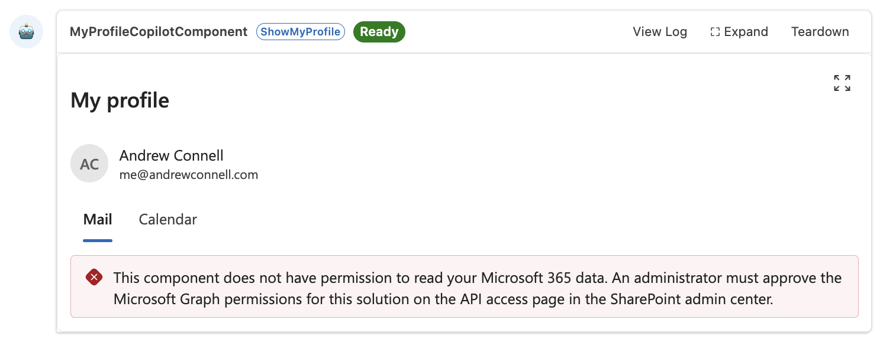
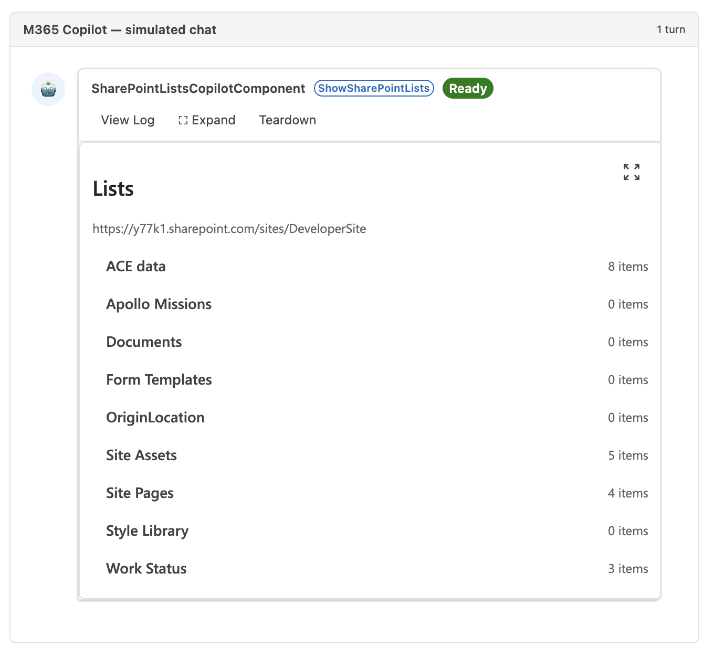
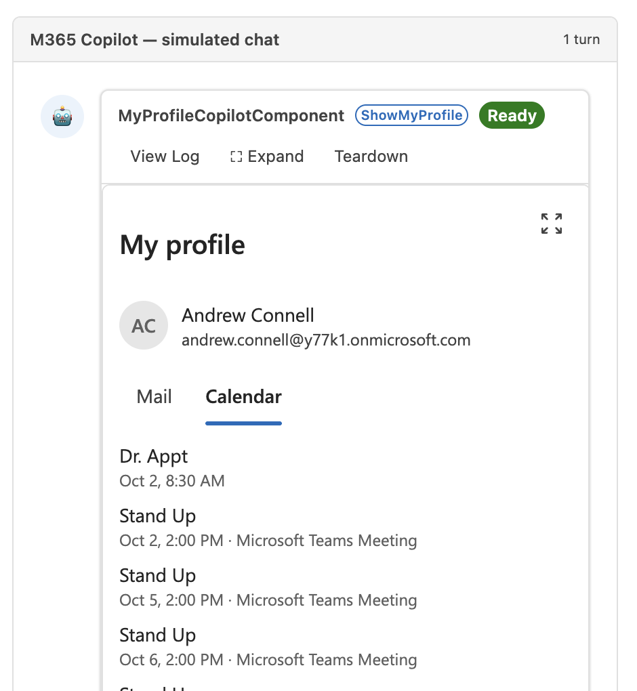

# Access data from a Copilot UX component

> [!IMPORTANT]
> Copilot UX components are currently in **preview** and are subject to change. Do not use them in production environments. APIs, schemas, and tooling described in this article may change before general availability.

A Copilot UX component gets the same SharePoint Framework (SPFx) clients as a web part through `this.context`. SPFx gets the access tokens for these clients, so the component doesn't need any authentication code.

| Client | Use it for |
| --- | --- |
| `this.context.spHttpClient` | SharePoint REST API |
| `this.context.msGraphClientFactory` | Microsoft Graph |

This article uses code from the [Access data companion sample](https://github.com/pnp/spfx-copilot-apps/samples/tutorial-connect-to-sharepoint-data).

## Choose where to load data

The `onInit()` method runs once before the first render, and the component shows nothing until it finishes. Loading data in `onInit()` delays the whole component. Load data in the view instead so the component renders right away with a loading state.

The sample creates the service in `onInit()`:

```typescript
protected async onInit(): Promise<void> {
  this._service = new SharePointListsService(this.context.spHttpClient);
}
```

The React view loads the data in an effect. It runs again when the site changes, and it ignores results that arrive after the effect is cleaned up:

```typescript
// Load the lists when the component starts and when the site changes.
React.useEffect(() => {
  let cancelled: boolean = false;
  setSelection(undefined);

  if (site.error.length > 0) {
    setLists({ status: 'error', message: site.error });
    return undefined;
  }

  setLists({ status: 'loading' });
  service.getLists(site.url).then(
    (data: ISharePointList[]) => {
      if (!cancelled) {
        setLists({ status: 'ready', data });
      }
    },
    (error: unknown) => {
      if (!cancelled) {
        setLists({ status: 'error', message: toErrorMessage(error, strings.GenericErrorMessage) });
      }
    }
  );

  return () => {
    cancelled = true;
  };
}, [service, site, strings]);
```

## Call the SharePoint REST API

Call `spHttpClient.get()` with `SPHttpClient.configurations.v1`. Check `response.ok` before reading the body, because a failed request doesn't throw.

```typescript
public async getLists(siteUrl: string): Promise<ISharePointList[]> {
  const url: string =
    `${siteUrl}/_api/web/lists` +
    '?$select=Id,Title,ItemCount&$filter=Hidden eq false&$orderby=Title';
  const data: IListResponse = await this._getJson<IListResponse>(url);

  return data.value.map((list) => ({
    id: list.Id,
    title: list.Title,
    itemCount: list.ItemCount
  }));
}
```

```typescript
private async _getJson<T>(url: string): Promise<T> {
  const response: SPHttpClientResponse = await this._spHttpClient.get(
    url,
    SPHttpClient.configurations.v1
  );

  if (!response.ok) {
    throw new Error(
      `SharePoint returned ${response.status}. ` +
        'Check that the URL is a SharePoint site and that you have access to it.'
    );
  }

  return (await response.json()) as T;
}
```

When the agent doesn't pass a site, the sample uses `this.context.pageContext.web.absoluteUrl`. In Microsoft 365 Copilot, that's the root site of the tenant. In the Copilot Workbench, it's the site the Workbench is opened on.

### Pass the site from the agent

Each property in the component's properties schema becomes a tool parameter. The agent fills the parameter from the conversation, and the component reads it from `this.properties`. The `describe()` text tells the agent when to set the parameter.

```typescript
const propertiesSchema = z.object({
  siteUrl: z
    .string()
    .optional()
    .describe(
      'Absolute HTTPS URL of the SharePoint site whose lists to show, for ' +
        'example https://contoso.sharepoint.com/sites/hr. Set it only when ' +
        'the user gives a site URL. Omit it to use the current site. Never ' +
        'guess a URL from a site name.'
    )
});
```

A tool parameter is text that the agent wrote, so validate it before you use it in a request:

```typescript
export function resolveSiteUrl(siteUrl: string | undefined, fallbackUrl: string): string {
  const trimmed: string = (siteUrl ?? '').trim();
  const candidate: string = trimmed.length > 0 ? trimmed : fallbackUrl;

  let parsed: URL;
  try {
    parsed = new URL(candidate);
  } catch {
    throw new Error(`"${candidate}" is not a valid site URL.`);
  }

  if (parsed.protocol !== 'https:') {
    throw new Error('The site URL must start with https://.');
  }

  return `${parsed.origin}${parsed.pathname}`.replace(/\/+$/, '');
}
```

## Call Microsoft Graph

Get a client with `msGraphClientFactory.getClient('3')`. The sample creates the client once and reuses it for every call:

```typescript
private _getClient(): Promise<MSGraphClientV3> {
  if (!this._clientPromise) {
    this._clientPromise = this._msGraphClientFactory.getClient('3');
  }
  return this._clientPromise;
}
```

Use `select()` to return only the fields the component shows:

```typescript
public async getProfile(): Promise<IUserProfile> {
  const client: MSGraphClientV3 = await this._getClient();
  const user: IGraphUser = await client
    .api('/me')
    .select('displayName,jobTitle,mail,userPrincipalName')
    .get();

  return {
    displayName: user.displayName ?? '',
    jobTitle: user.jobTitle ?? '',
    mail: user.mail ?? user.userPrincipalName ?? ''
  };
}
```

The `calendarView` endpoint returns the events in a time range. The sample asks for the next seven days:

```typescript
public async getEvents(now: Date): Promise<ICalendarEvent[]> {
  const client: MSGraphClientV3 = await this._getClient();
  const end: Date = new Date(now.getTime() + DAYS_AHEAD * MS_PER_DAY);
  const response: { value: IGraphEvent[] } = await client
    .api('/me/calendarView')
    .query({ startDateTime: now.toISOString(), endDateTime: end.toISOString() })
    .select('id,subject,start,end,location')
    .orderby('start/dateTime')
    .top(25)
    .get();

  return response.value.map((event: IGraphEvent) => ({
    id: event.id,
    subject: event.subject || NO_SUBJECT,
    start: toUtcIso(event.start),
    end: toUtcIso(event.end),
    location: event.location?.displayName ?? ''
  }));
}
```

## Request Microsoft Graph permissions

Declare the Microsoft Graph permissions the component needs in the `webApiPermissionRequests` section of **./config/package-solution.json**:

```json
"webApiPermissionRequests": [
  {
    "resource": "Microsoft Graph",
    "scope": "User.Read"
  },
  {
    "resource": "Microsoft Graph",
    "scope": "Mail.Read"
  },
  {
    "resource": "Microsoft Graph",
    "scope": "Calendars.Read"
  }
],
```

After the package is deployed, an administrator approves the requests:

1. Upload the **.sppkg** file to the app catalog and select **Enable app**.
1. Go to the **API access** page in the SharePoint admin center.
1. Select each pending request for the solution, and then select **Approve**.

The approved permissions apply to every SPFx solution in the tenant, not only to this one. The **API access** page lists only the requests that aren't already approved in the tenant, so it might show fewer requests than the solution declares. For more information, see [Connect to Azure AD-secured APIs in SharePoint Framework solutions](../use-aadhttpclient.md).

## Handle loading, empty, and error states

The host shows the component as soon as it renders. Show a loading state while data loads, a short message when there is no data, and the error when a call fails. The sample keeps each request's state in one value:

```typescript
export type LoadState<T> =
  | { status: 'loading' }
  | { status: 'ready'; data: T }
  | { status: 'error'; message: string };
```

The `LoadStatus` component renders the loading and error states, and the view renders the data:

```typescript
export function LoadStatus(props: ILoadStatusProps): React.ReactElement {
  if (props.state.status === 'loading') {
    return <Spinner size="small" label={props.loadingLabel} />;
  }

  if (props.state.status === 'error') {
    return (
      <MessageBar intent="error">
        <MessageBarBody>{props.state.message}</MessageBarBody>
      </MessageBar>
    );
  }

  return <></>;
}
```

When the Microsoft Graph permissions aren't approved, tell the user what to do instead of showing the raw error. The sample checks for this case:

```typescript
export function isPermissionError(error: unknown): boolean {
  if (typeof error !== 'object' || !error) {
    return false;
  }

  const candidate = error as { statusCode?: number; message?: string };
  if (candidate.statusCode === 401 || candidate.statusCode === 403) {
    return true;
  }

  return /AADSTS65001|consent/i.test(candidate.message ?? '');
}
```

> [!div class="mx-imgBorder"]
> 

## Resize the frame when content changes

The host sets the height of the component frame from the content at startup. In the Copilot Workbench, content that loads later, such as list items, doesn't resize the frame, so the rest of the content is cut off. Watch the size of the content and pass each new size to `requestSizeChangeAsync()`:

```typescript
export function watchContentSize(element: HTMLElement, onSize: ContentSizeHandler): () => void {
  const view: (Window & typeof globalThis) | null = element.ownerDocument.defaultView;
  if (!view || typeof view.ResizeObserver !== 'function') {
    return () => undefined;
  }

  let lastWidth: number = -1;
  let lastHeight: number = -1;
  const observer: ResizeObserver = new view.ResizeObserver(() => {
    const rect: DOMRect = element.getBoundingClientRect();
    const width: number = Math.ceil(rect.width);
    const height: number = Math.ceil(rect.height);
    if (width !== lastWidth || height !== lastHeight) {
      lastWidth = width;
      lastHeight = height;
      onSize(width, height);
    }
  });

  observer.observe(element);
  return () => observer.disconnect();
}
```

The sample watches a `div` that wraps the view's content, and the component class passes the size to the host:

```typescript
private _handleContentResize = (width: number, height: number): void => {
  this.requestSizeChangeAsync(width, height).catch(() => undefined);
};
```

## Test the component

1. Start the local development server:

    ```console
    heft start --nobrowser
    ```

1. Open the Copilot Workbench at `https://yourtenantname.sharepoint.com/_layouts/15/copilotworkbench.aspx`.
1. Activate a component from the left side of the screen, enter the properties JSON, and select **Fire turn**.

    For **SharePointLists**, leave out `siteUrl` to use the current site, or set it to another site:

    ```json
    {
      "siteUrl": "https://contoso.sharepoint.com/sites/hr"
    }
    ```

    > [!div class="mx-imgBorder"]
    > 

    For **MyProfile**, set `view` to `mail` or `calendar`:

    ```json
    {
      "view": "calendar"
    }
    ```

In the Workbench, Microsoft Graph calls succeed only for permissions that are already approved in the tenant. A permission the solution requests for the first time is approved after the package is deployed.

To package and deploy the solution, follow the steps in [Build your first SharePoint Copilot App](get-started/build-your-first-copilot-app.md#package-the-solution). After the agent is deployed, search for it by name in the Agent Store, add it, and then ask it for data. Copilot calls the tool that matches the request and renders the component in the conversation.

> [!div class="mx-imgBorder"]
> 

> [!div class="mx-imgBorder"]
> 

## Next steps

- [Display modes in SharePoint Copilot components](displayMode.md)
- [Access data companion sample](https://github.com/pnp/spfx-copilot-apps/samples/tutorial-connect-to-sharepoint-data)

## See also

The `this.context.aadHttpClientFactory` and `this.context.httpClient` clients are also available for other APIs.

- [Connect to SharePoint APIs](../connect-to-sharepoint.md)
- [Use the MSGraphClientV3 to connect to Microsoft Graph](../use-msgraph.md)
