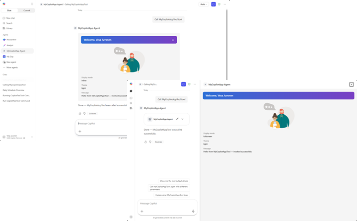
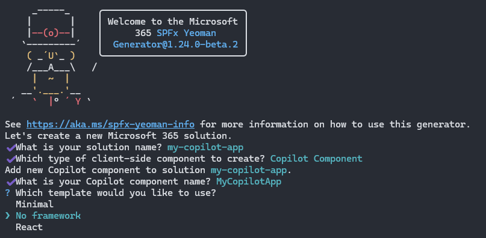
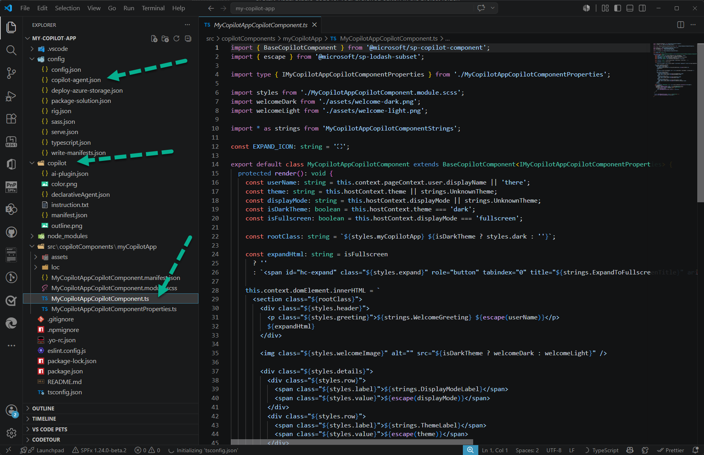
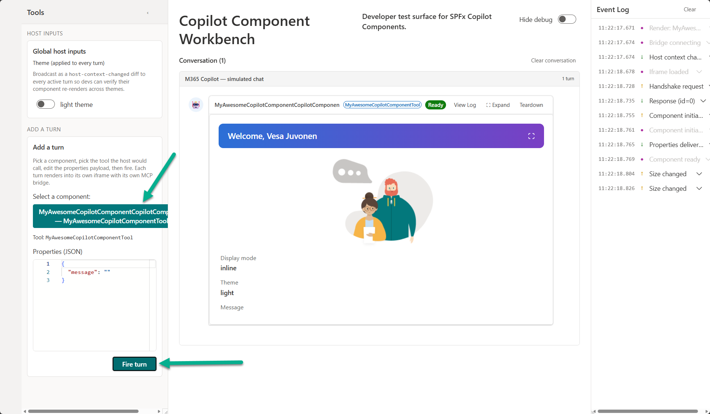
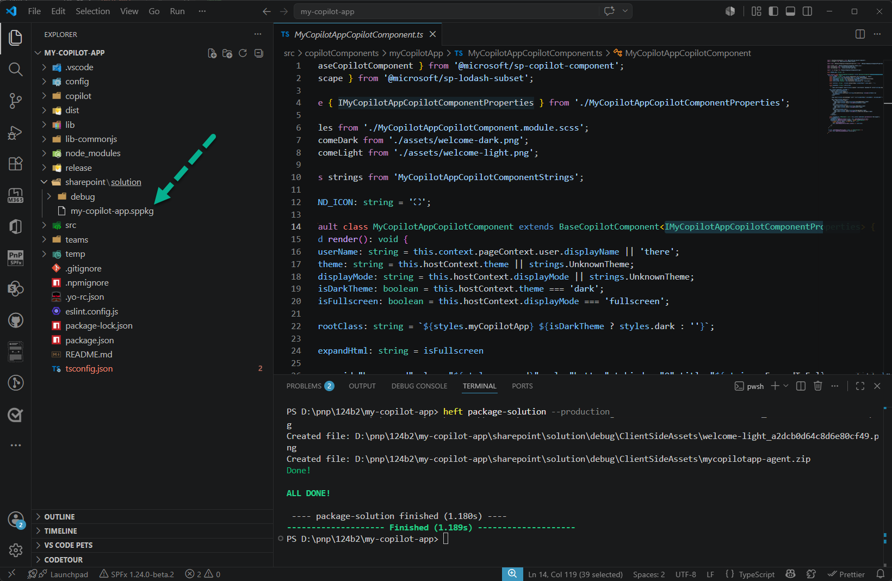
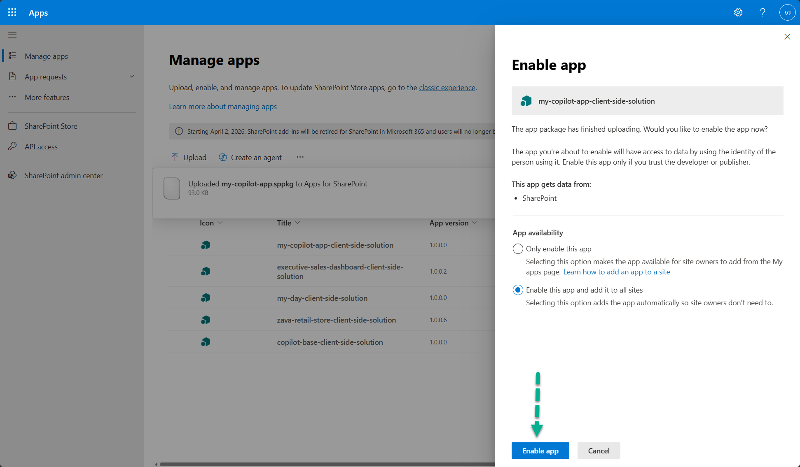
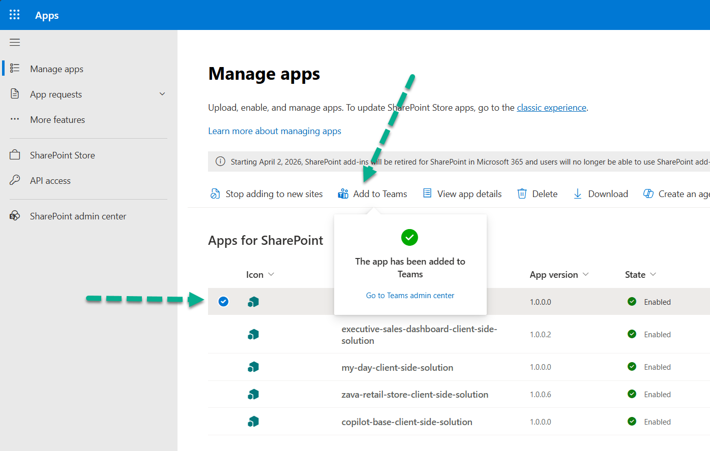
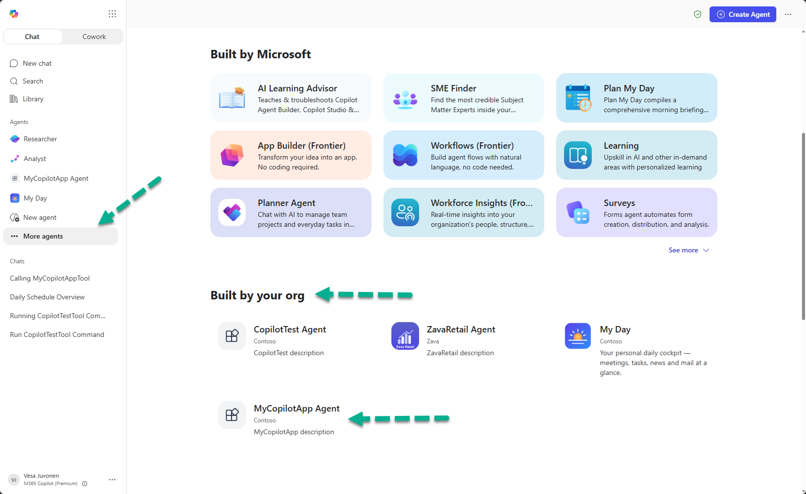
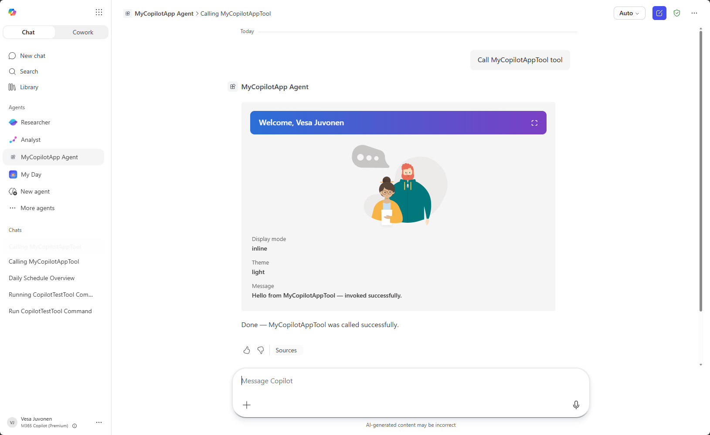
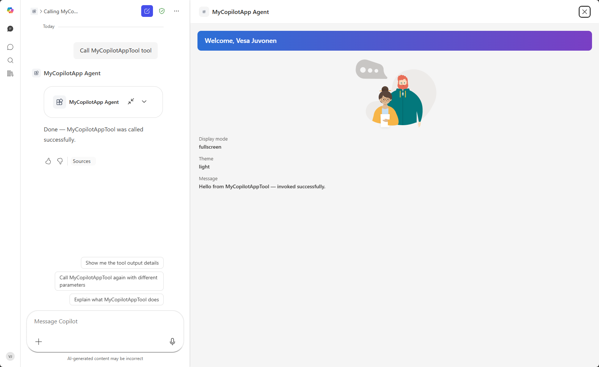

# Build your first SharePoint Copilot App

> [!IMPORTANT]
> SharePoint Copilot Apps are currently in **preview** and are subject to change. Do not use them in production environments. Please make sure that you are using the SharePoint Framework v1.24 beta 2 or newer version to be able to complete the following steps.

In this tutorial, you build a baseline SharePoint Copilot App from scratch, test it locally in the Copilot Workbench, package it, deploy it to the SharePoint app catalog, and use it inside Microsoft 365 Copilot. This gives you the complete end-to-end path for the model: create, test, package, deploy, and use.

<!-- PLACEHOLDER: hero screenshot of the finished Copilot component running in Microsoft 365 Copilot -->
> [!div class="mx-imgBorder"]
> 

For a conceptual overview of how SharePoint Copilot Apps work, see [Overview of SharePoint Copilot Apps](../overview-copilot-apps.md).

You can follow these steps by watching the video on the Microsoft Community Learning YouTube Channel:

> [!Video https://www.youtube.com/embed/1TaK6osdvc0]

## Prerequisites

Before you start, make sure you have the following in place:

- A Microsoft 365 tenant with the SharePoint app catalog provisioned. For more information, see [Set up your SharePoint Framework development environment](../../set-up-your-development-environment.md).
- The SharePoint Framework development toolchain installed, including [Node.js](https://nodejs.org) (the version required by SPFx v1.24) and a code editor such as [Visual Studio Code](https://code.visualstudio.com).
- Permission to upload and deploy solution packages to your tenant app catalog.

> [!NOTE]
> During the public preview, no Microsoft 365 Copilot license is required to build, deploy, or run SharePoint Copilot Apps. For more information, see [Availability during preview](../overview-copilot-apps.md#availability-during-preview).

## Create a Copilot component project

1. Create a new project directory in your favorite location.

    ```console
    md my-copilot-app
    ```

1. Go to the project directory.

    ```console
    cd my-copilot-app
    ```

1. Create a new Copilot component by running the Yeoman SharePoint generator.

    ```console
    yo @microsoft/sharepoint
    ```

1. When prompted, enter the following values (*select the default option for all prompts omitted below*):

    - **What is your solution name?**: my-copilot-app
    - **Which type of client-side component to create?**: Copilot Component
    - **What is your Copilot component name?**: MyCopilotApp
    - **Which template would you like to use?**: No framework

    The generator installs the required dependencies and scaffolds the solution files along with the **MyCopilotApp** component.

    > [!div class="mx-imgBorder"]
    > 

1. Start Visual Studio Code (or your preferred editor) in the project folder.

    ```console
    code .
    ```

## Review the project structure

A SharePoint Copilot App groups the Copilot component source with the declarative agent definition in a single SPFx solution. The following files and folders are the most important ones to understand.

<!-- PLACEHOLDER: screenshot highlighting the copilot folder and copilotComponents folder -->
> [!div class="mx-imgBorder"]
> 

- **src/copilotComponents/myCopilotApp** contains the Copilot component source.
- **copilot** contains the declarative agent definition (`manifest.json`, `declarativeAgent.json`, `ai-plugin.json`, and `instruction.txt`).
- **config/copilot-agent.json** groups the Copilot component into an agent.

### The Copilot component

Open **./src/copilotComponents/myCopilotApp/MyCopilotAppCopilotComponent.ts**.

The component derives from `BaseCopilotComponent`, imported from the **@microsoft/sp-copilot-component** package. Its `render()` method reads the current host context, such as the display mode and theme, and writes the component's UI into `this.context.domElement`. It also wires up an affordance that requests fullscreen through `requestDisplayModeAsync('fullscreen')`.

```typescript
import { BaseCopilotComponent } from '@microsoft/sp-copilot-component';

export default class MyCopilotAppCopilotComponent extends BaseCopilotComponent<IMyCopilotAppCopilotComponentProperties> {
  protected render(): void {
    const displayMode: string = this.hostContext.displayMode || strings.UnknownTheme;
    const isFullscreen: boolean = this.hostContext.displayMode === 'fullscreen';
    // ...render UI into this.context.domElement using this.properties
  }

  private _handleRequestFullscreen = async (): Promise<void> => {
    await this.requestDisplayModeAsync('fullscreen');
  };
}
```

### The component manifest

Open **./src/copilotComponents/myCopilotApp/MyCopilotAppCopilotComponent.manifest.json**.

The manifest declares the component `id`, the display modes it supports, and the tools it exposes. Each tool becomes an action the declarative agent can invoke, and points to a properties schema that describes the parameters it accepts.

```json
{
  "$schema": "https://developer.microsoft.com/json-schemas/spfx/client-side-component-manifest.schema.json",
  "id": "7931d745-bd5d-4b2c-9c67-9e8ce7e34432",
  "alias": "MyCopilotAppCopilotComponent",
  "componentType": "CopilotComponent",
  "copilotType": "Ux",
  "version": "*",
  "manifestVersion": 2,

  "capabilities": {
    "availableDisplayModes": ["inline", "fullscreen"]
  },

  "tools": [
    {
      "name": "MyCopilotAppTool",
      "description": {
        "default": "MyCopilotApp description"
      },
      "propertiesSchema": {
        "id": "$../../../lib/copilotComponents/myCopilotApp/MyCopilotAppCopilotComponentProperties.js:default;"
      }
    }
  ]
}
```

The properties schema in **MyCopilotAppCopilotComponentProperties.ts** uses [Zod](https://zod.dev) to describe the parameters the tool accepts. The default template defines a single `message` property.

```typescript
const propertiesSchema = z.object({
  message: z.string().describe('A message to display.')
});
```

### The declarative agent

The **copilot** folder contains the declarative agent definition. Open **./copilot/declarativeAgent.json** to see the agent name, description, instructions, conversation starters, and the action that maps to your Copilot component's tool.

```json
{
  "$schema": "https://developer.microsoft.com/json-schemas/copilot/declarative-agent/v1.7/schema.json",
  "version": "v1.7",
  "name": "MyCopilotApp Agent",
  "description": "MyCopilotApp description",
  "instructions": "$[file('instruction.txt')]",
  "conversation_starters": [
    {
      "title": "Get started",
      "text": "What can you do?"
    }
  ],
  "actions": [
    {
      "id": "myCopilotAppAction",
      "file": "ai-plugin.json"
    }
  ]
}
```

The **config/copilot-agent.json** file groups one or more Copilot components into the agent by referencing their component `id` values.

```json
{
  "$schema": "../node_modules/@microsoft/spfx-heft-plugins/lib-commonjs/plugins/copilotAgentPlugin/copilot-agent.schema.json",
  "agents": [
    {
      "name": {
        "default": "MyCopilotApp Agent"
      },
      "description": {
        "default": "MyCopilotApp description"
      },
      "components": [
        "7931d745-bd5d-4b2c-9c67-9e8ce7e34432"
      ]
    }
  ]
}

```

## Test in the Copilot Workbench

The Copilot Workbench lets you run and debug your component while it is hosted locally on your development machine, without deploying anything to the app catalog.

1. Compile your code and start the local development server.

    ```console
    heft start --nobrowser
    ```

    When the code compiles without errors, the manifest is served from `https://localhost:4321`. The `--nobrowser` switch prevents the browser from opening automatically, so browse to the Copilot Workbench yourself. The Workbench is always available at the `/_layouts/15/copilotworkbench.aspx` path of any site in your tenant, for example `https://yourtenantname.sharepoint.com/_layouts/15/copilotworkbench.aspx`.

1. When prompted, accept the loading of debug manifests so the debug version of your component loads in the Workbench.

    <!-- PLACEHOLDER: screenshot of the component running in the Copilot Workbench -->
    > [!div class="mx-imgBorder"]
    > 

1. Activate the component from the left side of the screen and select the **Fire turn** button to pass the properties JSON to the component and initialize it in the debug canvas.

1. Interact with the component, switch between the inline and fullscreen display modes, and iterate on the code. Changes are reflected as you rebuild, giving you a fast inner-loop before you package and deploy.

## Package the solution

When you are satisfied with the experience in the Workbench, build the solution package.

1. Bundle the solution in production mode.

    ```console
    heft build --production
    ```

1. Create the solution package.

    ```console
    heft package-solution --production
    ```

    The command creates the package at **./sharepoint/solution/my-copilot-app.sppkg**. Because `includeClientSideAssets` is set to `true` in **config/package-solution.json**, the component assets are bundled into the package and hosted automatically in the tenant where the app is installed.

    <!-- PLACEHOLDER: screenshot of the generated .sppkg package -->
    > [!div class="mx-imgBorder"]
    > 

## Deploy to the SharePoint app catalog

1. Go to your tenant's **app catalog** and open the **Apps for SharePoint** library.

1. Upload the **./sharepoint/solution/my-copilot-app.sppkg** file. SharePoint displays a dialog and asks you to trust the client-side solution. Notice that the **Enable this app and add it to all sites** option is enabled by default. This is required for the Copilot integration to work properly.

1. Select **Enable app**.

    <!-- PLACEHOLDER: screenshot of the trust/deploy dialog in the app catalog -->
    > [!div class="mx-imgBorder"]
    > 

1. In the app catalog list, select the uploaded app and select **Add to Teams**. This deploys the declarative agent to the tenant's agent catalog and makes it available to users in Microsoft 365 Copilot.

    > [!NOTE]
    > The **Add to Teams** button label will be updated in a future release to better reflect that it also publishes the agent to the tenant agent catalog. Deployment of the agent can take some time to complete.

    <!-- PLACEHOLDER: screenshot of selecting Add to Teams in the app catalog -->
    > [!div class="mx-imgBorder"]
    > 

## Use the app in Microsoft 365 Copilot

1. Open **Microsoft 365 Copilot** and locate the **MyCopilotApp Agent** in the list of available agents. Select the agent, and then select **Add** to add it to your list of agents in Copilot.

    > [!NOTE]
    > There can be a delay before the agent appears in the all-agents listing. You can also go to the Microsoft 365 admin center and install the agent directly for users, which can speed up the deployment process.

    <!-- PLACEHOLDER: screenshot of selecting the agent in Microsoft 365 Copilot -->
    > [!div class="mx-imgBorder"]
    > 

1. Start a conversation with the agent by entering "Call MyCopilotAppTool" and submitting it to Copilot. Copilot invokes your tool and renders the Copilot component inline in the conversation.

    > [!NOTE]
    > This is a reliable way to ensure the tool is called directly. It's also needed in this tutorial because we didn't adjust the tool description and the conversation starter to explain the tool's use case. When that information is adjusted, Copilot automatically calls the tool based on user intent.

1. The first time the tool (UX component) is accessed, Copilot confirms the call with the user. Select **Allow** when prompted. The prompt might currently appear a few times before the UX renders. After that, Copilot renders the UX component in the Copilot canvas.

    <!-- PLACEHOLDER: screenshot of the component rendered inline in Microsoft 365 Copilot -->
    > [!div class="mx-imgBorder"]
    > 

1. Expand the component to fullscreen to see the display mode switch in action. In the default **No framework** component, an expand button is rendered in the top-right corner, next to the user's name.

    <!-- PLACEHOLDER: screenshot of the component rendered in fullscreen in Microsoft 365 Copilot -->
    > [!div class="mx-imgBorder"]
    > 

## Next steps

- [Overview of SharePoint Copilot Apps](../overview-copilot-apps.md)
- [Display modes in SharePoint Copilot components](../displayMode.md)
- Review available samples in the [GitHub sample repository](https://github.com/pnp/spfx-copilot-apps).
