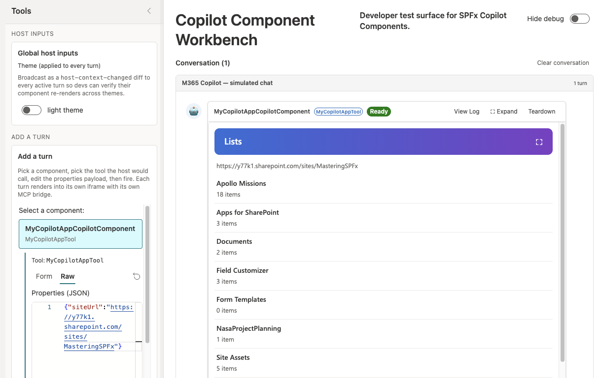

# Connect your Copilot UX component to SharePoint data

> [!IMPORTANT]
> Copilot UX components are currently in **preview** and are subject to change. Do not use them in production environments. APIs, schemas, and tooling described in this article may change before general availability.

In this tutorial, you extend the Copilot UX component from [Build your first SharePoint Copilot App](build-your-first-copilot-app.md). The agent passes a `siteUrl` parameter to the component, and the component shows the lists on that site. When the user selects a list, the component shows the items in it.

> [!div class="mx-imgBorder"]
> 

## Prerequisites

- You completed [Build your first SharePoint Copilot App](build-your-first-copilot-app.md), and the `my-copilot-app` solution is deployed to your tenant.
- The project uses SharePoint Framework 1.24.0-beta.5.

## Define the tool parameters

The agent passes values to the component through the properties schema. In part 1, the schema has one `message` property. Replace it with `siteUrl`.

The model reads the `.describe()` text to decide what value to send. Say what the value is, give an example, and say what not to do.

1. Open **./src/copilotComponents/myCopilotApp/MyCopilotAppCopilotComponentProperties.ts** and replace its contents with the following code.

    ```typescript
    import { z } from 'zod';
    import zodToJsonSchema from 'zod-to-json-schema';

    const propertiesSchema = z.object({
      siteUrl: z
        .string()
        .describe(
          'The absolute HTTPS URL of the SharePoint site whose lists to show, ' +
            'for example https://contoso.sharepoint.com/sites/hr. Use the URL ' +
            'the user gives. Pass the site URL only, without a page or list ' +
            'path. Never guess a URL.'
        )
    });

    export type IMyCopilotAppCopilotComponentProperties = z.infer<typeof propertiesSchema>;

    export default zodToJsonSchema(propertiesSchema);
    ```

## Describe the tool to the agent

In part 1, you entered "Call MyCopilotAppTool" to start the component, because the generated description doesn't say what the tool does. When the description, the instructions, and the conversation starter describe the task, Copilot calls the tool based on what the user asks for.

1. Open **./src/copilotComponents/myCopilotApp/MyCopilotAppCopilotComponent.manifest.json** and replace the tool description.

    ```json
    "tools": [
      {
        "name": "MyCopilotAppTool",
        "description": {
          "default": "Shows the lists and libraries on a SharePoint site and lets the user select a list to see its items. Use when the user asks to see, browse, or open the lists or the list items on a SharePoint site."
        },
        "propertiesSchema": {
          "id": "$../../../lib/copilotComponents/myCopilotApp/MyCopilotAppCopilotComponentProperties.js:default;"
        }
      }
    ]
    ```

1. Open **./copilot/instruction.txt** and replace its contents with the following text.

    ```text
    # PURPOSE

    You show the lists on a SharePoint site in an interactive component. The user selects a list in the component to see its items.

    # TOOL

    Use `MyCopilotAppTool` when the user asks to see, browse, or open the lists, libraries, or list items on a SharePoint site.

    # PROPERTY MAPPING

    - Set `siteUrl` to the absolute HTTPS SharePoint site URL from the request or from the conversation.
    - Pass the site URL only. Remove a page path such as `/SitePages/Home.aspx` and a list path such as `/Lists/Tasks`.
    - If the user gives a site name without a URL, ask for the URL before you call the tool. Never guess a URL.

    # EXAMPLES

    - "Show me the lists on https://contoso.sharepoint.com/sites/hr" -> MyCopilotAppTool({"siteUrl":"https://contoso.sharepoint.com/sites/hr"})
    - "What is on https://contoso.sharepoint.com/sites/hr/SitePages/Home.aspx?" -> MyCopilotAppTool({"siteUrl":"https://contoso.sharepoint.com/sites/hr"})
    - "Show me the lists on the HR site" -> ask for the site URL before you call the tool.

    # RESPONSE

    - Keep the text response to one short sentence. The component shows the lists and the items.
    - Do not repeat the lists or the items in text.
    ```

1. Open **./copilot/declarativeAgent.json** and replace the conversation starter.

    ```json
    "conversation_starters": [
      {
        "title": "Lists on a site",
        "text": "Show me the lists on a SharePoint site"
      }
    ],
    ```

Each file has a different job:

| File | What the model uses it for |
| --- | --- |
| **MyCopilotAppCopilotComponent.manifest.json** (tool description) | To decide whether the tool matches the user's request. |
| **copilot/instruction.txt** | To decide when to call the tool, how to fill in `siteUrl`, and what to say in text. |
| **copilot/declarativeAgent.json** (conversation starter) | To offer the user a prompt that leads to the tool. |

## Load the lists

The component calls the SharePoint REST API with `this.context.spHttpClient`. The call runs in the browser with the signed-in user's permissions, so the user sees only the lists they have access to.

1. Install the SharePoint Framework HTTP package. The **No framework** template doesn't include it.

    ```console
    npm install @microsoft/sp-http@1.24.0-beta.5 --save-exact
    ```

1. Create a file named **SharePointListsService.ts** in **./src/copilotComponents/myCopilotApp** with the following code.

    `parseSiteUrl()` checks the value from the agent before the component sends a request. The model fills in `siteUrl`, so the value can be empty, a page URL, or not a SharePoint URL at all. `getLists()` gets the lists that aren't hidden, sorted by title. `_getCollection()` turns each failure into a message for the user.

    ```typescript
    import { SPHttpClient, type SPHttpClientResponse } from '@microsoft/sp-http';

    export interface ISharePointList {
      id: string;
      title: string;
      itemCount: number;
    }

    export interface ISharePointListItem {
      id: number;
      title: string;
      modified: string;
    }

    interface IListResponse {
      Id: string;
      Title: string;
      ItemCount: number;
    }

    interface IItemResponse {
      Id: number;
      Title?: string;
      FileLeafRef?: string;
      Modified: string;
    }

    const EXAMPLE_URL: string = 'https://contoso.sharepoint.com/sites/hr';

    const NOT_A_SITE: string =
      'No SharePoint site was found at this URL. ' +
      'Use the URL of the site, not the URL of a page or a list.';

    // The model fills in the URL. Send requests only to SharePoint hosts.
    const SHAREPOINT_HOST: RegExp = /\.sharepoint(\.com|\.us|\.cn|-mil\.us)$/i;

    /**
     * Returns an absolute https site URL with no trailing slash, query
     * string or hash. Throws an Error with a message for the user when
     * the value is not the URL of a SharePoint site.
     */
    export function parseSiteUrl(siteUrl: string | undefined): string {
      const trimmed: string = typeof siteUrl === 'string' ? siteUrl.trim() : '';

      if (trimmed.length === 0) {
        throw new Error(
          `No site URL was given. Ask for the lists on a site by its URL, for example ${EXAMPLE_URL}.`
        );
      }

      let parsed: URL;
      try {
        parsed = new URL(trimmed);
      } catch {
        throw new Error(`"${trimmed}" is not a valid site URL.`);
      }

      if (parsed.protocol !== 'https:') {
        throw new Error('The site URL must start with https://.');
      }

      if (!SHAREPOINT_HOST.test(parsed.hostname)) {
        throw new Error(`The URL must be a SharePoint site, for example ${EXAMPLE_URL}.`);
      }

      return `${parsed.origin}${parsed.pathname}`.replace(/\/+$/, '');
    }

    export class SharePointListsService {
      public constructor(private readonly _spHttpClient: SPHttpClient) {}

      public async getLists(siteUrl: string): Promise<ISharePointList[]> {
        const url: string =
          `${siteUrl}/_api/web/lists` +
          '?$select=Id,Title,ItemCount&$filter=Hidden eq false&$orderby=Title';
        const lists: IListResponse[] = await this._getCollection<IListResponse>(url);

        return lists.map((list) => ({
          id: list.Id,
          title: list.Title,
          itemCount: list.ItemCount
        }));
      }

      private async _getCollection<T>(url: string): Promise<T[]> {
        let response: SPHttpClientResponse;
        try {
          response = await this._spHttpClient.get(url, SPHttpClient.configurations.v1);
        } catch {
          throw new Error('The site could not be reached. Check the URL and try again.');
        }

        if (response.status === 401 || response.status === 403) {
          throw new Error('You do not have access to this site.');
        }

        if (response.status === 404) {
          throw new Error(NOT_A_SITE);
        }

        if (!response.ok) {
          throw new Error(`SharePoint returned an error (${response.status}).`);
        }

        // A page URL can return 200 with HTML or with JSON that is not a
        // collection, so check the shape before using it.
        let body: { value?: unknown };
        try {
          body = await response.json();
        } catch {
          throw new Error(NOT_A_SITE);
        }

        if (!body || !Array.isArray(body.value)) {
          throw new Error(NOT_A_SITE);
        }

        return body.value as T[];
      }
    }
    ```

1. Replace the contents of **./src/copilotComponents/myCopilotApp/MyCopilotAppCopilotComponent.ts** with the [MyCopilotAppCopilotComponent.ts file from the sample](https://github.com/pnp/spfx-copilot-apps/samples/tutorial-access-data). The rest of this section and the next section explain its parts.

    The component imports the service and the `escape` function, which part 1 already uses.

    ```typescript
    import { BaseCopilotComponent } from '@microsoft/sp-copilot-component';
    import { escape } from '@microsoft/sp-lodash-subset';

    import type { IMyCopilotAppCopilotComponentProperties } from './MyCopilotAppCopilotComponentProperties';
    import {
      SharePointListsService,
      parseSiteUrl,
      type ISharePointList,
      type ISharePointListItem
    } from './SharePointListsService';

    import styles from './MyCopilotAppCopilotComponent.module.scss';

    import * as strings from 'MyCopilotAppCopilotComponentStrings';
    ```

    The view state is held in fields. `onInit()` creates the service once.

    ```typescript
    private _service!: SharePointListsService;

    // View state. render() reads these fields and writes the UI.
    private _hasStarted: boolean = false;
    private _requestedSiteUrl: string | undefined;
    private _siteUrl: string | undefined;
    private _requestId: number = 0;
    private _isLoading: boolean = false;
    private _error: string | undefined;
    private _lists: ISharePointList[] = [];
    private _selectedList: ISharePointList | undefined;
    private _items: ISharePointListItem[] = [];
    private _nextFocusKey: string | undefined;

    protected async onInit(): Promise<void> {
      this._service = new SharePointListsService(this.context.spHttpClient);
    }
    ```

    The host calls `render()` after `onInit()`, and again when the theme or the display mode changes. For this reason, `render()` starts a load only on the first call and when the agent sends a different site. Every other call draws the current state.

    ```typescript
    protected render(): void {
      // The host calls render() again when the theme or the display mode
      // changes. Load only on the first render and when the agent sends
      // a different site.
      if (!this._hasStarted || this.properties.siteUrl !== this._requestedSiteUrl) {
        this._loadLists();
      }
    ```

    `_loadLists()` checks the URL and starts the request. `_load()` sets the loading state, and calls `this.render()` again when the request finishes. A request number makes sure that a slow response for an earlier site doesn't replace a newer one.

    ```typescript
    private _loadLists(): void {
      this._hasStarted = true;
      this._requestedSiteUrl = this.properties.siteUrl;
      this._selectedList = undefined;
      this._lists = [];
      this._items = [];

      let siteUrl: string;
      try {
        siteUrl = parseSiteUrl(this.properties.siteUrl);
      } catch (error) {
        // Cancel a request that is still running for the previous site.
        this._requestId++;
        this._siteUrl = undefined;
        this._isLoading = false;
        this._error = toErrorMessage(error);
        return;
      }

      this._siteUrl = siteUrl;
      this._load(this._service.getLists(siteUrl), (lists: ISharePointList[]) => {
        this._lists = lists;
      });
    }

    /**
     * Tracks a request in the view state and renders again when it
     * finishes. The caller renders the loading state.
     */
    private _load<T>(request: Promise<T>, onLoaded: (data: T) => void): void {
      const requestId: number = ++this._requestId;
      this._isLoading = true;
      this._error = undefined;

      request.then(
        (data: T) => {
          // Ignore a response that a newer request replaced.
          if (requestId !== this._requestId) {
            return;
          }
          this._isLoading = false;
          onLoaded(data);
          this.render();
        },
        (error: unknown) => {
          if (requestId !== this._requestId) {
            return;
          }
          this._isLoading = false;
          this._error = toErrorMessage(error);
          this.render();
        }
      );
    }
    ```

    `_renderBody()` chooses what to show from the state, and `_renderLists()` writes one button for each list.

    ```typescript
    private _renderBody(): string {
      const backHtml: string = this._selectedList
        ? `<button type="button" id="hc-back" class="${styles.back}">Back to lists</button>`
        : '';

      if (this._isLoading) {
        return `${backHtml}<p class="${styles.status}" role="status">Loading...</p>`;
      }

      if (this._error) {
        return `${backHtml}<p class="${styles.error}" role="alert">${escape(this._error)}</p>`;
      }

      return this._selectedList ? backHtml + this._renderItems() : this._renderLists();
    }

    private _renderLists(): string {
      if (this._lists.length === 0) {
        return `<p class="${styles.status}">This site has no lists.</p>`;
      }

      const rows: string = this._lists
        .map((list: ISharePointList) => {
          const count: string = `${list.itemCount} ${list.itemCount === 1 ? 'item' : 'items'}`;
          return `
            <li>
              <button type="button" class="${styles.listButton}" data-list-id="${escape(list.id)}">
                <span class="${styles.value}">${escape(list.title)}</span>
                <span class="${styles.label}">${escape(count)}</span>
              </button>
            </li>`;
        })
        .join('');

      return `<ul class="${styles.list}">${rows}</ul>`;
    }
    ```

1. Open **./src/copilotComponents/myCopilotApp/MyCopilotAppCopilotComponent.module.scss**. Add the following rules before the `.dark` rule.

    ```scss
    .site {
      margin: 12px 4px 0;
      color: #605e5c;
      font-size: 13px;
      word-break: break-all;
    }

    .status {
      margin: 12px 4px 0;
    }

    .error {
      margin: 12px 4px 0;
      padding: 8px 12px;
      border-left: 4px solid #a4262c;
      background: #fde7e9;
      color: #323130;
    }

    .list {
      margin: 8px 0 0;
      padding: 0;
      list-style: none;
    }

    .listButton,
    .item {
      display: flex;
      flex-direction: column;
      gap: 2px;
      box-sizing: border-box;
      width: 100%;
      padding: 8px 4px;
      border: 0;
      border-bottom: 1px solid #edebe9;
      background: transparent;
      color: inherit;
      font: inherit;
      text-align: left;
    }

    .listButton {
      cursor: pointer;

      &:hover,
      &:focus-visible {
        background: rgba(0, 0, 0, 0.05);
      }
    }

    .back {
      margin: 12px 4px 0;
      padding: 4px 12px;
      border: 1px solid #8a8886;
      border-radius: 4px;
      background: transparent;
      color: inherit;
      font: inherit;
      cursor: pointer;
    }
    ```

1. Replace the `.dark` rule with the following rule.

    ```scss
    .dark {
      color: #f3f2f1;

      .label,
      .site {
        color: #c8c6c4;
      }

      .listButton,
      .item {
        border-bottom-color: #484644;
      }

      .listButton:hover,
      .listButton:focus-visible {
        background: rgba(255, 255, 255, 0.08);
      }

      .error {
        background: #442726;
        color: #f3f2f1;
      }
    }
    ```

In the Copilot Workbench, the component loads the lists of a site other than the one the Workbench runs on, and the lists replace the loading state when the request finishes.

## Show the items in a list

When the user selects a list, the component gets the first 25 items and shows a **Back to lists** control.

1. In **SharePointListsService.ts**, add the `getItems()` method after `getLists()`. Columns differ between lists, so the method gets only the title, the file name, and the modified date.

    ```typescript
    public async getItems(siteUrl: string, listId: string): Promise<ISharePointListItem[]> {
      const url: string =
        `${siteUrl}/_api/web/lists(guid'${listId}')/items` +
        '?$select=Id,Title,FileLeafRef,Modified&$top=25';
      const items: IItemResponse[] = await this._getCollection<IItemResponse>(url);

      // Columns differ between lists. A library item often has no title,
      // so fall back to the file name.
      return items.map((item) => ({
        id: item.Id,
        title: item.Title || item.FileLeafRef || `Item ${item.Id}`,
        modified: item.Modified
      }));
    }
    ```

1. Review how the entry class shows the items. Each list button has a `data-list-id` attribute. `_renderItems()` writes the items and says when the list has more than 25.

    ```typescript
    private _renderItems(): string {
      if (this._items.length === 0) {
        return `<p class="${styles.status}">This list has no items.</p>`;
      }

      const locale: string = this.context.pageContext.cultureInfo.currentUICultureName;

      const rows: string = this._items
        .map((item: ISharePointListItem) => {
          const modified: string = new Date(item.modified).toLocaleDateString(locale);
          return `
            <li class="${styles.item}">
              <span class="${styles.value}">${escape(item.title)}</span>
              <span class="${styles.label}">Modified ${escape(modified)}</span>
            </li>`;
        })
        .join('');

      // The service gets one page of items. Say so when the list has more.
      const total: number = this._selectedList ? this._selectedList.itemCount : 0;
      const moreHtml: string =
        total > this._items.length
          ? `<p class="${styles.status}">${escape(
              `Showing the first ${this._items.length} of ${total} items.`
            )}</p>`
          : '';

      return `<ul class="${styles.list}">${rows}</ul>${moreHtml}`;
    }
    ```

1. Review the event handling. `render()` writes the UI with `innerHTML`, which replaces the elements, so `_bindEvents()` adds the event listeners again after every render.

    ```typescript
    // innerHTML replaces the elements, so add the event listeners again
    // after every render.
    private _bindEvents(): void {
      const expandButton: HTMLElement | null = this.context.domElement.querySelector('#hc-expand');
      if (expandButton) {
        expandButton.addEventListener('click', this._handleRequestFullscreen);
        expandButton.addEventListener('keydown', (event: KeyboardEvent) => {
          if (event.key === 'Enter' || event.key === ' ') {
            event.preventDefault();
            this._handleRequestFullscreen().catch(() => undefined);
          }
        });
      }

      const backButton: HTMLElement | null = this.context.domElement.querySelector('#hc-back');
      if (backButton) {
        backButton.addEventListener('click', this._handleBack);
      }

      this.context.domElement
        .querySelectorAll<HTMLElement>('[data-list-id]')
        .forEach((button: HTMLElement) => {
          button.addEventListener('click', () => {
            this._handleSelectList(button.getAttribute('data-list-id'));
          });
        });
    }
    ```

1. Review the selection handlers. `_handleSelectList()` loads the items of the selected list. `_handleBack()` cancels a request that is still running and shows the lists again without a new request. Both set the control that gets the focus after the next render.

    ```typescript
    private _handleSelectList = (listId: string | null): void => {
      const list: ISharePointList | undefined = this._lists.filter(
        (candidate: ISharePointList) => candidate.id === listId
      )[0];
      if (!list || !this._siteUrl) {
        return;
      }

      this._selectedList = list;
      this._items = [];
      this._load(this._service.getItems(this._siteUrl, list.id), (items: ISharePointListItem[]) => {
        this._items = items;
      });
      this._nextFocusKey = 'hc-back';
      this.render();
    };

    private _handleBack = (): void => {
      // Cancel an item request that is still running.
      this._requestId++;
      // Put the focus back on the list the user came from.
      this._nextFocusKey = this._selectedList ? this._selectedList.id : undefined;
      this._selectedList = undefined;
      this._items = [];
      this._isLoading = false;
      this._error = undefined;
      this.render();
    };
    ```

The full entry class, including the focus handling, is in the [sample](https://github.com/pnp/spfx-copilot-apps). <!-- VERIFY: link to the file in the final sample location. -->

## Handle errors

The model fills in `siteUrl`, so the component checks the value before it sends a request. Each check and each failed request shows a message instead of the lists.

| Condition | What the component shows |
| --- | --- |
| `siteUrl` is empty or missing | No site URL was given. Ask for the lists on a site by its URL, for example https://contoso.sharepoint.com/sites/hr. |
| `siteUrl` isn't a URL | "&lt;value&gt;" is not a valid site URL. |
| `siteUrl` doesn't start with `https://` | The site URL must start with https://. |
| `siteUrl` isn't on a SharePoint host | The URL must be a SharePoint site, for example https://contoso.sharepoint.com/sites/hr. |
| The request can't reach the site | The site could not be reached. Check the URL and try again. |
| SharePoint returns 401 or 403 | You do not have access to this site. |
| SharePoint returns 404, or the URL is a page or a list | No SharePoint site was found at this URL. Use the URL of the site, not the URL of a page or a list. |
| SharePoint returns any other error | SharePoint returned an error (&lt;status&gt;). |

A page URL, such as `https://contoso.sharepoint.com/sites/hr/SitePages/Home.aspx`, can return a successful response that isn't a list collection. For this reason, `_getCollection()` checks the shape of the response before it uses it.

`_loadLists()` catches the errors from `parseSiteUrl()` and stores the message in the view state:

```typescript
let siteUrl: string;
try {
  siteUrl = parseSiteUrl(this.properties.siteUrl);
} catch (error) {
  // Cancel a request that is still running for the previous site.
  this._requestId++;
  this._siteUrl = undefined;
  this._isLoading = false;
  this._error = toErrorMessage(error);
  return;
}
```

> [!IMPORTANT]
> Escape every value from SharePoint and from the tool parameter before you write it to `innerHTML`. List titles, item titles, and the site URL are text that a user or the model controls. The component uses the `escape` function from `@microsoft/sp-lodash-subset`, for example:
>
> ```typescript
> <span class="${styles.value}">${escape(list.title)}</span>
> ```

## Test in the Copilot Workbench

1. Compile your code and start the local development server.

    ```console
    heft start --nobrowser
    ```

1. Go to the Copilot Workbench of a site in your tenant, for example `https://yourtenantname.sharepoint.com/_layouts/15/copilotworkbench.aspx`, and accept the loading of debug manifests.

1. Activate **MyCopilotApp** from the left side of the screen. The **Form** tab shows `siteUrl` as a required property.

1. On the **Raw** tab, enter the properties JSON with the URL of a site in your tenant, and select **Fire turn**. The site can be a different site from the one the Workbench runs on.

    ```json
    {"siteUrl":"https://yourtenantname.sharepoint.com/sites/yoursite"}
    ```

    The component shows **Loading...** and then the lists on the site.

    > [!div class="mx-imgBorder"]
    > 

1. Select a list to see its items, and then select **Back to lists**.

1. Select **Fire turn** with `{}` and with the URL of a page on the site to see the error messages.

## Update the deployed app

1. Bundle the solution in production mode.

    ```console
    heft build --production
    ```

1. Create the solution package.

    ```console
    heft package-solution --production
    ```

    The build increases the version in the Teams app manifest when the agent files change, so you don't have to change a version number by hand.

1. Go to your tenant's **app catalog**, open the **Apps for SharePoint** library, and upload **./sharepoint/solution/my-copilot-app.sppkg**. When SharePoint asks, replace the existing file, and then select **Enable app**.

1. Select the app and select **Add to Teams** to update the agent.

    > [!NOTE]
    > Deployment of the agent can take some time to complete.

## Try it in Microsoft 365 Copilot

1. Open **Microsoft 365 Copilot** and start a new chat with **MyCopilotApp Agent**. The conversation starter now reads **Lists on a site**.

    > [!NOTE]
    > If the agent or the new conversation starter doesn't appear, sign out of Microsoft 365, close the browser, and sign in again.

1. Enter "Show me the lists on https://contoso.sharepoint.com/sites/hr" with the URL of a site in your tenant. You don't need to enter "Call MyCopilotAppTool" anymore: the tool description and the instructions tell Copilot when to call the tool and how to fill in `siteUrl`.

1. Select a list to see its items.

    > [!div class="mx-imgBorder"]
    > 

1. Select the **Lists on a site** conversation starter in a new chat. The prompt has no URL, so the agent asks for one.

## Next steps

- [Access data from a Copilot UX component](../access-data.md)
- [Theme and design for the Copilot canvas](../theme-and-design.md)
- [Display modes in SharePoint Copilot components](../displayMode.md)
- Review the [tutorial-connect-to-sharepoint-data sample](https://github.com/pnp/spfx-copilot-apps).
