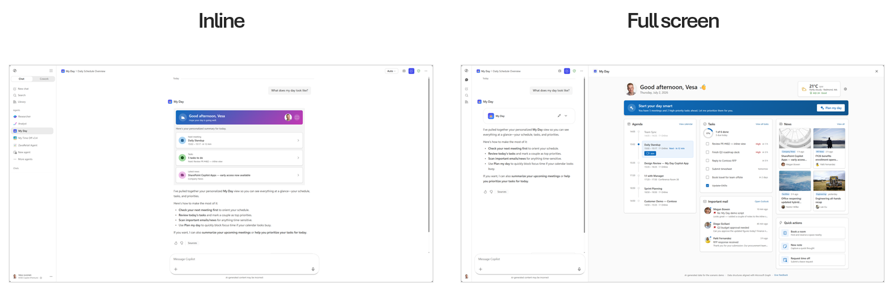
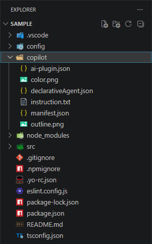
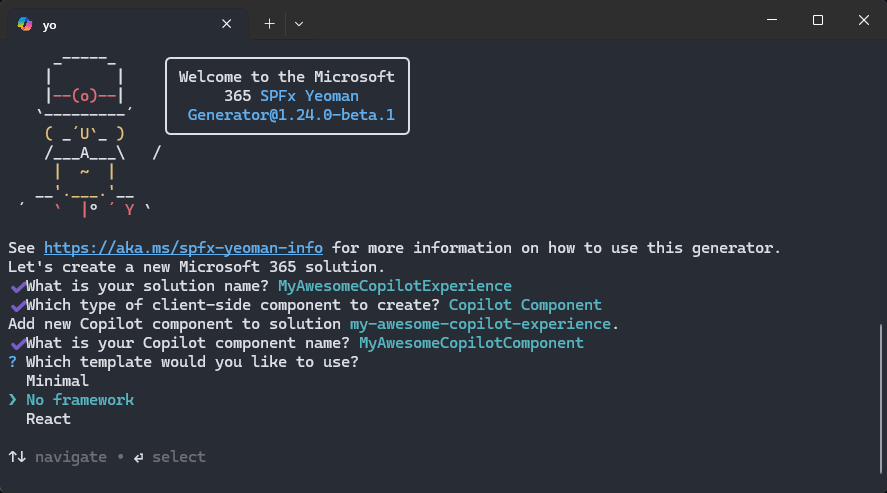
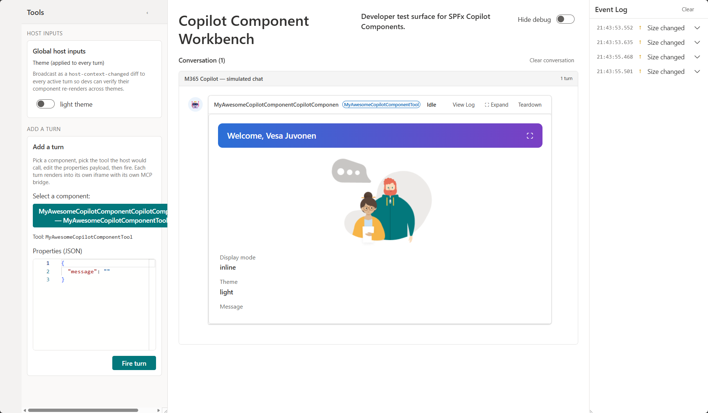

# Overview of SharePoint Copilot Apps

> [!IMPORTANT]
> SharePoint Copilot Apps are currently in **preview** and are subject to change. Do not use them in production environments. APIs, schemas, and tooling described in this article may change before general availability.

You can use **SharePoint Copilot Apps** to extend Microsoft 365 Copilot with custom, interactive experiences that you build using the familiar SharePoint Framework (SPFx) tools, libraries, and client-side development model. A SharePoint Copilot App packages one or more **Copilot components** - client-side UI components that render inside Microsoft 365 Copilot - together with a **declarative agent** definition that makes them discoverable and callable from within a Copilot conversation.


Where SPFx web parts and extensions extend the *SharePoint* user experience, SharePoint Copilot Apps extend the *Microsoft 365 Copilot* experience. You author them with the same toolchain (`heft`, TypeScript, SCSS, the `@microsoft/sp-*` libraries), package them as a SharePoint solution package (`.sppkg`), and deploy them through the SharePoint app catalog you already use.

SharePoint Copilot Apps enable you to:

- **Render rich, interactive UI inside Copilot** - Surface custom, branded experiences directly in a Copilot conversation instead of returning plain text.
- **Ship agent logic and UI together** - A single package contains both the declarative agent definition and the Copilot components it renders.
- **Reuse your SharePoint Framework skills** - Use the same project structure, build tooling, and deployment pipeline as your existing SPFx solutions.
- **Move solutions across tenants easily** - Because Copilot Apps are built with SPFx and packaged as a standard `.sppkg`, you can move them between tenants simply by deploying the same package to another tenant's app catalog.
- **Share the same UX across surfaces** - Build a UX component once and reuse it across Microsoft 365 - in Microsoft 365 Copilot, in SharePoint, and in Microsoft Teams - for a consistent end-user experience wherever people work.

## Build once, reach every surface

A key benefit of the SharePoint Framework model is that your UX components aren't tied to a single surface. The same interactive UI you render inside Microsoft 365 Copilot can also power an SPFx web part in SharePoint or a tab in Microsoft Teams, so users get the same experience regardless of which application they start from.

This works because SPFx separates the *hosting* concern from the *UI* concern. A Copilot component and a web part derive from different base classes: a Copilot component extends `BaseCopilotComponent`, while a web part extends `BaseClientSideWebPart`. Each base class adapts the component to its host (the Copilot canvas versus a SharePoint page), but what each one hosts can be the same underlying UX component. You factor your interface, business logic, and styling into shared, framework-agnostic components (for example, React, Angular, Vue, or Svelte), and each surface-specific base class renders them.

A single SPFx solution package (`.sppkg`) can contain a mix of different component types, such as Copilot components, web parts, and extensions, side by side. This lets you ship one solution that surfaces the same shared UX across Copilot, SharePoint, and Teams, while packaging, deploying, and versioning everything as a single unit.

The result is a single investment in your UX that delivers a consistent, branded experience across Copilot, SharePoint, and Teams, without rebuilding the core interaction pattern for every surface.

> [!NOTE]
> During the public preview, SharePoint Copilot Apps render only in the Microsoft 365 Copilot user experience. The cross-surface reuse described here is the direction of the model; support for additional surfaces is on the way. See [Known issues](#known-issues) for the current preview limitations.

## Key concepts

The following sections describe the concepts that are important to understand when you build SharePoint Copilot Apps.

### Two display modes

A Copilot component declares the display modes it supports in its component manifest through the `availableDisplayModes` capability. Microsoft 365 Copilot renders the component in one of two layouts:

- **`inline`** - The component renders inline within the Copilot conversation, alongside the chat flow. This is the default, compact presentation.
- **`fullscreen`** - The component expands to occupy the full Copilot surface, giving it maximum space for richer interactions.

The host owns the layout. Your component reads the current mode from `this.hostContext.displayMode` and can *request* expansion to fullscreen by calling `this.requestDisplayModeAsync('fullscreen')`. Collapsing back to inline is always host-initiated - the user clicks the host's collapse affordance, and your component is notified through `onHostContextChanged`.

```json
// HelloCopilotCopilotComponent.manifest.json (excerpt)
"capabilities": {
  "availableDisplayModes": ["inline", "fullscreen"]
}
```

The following example shows the My Day scenario in both display modes.

> [!div class="mx-imgBorder"]
> 

### Multiple tools in one package

A single SharePoint Copilot App can expose multiple tools from one solution package. Each Copilot component declares one or more tools in its manifest, and each tool becomes an action the declarative agent can invoke. This lets you group related capabilities, for example a "status" tool and a "reporting" tool, into one deployable unit that shares build output, hosting, and lifecycle.

```json
// HelloCopilotCopilotComponent.manifest.json (excerpt)
"tools": [
  {
    "name": "HelloCopilotTool",
    "description": { "default": "helloCopilot description" },
    "propertiesSchema": {
      "id": "$../../../lib/copilotComponents/helloCopilot/HelloCopilotCopilotComponentProperties.js:default;"
    }
  }
]
```

### Parameterized initial rendering

Each tool can define a properties schema that describes the parameters it accepts. When the declarative agent invokes a tool, Microsoft 365 Copilot passes these properties into the component, which uses them to control its initial rendering. This means the same component can present different content depending on the parameters supplied for a given invocation.

Your component reads these values from `this.properties` at render time:

```ts
// HelloCopilotCopilotComponent.ts (excerpt)
protected render(): void {
  const message: string = this.properties.message;
  // ...use message and other properties to drive the initial render
}
```

Because parameters shape the first render, a single tool can serve many scenarios without you shipping a separate component for each one.

### Automatic hosting in the customer tenant

When you set `includeClientSideAssets` to `true` in **package-solution.json**, the component's JavaScript assets are bundled into the `.sppkg` and hosted automatically in the customer's own Microsoft 365 tenant. You don't need to provision or maintain an external content delivery network, Azure Storage account, or any separate hosting infrastructure. The assets are served from, and stay within, the tenant where the app is installed.

```json
// package-solution.json (excerpt)
"solution": {
  "includeClientSideAssets": true
}
```

### Declarative agents synced to the tenant agent catalog

A SharePoint Copilot App defines a declarative agent, a Microsoft 365 Copilot agent described by a manifest, an agent definition, instructions, and one or more actions that map to the Copilot components' tools.

When you deploy the app package to the **SharePoint app catalog**, the declarative agent is automatically synchronized to the tenant's agent catalog. There is no separate publishing step in Microsoft 365 Copilot or Teams admin: deploying the `.sppkg` makes the agent available to users. Removing or updating the app in the SharePoint app catalog likewise updates the corresponding agent.

> [!NOTE]
> The only action an administrator needs to take is to upload the `.sppkg` file to the SharePoint app catalog and select **Add to Teams**, which deploys the declarative agent to the tenant's agent catalog. The label of this button will be updated in a future release to better reflect that it also publishes the agent.

```json
// declarativeAgent.json (excerpt)
{
  "version": "v1.5",
  "name": "helloCopilot Agent",
  "instructions": "$[file('instruction.txt')]",
  "conversation_starters": [
    { "title": "Get started", "text": "What can you do?" }
  ],
  "actions": [
    { "id": "helloCopilotAction", "file": "ai-plugin.json" }
  ]
}
```

## Anatomy of a SharePoint Copilot App

The declarative agent definition lives in a dedicated `copilot` folder in your project, alongside the Copilot component source under `src/copilotComponents`. The `copilot` folder contains the agent manifest and the files it references.

> [!div class="mx-imgBorder"]
> 

| File | Purpose |
| ---- | ------- |
| `manifest.json` | The Teams/Microsoft 365 app manifest that registers the declarative agent. The developer owns and updates this file - for example, the app name, description, icons, and identifiers. |
| `declarativeAgent.json` | The declarative agent definition: name, description, instructions, conversation starters, and actions. The developer fully controls this file and can use the **full set of declarative agent options** - not only what an SPFx-powered Copilot App needs. |
| `ai-plugin.json` | The plugin definition that describes the agent's actions to the model. |
| `instruction.txt` | The natural-language instructions that shape the agent's behavior. |

> [!NOTE]
> Because you author `manifest.json` and `declarativeAgent.json` directly, a SharePoint Copilot App is a full declarative agent. You can add capabilities such as additional instructions, conversation starters, knowledge sources, and other actions supported by the declarative agent schema - the SPFx Copilot components are one part of a broader agent you control.

The Copilot component itself is a client-side component that derives from `BaseCopilotComponent`, declares its display modes and tools in a component manifest, and is grouped into an agent through **copilot-agent.json**.

### How the copilot folder is packaged and deployed

You author the source files in the `copilot` folder - most importantly `manifest.json` and `declarativeAgent.json` - and the build combines them with your components. When the solution is built, the toolchain **merges your declarative agent definition** with the details of the Copilot components declared in **copilot-agent.json** - the components they reference and each component's tools and properties - and bundles the result into the solution package (`.sppkg`) alongside the component assets. You can see the packaged output under the project's `temp/copilot` folder during a build.

When you deploy that package to the **SharePoint app catalog**, the declarative agent is also **deployed to the tenant agent store**. This is what makes the experience available to end users through **Microsoft 365 Copilot** and **Copilot Chat** - there is no separate step to register or publish the agent. Updating or removing the app in the app catalog updates or removes the corresponding agent in the tenant agent store.

## Choose a starter template

When you scaffold a new SharePoint Copilot App, the SharePoint Framework generator offers **three starter templates** - just like the framework choices you already know from web parts. Each template gives you a working Copilot component that you can run in the Copilot Workbench right away, so you can pick the starting point that best matches your team's skills and the experience you want to build.

- **Minimal** - The leanest possible starting point, with only the code needed to render a Copilot component. Ideal for learning the model or building up an experience from scratch.
- **No framework** - Plain TypeScript with no UI framework, for full control over the rendering without additional dependencies.
- **React** - A React-based starting point for teams already building with React.

> [!div class="mx-imgBorder"]
> 

## Test with the Copilot Workbench

The **Copilot Workbench** lets you deploy and test your Copilot components while they are hosted locally on your development machine, before you package and deploy them to the SharePoint app catalog and sync them to Microsoft 365 Copilot. This gives you a fast inner-loop: you run your component from `localhost`, load it in the Workbench, and iterate on rendering, display modes, and tool parameters against a real Copilot surface without a full deployment cycle.

The Copilot Workbench is always available at the `/_layouts/15/copilotworkbench.aspx` path of any SharePoint site in your tenant - for example, `https://yourtenantname.sharepoint.com/_layouts/15/copilotworkbench.aspx`. Once your local dev server is running and serving the component from `localhost` - by running `heft start --nobrowser` - browse to that URL and the debug version of your component is loaded in the Workbench, ready for testing and development.

Once you are satisfied with the experience in the Workbench, you build the solution package and deploy it to the app catalog, where the declarative agent is automatically synced to the tenant agent catalog.

> [!div class="mx-imgBorder"]
> 

## Developer guidance and considerations

Keep the following in mind as you build and maintain SharePoint Copilot Apps, especially during the preview phase. This section will be updated with additional guidance and assets as the preview evolves.

### Update the declarative agent version on every change

When you make changes on the declarative agent side - for example, editing `declarativeAgent.json`, its instructions, conversation starters, or actions - you must **update the declarative agent `version`** so the new definition is picked up. If the version stays the same, Microsoft 365 Copilot may continue to use the previously synced agent even after you deploy an updated solution to the app catalog. Bumping the version ensures the changes are recognized and the refreshed agent is applied with the new deployment.

> [!NOTE]
> Deployment of the agent to the tenant agent catalog can take some time to complete. Improvements to this deployment experience are planned for a future release.

## Next steps

> [!div class="nextstepaction"]
> [Build your first SharePoint Copilot App](get-started/build-your-first-copilot-app.md)

- Learn how the [`displayMode`](displayMode.md) host context works and how to add an expand-to-fullscreen control.
- Review available samples in the [GitHub sample repository](https://github.com/pnp/spfx-copilot-apps).

## Availability during preview

Keep the following preview-time considerations in mind as you plan when and how to ship SharePoint Copilot Apps.

> [!NOTE]
> The public preview capabilities are rolling out in sequence. Tenants on the [targeted release](/microsoft-365/admin/manage/release-options-in-office-365) program get them first, followed by the remaining tenants. All tenants are expected to have the preview enabled - including automatic publishing of the declarative agent from the SharePoint app catalog to the tenant agent catalog - by the end of July 2026.

### No license required (during preview)

During the preview period, SharePoint Copilot Apps do **not** require a Microsoft 365 Copilot license to build, deploy, or run. Both makers and end users can create and use these experiences without a per-user Copilot license while the feature is in preview.

> [!NOTE]
> Licensing requirements may change when the feature reaches general availability. Review the licensing guidance again before you plan a production rollout.

### Not yet supported in the Microsoft marketplace (during preview)

During the public preview, SharePoint Copilot Apps **cannot** be published to or distributed through the Microsoft commercial marketplace (Microsoft AppSource). While in preview, you deploy them privately to your own tenant through the SharePoint app catalog. Microsoft marketplace support is planned for when the feature reaches general availability.

## Known issues

The following are known issues in the current public preview. They are expected to be resolved in an upcoming release.

- **Copilot UX only** - Initially during the public preview, components render only in the Microsoft 365 Copilot user experience. Support for other surfaces and hosting options is in the works.
- **Duplicate tool names across solutions** - If two deployed solutions declare a tool with the same name, only one of them is registered and the other is silently ignored. Until this is fixed, make sure each tool name is unique across all SharePoint Copilot Apps deployed to the tenant.

## See also

- [Get started building SharePoint Framework solutions](/sharepoint/dev/spfx/set-up-your-developer-tenant)
- [Declarative agents for Microsoft 365 Copilot](/microsoft-365-copilot/extensibility/overview-declarative-agent)
