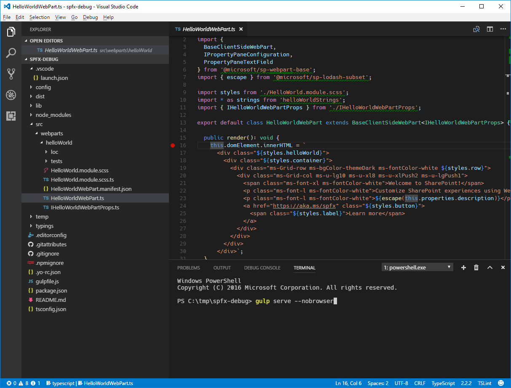
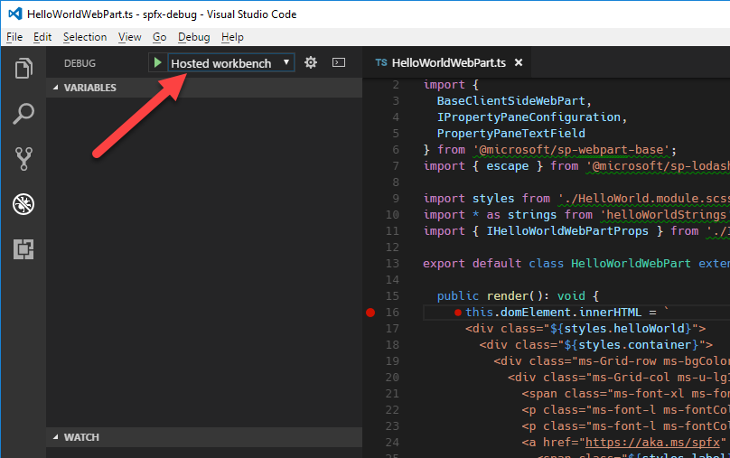
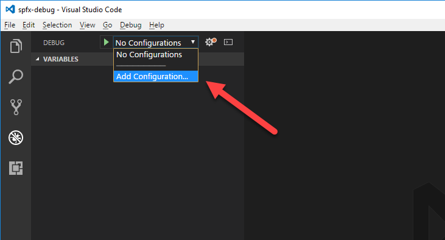
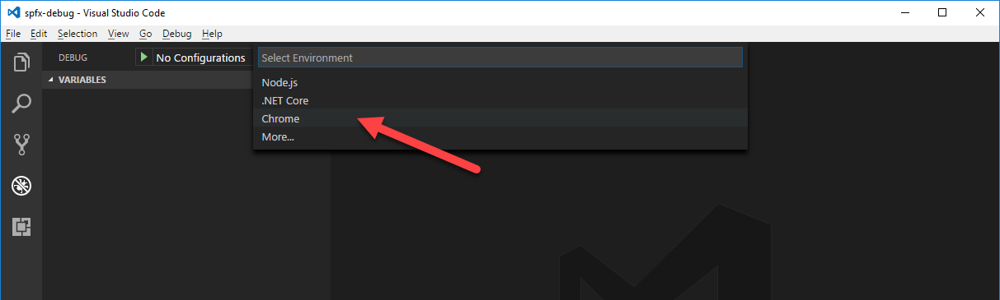

# Debug SharePoint Framework solutions in Visual Studio Code

Visual Studio Code is a popular code editor frequently used for building SharePoint Framework solutions. By setting up debugging of your SharePoint Framework solution in Visual Studio Code, you can more efficiently step through your code and fix errors. 

You can also see the required steps to enable debugging in Visual Studio Code in this video on the SharePoint PnP YouTube Channel:

<br/>

> [!Video https://www.youtube.com/embed/oNChcluMrm8&list=PLR9nK3mnD-OXZbEvTEPxzIOMGXj_aZKJG]

<br/> 

## Prerequisites

The easiest way to configure Visual Studio Code to debug SharePoint Framework solutions is by using Google Chrome and the Debugger for Chrome Visual Studio Code extension. Starting with the SharePoint Framework Yeoman generator version 1.3.4, the default project (web parts and extensions) templates come set up with the prerequisites and prompt for the required Visual Studio Code extensions to install. In this case, it prompts to install Debugger for Chrome Visual Studio Code extension.

You also need the Google Chrome browser. [Download and install the latest version of Google Chrome](https://www.google.com/chrome/browser/desktop/index.html).

If you are using a version of SharePoint Framework Yeoman generator that is older than version 1.3.4, you can [install the Chrome debugger extension for Visual Studio Code from the Visual Studio Marketplace](https://marketplace.visualstudio.com/items?itemName=msjsdiag.debugger-for-chrome).

## Debug configurations

You can locate the debug configurations in the launch.json file under the Visual Studio Code workspace folder:

```
project-name\.vscode
```

The launch.json contains two debug configurations:
* Local workbench configuration
* Hosted workbench configuration

## Debug solution using local workbench

When building SharePoint Framework solutions, you can use the local workbench to verify that your web part is working correctly. Using the local workbench is convenient for testing all scenarios that do not require communicating with SharePoint as well as for offline development.

With Visual Studio Code configured for debugging SharePoint Framework solutions by using Google Chrome and the local workbench, you can verify that everything is working as expected.

### Configure a breakpoint

1. In Visual Studio Code, open the main web part source file, and add a breakpoint in the first line of the **render** method by either selecting the margin that is left to the line number or by highlighting the code line in the editor and selecting the F9 key.

    

2. In Visual Studio Code, on the **View** menu, select the **Integrated Terminal** option or select **Ctrl+`** on the keyboard. 

3. In the terminal run the following command:

    ```sh
    gulp serve --nobrowser
    ```

    Running this command builds your SharePoint Framework solution and starts the local webserver to serve the output files. Because the debugger starts its own instance of the browser, you use the **--nobrowser** argument to prevent the **serve** task from opening a browser window.

    

### Start debugging in Visual Studio Code

After the gulp task is finished, move the focus to the code area of Visual Studio Code and select F5 (or on the **Debug** menu, select the **Start Debugging** option). 

The debug mode in Visual Studio Code starts, changing the color of the status bar to orange and opening a new window of Google Chrome showing the local version of the SharePoint Workbench.

> [!NOTE] 
> At this point the breakpoint is disabled because the web part's code hasn't been loaded yet. SharePoint Framework loads web parts on demand only after they have been added to the page.


### Add a web part to the canvas

To verify that debugging is working, in the workbench, add your web part to the canvas.


<br/>

Notice that with the code loaded on the page, the breakpoint indicator changed to active.


<br/>

If you now reload the page, your breakpoint in Visual Studio Code is hit, and you are able to inspect all the properties and step through the code.


## Debug solution using hosted workbench

When building SharePoint Framework solutions that communicate with SharePoint, you might want to verify the interaction between your solution in SharePoint. To do this easily, you can use the hosted version of the SharePoint Workbench, which is available on every Office 365 tenant at `https://yourtenant.sharepoint.com/_layouts/workbench.aspx`. 

When building SharePoint Framework solutions, you will be doing such tests regularly, and it is a good idea to create a separate debug configuration for the hosted version of the SharePoint Workbench.

### Debug solution using hosted workbench

1. Open launch.json, and update the `url` property under the *Hosted workbench* configuration to your SharePoint site URL.

    ```json
    "url": "https://enter-your-SharePoint-site/_layouts/workbench.aspx",
    ```

2. In Visual Studio Code, activate the **Debug** pane, and in the **Configurations** list, select the newly added **Hosted workbench** configuration.

    

3. Start debugging either by selecting F5 or by selecting the **Start Debugging** option on the **Debug** menu. Visual Studio Code switches into debug mode, indicated by the orange status bar, and the Debugger for Chrome extension opens a new instance of Google Chrome with the Office 365 sign-in page.

    

4. After you sign in, add the web part to the canvas and refresh the workbench, just like you did with the local workbench. You will see the breakpoint in Visual Studio Code be hit, and you are able to inspect variables and step through the code.

    

## For older projects

If you are using an older version of SharePoint Framework Yeoman generator, follow these steps to create the launch.json file manually.

### Create debug configuration for local workbench

1. In Visual Studio Code, activate the **Debug** pane.

    

2. In the top section of the pane, open the **Configurations** list, and select the **Add Configuration** option.

    

3. In the list of debug environments, select **Chrome**.

    

4. Replace the contents of the generated **launch.json** file with:

    ```json
    {
        "version": "0.2.0",
        "configurations": [
            {
                "name": "Local workbench",
                "type": "chrome",
                "request": "launch",
                "url": "https://localhost:4321/temp/workbench.html",
                "webRoot": "${workspaceRoot}",
                "sourceMaps": true,
                "sourceMapPathOverrides": {
                    "webpack:///../../../src/*": "${webRoot}/src/*",
                    "webpack:///../../../../src/*": "${webRoot}/src/*",
                    "webpack:///../../../../../src/*": "${webRoot}/src/*"
                },
                "runtimeArgs": [
                    "--remote-debugging-port=9222"
                ]
            }
        ]
    }
    ```

    This configuration uses the **Chrome** debugger provided with the **Debugger for Chrome** extension. It points to the URL of the local workbench as the starting point. What is essential in debugging TypeScript code is the configuration of source maps that the debugger uses to map the JavaScript running in the browser to the original TypeScript code.

### Create debug configuration for hosted workbench

1. In Visual Studio Code, open the **./.vscode/launch.json** file. 

2. Copy the existing debug configuration and use the URL of the hosted workbench:

    ```json
    {
        "version": "0.2.0",
        "configurations": [
            {
                "name": "Local workbench",
                "type": "chrome",
                "request": "launch",
                "url": "https://localhost:4321/temp/workbench.html",
                "webRoot": "${workspaceRoot}",
                "sourceMaps": true,
                "sourceMapPathOverrides": {
                    "webpack:///../../../src/*": "${webRoot}/src/*",
                    "webpack:///../../../../src/*": "${webRoot}/src/*",
                    "webpack:///../../../../../src/*": "${webRoot}/src/*"
                },
                "runtimeArgs": [
                    "--remote-debugging-port=9222"
                ]
            },
            {
                "name": "Hosted workbench",
                "type": "chrome",
                "request": "launch",
                "url": "https://contoso.sharepoint.com/_layouts/workbench.aspx",
                "webRoot": "${workspaceRoot}",
                "sourceMaps": true,
                "sourceMapPathOverrides": {
                    "webpack:///../../../src/*": "${webRoot}/src/*",
                    "webpack:///../../../../src/*": "${webRoot}/src/*",
                    "webpack:///../../../../../src/*": "${webRoot}/src/*"
                },
                "runtimeArgs": [
                    "--remote-debugging-port=9222"
                ]
            }
        ]
    }
    ```

## See also

- [How to debug your SharePoint Framework web part (Elio Struyf)](https://www.eliostruyf.com/how-to-debug-your-sharepoint-framework-web-part/)
- [Debug SPFx React webpart with Visual Studio Code (Velin Georgiev)](https://blog.velingeorgiev.com/how-debug-sharepoint-framework-webpart-visual-studio-code)
- [Scaffold projects by using Yeoman SharePoint generator](toolchain/scaffolding-projects-using-yeoman-sharepoint-generator.md)
- [SharePoint Framework Overview](sharepoint-framework-overview.md)
