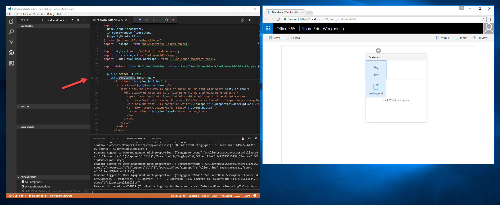

# Debug SharePoint Framework solutions in Visual Studio Code

Visual Studio Code is a popular code editor frequently used for building SharePoint Framework solutions. By setting up debugging of your SharePoint Framework solution in Visual Studio Code, you can more efficiently step through your code and fix errors. This article describes the prerequisites and configuration steps required to configure Visual Studio Code for debugging SharePoint Framework solutions.

## Prerequisites

The easiest way to configure Visual Studio Code to debug SharePoint Framework solutions is by using Google Chrome and the Debugger for Chrome Visual Studio Code extension. Starting with the SharePoint Framework yeoman generator version 1.3.4, the default project (web parts and extensions) templates will come setup with the pre-requisites and will prompt for the required Visual Studio Code extensions to install. In this case, it will prompt to install Debugger for Chrome Visual Studio Code extension.

You will also need Google Chrome browser. Download and install the latest version of Google Chrome from [https://www.google.com/chrome/browser/desktop/index.html](https://www.google.com/chrome/browser/desktop/index.html).

If you are using an older SharePoint Framework yeoman generator, older than 1.3.4, then you can install the Chrome debugger extension for Visual Studio Code from the [Visual Studio Marketplace](https://marketplace.visualstudio.com/items?itemName=msjsdiag.debugger-for-chrome).

## Debug configurations

You can locate the debug configurations in the launch.json file under the Visua Studio Code workspace folder:

```
project-name\.vscode
```

The launch.json contains two debug configurations:
* Local workbench configuration
* Hosted workbench configuration

## Debug SharePoint Framework solution using local workbench

When building SharePoint Framework solutions, you can use the local workbench to verify that your web part is working correctly. Using local workbench is convenient for testing all scenarios that do not require communicating with SharePoint as well as for offline development.

With Visual Studio Code configured for debugging SharePoint Framework solutions using Google Chrome and the local workbench, you can verify that everything is working as expected.

### Configure a breakpoint

In Visual Studio Code open the main web part source file and add a breakpoint in the first line of the **render** method by either clicking on the margin left to the line number or by highlighting the code line in the editor and pressing the **F9** key.


In Visual Studio Code, from the **View** menu select the **Integrated Terminal** option or press **CTRL+`** on the keyboard. In the terminal run the following command:

```sh
gulp serve --nobrowser
```

Running this command will build your SharePoint Framework solution and start the local webserver to serve the output files. Because the debugger will start its own instance of the browser, you use the **--nobrowser** argument to prevent the **serve** task from opening a browser window.


### Start debugging in Visual Studio Code

Once the gulp task is finished, move the focus to the code area of Visual Studio Code and press **F5** (or from the **Debug** menu select the **Start Debugging** option). The debug mode in Visual Studio Code will start, changing the color of the status bar to orange and a new window of Google Chrome will open showing the local version of the SharePoint workbench.


> Note, that at this point the breakpoint is disabled, because the web part's code hasn't been loaded yet. SharePoint Framework loads web parts on demand only after they have been added to the page.

### Add web part to canvas

To verify that debugging is working, in the workbench add your web part to the canvas.



Notice, that with the code loaded on the page, the breakpoint indicator changed to active.


If you now reload the page, your breakpoint in Visual Studio Code will be hit, and you will be able to inspect all properties and step through the code.


## Debug SharePoint Framework solution using hosted workbench

When building SharePoint Framework solutions that communicate with SharePoint you might want to verify the interaction between your solution in SharePoint. To do this easily, you can use the hosted version of the SharePoint workbench which is available on every Office 365 tenant at **https://yourtenant.sharepoint.com/_layouts/workbench.aspx**. When building SharePoint Framework solutions, you will be doing such tests regularly and it is a good idea to create a separate debug configuration for the hosted version of the SharePoint workbench.

Open launch.json and update the *url* property under *Hosted workbench* configuration to your SharePoint site URL.

```json
"url": "https://enter-your-SharePoint-site/_layouts/workbench.aspx",
```
In Visual Studio Code, activate the **Debug** pane and in the **Configurations** drop-down, select the newly added **Hosted workbench** configuration.


Next, start debugging either by pressing the **F5** key or by selecting from the **Debug** menu the **Start Debugging** option. Visual Studio Code will switch into debug mode, indicated by the orange status bar, and the Debugger for Chrome extension will open a new instance of Google Chrome with the Office 365 login page.


After you log in, add the web part to the canvas and refresh the workbench, just like with the local workbench, you will see the breakpoint in Visual Studio Code be hit and you will be able to inspect variables and step through the code.


## For older projects
If you are using an older version of SharePoint Framework yeoman generator, then follow the steps below to create the launch.json file manually.

### Create debug configuration for local workbench

In Visual Studio Code activate the **Debug** pane.


In the top section of the pane, open the **Configurations** drop-down and select the **Add Configuration...** option.


From the list of debug environments select **Chrome**.


Replace the contents of the generated **launch.json** file with:

```json
{
    "version": "0.2.0",
    "configurations": [
        {
            "name": "Local workbench",
            "type": "chrome",
            "request": "launch",
            "url": "https://localhost:4321/temp/workbench.html",
            "webRoot": "${workspaceRoot}",
            "sourceMaps": true,
            "sourceMapPathOverrides": {
                "webpack:///../../../src/*": "${webRoot}/src/*",
                "webpack:///../../../../src/*": "${webRoot}/src/*",
                "webpack:///../../../../../src/*": "${webRoot}/src/*"
            },
            "runtimeArgs": [
                "--remote-debugging-port=9222"
            ]
        }
    ]
}
```

This configuration uses the **chrome** debugger provided with the **Debugger for Chrome** extension. It points to the URL of the local workbench as the starting point. What is essential in debugging TypeScript code, is the configuration of source maps that the debugger uses to map the JavaScript running in the browser to the original TypeScript code.

### Create debug configuration for hosted workbench

In Visual Studio Code open the **./.vscode/launch.json** file. Copy the existing debug configuration and use the URL of the hosted workbench:

```json
{
    "version": "0.2.0",
    "configurations": [
        {
            "name": "Local workbench",
            "type": "chrome",
            "request": "launch",
            "url": "https://localhost:4321/temp/workbench.html",
            "webRoot": "${workspaceRoot}",
            "sourceMaps": true,
            "sourceMapPathOverrides": {
                "webpack:///../../../src/*": "${webRoot}/src/*",
                "webpack:///../../../../src/*": "${webRoot}/src/*",
                "webpack:///../../../../../src/*": "${webRoot}/src/*"
            },
            "runtimeArgs": [
                "--remote-debugging-port=9222"
            ]
        },
        {
            "name": "Hosted workbench",
            "type": "chrome",
            "request": "launch",
            "url": "https://contoso.sharepoint.com/_layouts/workbench.aspx",
            "webRoot": "${workspaceRoot}",
            "sourceMaps": true,
            "sourceMapPathOverrides": {
                "webpack:///../../../src/*": "${webRoot}/src/*",
                "webpack:///../../../../src/*": "${webRoot}/src/*",
                "webpack:///../../../../../src/*": "${webRoot}/src/*"
            },
            "runtimeArgs": [
                "--remote-debugging-port=9222"
            ]
        }
    ]
}
```

## Additional information

- [How to debug your SharePoint Framework web part (Elio Struyf)](http://www.eliostruyf.com/how-to-debug-your-sharepoint-framework-web-part/)
- [Debug SPFx React webpart with Visual Studio Code (Velin Georgiev)](http://blog.velingeorgiev.pro/how-debug-sharepoint-framework-webpart-visual-studio-code)
