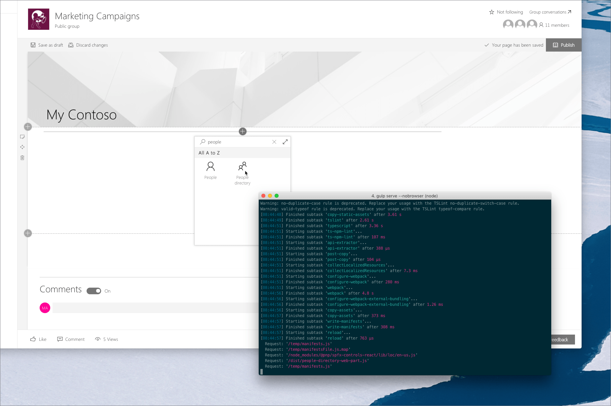

# Debug SharePoint Framework solutions on modern SharePoint pages

When building SharePoint Framework solutions, you can test them on modern SharePoint pages. For building SharePoint Framework extensions, testing on modern pages is the only option, since at this moment the SharePoint Workbench doesn't support loading extensions. Testing on modern pages can however be also used for debugging web parts where it offers developers additional value.

> [!IMPORTANT]
> While there are no technical restrictions for debugging local SharePoint Framework solutions on modern SharePoint pages, you should be careful when using it in your production tenant. This capability allows you to execute code that hasn't been tested and verified against your organization's policies and could be harmful to your production data.

## Debug SharePoint Framework extensions on modern SharePoint pages

At this moment, SharePoint Framework extension can be debugged only on modern SharePoint pages. SharePoint Workbench doesn't support testing extensions. Depending on the version of the SharePoint Framework that you use, there are different ways to debug extensions on modern pages.

### Debug extensions using serve configuration

Starting from version 1.3.0, when you add a SharePoint Framework extension to your project, the SharePoint Framework Yeoman generator will extend your project's configuration. Using this configuration, you can automatically start a modern SharePoint page in your web browser with all parameters required to debug the extension on that page already present.

#### How it works

When you add a new SharePoint Framework extension to your project, the SharePoint Framework Yeoman generator will add a new entry to the `config/serve.json` file in your project. A sample entry looks as follows:

```json
{
  "$schema": "https://dev.office.com/json-schemas/core-build/serve.schema.json",
  "port": 4321,
  "https": true,
  "serveConfigurations": {
    "default": {
      "pageUrl": "https://contoso.sharepoint.com/sites/mySite/SitePages/myPage.aspx",
      "customActions": {
        "d7678bd7-b58a-44fc-b9fa-a621a89edcad": {
          "location": "ClientSideExtension.ApplicationCustomizer",
          "properties": {
            "testMessage": "Test message"
          }
        }
      }
    },
    "helloWorld": {
      "pageUrl": "https://contoso.sharepoint.com/sites/mySite/SitePages/myPage.aspx",
      "customActions": {
        "d7678bd7-b58a-44fc-b9fa-a621a89edcad": {
          "location": "ClientSideExtension.ApplicationCustomizer",
          "properties": {
            "testMessage": "Test message"
          }
        }
      }
    }
  }
}
```

Next to the default configuration, the SharePoint Framework Yeoman generator will create an entry for each extension that you add to your project. Each entry contains a URL of the modern page that should be used to test the particular extension, the list of extensions that should be loaded and for each extension, the list of properties that should be set on them. To use the particular serve configuration, execute in the command line:

```sh
gulp serve --config=<name>
```

for example:

```sh
gulp serve --config=helloWorld
```

After running this command, gulp will start your web browser with the modern page specified in your configuration. The page will show a popup asking you to confirm that you now will be loading debug scripts.


Once you confirm, the page will load with the extensions you specified in your serve configuration.

### Debug extensions by manually building the debug URL

If you're working with a version of the SharePoint Framework older than 1.3.0, and you want to debug an extension on a modern page, you have to manually construct the URL with the required parameters. First, start the local gulp server, by in the command line changing the working directory to your project folder and then executing:

```sh
gulp serve --nobrowser
```

Next, in the web browser, navigate to the modern page, on which you want to test the extension. After the page loaded, copy its URL. Depending on the type of extension you want to test, there are different parameters that you need to add to the URL.

#### Debug application customizer

To debug an application customizer, to the URL of your modern page, add `?loadSPFX=true&debugManifestsFile=https://localhost:4321/temp/manifests.js&customActions={"<extensionId>":{"location":"<extensionType>","properties":<propertiesJSON>}}`, for example: `https://contoso.sharepoint.com/sites/team-a/sitepages/news.aspx?loadSPFX=true&debugManifestsFile=https://localhost:4321/temp/manifests.js&customActions={"e5625e23-5c5a-4007-a335-e6c2c3afa485":{"location":"ClientSideExtension.ApplicationCustomizer","properties":{"testMessage":"Hello as property!"}}}`.

Following are the query string parameters that you need to add:

Parameter|Description
---------|-----------
`loadSPFX=true`|Ensures that the SharePoint Framework is loaded on the page. For performance reasons, the framework does not load unless at least one extension is registered. Because no components are registered, you must explicitly load the framework.
`debugManifestsFile`|Specifies that you want to load SPFx components that are locally served. The loader only looks for components in the app catalog (for your deployed solution) and the SharePoint manifest server (for the system libraries).
`customActions`|Simulates a custom action. When you deploy and register this component in a site, you'll create this **CustomAction** object and describe all the different properties you can set on it.
`key`|Use the GUID of the extension as the key to associate with the custom action. This has to match the ID value of your extension, which is available in the extension manifest.json file.
`location`|The type of custom action. Use `ClientSideExtension.ApplicationCustomizer` for the Application Customizer extension.
`properties`|An optional JSON object that contains properties that are available via the this.properties member

With the parameters added to the URL, reload the page in the web browser. The page will show a popup asking you to confirm that you now will be loading debug scripts.


Once you confirm, the page will load with the extensions you specified in your serve configuration.

#### Debug field customizer

To debug a field customizer, to the URL of your list view page, add `?loadSPFX=true&debugManifestsFile=https://localhost:4321/temp/manifests.js&fieldCustomizers={"<fieldName>":{"id":"<fieldCustomizerId>","properties":<properties>}}`, for example: `https://contoso.sharepoint.com/sites/team-a/Lists/Orders/AllItems.aspx?loadSPFX=true&debugManifestsFile=https://localhost:4321/temp/manifests.js&fieldCustomizers={"Percent":{"id":"45a1d299-990d-4917-ba62-7cb67158be16","properties":{"sampleText":"Hello!"}}}`.

Following are the query string parameters that you need to add:

Parameter|Description
---------|-----------
`loadSPFX=true`|Ensures that the SharePoint Framework is loaded on the page. For performance reasons, the framework does not load unless at least one extension is registered. Because no components are registered, you must explicitly load the framework.
`debugManifestsFile`|Specifies that you want to load SPFx components that are locally served. The loader only looks for components in the app catalog (for your deployed solution) and the SharePoint manifest server (for the system libraries).
`fieldCustomizers`|indicates which fields in your list should have their rendering controlled by the Field Customizer. The ID parameter specifies the GUID of the extension that should be used to control the rendering of the field. The properties parameter is an optional text string containing a JSON object that is deserialized into `this.properties` for your extension.
`key`|Use the internal name of the field as the key.
`id`|The GUID of the Field Customizer extension associated with this field.
`properties`|The property values defined in the extension. In this example, `sampleText` is a property defined by the extension.

With the parameters added to the URL, reload the page in the web browser. The page will show a popup asking you to confirm that you now will be loading debug scripts.


Once you confirm, the page will load with the extensions you specified in your serve configuration.

#### Debug list view command set

To debug a list view command set, to the URL of your list view page, add `?loadSpfx=true&debugManifestsFile=https://localhost:4321/temp/manifests.js&customActions={"<extensionId>":{"location":"ClientSideExtension.ListViewCommandSet.CommandBar","properties":<properties>}}`, for example: `https://contoso.sharepoint.com/sites/team-a/Lists/Orders/AllItems.aspx?loadSpfx=true&debugManifestsFile=https://localhost:4321/temp/manifests.js&customActions={"a8047e2f-30d5-40fc-b880-b2890c7c16d6":{"location":"ClientSideExtension.ListViewCommandSet.CommandBar","properties":{"sampleTextOne":"One item is selected in the list.","sampleTextTwo":"This command is always visible."}}}`.

Following are the query string parameters that you need to add:

Parameter|Description
---------|-----------
`loadSPFX=true`|Ensures that the SharePoint Framework is loaded on the page. For performance reasons, the framework does not load unless at least one extension is registered. Because no components are registered, you must explicitly load the framework.
`debugManifestsFile`|Specifies that you want to load SPFx components that are locally served. The loader only looks for components in the app catalog (for your deployed solution) and the SharePoint manifest server (for the system libraries).
`customActions`|simulates a custom action. You can set many properties on this CustomAction object that affect the look, feel, and location of your button; we’ll cover them all later.
`key`|GUID of the extension.
`Location`|Where the commands are displayed. The possible values are: `ClientSideExtension.ListViewCommandSet.ContextMenu`: The context menu of the item(s), `ClientSideExtension.ListViewCommandSet.CommandBar`: The top command set menu in a list or library. `ClientSideExtension.ListViewCommandSet`: Both the context menu and the command bar (corresponds to `SPUserCustomAction.Location="CommandUI.Ribbon"`).
`properties`|An optional JSON object containing properties that are available via the this.properties member.

With the parameters added to the URL, reload the page in the web browser. The page will show a popup asking you to confirm that you now will be loading debug scripts.


Once you confirm, the page will load with the extensions you specified in your serve configuration.

## Debug SharePoint Framework web parts on modern SharePoint pages

To test the local versions of your SharePoint Framework client-side web parts on modern SharePoint pages in your tenant, first, start the local gulp server, by changing the working directory to your project folder and executing in the command line:

```sh
gulp serve --nobrowser
```

Next, in the web browser, navigate to the modern page, on which you want to test the web parts. After the page loaded, add to its URL `?loadSPFX=true&debugManifestsFile=https://localhost:4321/temp/manifests.js`, for example: `https://contoso.sharepoint.com/sites/team-a/sitepages/news.aspx?loadSPFX=true&debugManifestsFile=https://localhost:4321/temp/manifests.js`. The page will reload and show a popup asking you to confirm that you now will be loading debug scripts.


Once you confirm, that you want to load the web parts that you are developing, you can edit the page, and in the toolbox, select any of your local web parts.



### Added value of testing SharePoint Framework web parts on modern pages

When building SharePoint Framework web parts, you can test them using the local workbench. This is not only convenient but also efficient: each time you change something in your code, the local workbench will automatically reload and show your latest changes.

In some cases, like when building web parts that communicate with SharePoint, you cannot use the local SharePoint workbench, because you need access to the SharePoint APIs that can be called only in the context of a SharePoint site. In such cases, rather than using the local workbench, you can use the hosted SharePoint workbench which you can access by adding `/_layouts/15/workbench.aspx` to the URL of your site, for example `https://contoso.sharepoint.com/sites/team-a/_layouts/15/workbench.aspx`.

#### UI constraints

SharePoint Framework workbench conveniently mimics the canvas of modern SharePoint pages. But it doesn't mimic all their aspects. The width of the canvas is different, not all theme colors are reflected, and the workbench doesn't allow you to test the full-bleed experience where a web part spans the full width of the web browser without any horizontal margin or padding.

#### Does it work with other web parts and extensions

Using the SharePoint workbench, you can only test web parts from your solution. But what if you wanted to see how your web part works with other web parts on the page? Testing your local solution on modern pages using the approach outlined in this article, is way more efficient than packaging your project, deploying it to the app catalog and adding the web part to the page.

## See also

- [Debug SharePoint Framework solutions in Visual Studio Code](debug-in-vscode.md)
- [Easily test SharePoint Framework web parts on modern pages (Waldek Mastykarz, Rencore)](https://rencore.com/blog/easily-test-sharepoint-framework-web-parts-modern-pages)
- [Testing and debugging your SPFx solutions in production without causing any impact (Elio Struyf)](https://www.eliostruyf.com/testing-and-debugging-your-spfx-solutions-in-production-without-causing-any-impact/)
- [Scaffold projects by using Yeoman SharePoint generator](toolchain/scaffolding-projects-using-yeoman-sharepoint-generator.md)
- [SharePoint Framework Overview](sharepoint-framework-overview.md)
