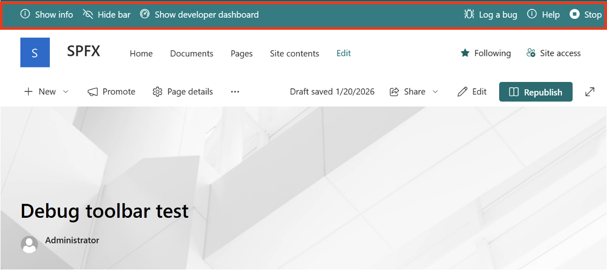
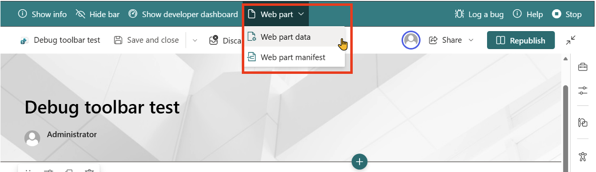
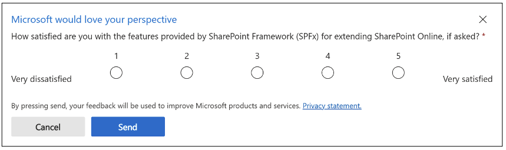

# SharePoint Framework Debug Toolbar

In this article, you'll learn about the debug toolbar available to SharePoint Framework (SPFx) developers when debugging SPFx solutions.

Developers have tested and debugged their SPFx solutions using the SharePoint workbench, either the [SharePoint-hosted workbench](debug-in-vscode.md#debug-solution-using-hosted-workbench) and/or the now-retired local workbench. However the workbench is limited in debugging and testing because it is not a *real* SharePoint page. The workbench is limited to testing web parts and Adaptive Card Extensions (ACE) and doesn't support testing SPFx extensions or other scenarios.

Another approach is to test and debug SPFx solutions on SharePoint site pages. This approach enables you to test your SPFx solutions on live pages and is the only way you can test some SPFx component types, including SPFx extensions.

To test SPFx solutions on a SharePoint site page, developers can add parameters to the URL (aka: querystring) to instruct SharePoint Online and the SharePoint Framework to load a manifest and component from the user's local machine. This uses the same process that the workbench uses. To learn more about debugging SPFx solutions in site pages, see [Debug SharePoint Framework solutions on modern SharePoint pages](debug-modern-pages.md).

## SharePoint Framework Debug Toolbar

To aid developers in the development and debugging of their SPFx solutions, SharePoint adds the Debug Toolbar to the page when these debugging parameters are added to the URL.

The Debug Toolbar has the following features:

- **Show info**:Use this feature to see information about the loaded manifest.
- **Hide bar**: You might want to see your SPFx solution without the Debug Toolbar visible. After clicking on "Hide bar" the Debug Toolbar will be hidden but you stay in debugging mode. To show the Debug Toolbar again simply reload the page.
- **Show developer dashboard**: Use this to toggle the developer dashboard on or off. To learn more about the developer dashboard, see [Use the developer dashboard](use-developer-dashboard.md).
- **Log a bug**: This open a new tab loading the sp-dev-docs GitHub issue list which can you use to log SPFx issues.
- **Help**: Opens a new tab loading the SPFx documentation.
- **Stop**: When debug scripts are enabled and allowed once on a page, they are allowed throughout the browser session. Use this to disable the debug scripts from loading without ending your browser session or manually deleting the session data. You'll need to reload the page again with the debug URL parameters to start a new debug session.

When the site page is in edit mode, the Debug Toolbar will add another menu item for working with web parts:

The **Web Part** menu enables developers to view the data for the currently selected web part, shown as JSON and HTML, and can be used as a reference to programmatically create pages with configured web parts.

It also shows the details in the manifest for the selected web part.

## SPFx Developer Feedback

When the debug toolbar is activated on the site page, you may be prompted for your feedback for extending and customizing SharePoint with the SPFx. This official survey, displayed as a popup, is entirely optional and can be used as a way for developers to provide Microsoft in-product feedback.

## See Also

- [Debug SharePoint Framework solutions on modern SharePoint pages](debug-modern-pages.md)
- [Use the developer dashboard](use-developer-dashboard.md)
