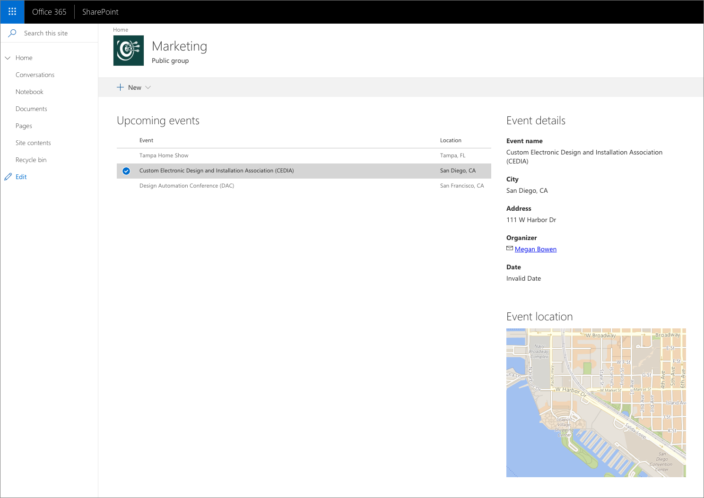
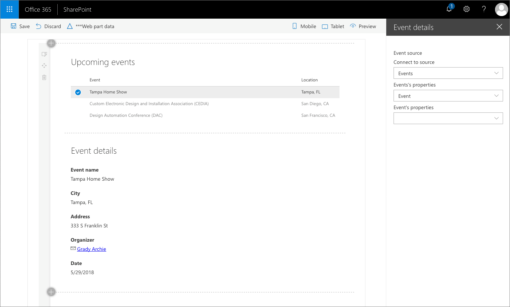
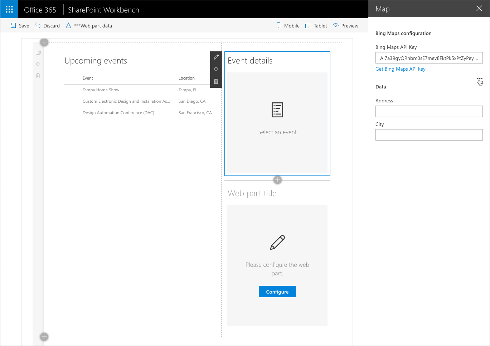

# Connect SharePoint Framework components using dynamic data

Using the dynamic data capability, you can connect SharePoint Framework client-side web parts and extensions to each other and exchange information between the components. This allows you to build rich experiences and compelling end-user solutions.



## Expose data using dynamic data source

Dynamic data in the SharePoint Framework is based on the source-notification model. Component designated as a dynamic data source, provides data and notifies about its changes. Other components on the page can subscribe to notifications issued by a dynamic data source. When handling notifications, dynamic data consumers can retrieve the current value of the dynamic data set exposed by the data source.

Every dynamic data source implements the `IDynamicDataCallables` interface. Following, is an example of a web part that displays a list of upcoming events. For each event, it includes some information such as its name, description and location. The events web part exposes information about the selected event to other components on the page in two ways: the complete event information and the location address.

```ts
import { IDynamicDataPropertyDefinition, IDynamicDataCallables } from '@microsoft/sp-dynamic-data';

export default class EventsWebPart extends BaseClientSideWebPart<IEventsWebPartProps> implements IDynamicDataCallables {
  /**
   * Currently selected event
   */
  private _selectedEvent: IEvent;

  /**
   * Event handler for selecting an event in the list
   */
  private _eventSelected = (event: IEvent): void => {
    // store the currently selected event in the class variable. Required
    // so that connected component will be able to retrieve its value
    this._selectedEvent = event;
    // notify subscribers that the selected event has changed
    this.context.dynamicDataSourceManager.notifyPropertyChanged('event');
    // notify subscribers that the selected location has changed
    this.context.dynamicDataSourceManager.notifyPropertyChanged('location');
  }

  protected onInit(): Promise<void> {
    // register this web part as dynamic data source
    this.context.dynamicDataSourceManager.initializeSource(this);

    return Promise.resolve();
  }

  /**
   * Return list of dynamic data properties that this dynamic data source
   * returns
   */
  public getPropertyDefinitions(): ReadonlyArray<IDynamicDataPropertyDefinition> {
    return [
      {
        id: 'event',
        title: 'Event'
      },
      {
        id: 'location',
        title: 'Location'
      }
    ];
  }

  /**
   * Return the current value of the specified dynamic data set
   * @param propertyId ID of the dynamic data set to retrieve the value for
   */
  public getPropertyValue(propertyId: string): IEvent | ILocation {
    switch (propertyId) {
      case 'event':
        return this._selectedEvent;
      case 'location':
        return this._selectedEvent ? { city: this._selectedEvent.city, address: this._selectedEvent.address } : undefined;
    }

    throw new Error('Bad property id');
  }

  public render(): void {
    const element: React.ReactElement<IEventsProps> = React.createElement(
      Events,
      {
        displayMode: this.displayMode,
        onEventSelected: this._eventSelected,
        title: this.properties.title,
        updateProperty: (value: string): void => {
          this.properties.title = value;
        },
        siteUrl: this.context.pageContext.web.serverRelativeUrl
      }
    );

    ReactDom.render(element, this.domElement);
  }

  // ... omitted for brevity
}
```

> [!IMPORTANT]
> The `IDynamicDataCallables` interface can be implemented by any class, not just web parts and extensions. If the dynamic data source requires complex logic, you should consider moving it into a separate class rather than implementing it directly inside a web part or extension.

The class implementing the `IDynamicDataCallables` interface must define two methods: `getPropertyDefinitions` and `getPropertyValue`. The `getPropertyDefinitions` method returns an array of types of data that the particular dynamic data source returns. In the previous example, the web part exposes detailed information about an event and its location. Even though the information comes from a single object (`_selectedEvent`), by exposing it in two different shapes, the web part is more reusable and could be used in combination with other web parts that aren't specific to events, such as a map web part that can show a map for the specified address. The list of the data types exposed by the data source is displayed to end-users when connecting web parts to the data source.

> [!IMPORTANT]
> The object returned by the `getPropertyValue` method should be flat, for example:
> ```json
> {
>    "date": "2018-06-01T11:21:59.446Z",
>    "name": "Tampa Home Show",
>    "organizerEmail": "Grady Archie",
>    "organizerName": "GradyA@contoso.onmicrosoft.com"
> }
> ```
>
> Object with a nested structure will be flattened during serialization, which could lead to undesired effects. For example, object like:
> ```json
> {
>    "date": "2018-06-01T11:21:59.446Z",
>    "name": "Tampa Home Show",
>    "organizer": {
>       "email": "Grady Archie",
>       "name": "GradyA@contoso.onmicrosoft.com"
>    }
> }
> ```
>
> would after serialization become:
> ```json
> {
>    "date": "2018-06-01T11:21:59.446Z",
>    "name": "Tampa Home Show",
>    "organizer.email": "Grady Archie",
>    "organizer.name": "GradyA@contoso.onmicrosoft.com"
> }
> ```

The `getPropertyValue` method returns the value for the particular type of data. The value of the `propertyId` argument corresponds to the `id` of the definition specified in the `getPropertyDefinitions` method.

To register a component as a dynamic data source, call the `this.context.dynamicDataSourceManager.initializeSource()` method, passing the instance of the dynamic data source as a parameter. In the previous example, the web part itself implements the `IDynamicDataCallables` interface, which is why the `initializeSource` method is called with `this` as its argument.

In the example code, the web part displays upcoming events in a list. Each time, the user selects an event from the list, the web part calls the `_eventSelected` method. In that method, the web part assigns the selected event to the `_selectedEvent` class variable and issues a notification that the information about the selected event and location has changed by calling the `this.context.dynamicDataSourceManager.notifyPropertyChanged()` method passing the `id` of the definition that represents the changed data set.

## Consume dynamic data in web parts

Web parts can consume data exposed by dynamic data sources present on the page. Following is the code of a web part showing on a map the location of the event selected in the events list web part showed previously.

```ts
import { DynamicProperty } from '@microsoft/sp-component-base';

/**
 * Map web part properties
 */
export interface IMapWebPartProps {
  /**
   * The address to display on the map
   */
  address: DynamicProperty<string>;
  /**
   * Bing maps API key to use with the Bing maps API
   */
  bingMapsApiKey: string;
  /**
   * The city where the address is located
   */
  city: DynamicProperty<string>;
  /**
   * Web part title
   */
  title: string;
}

/**
 * Map web part. Shows the map of the specified location. The location can be
 * specified either directly in the web part properties or via a dynamic data
 * source connection.
 */
export default class MapWebPart extends BaseClientSideWebPart<IMapWebPartProps> {
  /**
   * Event handler for clicking the Configure button on the Placeholder
   */
  private _onConfigure = (): void => {
    this.context.propertyPane.open();
  }

  public render(): void {
    // Get the location to show on the map. The location will be retrieved
    // either from the event selected in the connected data source or from the
    // address entered in web part properties
    const address: string | undefined = this.properties.address.tryGetValue();
    const city: string | undefined = this.properties.city.tryGetValue();
    const needsConfiguration: boolean = !this.properties.bingMapsApiKey || (!address && !this.properties.address.tryGetSource()) || 
    (!city && !this.properties.city.tryGetSource());

    const element: React.ReactElement<IMapProps> = React.createElement(
      Map,
      {
        needsConfiguration: needsConfiguration,
        httpClient: this.context.httpClient,
        bingMapsApiKey: this.properties.bingMapsApiKey,
        dynamicAddress: !!this.properties.address.tryGetSource(),
        address: `${address} ${city}`,
        onConfigure: this._onConfigure,
        width: this.domElement.clientWidth,
        height: this.domElement.clientHeight,
        title: this.properties.title,
        displayMode: this.displayMode,
        updateProperty: (value: string): void => {
          this.properties.title = value;
        }
      }
    );

    ReactDom.render(element, this.domElement);
  }

  protected get dataVersion(): Version {
    return Version.parse('1.0');
  }

  protected get propertiesMetadata(): IWebPartPropertiesMetadata {
    return {
      // Specify the web part properties data type to allow the address
      // information to be serialized by the SharePoint Framework.
      'address': {
        dynamicPropertyType: 'string'
      },
      'city': {
        dynamicPropertyType: 'string'
      }
    };
  }

  protected getPropertyPaneConfiguration(): IPropertyPaneConfiguration {
    return {
      pages: [
        {
          groups: [
            {
              groupName: strings.BingMapsGroupName,
              groupFields: [
                PropertyPaneTextField('bingMapsApiKey', {
                  label: strings.BingMapsApiKeyFieldLabel
                }),
                PropertyPaneLink('', {
                  href: 'https://www.bingmapsportal.com/',
                  text: strings.GetBingMapsApiKeyLinkText,
                  target: '_blank'
                })
              ]
            },
            // Web part properties group for specifying the information about
            // the address to show on the map.
            {
              // Primary group is used to provide the address to show on the map
              // in a text field in the web part properties
              primaryGroup: {
                groupName: strings.DataGroupName,
                groupFields: [
                  PropertyPaneTextField('address', {
                    label: strings.AddressFieldLabel
                  }),
                  PropertyPaneTextField('city', {
                    label: strings.CityFieldLabel
                  })
                ]
              },
              // Secondary group is used to retrieve the address from the
              // connected dynamic data source
              secondaryGroup: {
                groupName: strings.DataGroupName,
                groupFields: [
                  PropertyPaneDynamicFieldSet({
                    label: 'Address',
                    fields: [
                      PropertyPaneDynamicField('address', {
                        label: strings.AddressFieldLabel
                      }),
                      PropertyPaneDynamicField('city', {
                        label: strings.CityFieldLabel
                      })
                    ],
                    sharedConfiguration: {
                      depth: DynamicDataSharedDepth.Property
                    }
                  })
                ]
              },
              // Show the secondary group only if the web part has been
              // connected to a dynamic data source
              showSecondaryGroup: !!this.properties.address.tryGetSource()
            } as IPropertyPaneConditionalGroup
          ]
        }
      ]
    };
  }

  protected get disableReactivePropertyChanges(): boolean {
    // set property changes mode to reactive, so that the Bing Maps API is not
    // called on each keystroke when typing in the address to show on the map
    // in web part properties
    return true;
  }
}
```

SharePoint Framework offers standard UI for connecting web parts to dynamic data sources. This UI simplifies working with dynamic data by discovering available dynamic data sources and their properties and persisting the configured connection. To use this UI, a web part that consumes dynamic data must include a few specific building blocks.

### Define dynamic web part properties

Each web part property, for which the data can be retrieved from a dynamic data source, should be defined as `DynamicProperty<T>` where the `T` type denotes the type of data stored in the property, for example:

```ts
/**
 * Map web part properties
 */
export interface IMapWebPartProps {
  /**
   * The address to display on the map
   */
  address: DynamicProperty<string>;
  
  // ... omitted for brevity
}
```

In this example, the address is a string, but other types of data such as boolean, numbers or objects are supported as well. Web part properties defined as `DynamicProperty` can retrieve their data from dynamic data sources or values provided directly in the web part properties. Because the same web part property can be used for both dynamic data sources and static values configured in web part properties, you don't need to define multiple web part properties what simplifies building versatile web parts.

### Define the type of data stored in dynamic properties

For each dynamic property you have to specify the type of data it holds. This is necessary, so that the instance of the web part added to a page can be properly serialized. For each dynamic web part property, in the `propertiesMetadata` getter, specify the `dynamicPropertyType` value:

```ts
protected get propertiesMetadata(): IWebPartPropertiesMetadata {
  return {
    // Specify the web part properties data type to allow the address
    // information to be serialized by the SharePoint Framework.
    'address': {
      dynamicPropertyType: 'string'
    },
    'city': {
      dynamicPropertyType: 'string'
    }
  };
}
```

Possible values for the `dynamicPropertyType` property are: `boolean`, `number`, `string`, `array` and `object`.

### Use the standard UI for connecting web part to dynamic data sources

To allow users to connect web parts to dynamic data sources available on the page, SharePoint Framework provides a standard UI which can be accessed from the web part property pane.



> [!IMPORTANT]
> When using the standard UI to connect a web part to a dynamic data source, ensure, that the dynamic data source returns a value for the given dynamic property (in the previous example, there is an event selected in the list of events). If it doesn't, the UI will not be able to determine the type of data returned by the data source and setting up the connection will fail.

In its simplest form, the UI could be defined as follows:

```ts
protected getPropertyPaneConfiguration(): IPropertyPaneConfiguration {
  return {
    pages: [
      {
        groups: [
          {
            groupFields: [
              PropertyPaneDynamicFieldSet({
                label: 'Select event source',
                fields: [
                  PropertyPaneDynamicField('event', {
                    label: 'Event source'
                  })
                ]
              })
            ]
          }
        ]
      }
    ]
  };
}
```

For each set of dynamic properties, add a new group using the `PropertyPaneDynamicFieldSet` method. For each dynamic web part property, add a `PropertyPaneDynamicField`, which will allow users to select from which property, the web part property specified in the `PropertyPaneDynamicField` should retrieve its data.

If your dynamic data field set consists of multiple dynamic properties, you can specify how the connection data is shared using the `sharedConfiguration.depth`  property:

```ts
groupFields: [
  PropertyPaneDynamicFieldSet({
    label: 'Address',
    fields: [
      PropertyPaneDynamicField('address', {
        label: strings.AddressFieldLabel
      }),
      PropertyPaneDynamicField('city', {
        label: strings.CityFieldLabel
      })
    ],
    sharedConfiguration: {
      depth: DynamicDataSharedDepth.Property
    }
  })
]
```

In this example, all dynamic properties share the selected connection and property. This is useful in cases, where the selected property exposed by the data source is an object and you want to connect your dynamic properties to the different properties of the selected object. If you want to use the same data source, but connect each web part property to a different property exposed by the selected data source, you can use `DynamicDataSharedDepth.Source` instead. Finally, if you want each property to retrieve its data from a different data source, you can set the `sharedConfiguration.depth` property to `DynamicDataSharedDepth.None`.

### Allow users to choose if they want to use dynamic data or specify the value themselves

When building web parts, you can allow users to connect web parts to other components on the page, or specify values of web part properties themselves. This requires very little additional effort and allows you to build web parts that are more versatile and suitable for a broader range of use cases.

To allow users to be able to choose if they want to load data from a dynamic property or enter the value themselves in the web part properties, you can define the web part properties group as a `IPropertyPaneConditionalGroup` group.

```ts
protected getPropertyPaneConfiguration(): IPropertyPaneConfiguration {
  return {
    pages: [
      {
        groups: [
          // Web part properties group for specifying the information about
          // the address to show on the map.
          {
            // Primary group is used to provide the address to show on the map
            // in a text field in the web part properties
            primaryGroup: {
              groupName: strings.DataGroupName,
              groupFields: [
                PropertyPaneTextField('address', {
                  label: strings.AddressFieldLabel
                }),
                PropertyPaneTextField('city', {
                  label: strings.CityFieldLabel
                })
              ]
            },
            // Secondary group is used to retrieve the address from the
            // connected dynamic data source
            secondaryGroup: {
              groupName: strings.DataGroupName,
              groupFields: [
                PropertyPaneDynamicFieldSet({
                  label: 'Address',
                  fields: [
                    PropertyPaneDynamicField('address', {
                      label: strings.AddressFieldLabel
                    }),
                    PropertyPaneDynamicField('city', {
                      label: strings.CityFieldLabel
                    })
                  ],
                  sharedConfiguration: {
                    depth: DynamicDataSharedDepth.Property
                  }
                })
              ]
            },
            // Show the secondary group only if the web part has been
            // connected to a dynamic data source
            showSecondaryGroup: !!this.properties.address.tryGetSource()
          } as IPropertyPaneConditionalGroup
        ]
      }
    ]
  };
}
```

A conditional web part property pane group consists of a **primary** and a **secondary** group. Using the `showSecondaryGroup` property, you can specify when the secondary group should be visible and the primary group should be hidden. In the example above, the secondary group, which is used for connecting the web part to a dynamic data source, will be visible when the user selected to connect the web part to a dynamic data source by clicking the ellipsis (...).



## Considerations

- each page can have multiple dynamic data sources and consumers
- each component can both provide dynamic data to other components and consume dynamic data from other components
- components can consume data from multiple dynamic data sources
- SharePoint Framework offers standard UI for connecting web parts to data sources and automatically persists connection information

## See also

- [Dynamic Data sample code](https://github.com/SharePoint/sp-dev-fx-webparts/tree/master/samples/react-events-dynamicdata)
