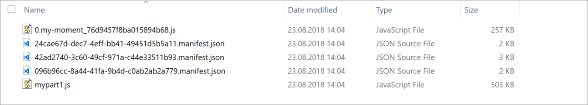

# Dynamic loading of packages in SharePoint Framework

When building SharePoint Framework components it is common to reference third party libraries such as [Office UI Fabric React](https://www.npmjs.com/package/office-ui-fabric-react) for layout controls or [moment](https://www.npmjs.com/package/moment) for time handling. Each of these libraries will add to the byte size of the bundled JavaScript file for the component. As an example, moment adds ~250KB, a considerable amount.

> [!NOTE]
> A _bundle_ is one or more JavaScript fragments and style sheets, put into the same `.js` file. When you package an SPFx solution, all your code is usually bundled into one `.js` file. Splitting a bundle, is the operation of generating multiple `.js` files instead of one, so that they can be loaded individually.*

Depending on the component, these third party libraries may or may not be used in all parts of the components lifecycle. Maybe they are only used in edit mode or in the property pane, or maybe they are needed once a user clicks a link or button in the component.

If the SPFx component is more like a single page application (SPA), optimizing the size might not be important, but if it's a web part added to a page or even used multiple times on a page, like a search web part, then reducing the amount of script loaded and the amount of script being executed on a page matters for load time of the page. Especially for mobile devices.

To improve on the speed a SPFx component takes to load on a page it is possible to take advantage of splitting the bundle into multiple JavaScript parts, and dynamically load these individually bundled packages as needed.

## Splitting up multiple web parts to be loaded individually

In an SPFx project with multiple web parts or extensions a typical structure in the `config/config.json` file might look like this.

```json
{
    "$schema": "https://developer.microsoft.com/json-schemas/spfx-build/config.2.0.schema.json",
    "version": "2.0",
    "bundles": {
        "my-spfx": {
            "components": [
                {
                    "entrypoint": "./lib/webparts/part1/part1.js",
                    "manifest": "./src/webparts/part1/part1.manifest.json"
                },
                {
                    "entrypoint": "./lib/webparts/part2/part2.js",
                    "manifest": "./src/webparts/part2/part2.manifest.json"
                }
            ]
        }
    },
    "externals": {},
    "localizedResources": {}
}
```

In the above configuration both web parts are included in the same JavaScript file or bundle. This means that if a user adds one of the web parts to a page, both are actually loaded. For scenarios where the web parts almost always coincide on the same page, this is fine, as it reduced load time. If however the web parts are used separately, then it is better to have them split into two files to reduce what is loaded on the page.

This can be achieved by changing `config/config.json` so that each web part is bundled as a separate JavaScript file. 

```json
{
    "$schema": "https://developer.microsoft.com/json-schemas/spfx-build/config.2.0.schema.json",
    "version": "2.0",
    "bundles": {
        "my-spfx-1": {
            "components": [
                {
                    "entrypoint": "./lib/webparts/part1/part1.js",
                    "manifest": "./src/webparts/part1/part1.manifest.json"
                }
            ]
        },
        "my-spfx-2": {
            "components": [
                {
                    "entrypoint": "./lib/webparts/part2/part2.js",
                    "manifest": "./src/webparts/part2/part2.manifest.json"
                }
            ]
        }
    },
    "externals": {},
    "localizedResources": {}
}
```

## Analyzing your bundle

In order to get an overview of where to start optimize, see the article [Optimize SharePoint Framework builds for production](https://github.com/SharePoint/sp-dev-docs/blob/master/docs/spfx/toolchain/optimize-builds-for-production.md) which illustrates how you can get a visual map of which part of your code or third party library takes up space in your bundle.

## Loading third party components dynamically

When a SharePoint Framework project is packaged up it, it is using webpack behind the scenes to create the bundle(s). One of the features of webpack is the ability to dynamically import parts of an application. Taking advantage of this in SharePoint Framework requires only a small refactoring.

**Normal import**

In the code below the moment library will be included into the packages JavaScript file, always being loaded even though the `GetTime` function is never used.

```typescript
// Import moment as a dependency
import * as moment from moment
.
.
export default class MyClass {
    public GetTime(dateString:string){
		return moment(dateString).format("LL");
    }
}
```

**Dynamic import**

However, in the code below the moment library is loaded asynchronous when the `GetTime` function is called, thus reducing the initial load and execution time.

```typescript
export default class MyClass {
    public async GetTime(dateString:string){
         const moment = await import(
                /* webpackChunkName: 'my-moment' */
                'moment'
            );
		return moment(dateString).format("LL");
    }
}
```

*Note: If your `config/tsconfig.json` file has `"module": "commonjs"` and not `"module": "esnext"` you need the following work-around in order for the dynamic library to be split out of the bundle.*

```typescript
declare var System: any;

export default class MyClass {
    public async GetTime(dateString:string){
         const moment = await System.import(
                /* webpackChunkName: 'my-moment' */
                'moment'
            );
		return moment(dateString).format("LL");
    }
}
```

### Verify code splitting and dynamic import

To verify that dynamic import is happening, open up the `dist` folder after a build and look for the dynamically loaded part as a separate JavaScript file. In the below image the moment library is split out. Also look at the webpack analyzer output referenced above, which will show that your code is split into multiple bundles/chunks.



Not every single file or library has to be dynamically imported. Instead choose an abstraction where everything needed for a certain scenario or capability is bundled together.

For example create a file `MyStuff.ts` which references a number of libraries, and then dynamically load `MyStuff`. In this case, `third-party` and `left-party` will be bundled into `my-stuff.js`.

```typescript
// MyStuff.ts

import { Something } from 'third-party;'
import * as Foo from 'left-party';

// Other file
await import(
    /* webpackChunkName: 'my-stuff' */
    './MyStuff'
);
```

## Special property pane dynamic loading

In your main web part file create a function named `loadPropertyPaneResources.` This function will execute before the property pane of a web part is shown. This allows dynamic loading of resources needed for the property pane only.

* Create a  new file (for example, HelloWorldWebPartPropertyPaneStuff.ts)
* Move all property pane related code to that file
* Create the following method in the main web part class

```typescript
  protected loadPropertyPaneResources(): Promise<void> {
    return import(
      /* webpackChunkName: 'HelloWorldWebPartPropertyPaneStuff' */
      './HelloWorldWebPartPropertyPaneStuff'
    ).then(component => {
      this._propertyPaneHelper = new component.HelloWorldWebPartPropertyPaneStuff(this);
    });
  }
```

- Rebuild

## Summary

When building SPFx solutions consisting of several web parts or extensions, or if building  an SPFx web part with a lot of code and which uses third party libraries, consider analyzing the resulting bundle size, and use the strategies defined above to split the code into multiple smaller bundles, where each one is loaded only when needed - thus reducing the time it takes for an end-user to load and execute a modern page.
