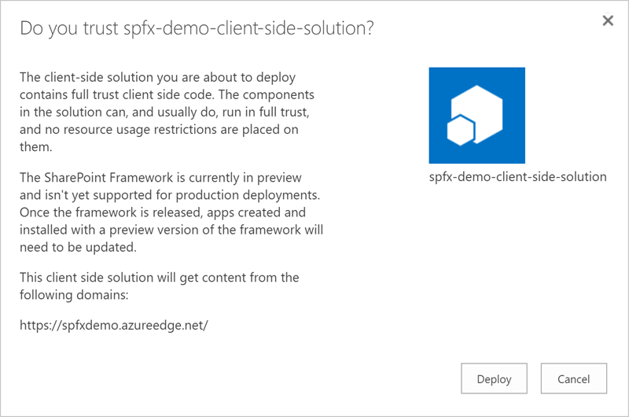

# SharePoint Framework (SPFx) enterprise guidance

The SharePoint Framework (or SPFx) is a new development model for SharePoint user interface extensibility.  It is used by first and third parties, complementing already existing user interface models such as the SharePoint Add-in model. The SharePoint Framework allows for a structured and supported approach to enrich and extend the user interface of SharePoint, by using client-side frameworks with initial support for client-side web parts. Based on modern web technology standards, it offers a unique set of features to make SharePoint customizations more broadly available for developers and enterprises, but at the same time aligns with previous models and patterns in SharePoint. In this document, we provide administrators with the background, benefits, and knowledge they need to successfully manage SharePoint Framework-based components within their SharePoint environments.

## Background

SharePoint has been used as an application and/or development platform for a long time and offered numerous sets of development and customization options ranging from full trust code executing on the SharePoint servers, to sandboxed solutions, to add-ins, to interface customizations achieved by using out-of-the box features or JavaScript/CSS embedding. 

Within multi-tenant SharePoint Online, full trust code has never been supported, and the sandboxed code service has been deprecated. The most common patterns for customizations of SharePoint Online have been either through add-ins, remote-code execution (code executing elsewhere, such as in Azure) through the standard APIs, and JavaScript embedding. Although JavaScript embedding has been a very powerful way of extending SharePoint, it has also proven difficult to keep up with the evergreen model of SharePoint Online. The SharePoint Framework aims to solve these issues by providing a standardized framework on how to create custom user interface extensions as well as building applications on top of SharePoint Online in a supported and future prepared way.

The SharePoint Framework will initially focus on extending the SharePoint user interface by using *client-side web parts*. The client-side web parts uses the well-known paradigm of web parts, which has been one of the success factors of SharePoint over the years, that can be added to pages and independently customized by the end users. These client-side web parts work on the new modern pages as well as in classic pages and even in the SharePoint mobile app.

This new model is built from the ground-up by using a modern web stack that uses TypeScript/JavaScript, HTML, and CSS, and all parts of the generated artifacts are executed in the end-user's browser. The SharePoint Framework also comes with a completely new set of tooling. This new tooling is platform-agnostic and works on PC and Mac and is based on open source technologies such as [Node.js](https://nodejs.org/), [Gulp](http://gulpjs.com/), [Webpack](http://webpack.github.io/), and [Yeoman](http://yeoman.io/). These frameworks and tools are used at build time to streamline the developer experience for building, packaging, and deploying; they are not required for the actual execution of the SharePoint Framework code.

## Current status of SharePoint Framework

The SharePoint Framework reached the [General Available (GA) milestone](https://blogs.office.com/2017/02/23/sharepoint-framework-reaches-general-availability-build-and-deploy-engaging-web-parts-today/), with version 1.0.0, in February 2017.

## From a developer's point of view

SharePoint developers, new and seasoned, all have something to gain from the SharePoint Framework. While the current release is focused on the user interface extensibility story, it allows the developer to, in a safe and structured way, extend the user interface capabilities of SharePoint by using, initially, client-side web parts. These web parts are executed client-side and can work with data in SharePoint, in Office 365 via the [Microsoft Graph](http://graph.microsoft.io), or even by using your own custom Web APIs that use standard OAuth and REST methods.

A seasoned SharePoint developer will be familiar with the concepts, such as web parts and the SharePoint data model. However, the tooling for building, packaging and deploying client-side web parts will be new. Developers need to gain skills in specifically [TypeScript](http://www.typescriptlang.org/), which is the primary language for developing SharePoint Framework artifacts. TypeScript adds several benefits on top of JavaScript, important for enterprise development, such as strongly typed objects, object inheritance, classes and interfaces, concepts which all should be familiar to current .NET, Java, and C/C++ developers. From a building and packaging point of view, developers no longer have Visual Studio as the only option to write SharePoint solutions; thanks to using open source technologies and projects such as node.js, [npm](https://www.npmjs.com/), and Gulp, SharePoint Framework development can be done on any platform with the developers preferred code editor or IDE, for example Visual Studio Code, Sublime, or even Notepad.

For developers that have never built SharePoint solutions previously, but are familiar with modern web technologies, the threshold is not that high, and many developers have already moved to the client-side of development, or a combination of it. Client-side development can provide a better, more dynamic and more responsive experience for users and even an easier experience for developers. Thanks to the freedom of the code editor, the use of well-known and popular open source frameworks and technologies, many developers that might not have worked within the Microsoft ecosystem can easily get up to speed on building SharePoint extensions.

One of the most common patterns in SharePoint Online extensibility has been the usage of JavaScript embedding (also known as JavaScript injection). This is a method where you use, for example, the Script Editor web part to insert arbitrary JavaScript on the page, and then use web browser DOM (Document Object Model) manipulation to inject HTML, CSS, and JavaScript to build a solution or application. This method has a lot of disadvantages, and in many cases, even prohibited customers from taking advantage of the new features in SharePoint Online, due to its hard dependencies on how SharePoint built up the HTML and CSS structure. The SharePoint Framework allows a better way, although not yet a complete replacement, for these JavaScript embed customizations. The SharePoint Framework, as said, uses TypeScript, which allows for a fairly easy transition of the JavaScript embeds to something standardized and future proof. The OfficeDev PnP initiative also has example projects and guidelines on how to make this transition.

## In perspective: SharePoint Framework in the broader SharePoint platform

The SharePoint Framework is a new model, an addition to already existing methods, but focused on leveraging more value to user interface customizations such as client-side web parts. This framework is designed to work in conjunction with already existing working models and makes it easier to create new user interface customizations in a more supported and sustainable way.

### Compared with add-ins

SharePoint Add-ins, previously known as SharePoint Apps and introduced in SharePoint 2013, have been one of the only available options of adding customizations to SharePoint Online in a supported and governed way. However, SharePoint Add-ins require a lot more infrastructure than necessary in many cases where a simple user interface customization is needed. 

SharePoint Add-ins come in two flavors: SharePoint-hosted and provider-hosted. SharePoint-hosted add-ins have been one of the ways of executing client-side code in SharePoint in a supported way, but as said require a lot more effort than necessary to just include a simple client-side (JavaScript) web part. In many cases SharePoint-hosted add-ins were built just to deploy artifacts, such as lists and web parts, onto a SharePoint site. These add-ins live in a "special" site called the App Web, which is a site with limited features. 

Provider-hosted add-ins, on the other hand, are add-ins that are executed remotely from SharePoint (Online) and can leverage server-side code as well as client-side code. This has a benefit for ISVs that want to protect their intellectual property/code/logic and for scenarios that can't be executed client-side by using JavaScript, such as long-running, calculation-heavy operations or access to remote data that cannot be achieved by using client-side scripting. 

The primary advantage of add-ins is isolation: because the actual code is not executed in the SharePoint site browser, cross-site scripting protections prevent the add-in from getting the same access as the user has. Add-ins are limited to the permissions that the add-in was granted at install time. This makes add-ins a safer option for scenarios where an admin acquires an add-in from a third party, and it also allows Microsoft to have a Store from where you can download add-ins.

The SharePoint Framework works side-by-side with both SharePoint-hosted and provider-hosted add-ins, but can also be used as an alternative in scenarios where only client-side scripting is required. For example, add-ins can add app parts to the site where they are hosted. These app parts are similar to web parts, but instead of running in the context of the page, they run in their own domain (App Web or provider-hosted web) within an Iframe on the page. This prevents the add-in from gaining the user context from the rest of the page. 

The SharePoint Framework, on the other hand, does not run in an Iframe. Thanks to this, it can more seamlessly run in the context of the page with the full power of the user viewing the part. This is the key to enabling it to run with rich functionality, but at the same time this means that it does not have the same level of security controls as add-ins. SharePoint Framework solutions are due to this also being referred to as *full trust client-side solutions*. Iframes suffer from the problem that they are not responsive, which results in the rendered webpage not being as fluent on a mobile phone or alternate screen size.

The SharePoint Framework solutions do not, at the time of writing, have a store where you can download and install solutions, due to the security aspect mentioned earlier. On the other hand, in many scenarios, using the user's context is a wanted scenario where SharePoint Framework could be used instead.

### JavaScript embeddings

One of the more popular approaches used by developers has been to use a method called JavaScript embeddings (also known as JavaScript injections). That means that arbitrary JavaScript has been inserted to the sites and pages by using, for example, Custom Actions, master pages, or page layouts, and even Script Editor web parts. This method has proven simpler than creating SharePoint-hosted add-ins, and allows the script code to run in the full context of the users, and therefore gained a lot of popularity. The downside with this approach is that many of these embeddings relied on DOM manipulation and required developers' skills to do and maintain. 

Due to the evergreen nature of SharePoint Online, these solutions built by using JavaScript embeddings could potentially break whenever SharePoint Online was updated, because the developers might have taken dependencies (even accidentally) on how the SharePoint pages are structured or styled. When updates are done in SharePoint, even minor and subtle, it can have huge impacts on these solutions and cause the embedded JavaScript to break completely.

Now with the SharePoint Framework, there is a Microsoft standardized and supported way to achieve many of these solutions previously built by using JavaScript embeddings.

### Script Editor web parts

The most common way of inserting arbitrary HTML, JavaScript, or CSS customizations in SharePoint is to use the Script Editor web part or the Content Editor web part. Script Editor web parts have gained popularity due to how easy it is to add custom scripts to any page. Any editor of a site can add a Script Editor web part to a page, copy and paste JavaScript into it, and have that JavaScript perform the necessary customizations. Just as with JavaScript embeddings, it can be a challenging task for administrators to have control of Script Editor web parts.

The SharePoint Framework can in many cases be a direct replacement for these Script Editor web part configurations.

### Control of scripting capabilities in SharePoint Online

SharePoint Online allows the admins to control the ability to add custom scripts to sites and pages to increase the security and integrity of the tenant. This is done by using the "Custom Script" feature in the SharePoint Online admin site, or individually per site by using PowerShell. Custom scripts can be disabled on all sites or just on personal sites. By default, new tenants have scripting disabled on personal sites, all self-service created sites, as well as the root site collection of the tenant. When custom scripts are disabled, editors of sites are not allowed to add web parts such as the Script Editor web part. However, SharePoint Framework solutions are allowed because they are considered safe after being approved by an administrator in the app catalog.

## Differences in how SharePoint Framework solutions are created, and why it matters

The SharePoint Framework uses a new paradigm to SharePoint developers in how to design, build and deploy SharePoint customizations, by leveraging a modern web stack approach and focusing on client-side/browser based customizations.
This marks an important change in how SharePoint development is being treated. 

By using technologies and frameworks such as TypeScript, Node.js, Yeoman, Gulp and more, the SharePoint Framework hopefully will attract developer audiences that traditionally have not been in the SharePoint, or even Microsoft, eco-system, while at the same time, open the doors for existing SharePoint developers to build SharePoint customizations by using a more modern and standardized approach.

### Creating solutions

Because of the need for very specific and targeted tools provided via Visual Studio, SharePoint development was typically solely done via Visual Studio on a Windows machine with an instance of SharePoint installed and running, which severely limited the hardware and user preferences, and increased development costs. The SharePoint Framework, on the other hand, uses various common open source web tools available for many different platforms, like MacOS and Linux, to allow for more flexibility in development.

SharePoint Framework solutions are created by using a tool called [Yeoman](http://yeoman.io/) along with a specific SharePoint Framework generator, which is based on Node.js. Yeoman is a project scaffolding tool that will create your project and generate the required artifacts, install the needed Node.js packages, and configure the build system. After the project is generated, it can be edited in any editor on any operating system: Visual Studio, Visual Studio Code, Sublime, or Atom for example. This allows for a wider usage preference and style, in and between teams. The Yeoman generator can be run multiple times on the same project to add additional artifacts, such as client-side web parts.

### Developing and building solutions

The build system is based on [Gulp](http://gulpjs.com/), which is a task runner that builds, packages, and optionally deploys the SharePoint Framework artifacts. Like Yeoman, Gulp is also based on Node.js and allows developers to build and deploy on any operating system. 

One new part of the build toolset for SharePoint Framework is called the *Workbench*. The Workbench is a tool where the developer can host and test their SharePoint Framework solution. The Workbench is reactive and will automatically reload your artifacts when the developer saves a file so that developers can see and test the solution quickly.

There are two versions of the Workbench, one outside of SharePoint, hosted locally on the development machine that runs offline without SharePoint access and SharePoint data. This allows the team and designers to build and design solutions with mock or fake data to focus on the user interface. The second version is hosted inside SharePoint and is used when you need to test and verify the SharePoint Framework solution by using real SharePoint data and context.

### Deploying SharePoint Framework solutions

Deploying SharePoint Framework solutions is done in two steps: the first one being deploying the script artifacts packaged by the build process to a CDN (Content Delivery Network) location. The second step is to add the solution package to the app catalog and approve it for usage in your tenant. The package added to the SharePoint app catalog contains a pointer to the CDN location.

Developers of the SharePoint Framework solution can choose to use any CDN service, such as Azure Storage, Azure CDN, or even SharePoint itself, preferably  by using the SharePoint CDN features (see later in this document). Using a public CDN, where the assets deployed to the CDN are publicly available on the Internet, allows for usage of the SharePoint Framework solution to be used by many tenants. In a SharePoint CDN-deployed SharePoint Framework solution, the deployed scripts and resources are only available for the tenant it is deployed into.

By default, there is a built-in task in the build tools to deploy the packaged solution to Azure Blob storage. This is something that is typically extended, by SIs or ISVs, to support custom CDN locations or configurations.

After changing the code and building the solution, the SharePoint Framework toolchain produces a new solution package (.sppkg) and a set of script files. These script files include a unique hash in their file name, which indicates that the contents of these files differ from their previously deployed versions. To use a new version of the solution, you must deploy the new set of scripts to your CDN and update the solution package in the app catalog. While theoretically you could replace the contents of the existing script files and avoid upgrading the solution package, it's unreliable and not recommended. Depending on the configuration of your CDN, it could be that the previously downloaded script files are cached for a long time on the client computers, complicating the rollout of the solution to end-users.

The location of the CDN is important. The location where the SharePoint Framework assets are hosted must have high availability, so trusted CDN providers such as Azure, Akamai, or similar, and SharePoint itself, are recommended. From a security standpoint, it is important to know what CDNs are in use by the SharePoint Framework solutions deployed. A broken CDN can also break the SharePoint Framework solutions, and in the worst case scenario, a compromised CDN might lead to the data in the SharePoint (Online) tenant also being compromised.

When approving third-party SharePoint Framework solutions, a typical checklist item is to check the authority and trust of the CDN location and any third parties that might host them. This is because after the application is installed and used within SharePoint site collections, these site collections have a dependency on the CDN location. As of this writing, there is no easy way to control that end-point. The third-party provider of the CDN can update with both wanted and unwanted changes without the users' knowledge, opening an attack surface, given that the SharePoint Framework is running under the users' context and can do whatever the users can do.

A recommendation is for IT administrators to keep track of what CDNs are used and what CDNs are approved by the organization, which should also be communicated to the enterprise developers.

### Office 365 Public CDN

The [Office 365 Public CDN](https://dev.office.com/blogs/general-availability-of-office-365-cdn) is a new capability in Office 365 and SharePoint Online that allows administrators to automatically host static assets such as JavaScript files, images, and CSS styles in a CDN to provide better performance. The Office 365 Public CDN is a geo-distributed caching feature that keeps static assets as close to the end-users' browsers requesting them.

Administrators can enable the Office 365 Public CDN capability on one or more designated document libraries, which will serve as the origin for the static assets. Administration of the libraries and the CDN are done by using the SharePoint Online PowerShell cmdlets. The assets in the document library will be replicated to the Office 365 CDN and be accessible through the Office 365 Public CDN URLs generated and associated with the document library. Any updates to the assets will be reflected on the CDN end-points within 15 minutes. Note that any assets within the document libraries will be available for anonymous users, through the CDN end-point.

## SharePoint Framework in the enterprise

SharePoint is and has been one of the most successful enterprise collaboration platforms, and one of the reasons for its success has been the possibility to extend SharePoint and consider it as a platform for applications and integrations. The SharePoint Framework will further expand this success by making SharePoint a more modern platform on which to build client-side customizations in a supported and standardized way.

### Enterprise developers

The SharePoint Framework allows **Enterprise developers**, typically developers that create applications for use within an organization, to extend SharePoint (Online) with new functionality in a structured and supported way. The SharePoint Framework offers everything from the development framework and build pipeline to the actual deployment, and allows the developers in a short time to reach out to all site collections with new solutions and features, all controlled by the app catalog. In an enterprise scenario, you also have full control of the CDN locations, external or internal in SharePoint, and you can very easily deploy fixes and updates to your whole organization.

Within your enterprise, administrators and developers jointly should create a *blue print* for how SharePoint Framework solutions should be deployed. The blue print should contain details on preferred client-side frameworks, CDN locations, etc. For more details, see the section later on *Building a plan around SharePoint Framework customizations*.

### Citizen developers

Citizen developers have for a long time used SharePoint to build business applications by using many methods and techniques.
SharePoint Framework will for certain scenarios, specifically JavaScript embeddings and Script Editor web part solutions, be one good way forward. This to make these solutions more standardized and maintainable over time. For citizen developers, there might be a little bit of a learning curve to adjust to this new structured way of building solutions, but will in the long run prove to be more stable, secure, and maintainable.

Given that the above mentioned *Custom Script* control methods are in place, the citizen developers will not be allowed to add arbitrary JavaScript code or Script Editor web parts. This can potentially make your SharePoint environment more stable and maintainable, but at the same time you might prohibit innovation in your company, so you should make sure that your citizen developers align with your enterprise developers on using SharePoint Framework going forward.

### User experience designers and front-end developers

For web developers or user experience/interface designers, the SharePoint Framework will be very valuable. The Workbench allows front-end developers to work with a SharePoint Framework solution on any operating system and by using their preferred editing tools without SharePoint, given that they use mock data, and focus on the user experience. 

The SharePoint Framework is released in parallel with [Office UI Fabric](https://developer.microsoft.com/en-us/fabric), which is the official front-end development framework for Office and Office 365, and allows the user experience designers to create a seamless experience across Office, Office 365, and the custom-built solutions.

### System Integrators (SI)

If you leverage System Integrators (SI) or consultancies to build your SharePoint and Office 365 solutions, you should place recommendations, or even requirements, on how they should build SharePoint Framework solutions so that they are aligned with your enterprise plan for the SharePoint Framework. 

Typically, System Integrators have a preferred way of building their solutions, which might not always be aligned with your governance, so this discussion with the System Integrators is important and will in the end make it easier for all parties.
A typical scenario with System Integrators is that they build the solution for your company, and after the project is complete, it is up to you to maintain, upgrade, and update the solution, which only emphasizes that you need to align with the SI on how the SharePoint Framework solutions are built and hosted.

### Independent software vendors (ISV)

Independent software vendors (ISV) are organizations building third-party solutions for the mass market, and they might not always fulfill your plan on SharePoint Framework solutions. Also, ISVs typically own their own code and intellectual property, which makes it very hard for you to change the way they implement and host their solutions. 

In the case of using SharePoint Framework solutions from third-party providers, you need to specifically consider how they manage updates and how their solutions are hosted. For example: Do you allow the solution to be updated without your knowledge? Do you allow the static assets to be hosted on the ISV's CDN without your control? What is your trust relationship with this ISV? 

Remember that any client-side code in SharePoint Framework executes under the current users' context, and there is no possibility for you to put constraints on that, which you can do with SharePoint Add-ins.

## Building a plan around SharePoint Framework customizations

When introducing SharePoint Framework as one of the tools to extend your SharePoint (Online) instances, you need to plan for it. The plan should start with introducing the new technology stack used when building SharePoint Framework solutions. Developers may need training on using TypeScript as the primary language for writing the SharePoint Framework code. 

Another facet of the SharePoint Framework developers may need to learn is the actual toolchain for SharePoint Framework, including node.js, npm, and Gulp, and how you use the different Gulp tasks to build, package, and deploy solutions. A very good starting resource for this is the [official SharePoint Framework documentation](./sharepoint-framework-overview.md) or the [SharePoint Github repositories](https://github.com/SharePoint/).

Developers might want to standardize on one specific client-side framework for the organization or on different frameworks. Client-side frameworks include, but are not limited to, React, Knockout, Angular, Handlebars, jQuery etc. There are advantages on standardizing on one framework, since that enables developers to build more reusable code and have better consistency in how they build and maintain their solutions. 

On the other hand, there are advantages of allowing more than one framework since each client-side framework has its pros and cons and use cases. But allowing any client-side framework may cause fragmentation in your enterprise solutions, not to mention having multiple different frameworks might add to the page load time, since many frameworks require loading of more external libraries.

Out-of-the-box, the SharePoint Framework Yeoman generator has templates for two client-side frameworks: React and Knockout. Over time, one can expect that the community adds more generators or sub-generators to use other client-side frameworks. Choosing React as your preferred client-side framework has an advantage because Microsoft has created a React version of the Office UI Fabric, so you will get the Office and Office 365 look and feel of your customization if that is something your organization prefers.

The fourth thing to plan for is how and where you deploy your solution artifacts, that is in what CDN are your generated script bundles and assets stored. Out-of-the-box, in the Gulp tasks included in the toolchain, only Azure Blob storage and Azure CDN is supported. This might be a very good option if you can manage an Azure subscription and share your assets between multiple tenants. Another very common scenario is to use SharePoint Online, and its CDN feature, as a host for the artifacts. Starting from the SharePoint Framework v1.4, static assets are by default packaged inside of the SharePoint Framework package. When this package is deployed in the app catalog, they are automatically hosted either from Office 365 CDN (if enabled) or from an app catalog URL.

Finally, developers will need to think about application life cycle management (ALM): the way you manage source code and versioning, automatic build, testing, and deployment etc. Most common source code versioning systems can be used such as Git, GitHub, or Visual Studio Team Systems. 

For continuous integration, there are no default tools, and you can use your tool of preference that supports node.js, such as Visual Studio Team Systems, Travis CI, or Jenkins. Using these tools, you can automate the build and testing process and in the case of a successful and approved build, you can even automatically deploy the artifacts to the CDN location, and in such a way automate everything from the developer checking in the code to deployment to production.

## Management capabilities of SharePoint Framework solutions

All SharePoint Framework solutions deployed into a tenant must be approved by a tenant administrator. This is done by uploading the SharePoint Framework package, the `.sppkg` file into the *Apps for SharePoint* library. When a new solution is added to the library, the administrator gets a dialog that asks for a consent to approve the solution for use in the tenancy. The dialog explains that this is a *full trust client-side code* solution without any resource restrictions and that it executes under users' context. The dialog also shows from what domain it will primarily get content, that is the CDN location of the SharePoint Framework scripts. Note that any SharePoint Framework application can load data from other locations, after the initial load from the CDN. Once approved, the SharePoint Framework solution can be enabled on any site collection.

An administrator of the app catalog can at any time remove the package from the app catalog by removing the solution package from the *Apps for SharePoint* library. This will prohibit the solution to be used in all site collections. The solution can also be disabled by modifying the *Enabled* property of the uploaded package. This will immediately disable the solution in all site collections; existing pages that use client-side web parts will not render the web part, and the app will not be available on the site collections or available to add on existing site collections. When removing a SharePoint Framework solution, it will not remove any data or information created by the actual client-side solution either in SharePoint or in any external data source used by the solution.

The administrator can also modify other properties on the package in the app catalog to enhance the *visibility* of the solution in the site collections; for example, the icon, category, description, and the featured status can be changed.

If there is a need to update the solution package, which is required if new SharePoint Framework artifacts or other package level changes are made, the administrator only needs to upload a new version of the package to the library.

A tenant admin can also monitor the SharePoint Framework solutions, just as with SharePoint Add-ins. In the SharePoint Admin center under *apps*, the SharePoint admin can add the SharePoint Framework solutions and then see how many installed locations there are of a specific solution, for both SharePoint Add-ins as well as SharePoint Framework solutions.

To enable a SharePoint Framework solution on a site collection, the site collection administrator must add it to the site collection. This is done in the same way as for SharePoint Add-ins, by selecting to *Add a new app* on the site collection, and then choosing the solution from the list of apps. Once the app is added, it is available for use in the site collection. The site collection administrator can also remove the SharePoint Framework from the site collection. This is done by going into *Site Contents* and then choosing *Remove* on the app.

### SharePoint Framework deployment scopes

When building SharePoint Framework solutions, developers can choose whether their solution supports tenant-wide deployment or if it must be deployed on each site separately. The latter is required when the solution needs to provision additional resources, such as lists, after being deployed to a site.

While the developers building the solution decide if the solution supports tenant-wide deployment or not, it's the administrators who make the final decision on how the solution is deployed. Even if a solution could be deployed to all sites in the tenant, administrators can choose to deploy it only to the specific sites. If the solution doesn't support tenant-wide deployment, administrators can deploy it only to specific sites.

> [!IMPORTANT] 
> Tenant-wide deployment is available only in SharePoint Online. In SharePoint hosted on-premises, SharePoint Framework solutions can be deployed only to specific sites.

The SharePoint Framework does not have a store, which SharePoint Add-ins have. For this reason, any deployments always must be initiated by the tenant admin by adding and approving a solution package to the app catalog.

### Backing up and restoring SharePoint Framework components

SharePoint Framework solutions do not have any specific backup and restore features. The only thing that is recommended from an administrative perspective is that it might be a good idea to have a copy of all installed solution package files (`.sppkg`), if a solution package is by mistake removed from the app catalog. However, the app catalog is a SharePoint library and has the same capabilities as any document library, with major versioning turned on and the recycle bin.

What you cannot back up is the actual solution artifacts such as script bundles and assets that are hosted in a CDN. However, if you have control of the CDN or the CDN is a SharePoint site, you can back them up. On the other hand, if you are using SharePoint Framework solutions provided by a third party, there may be no way for your organization to back them up.

## SharePoint Framework roadmap

The SharePoint Framework reached General Availability (GA) in February 2017. General Availability means that IT and developers can use SharePoint Framework in production in a supported manner. Beyond General Availability, we would expect that the set of scenarios where we would see SharePoint Framework-based components built and used will expand beyond web part scenarios, and into areas like list and site customizations. For more information about the SharePoint Framework, see the dedicated [SharePoint Framework Roadmap article](./roadmap.md).

Major changes or introductions of new major features will be announced through the Office 365 Message Center, found in your tenant admin, something that an Office 365 administrator already should have on their daily routine to check. Another important resource is the [Office Developer blog](https://dev.office.com/blogs) where you will find even more details and updates.

## Support and SLA

Microsoft doesn't provide support for custom solutions built for SharePoint through the regular SharePoint Online support channels. All issues related to building SharePoint solutions should be logged on GitHub at [https://github.com/SharePoint/sp-dev-docs/issues](https://github.com/SharePoint/sp-dev-docs/issues). The SharePoint Engineering group triages issues in this repository regularly and strives to respond to the incoming requests as quickly as possible.

If your organization has a Premier Support agreement, then it should be the default channel for you to request support with any issues related to building SharePoint solutions. Microsoft escalation engineers will handle your requests according to their urgency.

SharePoint Framework is designed to be backwards-compatible. Microsoft guarantees that solutions built using any of the generally available versions of the SharePoint Framework will keep working until an explicit deprecation notice for the specific version has been given in advance.

## Summary

The SharePoint Framework is a great new addition to and evolution of the SharePoint customization toolbox that allows developers to extend SharePoint in a supported and controllable way. SharePoint Framework, based on open source and modern technologies, lets developers extend your SharePoint enterprise development story not only to the SharePoint team, but also to a more diverse set of developers.  As an administrator, providing proper governance and support for SharePoint Framework within your tenancy can empower your developers to build more engaging solutions more quickly, resulting in better efficiency all around.

Since the SharePoint Framework is created for first- and third-party developers, and in growing use by Microsoft for future feature enhancements of SharePoint, it is also a safe bet for your organization. We can expect to see incremental updates and additions to the SharePoint Framework over time to close the feature gap between the classic SharePoint and the modern SharePoint experience.
