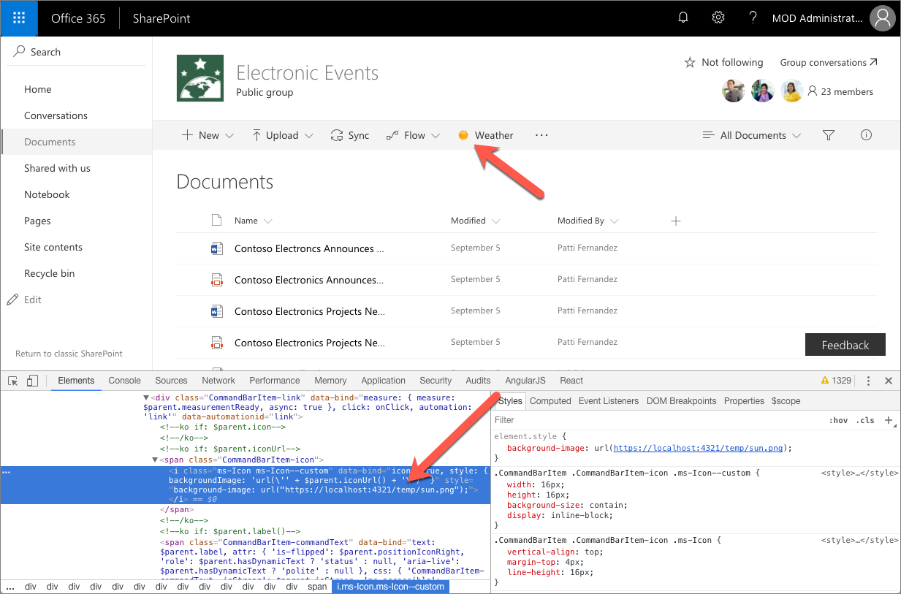
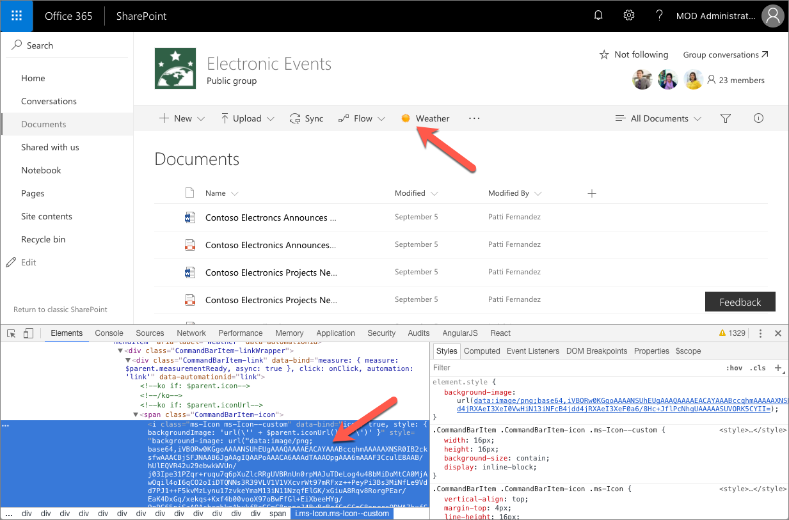

# Configure extension icon

Selecting an icon that illustrates the purpose of your custom command, makes it easier for users to find your command among other options visible in the toolbar or in the context menu. This article explains the different options available to you to configure the icon for your commands.

## Extension types that support icons

SharePoint Framework supports building the following types of extensions:

- Application customizer
- Field customizer
- Command set

Command set is the only type of SharePoint Framework extension for which you can configure icons.

## Defining Command set locations

When deploying command sets, you can choose whether their commands should be visible on the command bar (`location: ClientSideExtension.ListViewCommandSet.CommandBar`), in the context menu (`location: ClientSideExtension.ListViewCommandSet.ContextMenu`) or both (`location: ClientSideExtension.ListViewCommandSet`). Icons defined for the different commands will be displayed only for commands displayed in the command bar.

## Configuring command set icons

SharePoint Framework offers you two ways to define the icon for your extension.

### Using an external icon image

When building SharePoint Framework command sets, you can specify an icon for each command by providing an absolute URL pointing to the icon image in the extension manifest, in the **iconImageUrl** property.

```json
{
  "$schema": "https://dev.office.com/json-schemas/spfx/command-set-extension-manifest.schema.json",

  "id": "6cdfbff6-714f-4c26-a60c-0b18afe60837",
  "alias": "WeatherCommandSet",
  "componentType": "Extension",
  "extensionType": "ListViewCommandSet",

  // The "*" signifies that the version should be taken from the package.json
  "version": "*",
  "manifestVersion": 2,

  // If true, the component can only be installed on sites where Custom Script is allowed.
  // Components that allow authors to embed arbitrary script code should set this to true.
  // https://support.office.com/en-us/article/Turn-scripting-capabilities-on-or-off-1f2c515f-5d7e-448a-9fd7-835da935584f
  "requiresCustomScript": false,

  "items": {
    "WEATHER": {
      "title": { "default": "Weather" },
      "iconImageUrl": "https://localhost:4321/temp/sun.png",
      "type": "command"
    }
  }
}
```

The command icon displayed in the command bar is 16x16px. If your image is bigger, it will be sized proportionally to match these dimensions.



While using custom images gives you flexibility to choose an icon for your command, it requires you to deploy them along with your other extension assets. Additionally, your image might lose quality when displayed in higher DPI or specific accessibility settings. To avoid quality loss, you can use vector-based SVG images which are also supported by the SharePoint Framework.

### Using a base64 encoded image

When using a custom image, rather than specifying an absolute URL to the image file hosted together with other extension assets, you can have your image base64 encoded and use the base64 string instead of the URL.

> There are a number of services available on the Internet that you can use to base64 encode your image, such as [https://www.base64-image.de](https://www.base64-image.de).

After encoding the image, copy the base64 string and use it as the value for the **iconImageUrl** property in the web part manifest.

```json
{
  "$schema": "https://dev.office.com/json-schemas/spfx/command-set-extension-manifest.schema.json",

  "id": "6cdfbff6-714f-4c26-a60c-0b18afe60837",
  "alias": "WeatherCommandSet",
  "componentType": "Extension",
  "extensionType": "ListViewCommandSet",

  // The "*" signifies that the version should be taken from the package.json
  "version": "*",
  "manifestVersion": 2,

  // If true, the component can only be installed on sites where Custom Script is allowed.
  // Components that allow authors to embed arbitrary script code should set this to true.
  // https://support.office.com/en-us/article/Turn-scripting-capabilities-on-or-off-1f2c515f-5d7e-448a-9fd7-835da935584f
  "requiresCustomScript": false,

  "items": {
    "WEATHER": {
      "title": { "default": "Weather" },
      "iconImageUrl": "data:image/png;base64,iVBORw0KGgoAAAANSUhEUgAAAQAAAAEACAYAAABccqhmAAAAAXNSR0IB2cksfwAAACBjSFJNAAB6JgAAgIQAAPoAAACA6AAAdTAAAOpgAAA6mAAAF3CculE8AAB/hUlEQVR42u29ebwkWVUn/j03Ipe31PZqr+ruqu7q6pXuZlcRRgUVBRnUn0rpMAJuTDeLog4u48bMiDoMtCA0MjAwOqil4oI6qCO2oIiDTQ...",
      "type": "command"
    }
  }
}
```



Base64 encoding works both for bitmap images such as PNG as well as vector SVG images. The big benefit of using base64 encoded images is, that you don't need to deploy the web part icon image separately.

## Additional considerations

Specifying an icon for a command is optional. If you don't specify an icon, then only the command title will be displayed in the command bar.