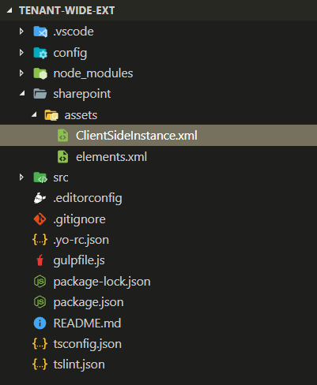
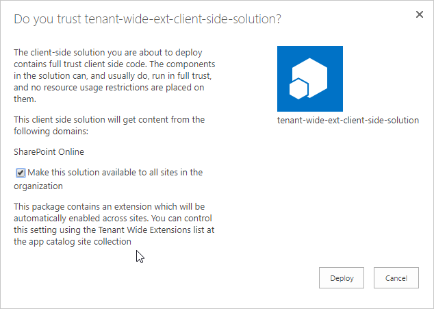

# Tenant Wide Deployment of SharePoint Framework Extensions

Tenant Wide Deployment option for SharePoint Framework Extensions is supported for application customizers and for List View Command Sets. It provides an easy option for tenant app catalog managers to manage which extensions are activated by default across the tenant or based on web / list templates used in the sites.

> [!NOTE]
> SharePoint Framework extensions are support with modern experiences regardless of the actual site template used when content site was created.

When developers create a new SharePoint Framework extension solution using standard SharePoint Framework Yeoman packages, automation is included in the solution package to activate extension cross the tenant.

> [!WARNING]
> Starting from SharePoint Framework v1.6, default scaffolding will automatically create example files in SharePoint Solution to activate extension across the tenant if you chose to use the tenant-scoped deployment option.

SharePoint Framework solution will need to be configured to use [tenant-scope deployment option](https://docs.microsoft.com/en-us/sharepoint/dev/spfx/tenant-scoped-deployment), to be able to automatically activate extensions across the tenant using Tenant Wide Deployment functionality. This means that the `skipFeatureDeployment` attribute in the `package-solution.json` will need to be set as *true*. 

# Controlling tenant wide deployment from app catalog site collection

App catalog site collection is used to deploy SharePoint add-ins and SharePoint Framework components to the tenant. This site collection is created by tenant administrator and it is used to manage what customizations are available for end users in actual content site collections.

App catalog site collection contains a **Tenant Wide Extensions** list, which can be used to manage SharePoint Framework Extension activations in the tenant. This list can be accessed from the **site contents** page of the app catalog site.

Specific SharePoint Framework extensions can be activated in the tenant level by adding entries to the **Tenant Wide Extension** list. Each entry can be targeted to specific web template or a list type, depending on the functional requirements.

These list specific configurations are resolved at runtime when end users are accessing pages in content site collections. This means that the changes applied to this list are available for both existing and new sites in the tenant.

SharePoint Framework solutions can contain automation which will add automatically entry to the Tenant Wide Extension list, when the solution is added

> [!IMPORTANT]
> It will take up to 20 minutes before the functionality will be enabled after first entry added to the **Tenant Wide Extensions** list on a specific tenant.

## Tenant wide deployment list description

Component ID must exists in the tenant to be able to add entry for it.

| Column                | Type      | Description |
|-----------            |------     |-------------|
| Title                 | String    |Title of the entry. Can be descriptive entry for the registration. |
| Component Id          | Guid      | Manifest ID of the component. Has to be in GUID format and component must exists in the app catalog. |
| Component Properties  | String    | Optional component properties. |
| Web Template          | String    | Can be used to target extension only to specific web template. See possible values in below table. |
| List template         | int       | List type as a number. See possible values from below table. |
| Location              | String    | Location of the entry. There are different support locations for application customizers and List View Command Sets. |
| Sequence              | int       | Sequence of the entry in rendering. |
| Disabled              | Boolean   | Is the entry enabled or disable. |

For the Web Template column any web template definition is technically supported. Following table defines the most commonly used templates. 

| Template                | Web Template ID      |
|-----------            |------     |
| Group associated team site | GROUP#0 |
| Communication Site | SITEPAGEPUBLISHING#0 |
| Modern team site without a group | STS#3 |
| Classic team site | STS#0 |
| Classic publishing site | BLANKINTERNET#0 |

 For the List Template column any list ID is technically supported, but only sub set of classic list types support modern experiences.

| List             | List Id   |
|-----------       |------     |
| Custom List      | 100 |
| Document library | 101 |

Supported location values are following. These are specific for the the component type.

| Value                                                 | Component Type            | Description |
|-----------                                            |------                     |-------------|
| ClientSideExtension.ApplicationCustomizer             | Application Customizer    | Required for application customizer. |
| ClientSideExtension.ListViewCommandSet.ContextMenu    | ListView Command Set      | Show List View buttons in Context Menu for items in a list. |
| ClientSideExtension.ListViewCommandSet.CommandBar     | ListView Command Set      | Show List View buttons in Command Bar of the list. |
| ClientSideExtension.ListViewCommandSet                | ListView Command Set      | Show List View buttons in both context menu and command bar. |

> [!NOTE]
> Technically this list defines the dynamic entries which will be automatically added to the Web or List UserCustomAction collection when a page from a site is being rendered. List information is cached and it's content output as part of the page rendering on runtime.

# Automating tenant wide deployment from solution package

SharePoint Framework solutions default scaffolding creates an automation file to the SharePoint Framework solution when an extension component type is created with initial solution creation. Default deployment activation is located in **ClientSideInstance.xml** file in the `sharepoint\assets` folder.



**ClientSideInstance.xml** is taken into account in the solution activation at the app catalog if the `skipFeatureDeployment` attribute is set to *true* in the `package-solution.json` file. 

This file contains by default following structure. **ClientSideComponentInstance** element instructs SharePoint to add automatically an entry to the Tenant Wide Deployment list when the solution package is added to the app catalog.

```xml
<?xml version="1.0" encoding="utf-8"?>
<Elements xmlns="http://schemas.microsoft.com/sharepoint/">
    <ClientSideComponentInstance
        Title="MyAppCust"
        Location="ClientSideExtension.ApplicationCustomizer"
        ComponentId="917a86f2-15c1-403e-bbe1-59c6bd50d1e1"
        Properties="{&quot;testMessage&quot;:&quot;Test message&quot;}">
    </ClientSideComponentInstance>
</Elements>
```

 **ClientSideInstance.xml** file is also referenced in the **package-solution.json**, so that it's included inside of the **sppkg** file, when you package your solution.

> [!NOTE]
> If you do not want this file to be present in the **sppkg file**, you can easily remove that from packaging process by updating **package-solution.json** file.

**ClientSideComponentInstance** element supports following attributes.

| Attribute         | Mandatory | Description |
|-----------        |------     |-------------|
| Title             | Yes       | Title of the entry. Can be descriptive entry for the registration. |
| Location          | Yes       | Location entry for the extension registration |
| ComponentId       | Yes       | Manifest ID of the component |
| Properties        | Yes       | Optional properties for the component. *Notice* that this is mandatory attribute in xml level, which can be set as empty string, if no properties are needed. Value also needs to be encoded properly so that the property values can be provided in the xml format. |
| ListTemplateId    | No       | Optional list template type ID to which extension should be activated |
| WebTemplateId     | No       | Optional web template id to define the site type where extension should be activated |
| Sequence          | No       | Optional activation sequence order for the extensions. Used if multiple extensions are activated on a same scope. |

Below xml definition shows how the optional values could be used as part of the registration.

```xml
<?xml version="1.0" encoding="utf-8"?>
<Elements xmlns="http://schemas.microsoft.com/sharepoint/">
    <ClientSideComponentInstance
        Title="MyAppCust"
        Location="ClientSideExtension.ApplicationCustomizer"
        ComponentId="917a86f2-15c1-403e-bbe1-59c6bd50d1e1"
        Properties="{&quot;testMessage&quot;:&quot;Test message&quot;}"
        ListTemplateId="100"
        WebTemplateId="GROUP#0"
        Sequence="10" >
    </ClientSideComponentInstance>
</Elements>

```

When an administrator adds a  solution which has a ClientSideInstance.xml file inside of it to app catalog, specific warning message is shows to ensure that presence of the automated configuration is known.



After solution deployment, administrator can change the deployment settings from the **Tenant Wide Extension** list.
