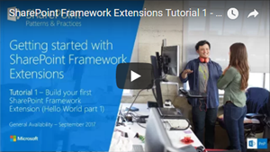
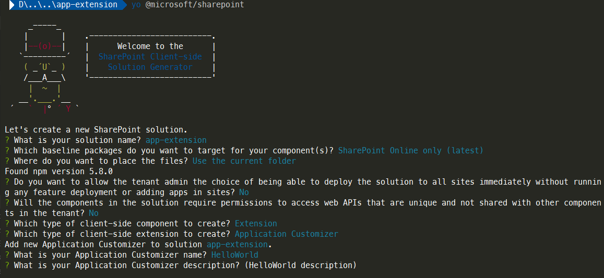
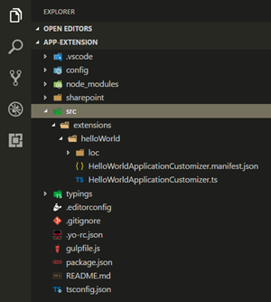
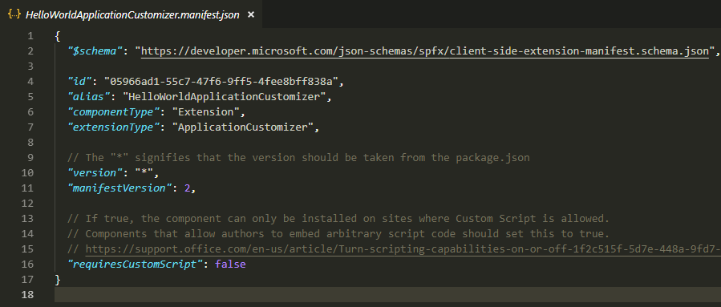
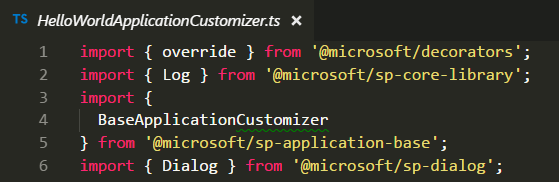
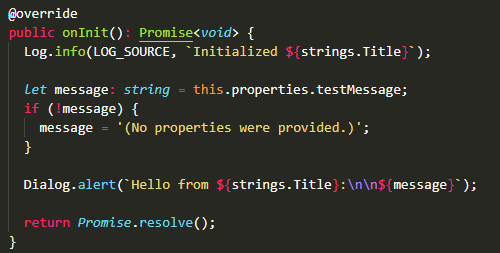
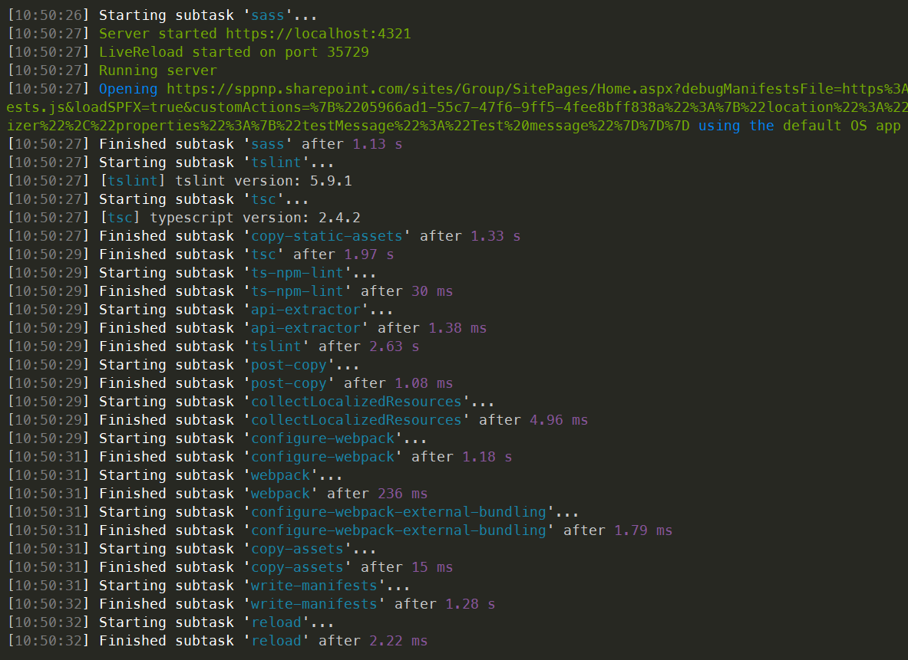
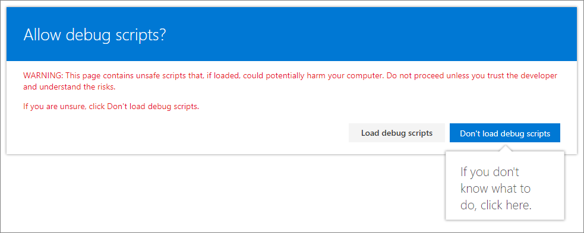
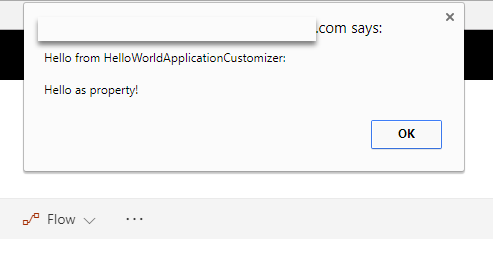

# Build your first SharePoint Framework Extension (Hello World part 1)

SharePoint Framework (SPFx) Extensions are client-side components that run inside the context of a SharePoint page. You can deploy extensions to SharePoint Online, and you can use modern JavaScript tools and libraries to build them.

You can also follow the steps in this article by watching the video on the [SharePoint PnP YouTube Channel](https://www.youtube.com/watch?v=0BeS0HukW24&list=PLR9nK3mnD-OXtWO5AIIr7nCR3sWutACpV). 

<a href="https://www.youtube.com/watch?v=yrFNu6K7iuU">

</a>

## Create an extension project

1. Create a new project directory in your favorite location.

    ```
    md app-extension
    ```

2. Go to the project directory.

    ```
    cd app-extension
    ```

3. Create a new HelloWorld extension by running the Yeoman SharePoint Generator.

    ```
    yo @microsoft/sharepoint
    ```

4. When prompted:

    * Accept the default **app-extension** as your solution name, and select Enter.
    * Select **SharePoint Online only (latest)**, and select Enter.
    * Select **Use the current folder**, and select Enter.
    * Select **N** to require the extension to be installed on each site explicitly when it's being used. 
    * Select **Extension** as the client-side component type to be created. 
    * Select **Application Customizer** as the extension type to be created.

5. The next set of prompts ask for specific information about your extension. When prompted:

    * Accept the default **HelloWorld** as your extension name, and select Enter.
    * Accept the default **HelloWorld description** as your extension description, and select Enter.

    <br/>

    

    > [!NOTE] 
    > If you use a name for the extension that is too long, you might encounter issues. The entries provided are used to generate an alias entry for the Application Customizer manifest JSON file. If the alias is longer than 40 characters, you get an exception when you try to serve the extension by using `gulp serve --nobrowser`. You can resolve this by updating the alias entry afterward.

    At this point, Yeoman installs the required dependencies and scaffolds the solution files along with the **HelloWorld** extension. This might take a few minutes. 

    When the scaffold is complete, you should see the following message indicating a successful scaffold:

    

    For information about troubleshooting any errors, see [Known issues](../../known-issues-and-common-questions.md).

6. After the scaffolding completes, lock down the version of the project dependencies by running the following command:

    ```sh
    npm shrinkwrap
    ```

7. Next, type the following into the console to start Visual Studio Code.

    ```
    code .
    ```

    > [!NOTE] 
    > Because the SharePoint client-side solution is HTML/TypeScript based, you can use any code editor that supports client-side development to build your extension.

    Notice how the default solution structure looks like the solution structure for client-side web parts. This is the basic SharePoint Framework solution structure, with similar configuration options across all solution types.

    

8. Open **HelloWorldApplicationCustomizer.manifest.json** in the src\extensions\helloWorld folder.

    This file defines your extension type and a unique identifier for your extension. You’ll need this ID later when you debug and deploy your extension to SharePoint.

    

## Code your Application Customizer 

Open the **HelloWorldApplicationCustomizer.ts** file in the **src\extensions\helloWorld** folder.

Notice that base class for the Application Customizer is imported from the **sp-application-base** package, which contains SharePoint framework code required by the Application Customizer. 



The logic for your Application Customizer is contained in the **onInit** method, which is called when the client-side extension is first activated on the page. This event occurs after `this.context` and `this.properties` are assigned. As with web parts, `onInit()` returns a promise that you can use to perform asynchronous operations.

> [!NOTE] 
> The class constructor is called at an early stage, when `this.context` and `this.properties` are undefined. Custom initiation logic is not supported here.

The following are the contents of **onInit()** in the default solution. This default solution writes a log to the Dev Dashboard, and then displays a simple JavaScript alert when the page renders.



If your Application Customizer uses the **ClientSideComponentProperties** JSON input, it is deserialized into the **BaseExtension.properties** object. You can define an interface to describe it. The default template is looking for a property called **testMessage**. If that property is provided, it outputs it in an alert message.

## Debug your Application Customizer

You cannot currently use the local Workbench to test SharePoint Framework Extensions. You need to test them against a live SharePoint Online site. You don't have to deploy your customization to the app catalog to do this, which makes the debugging experience simple and efficient. 

1. Compile your code and host the compiled files from your local computer by running the following command:

    ```
    gulp serve --nobrowser
    ```

    > [!NOTE] 
    > If you do not have the SPFx developer certificate installed, Workbench notifies you that it is not configured to load scripts from localhost. If this happens, stop the process that is currently running in the console window, run the `gulp trust-dev-cert` command in your project directory console to install the developer certificate, and then run the `gulp serve --nobrowser` command again.

    You use the `--nobrowser` option because you don't need to launch the local Workbench since you can't debug extensions locally.

    When the code compiles without errors, it serves the resulting manifest from https://localhost:4321.

    

2. To test your extension, go to a modern list view page in your SharePoint environment and append the following query string parameters to the URL. Notice that you need to update the ID to match your own extension identifier. This is available in the **HelloWorldApplicationCustomizer.manifest.json** file.

    ```json
        ?loadSPFX=true&debugManifestsFile=https://localhost:4321/temp/manifests.js&customActions={"e5625e23-5c5a-4007-a335-e6c2c3afa485":{"location":"ClientSideExtension.ApplicationCustomizer","properties":{"testMessage":"Hello as property!"}}}
    ```

    More detail about the URL query parameters:

    * **loadSPFX=true**. Ensures that the SharePoint Framework is loaded on the page. For performance reasons, the framework does not load unless at least one extension is registered. Because no components are registered, you must explicitly load the framework.

    * **debugManifestsFile**. Specifies that you want to load SPFx components that are locally served. The loader only looks for components in the app catalog (for your deployed solution) and the SharePoint manifest server (for the system libraries).

    * **customActions**. Simulates a custom action. When you deploy and register this component in a site, you'll create this **CustomAction** object and describe all the different properties you can set on it. 
        * **Key**. Use the GUID of the extension as the key to associate with the custom action. This has to match the ID value of your extension, which is available in the extension manifest.json file.
        * **Location**. The type of custom action. Use `ClientSideExtension.ApplicationCustomizer` for the Application Customizer extension.
        * **Properties**. An optional JSON object that contains properties that are available via the **this.properties** member. In this HelloWorld example, it defined a `testMessage` property.


3. Go to a modern list in SharePoint Online. This can be either a list or a library. Application Customizers are also supported in modern pages and on the Site Contents page. 

4. Extend the URL with the additional query parameters described. Notice that you need to update the GUID to match the ID of your custom Application Customizer. 

    The full URL should look similar to the following:

    ```json
    contoso.sharepoint.com/Lists/Contoso/AllItems.aspx?loadSPFX=true&debugManifestsFile=https://localhost:4321/temp/manifests.js&customActions={"e5625e23-5c5a-4007-a335-e6c2c3afa485":{"location":"ClientSideExtension.ApplicationCustomizer","properties":{"testMessage":"Hello as property!"}}}
    ```

5. Select **Load debug scripts** to continue loading scripts from your local host.

    

    <br/>

    You should now see the dialog message on your page.

    

    This dialog is thrown by your SharePoint Framework Extension. Note that because you provided the `testMessage` property as part of the debug query parameters, it's included in the alert message. You can configure your extension instances based on the client component properties, which are passed for the instance in runtime mode.

> [!NOTE] 
> If you have issues with debugging, double-check the URL query parameters used for the query. Some browsers encode the parameters and in some scenarios this affects the behavior.

## Next steps

Congratulations, you got your first SharePoint Framework Extension running! 

To continue building out your extension, see [Using page placeholders from Application Customizer (Hello World part 2)](./using-page-placeholder-with-extensions.md). You use the same project and take advantage of specific content placeholders for modifying the UI of SharePoint. Notice that the `gulp serve` command is still running in your console window (or in Visual Studio Code if you are using the editor). You can continue to let it run while you go to the next article.

> [!NOTE]
> If you find an issue in the documentation or in the SharePoint Framework, report that to SharePoint engineering by using the [issue list at the sp-dev-docs repository](https://github.com/SharePoint/sp-dev-docs/issues). Thanks for your input in advance.