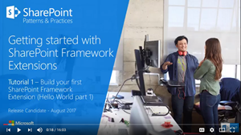
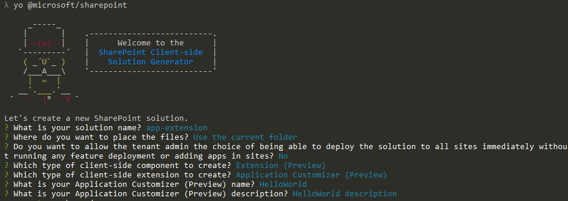
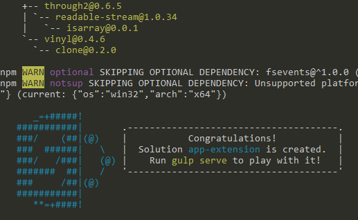
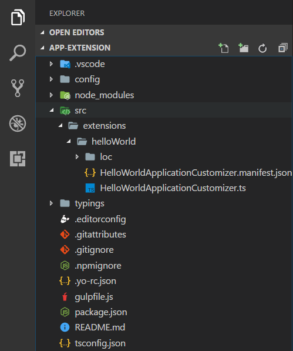
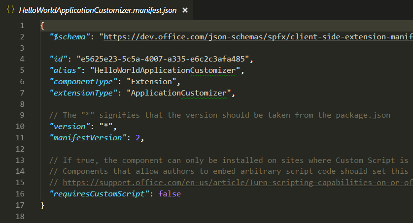
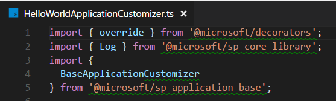
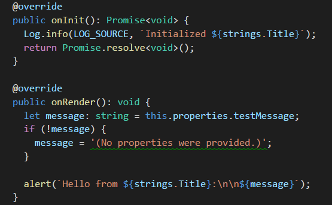
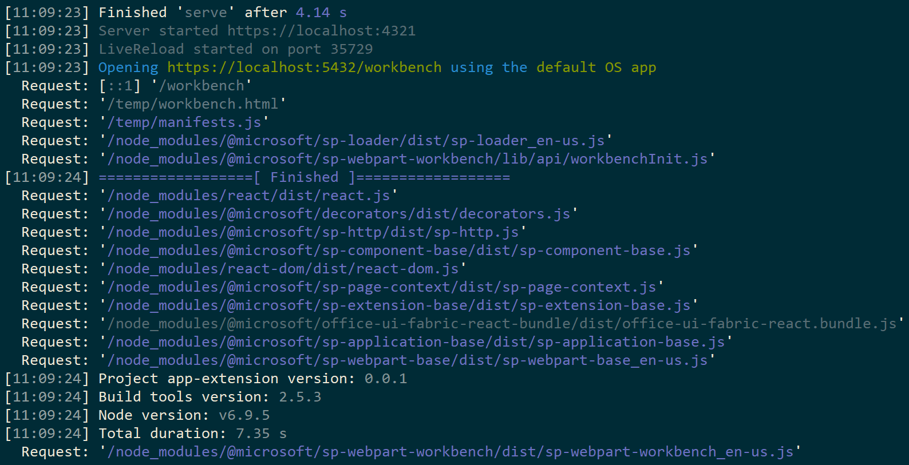
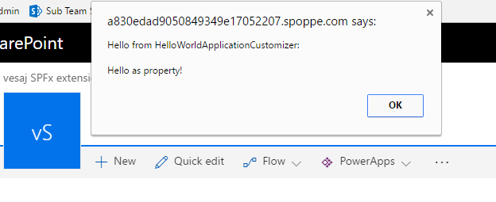

# Build your first SharePoint Framework Extension (Hello World part 1)

>**Note:** The SharePoint Framework Extensions are currently in preview and are subject to change. SharePoint Framework Extensions are not currently supported for use in production environments.

Extensions are client-side components that run inside the context of a SharePoint page. Extensions can be deployed to SharePoint Online, and you can also use modern JavaScript tools and libraries to build them.

This article describes how to create your first Hello World SharePoint Framework Extension. You can also follow these steps by watching the video on the [SharePoint PnP YouTube Channel](https://www.youtube.com/watch?v=0BeS0HukW24&list=PLR9nK3mnD-OXtWO5AIIr7nCR3sWutACpV). 

<a href="https://www.youtube.com/watch?v=0BeS0HukW24&list=PLR9nK3mnD-OXtWO5AIIr7nCR3sWutACpV">

</a>

## Create an extension project
Create a new project directory in your favorite location.

```
md app-extension
```

Go to the project directory.

```
cd app-extension
```

Create a new HelloWorld extension by running the Yeoman SharePoint Generator.

```
yo @microsoft/sharepoint
```

When prompted:

* Accept the default **app-extension** as your solution name and press **Enter**.
* Choose **Use the current folder** and press **Enter**
* Choose **N** to require extension to be installed on each site explicitly when it's being used 
* Choose **Extension (Preview)** as the client-side component type to be created. 
* Choose **Application Customizer (Preview)** as the extension type to be created.

The next set of prompts will ask for specific information about your extension:

* Accept the default **HelloWorld** as your extension name and press **Enter**.
* Accept the default **HelloWorld description** as your extension description and press **Enter**.



> Notice that if you use too long naming for the extension, that can cause issues. Provided entries are used to generate alias entry for the application customizer manifest json file. If alias is longer than 40 characters, you will have an exception when you are trying to serve the extension using `gulp serve --nobrowser`. You can solve this by updating the alias entry also afterwards.

At this point, Yeoman will install the required dependencies and scaffold the solution files along with the **HelloWorld** extension. This might take a few minutes. 

When the scaffold is complete, you should see the following message indicating a successful scaffold:



For information about troubleshooting any errors, see [Known issues](../basics/known-issues).

Once solution scaffolding is completed, type the following into the console to start Visual Studio Code.

```
code .
```

> Notice that because the SharePoint client-side solution is HTML/TypeScript based, you can use any code editor that supports client-side development to build your extension.

Notice how the default solution structure is like the solution structure of client-side web parts. This is the basic SharePoint Framework solution structure, with similar configuration options across all solution types.



Open **HelloWorldApplicationCustomizer.manifest.json** at the src\extensions\helloWorld folder.

This file defines your extension type and a unique identifier **“id”** for your extension. You’ll need this unique identifier later when debugging and deploying your extension to SharePoint.



## Coding your Application Customizer 
Open the **HelloWorldApplicationCustomizer.ts** file in the **src\extensions\helloWorld** folder.

Notice that base class for the Application Customizer is imported from the **sp-application-base** package, which contains SharePoint framework code required by the Application Customizer.



The logic for your Application Customizer is contained in the **onInit** method.

- **onInit()** is called when the client-side extension is first activated on the page. This event occurs after ```this.context``` and ```this.properties``` are assigned. As with web parts, ```onInit()``` returns a promise that you can use to perform asynchronous operations.

> Notice. The class constructor is called at an early stage, when ```this.context``` and ```this.properties``` are undefined. We do not support including custom initiation logic here.

Below is the contents of **onInit()** in the default solution. This default solution simply writes a log to the Dev Dashboard, and then displays a simple JavaScript alert when the page renders.



>  If your application customizer uses the ClientSideComponentProperties JSON input, it will be deserialized into the BaseExtension.properties object. You can define an interface to describe it. The default template is looking for a property called testMessage, and if it's provided, outputting it in an alert message.

## Debugging your Application Customizer using gulp serve and query string parameters
SharePoint Framework extensions cannot currently be tested using the local workbench, so you'll need to test and develop them directly against a live SharePoint Online site. You do not, however, need to deploy your customization to the app catalog to do this, which keeps the debugging experience simple and efficient. 

First, compile your code and host the compiled files from your local machine by running this command:
```
gulp serve --nobrowser
```

>**Note:** If you do not have the SPFx developer certificate installed, then Workbench will notify you that it is configured not to load scripts from localhost. Stop currently running process in the console window, execute `gulp trust-dev-cert` command in your project directory console to install the developer certificate before running `gulp serve --nobrowser` command again.

Notice that we used the ```--nobrowser``` option, since there's no value in launching the local workbench since you currently cannot debug extensions locally.

Once it compiles the code without errors, it will serve the resulting manifest from http://localhost:4321.



To test your extension, navigate to a modern list view page in your SharePoint environment and append the following query string parameters to the URL. Notice that you will need to update the id to match your own extension identifier available from the **HelloWorldApplicationCustomizer.manifest.json** file:
```
?loadSPFX=true&debugManifestsFile=https://localhost:4321/temp/manifests.js&customActions={"e5625e23-5c5a-4007-a335-e6c2c3afa485":{"location":"ClientSideExtension.ApplicationCustomizer","properties":{"testMessage":"Hello as property!"}}}
```

More detail about the URL query parameters:

* **loadSPFX=true:**  ensures that the SharePoint Framework is loaded on the page. For performance reasons, the framework is not normally loaded unless at least one extension is registered. Since no components are registered yet, we must explicitly load the framework.

* **debugManifestsFile:**  specifies that we want to load SPFx components that are being locally served. Normally the loader only looks for components in the App Catalog (for your deployed solution) and the SharePoint manifest server (for the system libraries).

* **customActions:**  this URL query parameter simulates a custom action. When we actually deploy and register this component in a site later in this lab, we’ll create this CustomAction object for real and describe all the different properties you can set on it. 
    * **Key:** use the Guid of the extension as the key to associate with the custom action. This has to match on the id value of your extension available from the extension manifest.json.
    * **Location:** the type of custom action, use "ClientSideExtension.ApplicationCustomizer" for the Application Customizer extension
    * **Properties:** an optional JSON object containing properties that will be available via the this.properties member. In this HelloWorld example, it defined a ‘testMessage’ property.


Navigate to a out of the box modern list in SharePoint Online. This can be a list or a library for the initial testing. Application customizers are also supported in modern pages and on the Site Contents page. 

Extend the URL with the additional query parameters defined above. Notice that you'll need to update the GUID to match the ID of your custom Application Customizer available from  **HelloWorldApplicationCustomizer.manifest.json** at the src\extensions\helloWorld folder. 

The full URL should look similar to the following depending on your tenant URL:

```
contoso.sharepoint.com/Lists/Contoso/AllItems.aspx?loadSPFX=true&debugManifestsFile=https://localhost:4321/temp/manifests.js&customActions={"e5625e23-5c5a-4007-a335-e6c2c3afa485":{"location":"ClientSideExtension.ApplicationCustomizer","properties":{"testMessage":"Hello as property!"}}}
```


Click the "**Load debug scripts**" button to continue loading scripts from your local host.

You should now see the alert message on your page.



This alert is thrown by your SharePoint Framework Extension. Notice also that since we provided the testMessage property as part of the debug query parameters, it's included in the alert message. You can configure your extension instances based on the client component properties, which are passed for the instance also in runtime mode. 

> If you are having challenges in getting debugging to work, double check the URL query parameters used for the query. Some browsers tend to encode the parameters and in some scenarios this will impact the behavior. 

## Next steps
Congratulations on getting your first SharePoint Framework Extension running! Now that your extension is running, you can continue building out your extension in the next topic, [Using page placeholders from Application Customizer (Hello World part 2)](./using-page-placeholder-with-extensions.md). You will use the same project and take advantage of specific content placeholders for modifying the UI of SharePoint. Notice that the ```gulp serve``` command is still running in your console window (or in Visual Studio Code if you are using the editor). You can continue to let it run while you go to the next article.
