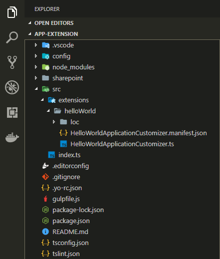
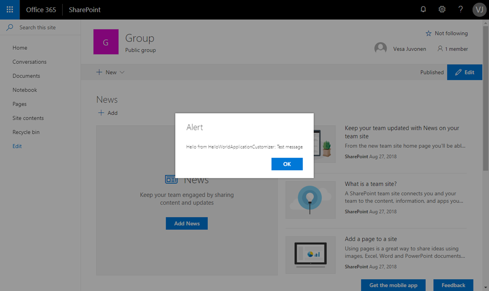

# Build your first SharePoint Framework Extension (Hello World part 1)

SharePoint Framework (SPFx) Extensions are client-side components that run inside the context of a SharePoint page. You can deploy extensions to SharePoint Online, and you can use modern JavaScript tools and libraries to build them.

You can also follow the steps in this article by watching the video on the SharePoint PnP YouTube Channel:

<br/>

> [!Video https://www.youtube.com/embed/yrFNu6K7iuU]

<br/> 

## Create an extension project

1. Create a new project directory in your favorite location.

    ```
    md app-extension
    ```

2. Go to the project directory.

    ```
    cd app-extension
    ```

3. Create a new HelloWorld extension by running the Yeoman SharePoint Generator.

    ```
    yo @microsoft/sharepoint
    ```

4. When prompted:

    * Accept the default **app-extension** as your solution name, and select Enter.
    * Select **SharePoint Online only (latest)**, and select Enter.
    * Select **Use the current folder**, and select Enter.
    * Select **N** to require the extension to be installed on each site explicitly when it's being used. 
    * Select **Extension** as the client-side component type to be created. 
    * Select **Application Customizer** as the extension type to be created.

5. The next set of prompts ask for specific information about your extension. When prompted:

    * Accept the default **HelloWorld** as your extension name, and select Enter.
    * Accept the default **HelloWorld description** as your extension description, and select Enter.
    * For the next question **Do you want to allow the tenant admin the choice of being able to deploy the solution to all sites....**, ensure you select No (N) , and select Enter. If you select Yes (y), the scaffolding will not generate the Elements.xml feature deployment file.

    <br/>

    

    > [!NOTE] 
    > If you use a name for the extension that is too long, you might encounter issues. The entries provided are used to generate an alias entry for the Application Customizer manifest JSON file. If the alias is longer than 40 characters, you get an exception when you try to serve the extension by using `gulp serve --nobrowser`. You can resolve this by updating the alias entry afterward.

    At this point, Yeoman installs the required dependencies and scaffolds the solution files along with the **HelloWorld** extension. This might take a few minutes. 

    When the scaffold is complete, you should see the following message indicating a successful scaffold:

    

    For information about troubleshooting any errors, see [Known issues](../../known-issues-and-common-questions.md).

6. Next, type the following into the console to start Visual Studio Code.

    ```
    code .
    ```

    > [!NOTE] 
    > Because the SharePoint client-side solution is HTML/TypeScript based, you can use any code editor that supports client-side development to build your extension.

    Notice how the default solution structure looks like the solution structure for client-side web parts. This is the basic SharePoint Framework solution structure, with similar configuration options across all solution types.

    

8. Open **HelloWorldApplicationCustomizer.manifest.json** in the src\extensions\helloWorld folder.

    This file defines your extension type and a unique identifier for your extension. You’ll need this ID later when you debug and deploy your extension to SharePoint.

    

## Code your Application Customizer 

Open the **HelloWorldApplicationCustomizer.ts** file in the **src\extensions\helloWorld** folder.

Notice that base class for the Application Customizer is imported from the **sp-application-base** package, which contains SharePoint framework code required by the Application Customizer. 


The logic for your Application Customizer is contained in the **onInit** method, which is called when the client-side extension is first activated on the page. This event occurs after `this.context` and `this.properties` are assigned. As with web parts, `onInit()` returns a promise that you can use to perform asynchronous operations.

> [!NOTE] 
> The class constructor is called at an early stage, when `this.context` and `this.properties` are undefined. Custom initiation logic is not supported here.

The following are the contents of **onInit()** in the default solution. This default solution writes a log to the Dev Dashboard, and then displays a simple JavaScript alert when the page renders.


> [!NOTE] 
> **SharePoint Framework Dev Dashboard** is additional UI dashboard, which can be started with `ctrl+F12`. This is developer oriented logging information, which you can take advantage as developer. It also has plenty of oob logging in it.

If your Application Customizer uses the **ClientSideComponentProperties** JSON input, it is deserialized into the **BaseExtension.properties** object. You can define an interface to describe it. The default template is looking for a property called **testMessage**. If that property is provided, it outputs it in an alert message.

## Debug your Application Customizer

You cannot use the local Workbench to test SharePoint Framework Extensions. You need to test them against a live SharePoint Online site. You don't have to however deploy your customization to the app catalog to do this, which makes the debugging experience simple and efficient.

1. Open the **server.json** file in the **config** folder.

    Notice that this file has been updated with the default settings matching your project. Yuo can notice that there's a specific GUID mentioned under the customActions element. This is automatically updated to match your component when project was scaffold. If you will add new components or change the properties for the component, you will need to update this file for testing.

2. Update pageURL to match your own tenant, which you want to use for testing. You can use any URL with modern experience. *This could be for example a welcome page of a new group associated team site, which would mean somewhat following URL:

    `https://sppnp.sharepoint.com/sites/yoursite/SitePages/Home.aspx`

    Your **serve.json** file should look somewhat following (updated with your tenant details):

    

3. Compile your code and host the compiled files from your local computer by running the following command:

    ```
    gulp serve
    ```

    > [!NOTE] 
    > If you do not have the SPFx developer certificate installed, Workbench notifies you that it is not configured to load scripts from localhost. If this happens, stop the process that is currently running in the console window, run the `gulp trust-dev-cert` command in your project directory console to install the developer certificate, and then run the `gulp serve --nobrowser` command again. This process is documented in the [Set up your development environment](https://docs.microsoft.com/en-us/sharepoint/dev/spfx/set-up-your-development-environment) article.

    When the code compiles without errors, it serves the resulting manifest from https://localhost:4321 and also starts your default browser with needed query parameters.

    


4. Move to your browser and select **Load debug scripts** to continue loading scripts from your local host.

    

    <br/>

    You should now see the dialog message on your page.

    

    This dialog is thrown by your SharePoint Framework Extension. Note that because you provided the `testMessage` property as part of the debug query parameters, it's included in the alert message. You can configure your extension instances based on the client component properties, which are passed for the instance in runtime mode.

> [!NOTE] 
> If you have issues with debugging, double-check the pageUrl setting in the **server.json** file.

## Next steps

Congratulations, you got your first SharePoint Framework Extension running! 

To continue building out your extension, see [Using page placeholders from Application Customizer (Hello World part 2)](./using-page-placeholder-with-extensions.md). You use the same project and take advantage of specific content placeholders for modifying the UI of SharePoint. Notice that the `gulp serve` command is still running in your console window (or in Visual Studio Code if you are using the editor). You can continue to let it run while you go to the next article.

> [!NOTE]
> If you find an issue in the documentation or in the SharePoint Framework, please report that to SharePoint engineering by using the [issue list at the sp-dev-docs repository](https://github.com/SharePoint/sp-dev-docs/issues) or by adding a comment to this article. Thanks for your input in advance.
