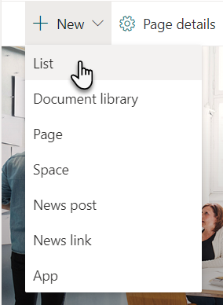
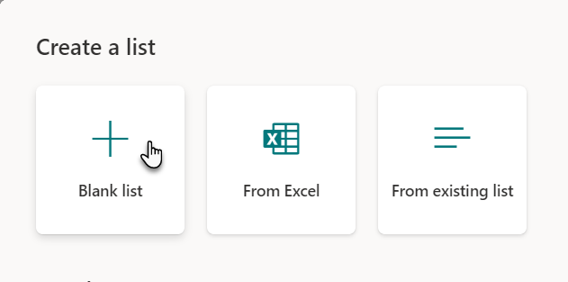
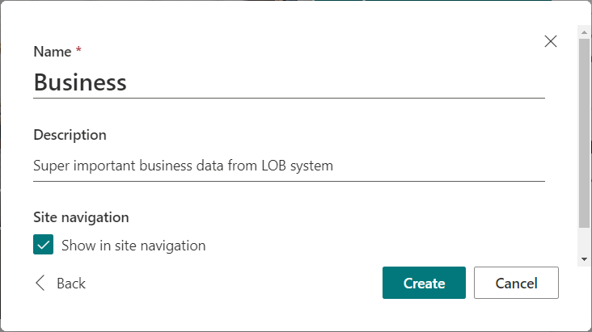
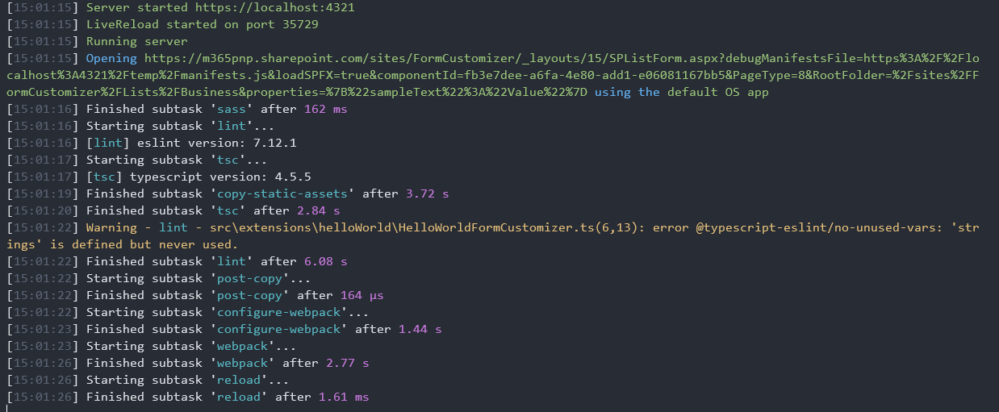
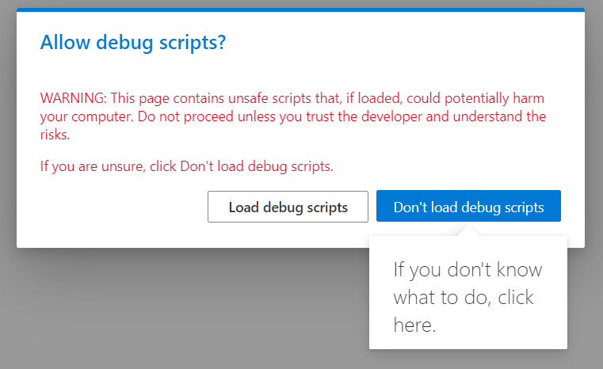
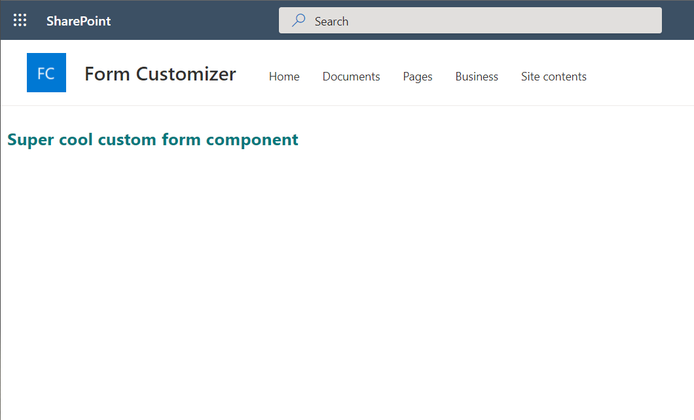
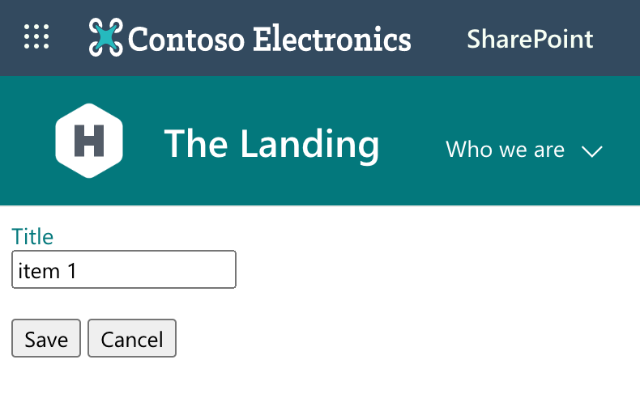

# Build your first Form Customizer extension (preview)

Form customizers are SharePoint Framework components giving you an option to override the form experience in a list or library level by associating the component to the used content type. Form customizer components can be used in SharePoint Online, and you build them using  modern JavaScript tools and libraries.

>[!Important]
> Form customizer were released as part of the SharePoint Framework 1.15, so ensure that you are using the right version in your environment. See [v1.15 release notes](../../release-1.15.md) for details.

> [!TIP]
> You can find the output from this tutorial from [GitHub](https://github.com/pnp/spfx-reference-scenarios/tree/main/samples/spfx-formcustomizer-basics).

## Create an extension project

1. Create a new project directory in your favorite location.

    ```console
    md form-customizer
    ```

1. Go to the project directory.

    ```console
    cd form-customizer
    ```

1. Create a new HelloWorld extension by running the Yeoman SharePoint Generator.

    ```console
    yo @microsoft/sharepoint
    ```

1. When prompted, enter the following values (*select the default option for all prompts omitted below*):

    - **What is your solution name?**: form-customizer
    - **Which type of client-side component to create?**: Extension
    - **Which type of client-side extension to create?** Form Customizer
    - **What is your Form Customizer name?** HelloWorld
    - **Which template would you like to use?**: No JavaScript Framework

    At this point, Yeoman installs the required dependencies and scaffolds the solution files along with the **HelloWorld** extension. This might take a few minutes.

1. Type the following into the console to start Visual Studio Code.

    ```console
    code .
    ```

    > [!NOTE]
    > Because the SharePoint client-side solution is HTML/TypeScript based, you can use any code editor that supports client-side development to build your extension.

1. Open the **./src/extensions/helloWorld/HelloWorldFormCustomizer.manifest.json** file.

    This file defines your extension type and a unique identifier `id` for your extension which can be used to set to be used in content type level for enabling a custom rendering with this component.

## Code your Form Customizer

Open the **./src/extensions/helloWorld/HelloWorldFormCustomizer.ts** file.

Notice that the base class for the Form Customizer is imported from the **sp-listview-extensibility** package, which contains SharePoint Framework code required by the Form Customizer.

```typescript
import { Log } from '@microsoft/sp-core-library';
import {
  BaseFormCustomizer
} from '@microsoft/sp-listview-extensibility';
```

The logic for your Form Customizer is contained in the `onInit()`, `render()`, and `onDispose()` methods.

- `onInit()` is where you'll execute the setup needed for your extension. This event occurs after `this.context` and `this.properties` are assigned, but before the page DOM is ready. As with web parts, `onInit()` returns a promise that you can use to do asynchronous operations; `render()` isn't called until your promise has resolved. If you don’t need that, simply return `Promise.resolve<void>();`.
- `render()` occurs when component is rendered. It provides an `event.domElement` HTML element where your code can write its content.
- `onDispose()` occurs immediately before the form host element is deleted. It can be used to free any resources that were allocated during form rendering. For example, if `render()` mounted a React element, `onDispose()` must be used to free it; otherwise, a resource leak would occur.

The following are the contents of `render()` and `onDispose()` in the default solution:

```typescript
  public render(): void {
    // Use this method to perform your custom rendering.
    this.domElement.innerHTML = `<div class="${ styles.helloWorld }"></div>`;
  }

  public onDispose(): void {
    // This method should be used to free any resources that were allocated during rendering.
    super.onDispose();
  }
```

As by default the form customzier component does not render any information, let's update the render method as follows.

```typescript
  public render(): void {
    // Use this method to perform your custom rendering.
    this.domElement.innerHTML = `<div class="${ styles.helloWorld }"><h1>Super cool custom form component</h1></div>`;
  }

```


## Debug your Form Customizer

You can test and debug your Form Customizer within a live SharePoint Online site. You do not need to deploy your customizations to the tenant app catalog to do this, which makes the debugging experience simple and efficient.


1. To test your extension, you'll need to first create list to test the customizer in. So move to the site in your SharePoint Online tenant where you want to test the form customizer.

2. On the toolbar, select **New**, and then select **List**.

    

3. Choose **Blank list** from the new list creation experience

    

4. Create a new list named **Business**, and then select **Create**.

    

5. Within Visual Studio Code, open the **./config/serve.json** file.

    Update the `pageUrl` attributes to match a URL of the list which we created in the preview steps. After the changes, your **serve.json** should look like the following code:

    ```json
    {
      "$schema": "https://developer.microsoft.com/json-schemas/core-build/serve.schema.json",
      "port": 4321,
      "https": true,
      "serveConfigurations": {
        "default": {
          "pageUrl": "https://yourtenant.sharepoint.com/sites/demo/_layouts/15/SPListForm.aspx",
          "formCustomizer": {
            "componentId": "fb3e7dee-a6fa-4e80-add1-e06081167bb5",
            "PageType": 8,
            "RootFolder": "/sites/demo/Lists/business",
            "properties": {
              "sampleText": "Value"
            }
          }
    ```

    Let's call out few specific topics from serve.json file

    * You can see multiple different configurations which can be used to debug new, edit and view forms with specific query parameter differences. You can define the used configuration in your gulp serve command, for example as `gulp serve --config=helloWorld_EditForm`
    * componentId is automatically associated to be the first list formatting component in your solution (if you have multiple components)
    * To simplify the debugging, you do not need to define target content type id to which the component is associated, but in the runtime the association is performed in content type level by updating at least one of the following properties in the content type:
      * ContentType.**NewFormClientSideComponentId** - component id for new form
      * ContentType.**NewFormClientSideComponentProperties** - optional configuration details
      * ContentType.**DispFormClientSideComponentId** - component id for edit form
      * ContentType.**DispFormClientSideComponentProperties** - optional configuration details
      * ContentType.**EditFormClientSideComponentId** - component id display  form
      * ContentType.**EditFormClientSideComponentProperties** - optional configuration details

6. Compile your code and host the compiled files from the local machine by running this command:

    ```console
    gulp serve
    ```

    When the code compiles without errors, it serves the resulting manifest from **https://localhost:4321**.

    

    This will start your default browser and load the page defined in **serve.json** file.

7.  Accept the loading of debug manifests by selecting **Load debug scripts** when prompted.

    

    Notice how the the custom component is rendered in the page based on the custom content which we updated to the render method.

    


## Add form item editing capabilities to the sample

Now that we have created the baseline component and tested that it works properly. We will be creating a separate rendering logic for display, edit and new forms and to support saving new items to the list.

1. Open the **./src/extensions/helloWorld/loc/myStrings.d.ts** file, and add new **Title** to the **IHelloWorldFormCustomizerStrings** interface . Interface should be as follows after your edits..

    ```typescript
    declare interface IHelloWorldFormCustomizerStrings {
      Save: string;
      Cancel: string;
      Close: string;
      Title: string;
    }
    ```

1. Open the **./src/extensions/helloWorld/loc/en-us.js** file, and add new **Title** string to the file. File content should be as follows after your edits.

    ```typescript
    define([], function() {
      return {
        "Save": "Save",
        "Cancel": "Cancel",
        "Close": "Close",
        "Title": "Title"
      }
    });
    ```

1. Open the **./src/extensions/helloWorld/HelloWorldFormCustomizer.module.scss** file, and update the styling definition as follows. We are adding error styling for the component.

    ```scss
    .helloWorld {
      background-color: "[theme:white, default:#ffffff]";
      color: "[theme:themePrimary, default:#0078d4]";
      padding: 0.5rem;

      .error {
        color: red;
      }
    }
    ```

1. Move to the top of the **HelloWorldFormCustomizer.ts** file.
1. Locate the line `import styles from './HelloWorldFormCustomizer.module.scss';` and add the following lines immediately after it:

    ```typescript
    import { FormDisplayMode } from '@microsoft/sp-core-library';
    import {
      SPHttpClient,
      SPHttpClientResponse
    } from '@microsoft/sp-http';
    ```

1. Include **_item** and **_etag** private types inside of the **HelloWorldFormCustomizer** class as shown in this code snippet. Notice that the class definition already exists in your code.

    ```typescript
    // This already exists in YOUR code
    export default class HelloWorldFormCustomizer
      extends BaseFormCustomizer<IHelloWorldFormCustomizerProperties> {

    // Added for the item to show in the form; use with edit and view form
    private _item: {
      Title?: string;
    };
    // Added for item's etag to ensure integrity of the update; used with edit form
    private _etag?: string;
    ```

1. Update the **onInit()** method as follows. This code is using **this.displayMode** to determine the status of the rendering and then fetches the selected list item if that's needed.

    ```typescript
    public onInit(): Promise<void> {
      if (this.displayMode === FormDisplayMode.New) {
        // we're creating a new item so nothing to load
        return Promise.resolve();
      }

      // load item to display on the form
      return this.context.spHttpClient
        .get(this.context.pageContext.web.absoluteUrl + `/_api/web/lists/getbytitle('${this.context.list.title}')/items(${this.context.itemId})`, SPHttpClient.configurations.v1, {
          headers: {
            accept: 'application/json;odata.metadata=none'
          }
        })
        .then(res => {
          if (res.ok) {
            // store etag in case we'll need to update the item
            this._etag = res.headers.get('ETag');
            return res.json();
          }
          else {
            return Promise.reject(res.statusText);
          }
        })
        .then(item => {
          this._item = item;
          return Promise.resolve();
        });
    }
    ```

1. Update the **render()** method as follows. Render the form either in display only or in the edit mode, depending on the display mode of the form. In this case we use the same renderig for new and edit experience, but you could easily have dedicated option if needed.

    ```typescript
      public render(): void {
        // render view form
        if (this.displayMode === FormDisplayMode.Display) {

          this.domElement.innerHTML =
                        `<div class="${styles.basics}">
                          <label for="title">${strings.Title}</label>
                          <br />
                            ${this._item?.Title}
                          <br />
                          <br />
                          <input type="button" id="cancel" value="${strings.Close}" />
                        </div>`;

          document.getElementById('cancel').addEventListener('click', this._onClose.bind(this));
        }
        // render new/edit form
        else {
          this.domElement.innerHTML =
                      `<div class="${styles.basics}">
                        <label for="title">${strings.Title}</label><br />
                        <input type="text" id="title" value="${this._item?.Title || ''}"/>
                        <br />
                        <br />
                        <input type="button" id="save" value="${strings.Save}" />
                        <input type="button" id="cancel" value="${strings.Cancel}" />
                        <br />
                        <br />
                        <div class="${styles.error}"></div>
                      </div>`;

          document.getElementById('save').addEventListener('click', this._onSave.bind(this));
          document.getElementById('cancel').addEventListener('click', this._onClose.bind(this));
        }
      }
    ```

1. Update the **_onSave** methods in the the **HelloWorldFormCustomizer** class as follows.

    ```typescript
    private _onSave = async (): Promise<void> => {
      // disable all input elements while we're saving the item
      this.domElement.querySelectorAll('input').forEach(el => el.setAttribute('disabled', 'disabled'));
      // reset previous error message if any
      this.domElement.querySelector(`.${styles.error}`).innerHTML = '';

      let request: Promise<SPHttpClientResponse>;
      const title: string = (document.getElementById('title') as HTMLInputElement).value;

      switch (this.displayMode) {
        case FormDisplayMode.New:
          request = this._createItem(title);
          break;
        case FormDisplayMode.Edit:
          request = this._updateItem(title);
      }

      const res: SPHttpClientResponse = await request;

      if (res.ok) {
        // You MUST call this.formSaved() after you save the form.
        this.formSaved();
      }
      else {
        const error: { error: { message: string } } = await res.json();

        this.domElement.querySelector(`.${styles.error}`).innerHTML = `An error has occurred while saving the item. Please try again. Error: ${error.error.message}`;
        this.domElement.querySelectorAll('input').forEach(el => el.removeAttribute('disabled'));
      }
    }
    ```

1. Add new method **_createItem** to the **HelloWorldFormCustomizer** class.

    ```typescript
    private _createItem(title: string): Promise<SPHttpClientResponse> {
      return this.context.spHttpClient
        .post(this.context.pageContext.web.absoluteUrl + `/_api/web/lists/getByTitle('${this.context.list.title}')/items`, SPHttpClient.configurations.v1, {
          headers: {
            'content-type': 'application/json;odata.metadata=none'
          },
          body: JSON.stringify({
            Title: title
          })
        });
    }
    ```

1. Add new method **_updateItem** to the **HelloWorldFormCustomizer** class.

    ```typescript
    private _updateItem(title: string): Promise<SPHttpClientResponse> {
      return this.context.spHttpClient
        .post(this.context.pageContext.web.absoluteUrl + `/_api/web/lists/getByTitle('${this.context.list.title}')/items(${this.context.itemId})`, SPHttpClient.configurations.v1, {
          headers: {
            'content-type': 'application/json;odata.metadata=none',
            'if-match': this._etag,
            'x-http-method': 'MERGE'
          },
          body: JSON.stringify({
            Title: title
          })
        });
    }
    ```

Now the code is complete to support minimal New, Edit and Display experiences and you can test out the different experiences using different configurations for debugging.




## Deployment of your extension

Whenever you are ready to start using your component, there are few steps to consider related on the component association to the content type. Steps for deployment are as follows:

1. Deploy solution to SharePoint App Catalog
1. Install solution to the site collection where you want to use the extension if you are not using the tenant scoped deployment
1. Associate the custom component to the content type using the specific properties in ContentType object. There are few options to do this:
   1. You can provision the used list and content type from your solution if you are using site scoped deployment option
   2. You can associate the component to content types using REST or CSOM APIs. Notice that if you associate the component in the site collection or in the content type hub level, it's automatically inherited to all new content type instances
