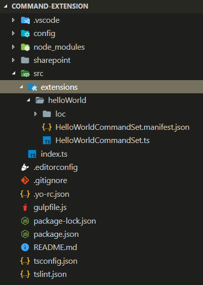
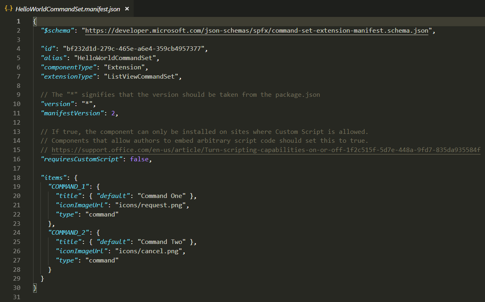
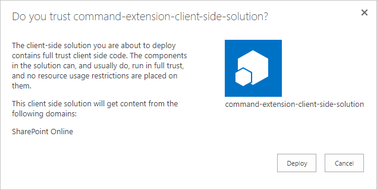

# Build your first ListView Command Set extension

Extensions are client-side components that run inside the context of a SharePoint page. Extensions can be deployed to SharePoint Online, and you can use modern JavaScript tools and libraries to build them.

You can follow these steps by watching the video on the SharePoint PnP YouTube Channel:

<br/>

> [!Video https://www.youtube.com/embed/JBhgdSgWgdM]

<br/> 

## Create an extension project

1. Create a new project directory in your favorite location.
    
    ```
    md command-extension
    ```
    
2. Go to the project directory.
    
    ```
    cd command-extension
    ```
    
3. Create a new HelloWorld extension by running the Yeoman SharePoint Generator.
    
    ```
    yo @microsoft/sharepoint
    ```
    
4. When prompted:

    * Accept the default value of **command-extension** as your solution name, and then select Enter.
    * Select **SharePoint Online only (latest)**, and select Enter.
    * Select **Use the current folder**, and select Enter.
    * Select **N** to require the extension to be installed on each site explicitly when it's being used. 
    * Select **Extension** as the client-side component type to be created. 
    * Select **ListView Command Set** as the extension type to be created.

5. The next set of prompts ask for specific information about your extension:

    * Accept the default value of **HelloWorld** as your extension name, and then select Enter.
    * Accept the default value of **HelloWorld description** as your extension description, and select Enter.

    

    At this point, Yeoman installs the required dependencies and scaffolds the solution files along with the **HelloWorld** extension. This might take a few minutes.

    When the scaffold is complete, you should see the following message indicating a successful scaffold:

    

    For information about troubleshooting any errors, see [Known issues](../../known-issues-and-common-questions.md).

6. After the scaffolding completes, lock down the version of the project dependencies by running the following command:

    ```sh
    npm shrinkwrap
    ```

7. Next, type the following into the console to start Visual Studio Code.

    ```
    code .
    ```

    > [!NOTE] 
    > Because the SharePoint client-side solution is HTML/TypeScript based, you can use any code editor that supports client-side development to build your extension.

    Note how the default solution structure looks like the solution structure of client-side web parts. This is the basic SharePoint Framework solution structure, with similar configuration options across all solution types.

    

8. Open **HelloWorldCommandSet.manifest.json** in the **src\extensions\helloWorld** folder.

    This file defines your extension type and a unique identifier `id` for your extension. You need this unique identifier later when debugging and deploying your extension to SharePoint.

    Note the actual command definitions in the manifest file. These are the actual buttons that are exposed based on the registration target. In the default template, you find two different buttons: **Command One** and **Command Two**.

    

    Currently, images are not properly referenced unless you are referring to them from absolute locations in a CDN within your manifest. This will be improved in future releases.

## Code your ListView Command Set 

Open the **HelloWorldCommandSet.ts** file in the **src\extensions\helloWorld** folder.

Notice that the base class for the ListView Command Set is imported from the **sp-listview-extensibility** package, which contains SharePoint Framework code required by the ListView Command Set.

```typescript
import { override } from '@microsoft/decorators';
import { Log } from '@microsoft/sp-core-library';
import {
  BaseListViewCommandSet,
  Command,
  IListViewCommandSetListViewUpdatedParameters,
  IListViewCommandSetExecuteEventParameters
} from '@microsoft/sp-listview-extensibility';
import { Dialog } from '@microsoft/sp-dialog';
```

The behavior for your custom buttons is contained in the **onListViewUpdated()** and **OnExecute()** methods.

The **onListViewUpdated()** event occurs separately for each command (for example, a menu item) whenever a change happens in the ListView, and the UI needs to be re-rendered. The `event` function parameter represents information about the command being rendered. The handler can use this information to customize the title or adjust the visibility, for example, if a command should only be shown when a certain number of items are selected in the list view. This is the default implementation.

When using the method `tryGetCommand`, you get a Command object, which is a representation of the command that shows in the UI. You can modify its values, such as `title`, or `visible`, to modify the UI element. SPFx uses this information when re-rendering the commands. These objects keep the state from the last render, so if a command is set to `visible = false`, it remains invisible until it is set back to `visible = true`.

```typescript
  @override
  public onListViewUpdated(event: IListViewCommandSetListViewUpdatedParameters): void {
    const compareOneCommand: Command = this.tryGetCommand('COMMAND_1');
    if (compareOneCommand) {
      // This command should be hidden unless exactly one row is selected.
      compareOneCommand.visible = event.selectedRows.length === 1;
    }
  }
```

The **OnExecute()** method defines what happens when a command is executed (for example, the menu item is selected). In the default implementation, different messages are shown based on which button was selected. 


```typescript
  @override
  public onExecute(event: IListViewCommandSetExecuteEventParameters): void {
    switch (event.itemId) {
      case 'COMMAND_1':
        Dialog.alert(`${this.properties.sampleTextOne}`);
        break;
      case 'COMMAND_2':
        Dialog.alert(`${this.properties.sampleTextTwo}`);
        break;
      default:
        throw new Error('Unknown command');
    }
  }
```


## Debug your ListView Command Set

You cannot currently use the local Workbench to test SharePoint Framework Extensions. You'll need to test and develop them directly against a live SharePoint Online site. You don't have to deploy your customization to the app catalog to do this, which makes the debugging experience simple and efficient. 

1. Compile your code and host the compiled files from the local machine by running this command:

    ```
    gulp serve --nobrowser
    ```

    You use the `--nobrowser` option because you don't need to launch the local Workbench, since you can't debug extensions locally.

    When the code compiles without errors, it serves the resulting manifest from https://localhost:4321.

2. Go to any SharePoint list in your SharePoint Online site by using the modern experience.
    
    Because our ListView Command Set is hosted from localhost and is running, we can use specific debug query parameters to execute the code in the list view.
    
3. Append the following query string parameters to the URL. Notice that you need to update the GUID to match the ID of your ListView Command Set Extension available in the **HelloWorldCommandSet.manifest.json** file. For more information, see [More details about the URL query parameters](#more-details-about-the-url-query-parameters).
    
    ```
    ?loadSpfx=true&debugManifestsFile=https://localhost:4321/temp/manifests.js&customActions={"a8047e2f-30d5-40fc-b880-b2890c7c16d6":{"location":"ClientSideExtension.ListViewCommandSet.CommandBar","properties":{"sampleTextOne":"One item is selected in the list.","sampleTextTwo":"This command is always visible."}}}
    ```

    The full URL should look similar to the following, depending on your tenant URL and the location of the list.

    ```
    contoso.sharepoint.com/Lists/Orders/AllItems.aspx?loadSpfx=true&debugManifestsFile=https://localhost:4321/temp/manifests.js&customActions={"a8047e2f-30d5-40fc-b880-b2890c7c16d6":{"location":"ClientSideExtension.ListViewCommandSet.CommandBar","properties":{"sampleTextOne":"One item is selected in the list.","sampleTextTwo":"This command is always visible."}}}
    ```

4. Accept the loading of debug manifests by selecting **Load debug scripts** when prompted.
    
    
    
5. Notice the new **Command Two** button available in the toolbar. Select that button to see the text provided as property for the `sampleTextTwo` property.

    

6. The **Command One** button is not visible based on the code, until one row is selected in the document library. Upload or create a document to the library and confirm that the second button is visible.

    

7. Select **Command Two** to see how the dialog control works, which is used in the default output from the solution scaffolding when the ListView Command Set is selected as the extension type. 

    


### More details about the URL query parameters

- **loadSPFX=true** ensures that the SharePoint Framework is loaded on the page. For performance reasons, the framework is not normally loaded unless at least one extension is registered. Because no components are registered yet, we must explicitly load the framework.
- **debugManifestsFile** specifies that we want to load SPFx components that are being locally served. The loader only looks for components in the app catalog (for your deployed solution) and the SharePoint manifest server (for the system libraries).
- **customActions** simulates a custom action. You can set many properties on this `CustomAction` object that affect the look, feel, and location of your button; we’ll cover them all later.
    - **Key**: GUID of the extension.
    - **Location**: Where the commands are displayed. The possible values are:
        - **ClientSideExtension.ListViewCommandSet.ContextMenu**:  The context menu of the item(s).
        - **ClientSideExtension.ListViewCommandSet.CommandBar**: The top command set menu in a list or library.
        - **ClientSideExtension.ListViewCommandSet**: Both the context menu and the command bar (corresponds to SPUserCustomAction.Location="CommandUI.Ribbon").
    - **Properties**: An optional JSON object containing properties that are available via the `this.properties` member.

<br/>

## Enhance the ListView Command Set rendering

The default solution takes advantage of a new Dialog API, which can be used to show modal dialogs easily from your code. In the following steps, we'll slightly modify the default experience to demonstrate Dialog API use cases.

1. Return to the console, and execute the following command to include the Dialog API in our solution.

2. Return to Visual Studio Code (or your preferred editor).

3. Open **HelloWorldCommandSet.ts** from the **src\extensions\helloWorld** folder.

4. Add the following import statement for the `Dialog` class from `@microsoft/sp-dialog` after the existing import statements. 

5. Update the **onExecute** method as follows:
    
    ```typescript
      @override
      public onExecute(event: IListViewCommandSetExecuteEventParameters): void {
        switch (event.itemId) {
          case 'COMMAND_1':
            Dialog.alert(`Clicked ${strings.Command1}`);
            break;
          case 'COMMAND_2':
            Dialog.prompt(`Clicked ${strings.Command2}. Enter something to alert:`).then((value: string) => {
              Dialog.alert(value);
            });
            break;
          default:
            throw new Error('Unknown command');
        }
      }
    ``` 
    
6. In your console window, ensure that you do not have any exceptions. If you do not already have the solution running in localhost, execute the following command:

    ```
    gulp serve --nobrowser
    ```

7. In the list view, use the same query parameters used previously with the ID matching your extension identifier available in the **HelloWorldCommandSet.manifest.json** file.

8. Accept the loading of debug manifests by selecting **Load debug scripts** when prompted.

    

    We still have the same buttons in the toolbar, but you'll notice they behave differently if you select them one-by-one. Now we are using the new Dialog API, which can be easily used with your solutions, even for complex scenarios. 

    


## Add a ListView Command Set to a solution package for deployment

1. Return to your solution in Visual Studio Code (or to your preferred editor).

2. Extend the **sharepoint** folder and **assets** subfolder in the root of the solution to see the existing **elements.xml** file. 
    
    
    
### Review the elements.xml file 

Open the **elements.xml** file inside the **sharepoint\assets** folder.

Note the following XML structure in **elements.xml**. The **ClientSideComponentId** property has been automatically updated to the unique ID of your ListView Command Set available in the **HelloWorldCommandSet.manifest.json** file in the **src\extensions\helloWorld** folder.

Notice that we use a specific location value of `ClientSideExtension.ListViewCommandSet.CommandBar` to define that this is a ListView Command Set and it should be displayed in the command bar. We also define the `RegistrationId` as **100** and the `RegistrationType` as **List** to associate this custom action automatically with generic lists. `ClientSideComponentProperties` can be used to provide instance specific configurations. In this case, we are using default properties called *sampleTextOne* and *sampleTextTwo*.

```xml
<?xml version="1.0" encoding="utf-8"?>
<Elements xmlns="http://schemas.microsoft.com/sharepoint/">

    <CustomAction 
        Title="SPFxListViewCommandSet"
        RegistrationId="100"
        RegistrationType="List"
        Location="ClientSideExtension.ListViewCommandSet.CommandBar"
        ClientSideComponentId="5fc73e12-8085-4a4b-8743-f6d02ffe1240"
        ClientSideComponentProperties="{&quot;sampleTextOne&quot;:&quot;One item is selected in the list.&quot;, &quot;sampleTextTwo&quot;:&quot;This command is always visible.&quot;}">

    </CustomAction>

</Elements>
```

Possible location values that can be used with a ListView Command Set:

* `ClientSideExtension.ListViewCommandSet.CommandBar` - Toolbar of the list or library
* `ClientSideExtension.ListViewCommandSet.ContextMenu` - Context menu for list or library items
* `ClientSideExtension.ListViewCommandSet` - Register commands to both the toolbar and to the context menu

### Ensure that definitions are taken into account within the build pipeline

Open **package-solution.json** from the **config** folder. The **package-solution.json** file defines the package metadata as shown in the following code. To ensure that the **element.xml** file is taken into account while the solution is being packaged, default scaffolding added needed configuration to define a feature framework feature definition for the solution package.

```json
{
  "$schema": "https://dev.office.com/json-schemas/spfx-build/package-solution.schema.json",
  "solution": {
    "name": "command-extension-client-side-solution",
    "id": "690ae189-a4fc-4b98-8f28-d4ec17448b7a",
    "version": "1.0.0.0",
    "features": [
      {
        "title": "Application Extension - Deployment of custom action.",
        "description": "Deploys a custom action with ClientSideComponentId association",
        "id": "e91d5532-3519-4b50-b55e-b142fc74cd8a",
        "version": "1.0.0.0",
        "assets": {
          "elementManifests": [
            "elements.xml"
          ]
        }
      }
    ]
  },
  "paths": {
    "zippedPackage": "solution/command-extension.sppkg"
  }
}
```

## Deploy the extension to SharePoint Online and host JavaScript from local host

Now you are ready to deploy the solution to a SharePoint site and have the `CustomAction` automatically associated on the site level.

1. In the console window, enter the following command to package your client-side solution that contains the extension so that we get the basic structure ready for packaging:
    
    ```
    gulp bundle
    ```
    
2. Execute the following command so that the solution package is created:
    
    ```
    gulp package-solution
    ```
    
    The command creates the package in the **sharepoint/solution** folder:
    
    ```
    command-extension.sppkg
    ```
    
3. Deploy the package that was generated to the app catalog. To do this, go to your tenant's **app catalog** and open the **Apps for SharePoint** library.

4. Upload or drag-and-drop the `command-extension.sppkg` located in the **sharepoint/solution** folder to the app catalog. SharePoint displays a dialog and asks you to trust the client-side solution.

    Note that we did not update the URLs for hosting the solution for this deployment, so the URL is still pointing to `https://localhost:4321`. 
    
5. Select the **Deploy** button.

    

6. In your console, ensure that the solution is running. If it's not running, execute the following command in the solution folder:

    ```
    gulp serve --nobrowser
    ```

7. Go to the site where you want to test SharePoint asset provisioning. This could be any site collection in the tenant where you deployed this solution package.

8. Select the gears icon on the top navigation bar on the right, and then select **Add an app** to go to your Apps page.

9. In the **Search** box, enter **extension**, and then select Enter to filter your apps.

    

10. Select the **command-extension-client-side-solution** app to install the solution on the site. When the installation is complete, refresh the page by selecting F5.

11. When the application has been successfully installed, select **New** from the toolbar on the **Site Contents** page, and then select **List**.

    

12. Provide the name as **Sample**, and then select **Create**.

    Notice how **Command One** and **Command Two** are rendering in the toolbar based on your ListView Command Set customizations. 

    

> [!NOTE]
> If you find an issue in the documentation or in the SharePoint Framework, report that to SharePoint engineering by using the [issue list at the sp-dev-docs repository](https://github.com/SharePoint/sp-dev-docs/issues). Thanks for your input in advance.

## See also

- [Build your first Field Customizer extension](./building-simple-field-customizer.md)
- [Overview of SharePoint Framework Extensions](../overview-extensions.md)
