# Build your first Field Customizer extension

>**Note:** The SharePoint Framework Extensions are currently in preview and are subject to change. SharePoint Framework Extensions are not currently supported for use in production environments.

Extensions are client-side components that run inside the context of a SharePoint page. Extensions can be deployed to SharePoint Online and you can use modern JavaScript tools and libraries to build them.

>**Note:** Before following the steps in this article, be sure to [Set up your development environment](../../set-up-your-development-environment). Notice that extensions are currently **ONLY** available from Office 365 developer tenants.

## Create an extension project
Create a new project directory in your favorite location.

```
md field-extension
```

Go to the project directory.

```
cd field-extension
```

Create a new HelloWorld extension by running the Yeoman SharePoint Generator.

```
yo @microsoft/sharepoint
```

When prompted:

* Accept the default value of **field-extension** as your solution name and press **Enter**.
* Choose **Extension (Preview)** as the client-side component type to be created. 
* Choose **Field Customizer (Preview)** as the extension type to be created.

The next set of prompts will ask for specific information about your extension:

* Accept the default value of **HelloWorld** as your extension name and press **Enter**.
* Accept the default value of **HelloWorld description** as your extension description and press **Enter**.
* Accept the default **No JavaScript Framework** as the framework selection and press **Enter** 

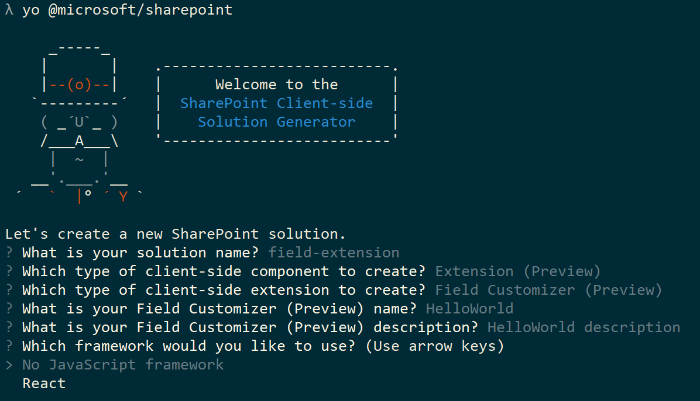

At this point, Yeoman will install the required dependencies and scaffold the solution files along with the **HelloWorld** extension. This might take a few minutes. 

When the scaffold is complete, you should see the following message indicating a successful scaffold:

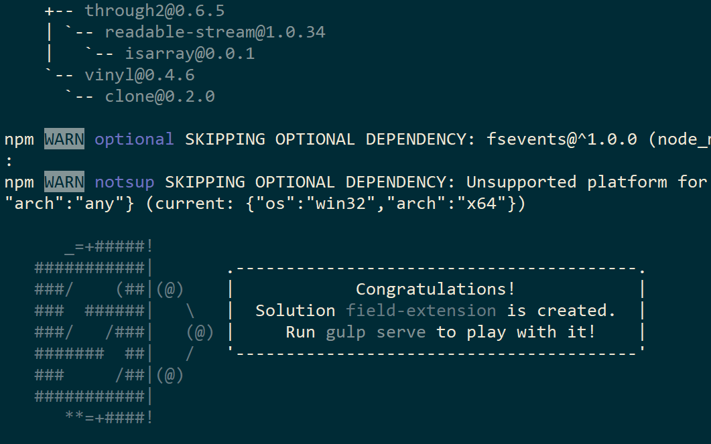

For information about troubleshooting any errors, see [Known issues](../basics/known-issues).

Once the solution scaffolding is completed, type the following into the console to start Visual Studio Code.

```
code .
```

> Notice that because the SharePoint client-side solution is HTML/TypeScript based, you can use any code editor that supports client-side development to build your extension.

Notice how the default solution structure is like the solution structure of client-side web parts. This is the basic SharePoint Framework solution structure with similar configuration options across all solution types.

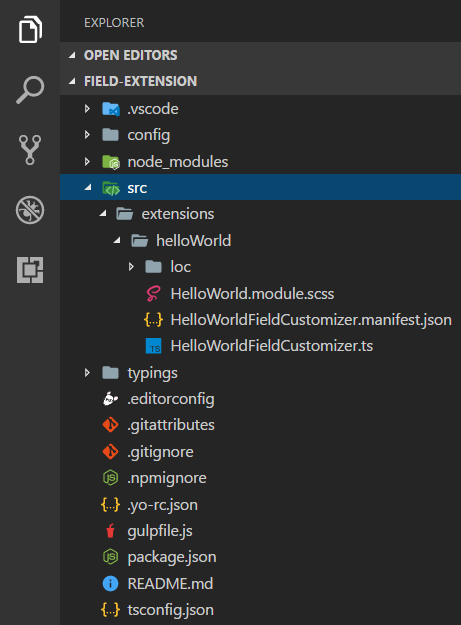

Open **HelloWorldFieldCustomizer.manifest.json** at the **src\extensions\helloWorld** folder.

This file defines your extension type and a unique identifier **“id”** for your extension. You’ll need this unique identifier later when debugging and deploying your extension to SharePoint.

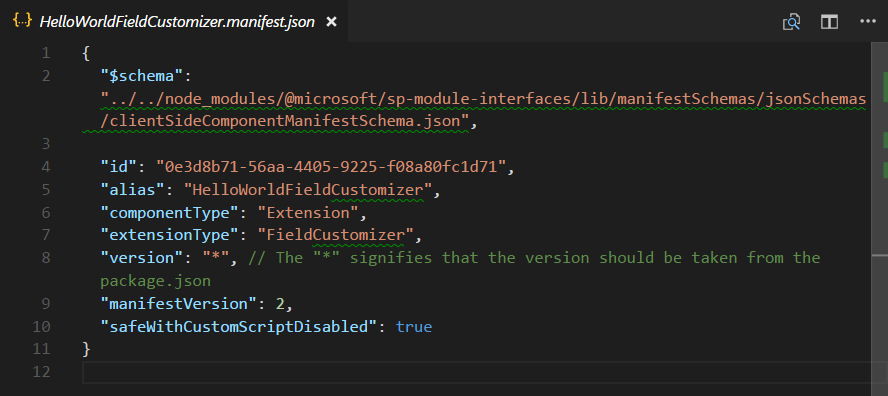

## Coding your Field Customizer 
Open the **HelloWorldFieldCustomizer.ts** file in the **src\extensions\helloWorld** folder.

Notice that the base class for the Field Customizer is imported from the **sp-application-base** package, which contains SharePoint framework code required by the Field Customizer.

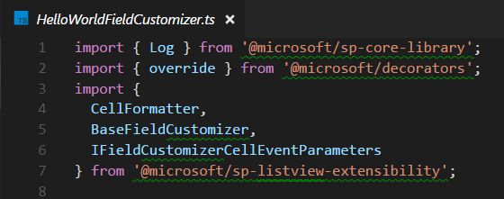

The logic for your Field Customizer is contained in the **OnInit()**, **onRenderCell()**, and **onDisposeCell()** methods.

* **onInit():**  this is where you should perform any setup needed for your extension. This event occurs after `this.context` and `this.properties` are assigned, but before the page DOM is ready. As with web parts, `onInit()` returns a promise that you can use to perform asynchronous operations; `onRenderCell()` will not be called until your promise has resolved. If you don’t need that, simply return `super.onInit()`.
* **onRenderCell():**  This event occurs before each cell is rendered. It provides an `event.cellDiv` HTML element where your code can write its content.
* **onDisposeCell():** This event occurs immediately before the `event.cellDiv` is deleted. It can be used to free any resources that were allocated during field rendering. For example, if `onRenderCell()` mounted a React element, `onDisposeCell()` must be used to free it, otherwise a resource leak would occur. 

Below are the contents of **onRenderCell()** and **onDisposeCell()** in the default solution:


## Debugging your Field Customizer using gulp serve and query string parameters
SharePoint Framework extensions cannot currently be tested using the local workbench, so you'll need to test and develop them directly against a live SharePoint Online site. You do not however need to deploy your customization to the app catalog to do this, which keeps the debugging experience simple and efficient.

First, compile your code and host the compiled files from the local machine by running this command:
```
gulp serve --nobrowser
```

Notice that we used the `--nobrowser` option, since there's no value in launching the local workbench since you currently cannot debug extensions locally.

Once it compiles the code without errors, it will serve the resulting manifest from http://localhost:4321.

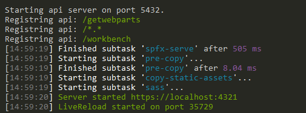

To test your extension, navigate to a site in your SharePoint Online tenant.

Move to the **Site Contents** page.

Click **New** from the toolbar and choose **List**:

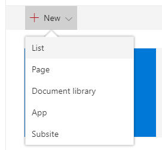

Create a new list named *Orders* and click **Create**:

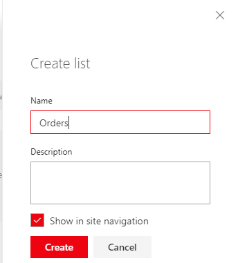

Click the **plus** sign and choose **Number** to create a new Number field for the list:

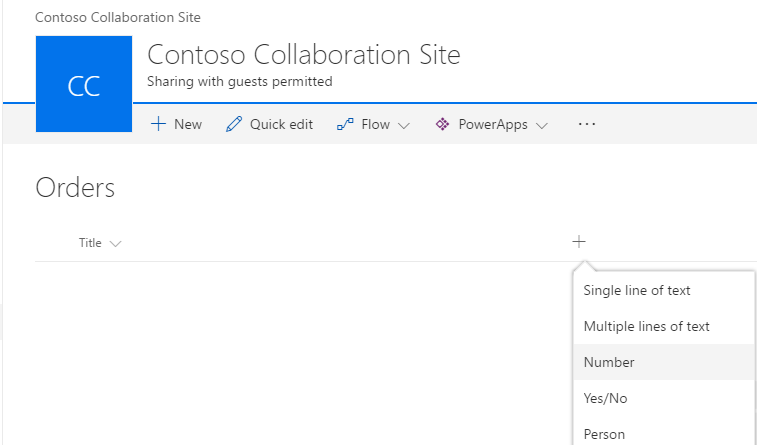

Set name of the field to **Percent** and click **Save**:

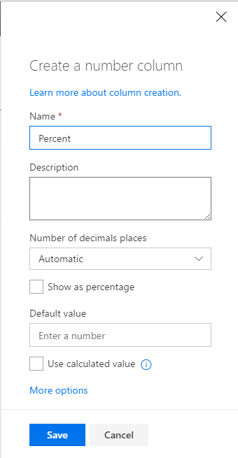

Add a few items with different numbers in the percent field. We'll modify the rendering later in this tutorial, so the different numbers will be presented differently based on your custom implementation.


Since our Field Customizer is still hosted in localhost and is running, we can use specific debug query parameters to execute the code in the newly created list.

Append the following query string parameters to the URL. Notice that you will need to update the id to match your own extension identifier available from the **HelloWorldFieldCustomizer.manifest.json** file:

```
?loadSPFX=true&debugManifestsFile=https://localhost:4321/temp/manifests.js&fieldCustomizers={"Percent":{"id":"0e3d8b71-56aa-4405-9225-f08a80fc1d71","properties":{"sampleText":"Hello!"}}}
```
More detail about the URL query parameters:

* **loadSPFX=true:**  ensures that the SharePoint Framework is loaded on the page. For performance reasons, the framework is not normally loaded unless at least one extension is registered. Since no components are registered yet, we must explicitly load the framework.
* **debugManifestsFile:**  specifies that we want to load SPFx components that are being locally served. Normally the loader only looks for components in the App Catalog (for your deployed solution) and the SharePoint manifest server (for the system libraries).
* **fieldCustomizers**:  Indicates which fields in your list should have their rendering controlled by the Field Customizer. The ID parameter specifies the GUID of the extension that should be used to control the rendering of the field. The properties parameter is an optional text string containing a JSON object that will be deserialized into `this.properties` for your extension.
    * **Key:** use the internal name of the field as the key
    * **Id:** the guid of the field customizer extension associated with this field
    * **Properties:** property values defined in the extension. In this example, *‘sampleText’* is a property defined by the extension

The full URL should look similar to the following, depending on your tenant URL and the location of the newly created list:

```
contoso.sharepoint.com/Lists/Orders/AllItems.aspx?loadSPFX=true&debugManifestsFile=https://localhost:4321/temp/manifests.js&fieldCustomizers={"Percent":{"id":"0e3d8b71-56aa-4405-9225-f08a80fc1d71","properties":{"sampleText":"Hello!"}}}
```

Accept the loading of Debug Manifests, by clicking **Load debug scripts** when prompted:

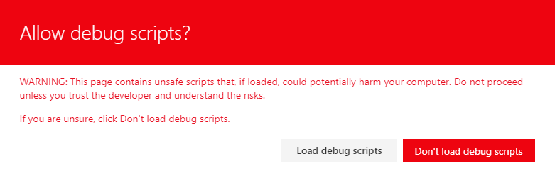

Notice how the Percent values are now presented with additional [ ] characters:

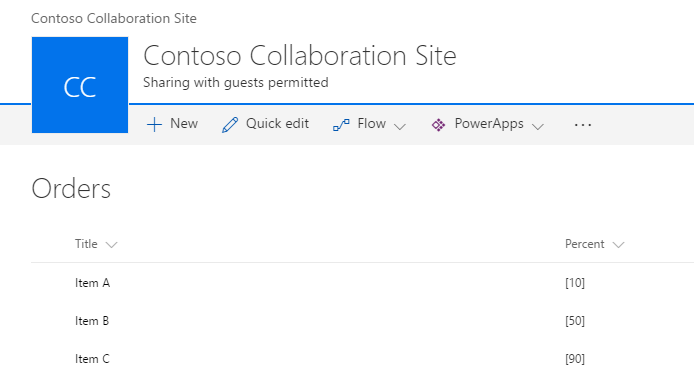

## Enhancing the Field Customizer rendering
Now that we have successfully tested the out of the box starting point of the Field Customizer, let's modify the logic slightly to have a more polished rendering of the field value. 

Open the **HelloWorld.module.scss** file in the **src\extensions\helloWorld** folder and update the styling definition as follows.

```
.HelloWorld {
  .cell {
    display: 'inline-block';
  }
  .full {
    background-color: '#e5e5e5';
    width: '100px';
  }
}

```
Open the **HelloWorldFieldCustomizer.ts** file in the **src\extensions\helloWorld** folder and update the **onRednerCell** method as follows.

```
  @override
  public onRenderCell(event: IFieldCustomizerCellEventParameters): void {

    event.cellDiv.classList.add(styles.cell);
    event.cellDiv.innerHTML = `
                <div class='${styles.full}'>
                  <div style='width: ${event.cellValue}px; background:#0094ff; color:#c0c0c0'>
                    &nbsp; ${event.cellValue}
                  </div>
                </div>`;

  }
```

Switch back to your console window and ensure that you do not have any exceptions. If you do not have the solution running in *locahost*, execute the following command:

```
gulp serve --nobrowser
```

Move back to your previously created list and use the same query parameter as used previously with the Field being 'Percent' and the Id being updated to your extension identifier available from the **HelloWorldFieldCustomizer.manifest.json** file.

Accept the loading of Debug Manifests, by clicking **Load debug scripts** when prompted.


Notice how we have changed the field rendering style completely. The field value is indicated using a graphical representation of the value.

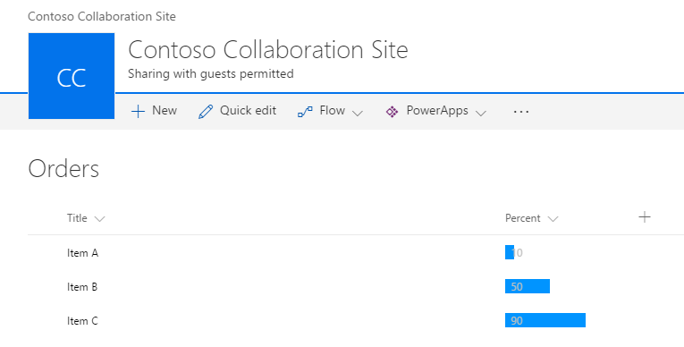

## Add the field definition to the solution package for deployment
Now that we have tested our solution properly in debug mode, we can package this to be deployed automatically as part of the solution package deployed to the sites. There are few things to take care of here.

1. Install the solution package to the site where it should be installed, so that the extension manifest is being white listed for execution
2. Associate the Field Customizer to an existing field in the site. This can be performed programmatically (CSOM/REST) or by using the feature framework inside of the SharePoint Framework solution package. You'll need to associate the following properties in the *SPField* object at the site or list level.
    * **ClientSiteComponentId:** This is the identifier (GUID) of the Field Customizer, which has been installed in the app catalog. 
    * **ClientSideComponentProperties:** This is an optional parameter, which can be used to provide properties for the Field Customizer instance.

> Notice, currently you'll need to install solution packages explicitly to the sites to ensure that the extension is being properly executed. There will be alternative ways to achieve this in the future without site-by-site deployment. 

In the following steps, we'll create a new field definition, which will then be automatically deployed with the needed configurations when the solution package is installed on a site. 

Return to your solution in Visual Studio Code (or to your preferred editor).

We'll first need to create an **assets** folder where we will place all feature framework assets used to provision SharePoint structures when the package is installed.

* Create a folder named **sharepoint** in the root of the solution
* Create a folder named **assets** as a sub folder of the just created **sharepoint** folder

Your solution structure should look similar to the following picture:

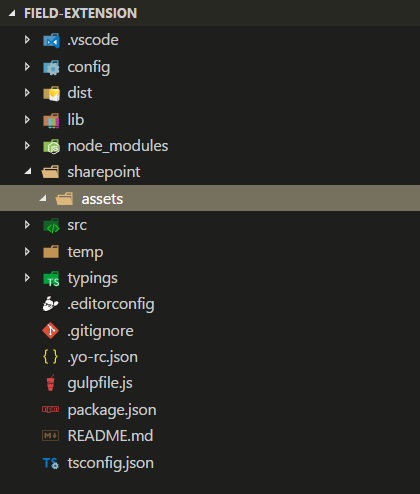

### Add an elements.xml file for SharePoint definitions
Create a new file inside the **sharepoint\assets** folder named **elements.xml**

Copy the following xml structure into **elements.xml**. Be sure to update the **ClientSideComponentId** property to the unique Id of your Field Customizer available in the **HelloWorldFieldCustomizer.manifest.json** file in the** src\extensions\helloWorld** folder.

```xml
<?xml version="1.0" encoding="utf-8"?>
<Elements xmlns="http://schemas.microsoft.com/sharepoint/">

    <Field ID="{060E50AC-E9C1-3D3C-B1F9-DE0BCAC200F6}"
            Name="SPFxPercentage"
            DisplayName="Percentage"
            Type="Number"
            Min="0"
            Required="FALSE"
            Group="SPFx Columns"
            ClientSideComponentId="0e3d8b71-56aa-4405-9225-f08a80fc1d71">
    </Field>

</Elements>
```

### Ensure that definitions are taken into account within the build pipeline

Open **package-solution.json** from the **config** folder. The **package-solution.json** file defines the package metadata as shown in the following code:

```json
{
  "solution": {
    "name": "field-extension-client-side-solution",
    "id": "11cd343e-1ce6-462c-8acb-929804d0c3b2",
    "version": "1.0.0.0"
  },
  "paths": {
    "zippedPackage": "solution/field-extension.sppkg"
  }
}


```

To ensure that our newly added **elements.xml** file is taken into account while solution is being packaged, we'll need to include a Feature Framework feature definition for the solution package. Let's include a JSON definition for the needed feature inside of the solution structure as demonstrated below.

```json
{
  "solution": {
    "name": "field-extension-client-side-solution",
    "id": "11cd343e-1ce6-462c-8acb-929804d0c3b2",
    "version": "1.0.0.0",
    "features": [{
      "title": "Field Extension - Deployment of custom field.",
      "description": "Deploys a custom field with ClientSideComponentId association",
      "id": "123fe847-ced2-3036-b564-8dad5c6c6e83",
      "version": "1.0.0.0",
      "assets": {        
        "elementManifests": [
          "elements.xml"
        ]
      }
    }]
  },
  "paths": {
    "zippedPackage": "solution/field-extension.sppkg"
  }
}

```

## Deploy the field to SharePoint Online and host JavaScript from local host
Now you are ready to deploy the solution to a SharePoint site and to get the field association automatically included in a field. 

In the console window, enter the following command to package your client-side solution that contains the extension, so that we get the basic structure ready for packaging:

```
gulp bundle
```

Next, execute the following command so that the solution package is created:

```
gulp package-solution
```

The command will create the package in the **sharepoint/solution** folder:

```
field-extension.sppkg
```

Next you need to deploy the package that was generated to the App Catalog.

Go to your tenant's **App Catalog** and open the **Apps for SharePoint** library.

Upload or drag and drop the `field-extension.sppkg` located in the **sharepoint/solution** folder to the App Catalog. SharePoint will display a dialog and ask you to trust the client-side solution.

Notice that we did not update the URLs for hosting the solution for this deployment, so the URL is still pointing to https://localhost:4321. Click the **Deploy** button.

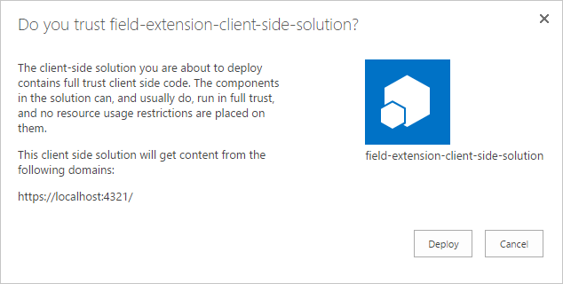

Go to the site where you want to test SharePoint asset provisioning. This could be any site collection in the tenant where you deployed this solution package.

Choose the gears icon on the top navigation bar on the right and choose **Add an app** to go to your Apps page.

In the **Search** box, enter '**field**' and press *Enter* to filter your apps.

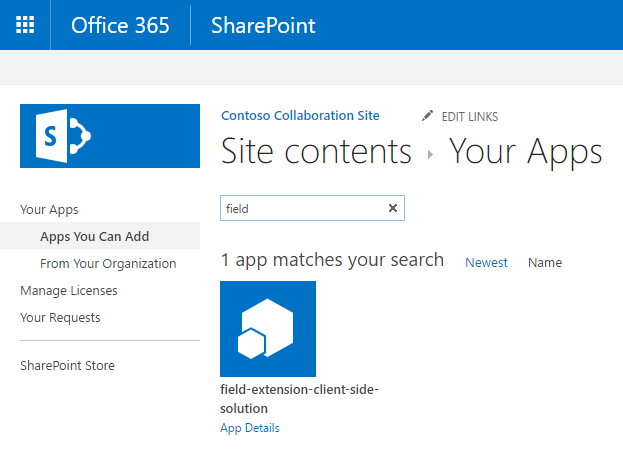

Choose the **field-extension-client-side-solution** app to install the solution on the site. Once the installation is completed, refresh the page by pressing **F5**.

When the solution has been installed, Click **New** from the toolbar in **Site Contents** page and choose **List**:


Create a list named **Invoices**:

When the new list has been created, move back to the **Site Contents** page and choose **Settings** from the context menu of the just created list:


Choose **Add from existing site columns** under the **Columns** section:

Choose the **Percentage** field which was provisioned from the solution package, under the **SPFx Columns** group:

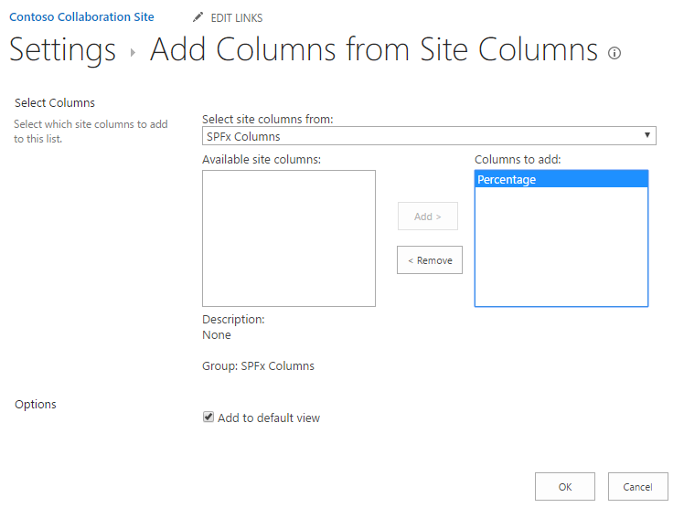

Click **OK**.

Move back to your console and ensure that the solution is running. If it's not running, execute the following command in the solution folder:

```
gulp serve --nobrowser
```
Navigate to the newly created **Invoices** list and add a few new items to the list with different values in the Percentage column to see how the field is being rendered without the Debug query parameters.

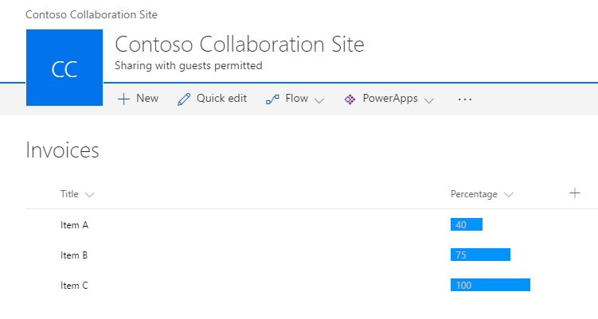

In this case, we continued to host the JavaScript from the localhost, but you could just as well relocate the assets to any CDN and update the URL to enable the loading of the JavaScript assets outside of the localhost as well. 

The process for publishing your app is identical among the different extension types. You can follow the following publishing steps to update the assets to be hosted from a CDN.

* [Deploy extension to Office 365 CDN](./hosting-extension-from-office365-cdn.md).
