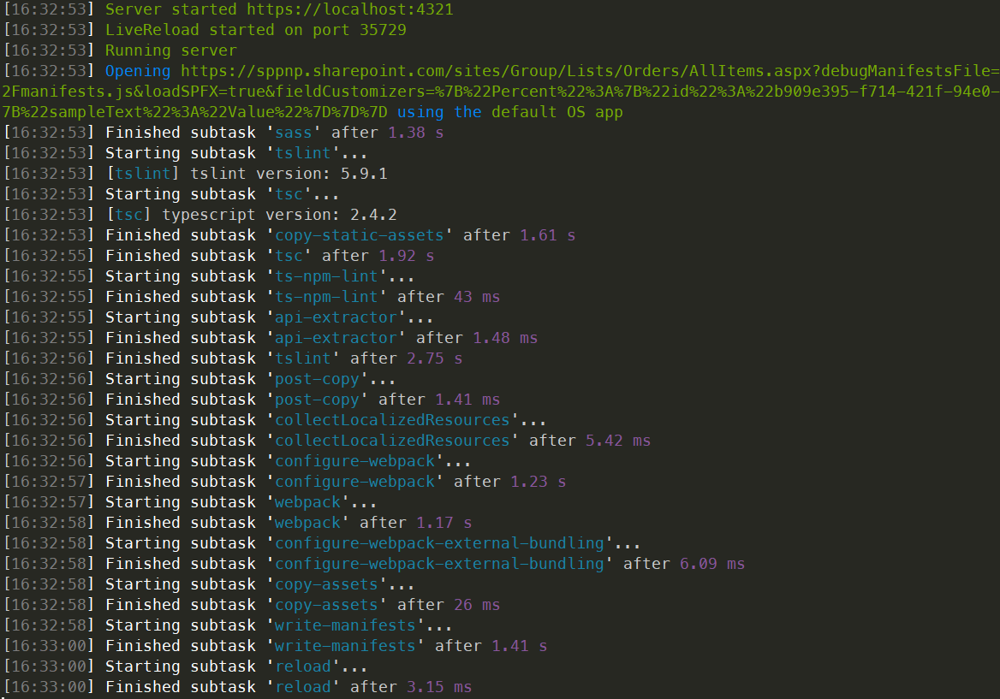
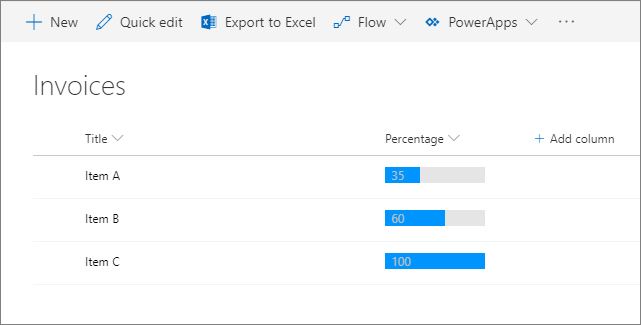

# Build your first Field Customizer extension

Extensions are client-side components that run inside the context of a SharePoint page. Extensions can be deployed to SharePoint Online, and you can use modern JavaScript tools and libraries to build them.

You can follow these steps by watching the video on the [SharePoint PnP YouTube Channel](https://www.youtube.com/watch?v=fijOzUmlXrY&list=PLR9nK3mnD-OXtWO5AIIr7nCR3sWutACpV). 

<a href="https://www.youtube.com/watch?v=4wgZy5tm4yo">

</a>

## Create an extension project

1. Create a new project directory in your favorite location.
    
    ```
    md field-extension
    ```
    
2. Go to the project directory.
    
    ```
    cd field-extension
    ```
    
3. Create a new HelloWorld extension by running the Yeoman SharePoint Generator.
    
    ```
    yo @microsoft/sharepoint
    ```
    
4. When prompted:
    
    * Accept the default value of **field-extension** as your solution name, and then select Enter.
    * Select **SharePoint Online only (latest)**, and select Enter.
    * Select **Use the current folder**, and select Enter.
    * Select **N** to require the extension to be installed on each site explicitly when it's being used.
    * Select **Extension** as the client-side component type to be created. 
    * Select **Field Customizer** as the extension type to be created.
    
5. The next set of prompts ask for specific information about your extension:
     
    * Accept the default value of **HelloWorld** as your extension name, and then select Enter.

    * Accept the default value of **HelloWorld description** as your extension description, and select Enter.

    * Accept the default value of **No JavaScript Framework** as the framework selection, and select Enter. 
    
    
    
    At this point, Yeoman installs the required dependencies and scaffolds the solution files along with the **HelloWorld** extension. This might take a few minutes. 
    
    When the scaffold is complete, you should see the following message indicating a successful scaffold:
    
    
    
    For information about troubleshooting any errors, see [Known issues](../../known-issues-and-common-questions.md).

6. After the scaffolding completes, lock down the version of the project dependencies by running the following command:

    ```sh
    npm shrinkwrap
    ```
    
7. Type the following into the console to start Visual Studio Code.
    
    ```
    code .
    ```
    
    > [!NOTE] 
    > Because the SharePoint client-side solution is HTML/TypeScript based, you can use any code editor that supports client-side development to build your extension.

    Note how the default solution structure looks like the solution structure of client-side web parts. This is the basic SharePoint Framework solution structure, with similar configuration options across all solution types.

    

8. Open **HelloWorldFieldCustomizer.manifest.json** in the **src\extensions\helloWorld** folder.

    This file defines your extension type and a unique identifier `id` for your extension. You need this unique identifier later when debugging and deploying your extension to SharePoint.

    

## Code your Field Customizer 

Open the **HelloWorldFieldCustomizer.ts** file in the **src\extensions\helloWorld** folder.

Notice that the base class for the Field Customizer is imported from the **sp-listview-extensibility** package, which contains SharePoint Framework code required by the Field Customizer.

```typescript
import { Log } from '@microsoft/sp-core-library';
import { override } from '@microsoft/decorators';
import {
  BaseFieldCustomizer,
  IFieldCustomizerCellEventParameters
} from '@microsoft/sp-listview-extensibility';
```

The logic for your Field Customizer is contained in the **OnInit()**, **onRenderCell()**, and **onDisposeCell()** methods.

* **onInit()** is where you should perform any setup needed for your extension. This event occurs after `this.context` and `this.properties` are assigned, but before the page DOM is ready. As with web parts, `onInit()` returns a promise that you can use to perform asynchronous operations; `onRenderCell()` is not called until your promise has resolved. If you don’t need that, simply return `Promise.resolve<void>();`.
* **onRenderCell()** occurs when each cell is rendered. It provides an `event.domElement` HTML element where your code can write its content.
* **onDisposeCell()** occurs immediately before the `event.cellDiv` is deleted. It can be used to free any resources that were allocated during field rendering. For example, if `onRenderCell()` mounted a React element, `onDisposeCell()` must be used to free it; otherwise, a resource leak would occur. 

The following are the contents of **onRenderCell()** and **onDisposeCell()** in the default solution:

```typescript
@override
  public onRenderCell(event: IFieldCustomizerCellEventParameters): void {
    // Use this method to perform your custom cell rendering.
    const text: string = `${this.properties.sampleText}: ${event.fieldValue}`;

    event.domElement.innerText = text;

    event.domElement.classList.add(styles.cell);
  }

  @override
  public onDisposeCell(event: IFieldCustomizerCellEventParameters): void {
    // This method should be used to free any resources that were allocated during rendering.
    // For example, if your onRenderCell() called ReactDOM.render(), then you should
    // call ReactDOM.unmountComponentAtNode() here.
    super.onDisposeCell(event);
  }
```

## Debug your Field Customizer

You cannot currently use the local Workbench to test SharePoint Framework Extensions. You need to test and develop them directly against a live SharePoint Online site. You don't have to deploy your customization to the App Catalog to do this, which makes the debugging experience simple and efficient.

1. Compile your code and host the compiled files from the local machine by running this command:
    
    ```
    gulp serve --nobrowser
    ```
    
    You use the `--nobrowser` option because you don't need to launch the local Workbench, since you can't debug extensions locally.

    When the code compiles without errors, it serves the resulting manifest from https://localhost:4321.

    

2. To test your extension, go to a site in your SharePoint Online tenant.

3. Move to the **Site Contents** page.

4. On the toolbar, select **New**, and then select **List**.
    
    
    
5. Create a new list named **Orders**, and then select **Create**.
    
    
    
6. Select the **plus** sign, and then select **Number** to create a new Number field for the list.
    
    
    
7. Set the name of the field to **Percent**, and then select **Save**.
    
    
    
8. Add a few items with different numbers in the percent field. We'll modify the rendering later in this tutorial, so the different numbers will be presented differently based on your custom implementation.

    

    Because our Field Customizer is still hosted in localhost and is running, we can use specific debug query parameters to execute the code in the newly created list.

9. Append the following query string parameters to the URL. Notice that you need to update the ID to match your own extension identifier available from the **HelloWorldFieldCustomizer.manifest.json** file. For more information, see [More details about the URL query parameters](#more-details-about-the-url-query-parameters). 

    ```
    ?loadSPFX=true&debugManifestsFile=https://localhost:4321/temp/manifests.js&fieldCustomizers={"Percent":{"id":"45a1d299-990d-4917-ba62-7cb67158be16","properties":{"sampleText":"Hello!"}}}
    ```
    
    <br/>

    The full URL should look similar to the following, depending on your tenant URL and the location of the newly created list:
    
    ```
    contoso.sharepoint.com/Lists/Orders/AllItems.aspx?loadSPFX=true&debugManifestsFile=https://localhost:4321/temp/manifests.js&fieldCustomizers={"Percent":{"id":"45a1d299-990d-4917-ba62-7cb67158be16","properties":{"sampleText":"Hello!"}}}
    ```
    
10. Accept the loading of debug manifests by selecting **Load debug scripts** when prompted.

    

    Notice how the Percent values are now presented with an additional prefix string as `Hello!: `, which is provided as a property for the Field Customizer.

    


### More details about the URL query parameters

- **loadSPFX=true** ensures that the SharePoint Framework is loaded on the page. For performance reasons, the framework is not normally loaded unless at least one extension is registered. Because no components are registered yet, we must explicitly load the framework.
- **debugManifestsFile** specifies that you want to load SPFx components that are locally served. The loader only looks for components in the App Catalog (for your deployed solution) and the SharePoint manifest server (for the system libraries).
- **fieldCustomizers** indicates which fields in your list should have their rendering controlled by the Field Customizer. The ID parameter specifies the GUID of the extension that should be used to control the rendering of the field. The properties parameter is an optional text string containing a JSON object that is deserialized into `this.properties` for your extension.
    - **Key**: Use the internal name of the field as the key.
    - **Id**: The GUID of the Field Customizer extension associated with this field.
    - **Properties**: The property values defined in the extension. In this example, `sampleText` is a property defined by the extension.

<br/>

## Enhance the Field Customizer rendering

Now that we have successfully tested the out-of-the-box starting point of the Field Customizer, let's modify the logic slightly to have a more polished rendering of the field value. 

1. Open the **HelloWorld.module.scss** file in the **src\extensions\helloWorld** folder, and update the styling definition as follows.

    ```
    .HelloWorld {
      .cell {
        display: 'inline-block';
      }
      .full {
        background-color: '#e5e5e5';
        width: '100px';
      }
    }

    ```
    
2. Open the **HelloWorldFieldCustomizer.ts** file in the **src\extensions\helloWorld** folder, and update the **onRednerCell** method as follows.

    ```typescript
        @override
        public onRenderCell(event: IFieldCustomizerCellEventParameters): void {

            event.domElement.classList.add(styles.cell);
            event.domElement.innerHTML = `
                    <div class='${styles.HelloWorld}'>
                        <div class='${styles.full}'>
                        <div style='width: ${event.fieldValue}px; background:#0094ff; color:#c0c0c0'>
                            &nbsp; ${event.fieldValue}
                        </div>
                        </div>
                    </div>`;
        }
    ```

3. In your console window, ensure that you do not have any exceptions. If you do not have the solution running in *localhost*, execute the following command:

    ```
    gulp serve --nobrowser
    ```

4. In your previously created list, use the same query parameter as used previously, with the field being `Percent` and the `ID` being updated to your extension identifier available from the **HelloWorldFieldCustomizer.manifest.json** file.

5. Accept the loading of debug manifests by selecting **Load debug scripts** when prompted.

    

    <br/>

    Note how we changed the field rendering style completely. The field value is indicated by using a graphical representation of the value.

    

## Add the field definition to the solution package for deployment

Now that we have tested our solution properly in debug mode, we can package this to be deployed automatically as part of the solution package deployed to the sites. 

1. Install the solution package to the site where it should be installed, so that the extension manifest is white listed for execution.

2. Associate the Field Customizer to an existing field in the site. You can do this programmatically (CSOM/REST) or by using the feature framework inside of the SharePoint Framework solution package. You need to associate the following properties in the `SPField` object at the site or list level.
    - **ClientSiteComponentId** is the identifier (GUID) of the Field Customizer, which has been installed in the App Catalog.
    - **ClientSideComponentProperties** is an optional parameter, which can be used to provide properties for the Field Customizer instance.

    Note that you can control the requirement to add a solution containing your extension to the site by using the `skipFeatureDeployment` setting in **package-solution.json**. Even though you would not require the solution to be installed on the site, you'd need to associate **ClientSideComponentId** to specific objects for the extension to be visible.

    In the following steps, we review the default field definition, which was automatically created and will then be used to automatically deploy needed configurations when the solution package is installed on a site.

3. Return to your solution in Visual Studio Code (or to your preferred editor).

4. Extend the **sharepoint** folder and **assets** subfolder in the root of the solution to see the existing **elements.xml** file. 
    
    

<br/>

### Review the elements.xml file 

Open the **elements.xml** file inside the **sharepoint\assets** folder.

Note the following XML structure in **elements.xml**.  The **ClientSideComponentId** property has been automatically updated to the unique ID of your Field Customizer available in the **HelloWorldFieldCustomizer.manifest.json** file in the **src\extensions\helloWorld** folder.

```xml
<?xml version="1.0" encoding="utf-8"?>
<Elements xmlns="http://schemas.microsoft.com/sharepoint/">

    <Field ID="{060E50AC-E9C1-3D3C-B1F9-DE0BCAC200F6}"
            Name="SPFxPercentage"
            DisplayName="Percentage"
            Type="Number"
            Min="0"
            Required="FALSE"
            Group="SPFx Columns"
            ClientSideComponentId="7e7a4262-d02b-49bf-bfcb-e6ef1716aaef">
    </Field>

</Elements>
```

<br/>

### Ensure that definitions are taken into account within the build pipeline

Open **package-solution.json** from the **config** folder. The **package-solution.json** file defines the package metadata as shown in the following code. To ensure that the **element.xml** file is taken into account while the solution is being packaged, default scaffolding added needed configuration to define a feature framework feature definition for the solution package.

```json
{
  "solution": {
    "name": "field-extension-client-side-solution",
    "id": "11cd343e-1ce6-462c-8acb-929804d0c3b2",
    "version": "1.0.0.0",
    "skipFeatureDeployment": false,
    "features": [{
      "title": "Field Extension - Deployment of custom field.",
      "description": "Deploys a custom field with ClientSideComponentId association",
      "id": "123fe847-ced2-3036-b564-8dad5c6c6e83",
      "version": "1.0.0.0",
      "assets": {        
        "elementManifests": [
          "elements.xml"
        ]
      }
    }]
  },
  "paths": {
    "zippedPackage": "solution/field-extension.sppkg"
  }
}

```


## Deploy the field to SharePoint Online and host JavaScript from local host

Now you are ready to deploy the solution to a SharePoint site and get the field association automatically included in a field. 

1. In the console window, enter the following command to package your client-side solution that contains the extension so that we get the basic structure ready for packaging:

    ```
    gulp bundle
    ```

2. Execute the following command so that the solution package is created:

    ```
    gulp package-solution
    ```

    The command creates the package in the **sharepoint/solution** folder:

    ```
    field-extension.sppkg
    ```

3. You now need to deploy the package that was generated to the App Catalog. To do this, go to your tenant's **App Catalog** and open the **Apps for SharePoint** library.

4. Upload or drag-and-drop the `field-extension.sppkg` located in the **sharepoint/solution** folder to the App Catalog. SharePoint displays a dialog and asks you to trust the client-side solution.

    Note that we did not update the URLs for hosting the solution for this deployment, so the URL is still pointing to `https://localhost:4321`. 
    
5. Select the **Deploy** button.

    

6. Go to the site where you want to test SharePoint asset provisioning. This could be any site collection in the tenant where you deployed this solution package.

7. Select the gears icon on the top navigation bar on the right, and then select **Add an app** to go to your Apps page.

8. In the **Search** box, enter **field**, and then select Enter to filter your apps.

    

9. Select the **field-extension-client-side-solution** app to install the solution on the site. After the installation is complete, refresh the page by selecting F5.

10. When the solution has been installed, select **New** from the toolbar on the **Site Contents** page, and then select **List**.

    

11. Create a list named **Invoices**.

12. When the new list is created, on the **Site Contents** page, select **Settings** from the menu of the newly created list.

    

13. Under **Columns**, select **Add from existing site columns**.

14. Under the **SPFx Columns** group, select the **Percentage** field that was provisioned from the solution package, and then select **OK**.

    

15. On your console, ensure that the solution is running. If it's not running, execute the following command in the solution folder:

    ```
    gulp serve --nobrowser
    ```

16. Go to the newly created **Invoices** list. Add a few items to the list with different values in the Percentage column to determine how the field is rendering without the debug query parameters.



In this case, we continued to host the JavaScript from the localhost, but you could just as well relocate the assets to any CDN and update the URL to enable the loading of the JavaScript assets outside of the localhost as well.

The process for publishing your app is identical among the different extension types. You can use the following publishing steps to update the assets to be hosted from a CDN: [Host extension from Office 365 CDN](./hosting-extension-from-office365-cdn.md).

> [!NOTE]
> If you find an issue in the documentation or in the SharePoint Framework, report that to SharePoint engineering by using the [issue list at the sp-dev-docs repository](https://github.com/SharePoint/sp-dev-docs/issues). Thanks for your input in advance.

## See also

- [Build your first ListView Command Set extension](./building-simple-cmdset-with-dialog-api.md)
- [Overview of SharePoint Framework Extensions](../overview-extensions.md)