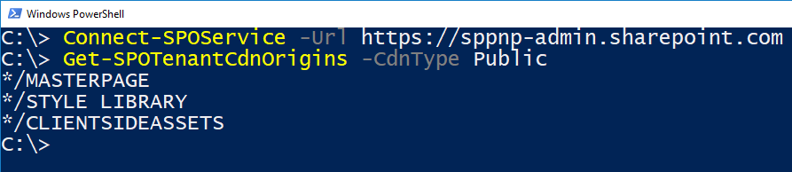

# Host extension from Office 365 CDN (Hello World part 4)

This article describes how to deploy your SharePoint Framework Application Customizer to be hosted from an Office 365 CDN and how to deploy that to SharePoint for end users. 

Be sure you have completed the procedures in the following articles before you begin:

* [Build your first SharePoint Framework Extension (Hello World part 1)](./build-a-hello-world-extension.md)
* [Use page placeholders from Application Customizer (Hello World part 2)](./using-page-placeholder-with-extensions.md)
* [Deploy your extension to SharePoint (Hello World part 3)](./serving-your-extension-from-sharepoint.md)

You can also follow these steps by watching the video on the SharePoint PnP YouTube Channel:

<br/>

> [!Video https://www.youtube.com/embed/q4ZXlqE-MC4]

<br/> 

## Enable the CDN in your Office 365 tenant

Office 365 CDN is the easiest way to host SharePoint Framework solutions directly from your tenant while still taking advantage of the Content Delivery Network (CDN) service for faster load times of your assets.

1. Download the [SharePoint Online Management Shell](https://www.microsoft.com/en-us/download/details.aspx?id=35588) to ensure that you have the latest version.

2. Connect to your SharePoint Online tenant by using PowerShell:
    
    ```powershell
    Connect-SPOService -Url https://contoso-admin.sharepoint.com
    ```
    
3. Get the current status of public CDN settings from the tenant level by executing the following commands one-by-one: 
    
    ```powershell
    Get-SPOTenantCdnEnabled -CdnType Public
    Get-SPOTenantCdnOrigins -CdnType Public
    Get-SPOTenantCdnPolicies -CdnType Public
    ```
    
4. Enable public CDN in the tenant:
    
    ```powershell
    Set-SPOTenantCdnEnabled -CdnType Public
    ```
    
    Public CDN has now been enabled in the tenant by using the default file type configuration allowed. This means that the following file type extensions are supported: CSS, EOT, GIF, ICO, JPEG, JPG, JS, MAP, PNG, SVG, TTF, and WOFF.
    
5. Execute the following command to get the list of CDN origins from your tenant:
    
    ```powershell
    Get-SPOTenantCdnOrigins -CdnType Public
    ```
    
    Note that your newly added origin is listed as a valid CDN origin. Final configuration of the origin takes approximately 15 minutes, so we can continue creating your test extension, which is hosted from the origin after deployment is completed. Following picture shows status without the *pending* message. Notice that you will need to have ***/CLIENTSIDEASSETS** entry for public CDN to be able to use automatic hosting option.

    

    When the origin is listed without the `(configuration pending)` text, it is ready to be used in your tenant. This indicates an on-going configuration between SharePoint Online and the CDN system.

## Update your solution project for the CDN URLs

1. Return to the previously created solution and open **package-solution.json** from the **config** folder. Notice that the **includeClientSideAssets** attribute has to be set to true for automatic asset hosting through Office 365 CDN. This controls if the JavaScript assets and related files are included in the *sppkg file* when solution is packaged for shipping.

    ```json
    {
    "$schema": "https://developer.microsoft.com/json-schemas/spfx-build/package-solution.schema.json",
    "solution": {
        "name": "app-extension-client-side-solution",
        "id": "831b6fac-7668-46b4-96c6-e2ee35559287",
        "version": "1.0.0.0",
        "includeClientSideAssets": true,
        ...
    ```

2. Open **write-manifests.json** file from the **config** folder. This file should be only updated when you are using external CDN system. Ensure that the **cdnBasePath** attribute is exactly as shown below. If it has any other entry, automatic hosting with Office 365 Public CDN will not work.

    ```json
    {
        "$schema": "https://developer.microsoft.com/json-schemas/spfx-build/write-manifests.schema.json",
        "cdnBasePath": "<!-- PATH TO CDN -->"
    }
    ```

3. Execute the following tasks to bundle your solution. This executes a release build of your project. Due the configurations which were applied in the previous steps, it means that all assets are inside of the **sppkg** file and there is not other actions to be performed.
    
    ```
    gulp bundle --ship
    ```
    
4. Execute the following task to package your solution. This command creates an **app-extension.sppkg** package in the **sharepoint/solution** folder.
    
    ```
    gulp package-solution --ship
    ```
    
6. Upload or drag-and-drop the newly created client-side solution package to the app catalog in your tenant, and then select the **Deploy** button. Notice how the domain definition is updated as **SharePoint Online** as your assets will be now automatically hosted with Office 365 CDN.

    

7. Install the new version of the solution to your site, and ensure that it's working properly without your *locahost* hosting the JavaScript file. Notice that if you did NOT remove the package with localhost installation before updating it in the app catalog, your site is automatically running the updated version and placeholders are rendered from the CDN.

    

<br/>

Congratulations, you have enabled a public CDN in your Office 365 tenant and taken advantage of it from your solution!

> [!NOTE]
> If you find an issue in the documentation or in the SharePoint Framework, please report that to SharePoint engineering by using the [issue list at the sp-dev-docs repository](https://github.com/SharePoint/sp-dev-docs/issues) or by adding a comment to this article. Thanks for your input in advance.

## See also

- [Build your first ListView Command Set extension](./building-simple-cmdset-with-dialog-api.md)
- [Build your first Field Customizer extension](./building-simple-field-customizer.md)
- [Overview of SharePoint Framework Extensions](../overview-extensions.md)