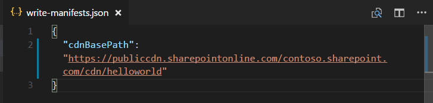

# Hosting extension from Office 365 CDN (Hello world part 4)

>**Note:** The SharePoint Framework Extensions are currently in preview and is subject to change. SharePoint Framework Extensions are not currently supported for use in production environments.

In this article you will learn how to deploy your SharePoint Framework Application Customizer to be hosted from Office 365 CDN and how to deploy that to SharePoint for the end users. This article continues with the hello world extension built in the previous article [# Deploy your extension to site collection (Hello world part 3)](./using-page-placeholder-with-extensions.md) where we hosted customizer still from from localhost.

Be sure you have completed the procedures in the following articles before you start:

* [Build your first SharePoint SharePoint Extension (Hello world part 1)](./build-a-hello-world-extension.md)
* [Connect your client-side web part to SharePoint (Hello world part 2)](./using-page-placeholder-with-extensions.md)
* [Deploy your extension to site collection (Hello world part 3)](./serving-your-extension-from-sharepoint.md)

## Enabled CDN in your Office 365 tenant
Office 365 CDN is the easiest way to host SharePoint Framework solutions directly from your tenant, but still taking advantages of the Content Delivery Network (CDN) service for faster load times of your assets.

## Enable CDN in your Office 365 tenant
Ensure that you have latest version of the SharePoint Online Management Shell by downloading it from [Microsoft Download site](https://www.microsoft.com/en-us/download/details.aspx?id=35588).

Connect to your SharePoint Online tenant with PowerShell session.
```
Connect-SPOService -Url https://contoso-admin.sharepoint.com
```

Get current status of public CDN settings from tenant level by executing following commands one-by-one. 
```
Get-SPOTenantCdnEnabled -CdnType Public
Get-SPOTenantCdnOrigins -CdnType Public
Get-SPOTenantCdnPolicies -CdnType Public
```
Enable public CDN in the tenant
```
Set-SPOTenantCdnEnabled -CdnType Public
```
Now public CDN has been enabled in the tenant using the default file type configuration allowed. This means that the following file type extensions are supported: "CSS,EOT,GIF,ICO,JPEG,JPG,JS,MAP,PNG,SVG,TTF,WOFF".

Open up a browser and move to a site collection where you'd like to host your CDN library. This could be any site collection in your tenant. In this tutorial, we create a specific library to act as your CDN library, but you can also use a specific folder in any existing document library as the CDN endpoint.

Create a new document library on your site collection called **CDN** and add a folder called **helloworld** to it.

 

Move back to your PowerShell console and add a new CDN origin. Update the provided URL below to match your own environment. In this case we are setting origin as `*/cdn`, which means that any relative folder with name of **cdn** will act as CDN origin.
```
Add-SPOTenantCdnOrigin -CdnType Public -OriginUrl */cdn
```
Execute the following command to get the list of CDN origins from your tenant
```
Get-SPOTenantCdnOrigins -CdnType Public
```
Notice that your newly added origin is listed as a valid CDN origin. Final configuration of the origin will take a while (approximately 15 minutes), so we can continue by creating your test extension, which will be hosted from the origin, when the deployment is completed. 


> When origin is listed without the *(configuration pending)* text, it is ready to be used in your tenant. This is the indication of an on-going configuration between SharePoint Online and CDN system. 

## Updating your solution project for the CDN URLs
Move to previously created solution to perform needed URL updates.

```
code .
```
Update the *write-manifests.json* file (under *config* folder) as follow to point to your CDN endpoint. 
- You will need to use the publiccdn.sharepointonline.com as the prefix and then extend the URL with the actual path in your tenant
* Format of the CDN URL is as follows
```
https://publiccdn.sharepointonline.com/<tenant host name>/sites/site/library/folder
```



Save your changes.

Execute the following tasks to bundle your solution
* This will execute a release build of your project using CDN URL specified in the **writer-manifest.json** file. Output of the execution will be located in the **./temp/deploy** folder. These are the files which you will need to upload to the SharePoint folder acting as your CDN endpoint. 

```
gulp bundle --ship
```

Execute the following task to package your solution

```
gulp package-solution --ship
```

This command will create a **app-extension.sppkg** package on the **sharepoint/solution** folder and also prepare the assets on the **temp/deploy folder** to be deployed to the CDN.

Upload or drag & drop the newly created client-side solution package to the app catalog in your tenant. 

UPDUPAUPETPE


Install new version of the solution to your site and ensure that it's working properly.


