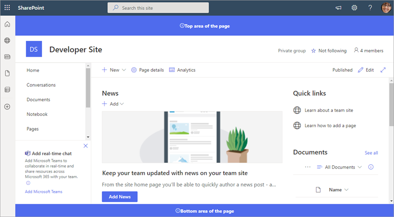

# Host extension from Office 365 CDN (Hello World part 4)

This article describes how to deploy your SharePoint Framework Application Customizer to be hosted from an Office 365 CDN and how to deploy that to SharePoint for end users. 

Be sure you have completed the procedures in the following articles before you begin:

* [Build your first SharePoint Framework Extension (Hello World part 1)](./build-a-hello-world-extension.md)
* [Use page placeholders from Application Customizer (Hello World part 2)](./using-page-placeholder-with-extensions.md)
* [Deploy your extension to SharePoint (Hello World part 3)](./serving-your-extension-from-sharepoint.md)

You can also follow these steps by watching the video on the [SharePoint PnP YouTube Channel](https://www.youtube.com/watch?v=oOIHWamPr34&list=PLR9nK3mnD-OXtWO5AIIr7nCR3sWutACpV). 

<a href="https://www.youtube.com/watch?v=nh1qFArXG2Y">

</a>

## Enable the CDN in your Office 365 tenant

Office 365 CDN is the easiest way to host SharePoint Framework solutions directly from your tenant while still taking advantage of the Content Delivery Network (CDN) service for faster load times of your assets.

1. Download the [SharePoint Online Management Shell](https://www.microsoft.com/en-us/download/details.aspx?id=35588) to ensure that you have the latest version.

2. Connect to your SharePoint Online tenant by using PowerShell:
    
    ```powershell
    Connect-SPOService -Url https://contoso-admin.sharepoint.com
    ```
    
3. Get the current status of public CDN settings from the tenant level by executing the following commands one-by-one: 
    
    ```powershell
    Get-SPOTenantCdnEnabled -CdnType Public
    Get-SPOTenantCdnOrigins -CdnType Public
    Get-SPOTenantCdnPolicies -CdnType Public
    ```
    
4. Enable public CDN in the tenant:
    
    ```powershell
    Set-SPOTenantCdnEnabled -CdnType Public
    ```
    
    Public CDN has now been enabled in the tenant by using the default file type configuration allowed. This means that the following file type extensions are supported: CSS, EOT, GIF, ICO, JPEG, JPG, JS, MAP, PNG, SVG, TTF, and WOFF.

5. Open up a browser and move to a site collection where you'd like to host your CDN library. This could be any site collection in your tenant. In this tutorial, we create a specific library to act as your CDN library, but you can also use a specific folder in any existing document library as the CDN endpoint.

6. Create a new document library on your site collection called **CDN**, and add a folder named **helloworld** to it.
    
     
    
    <br/>
    
7. In the PowerShell console, add a new CDN origin. In this case, we are setting the origin as `*/cdn`, which means that any relative folder with the name of **cdn** acts as a CDN origin.
    
    ```powershell
    Add-SPOTenantCdnOrigin -CdnType Public -OriginUrl */cdn
    ```
    
8. Execute the following command to get the list of CDN origins from your tenant:
    
    ```powershell
    Get-SPOTenantCdnOrigins -CdnType Public
    ```
    
    Note that your newly added origin is listed as a valid CDN origin. Final configuration of the origin takes approximately 15 minutes, so we can continue creating your test extension, which is hosted from the origin after deployment is completed. 

    

    When the origin is listed without the `(configuration pending)` text, it is ready to be used in your tenant. This indicates an on-going configuration between SharePoint Online and the CDN system. 

## Update your solution project for the CDN URLs

1. Return to the previously created solution to perform the needed URL updates.
    
2. Update the **write-manifests.json** file (under the **config** folder) as follows to point to your CDN endpoint. Use `publiccdn.sharepointonline.com` as the prefix, and then extend the URL with the actual path of your tenant. The format of the CDN URL is as follows:
    
    ```json
    https://publiccdn.sharepointonline.com/<tenant host name>/sites/site/library/folder
    ```
    
    

3. Save your changes.

4. Execute the following tasks to bundle your solution. This executes a release build of your project using the CDN URL specified in the **write-manifests.json** file. The output of this command is located in the **./temp/deploy** folder. These are the files that you need to upload to the SharePoint folder acting as your CDN endpoint. 
    
    ```
    gulp bundle --ship
    ```
    
5. Execute the following task to package your solution. This command creates an **app-extension.sppkg** package in the **sharepoint/solution** folder, and prepares the assets in the **temp/deploy** folder to be deployed to the CDN.
    
    ```
    gulp package-solution --ship
    ```
    
6. Upload or drag-and-drop the newly created client-side solution package to the App Catalog in your tenant, and then select the **Deploy** button.

    

7. Upload or drag-and-drop the files in the **temp/deploy** folder to the **CDN/helloworld** folder created earlier.

8. Install the new version of the solution to your site, and ensure that it's working properly without your *locahost* hosting the JavaScript file.

    

<br/>

Congratulations, you have enabled a public CDN in your Office 365 tenant and taken advantage of it from your solution!

> [!NOTE]
> If you find an issue in the documentation or in the SharePoint Framework, report that to SharePoint engineering by using the [issue list at the sp-dev-docs repository](https://github.com/SharePoint/sp-dev-docs/issues). Thanks for your input in advance.

## See also

- [Overview of SharePoint Framework Extensions](../overview-extensions.md)