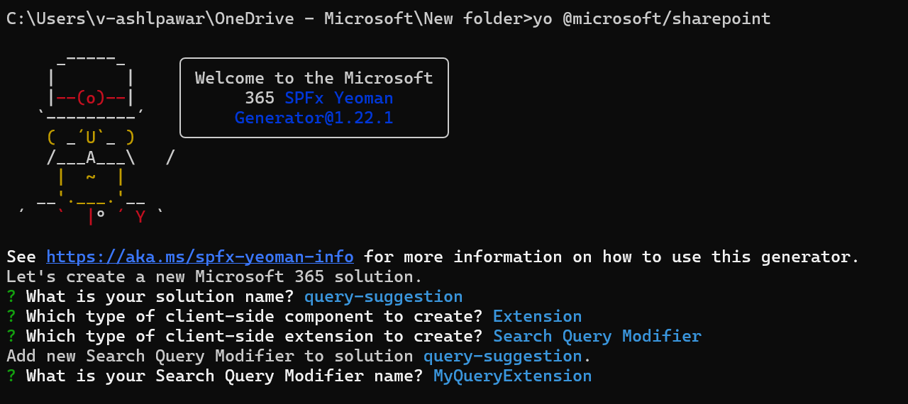
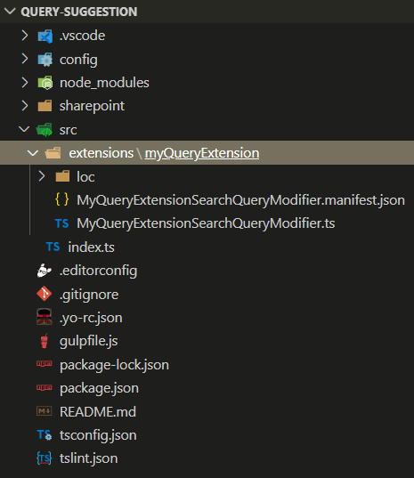

# Building a query suggestion extension using SharePoint Framework

Starting with the SharePoint Framework v1.10, you can also build a query suggestion extensions with SharePoint Framework.

Be sure you have completed the procedures in the following articles before you begin to understand the overall process of SharePoint Framework extension, as Query Suggestion extension work similarly to Application Customizers:

* [Build your first SharePoint Framework Extension (Hello World part 1)](./build-a-hello-world-extension.md)
* [Use page placeholders from Application Customizer (Hello World part 2)](./using-page-placeholder-with-extensions.md)
* [Deploy your extension to SharePoint (Hello World part 3)](./serving-your-extension-from-sharepoint.md)

> [!NOTE]
> This feature was introduced as a developer preview feature. In order to use features in developer preview, ensure you use the `--plusbeta` version of the library (*see [this article for reference](/sharepoint/dev/spfx/try-preview-capabilities)*)

> [!IMPORTANT]
> This lab requires that you are using at least version 1.10 of the SharePoint Framework as these capabilities are not available in earlier versions.

## Create a new solution project

1. Create a new project directory in your favorite location:

    ```console
    md query-extension
    ```

1. Go to the project directory:

    ```console
    cd query-extension
    ```

1. Create a new client-side web part solution by running the Yeoman SharePoint Generator:

    ```console
    yo @microsoft/sharepoint 
    ```

1. When prompted:

    * Accept the default **query-suggestion** as your solution name, and then select Enter.
    * Select **Extension** as the client-side component type to be created.
    * Select **Search Query Modifier** as the client-side extension to be created.

    > [!NOTE]
    > If the **Search Query Modifier** extension is not available, re-start the process and ensure that you used the `--plusbeta` switch when executing the yeoman generator as follows: `yo @microsoft/sharepoint --plusbeta`.

1. The next set of prompts asks for specific information about your web part:

    * Enter **MyQueryExtension** for the extension name, and then select Enter.

    

    At this point, Yeoman installs the required dependencies and scaffolds the solution files. The creation of the solution might take a few minutes. Yeoman scaffolds the project to include your **MyQueryExtension** extension, which can be used to modify runtime the provided search queries.

1. Next, enter the following to open the web part project in Visual Studio Code:

    ```console
    code .
    ```

Notice how the structure looks similar to the other SharePoint Framework solutions. Your extension has been created with the default values under the **extensions\myQueryExtension** folder.

  


## Modifying the query extension code

1. Open the file `MyQueryExtensionSearchQueryModifier.ts` in Visual Studio Code.

1. The default scaffolded code returns the query unmodified. Modify the `modifySearchQuery` method to add custom query logic. In this example, we scope search results to the current site by appending a `Path:` filter:

    ```typescript
    import { Log } from '@microsoft/sp-core-library';
    import {
      BaseSearchQueryModifier, IQuery, SearchQueryScenario
    } from '@microsoft/sp-search-extensibility';

    export interface IMyQueryExtensionSearchQueryModifierProperties {
      testMessage: string;
    }

    const LOG_SOURCE: string = 'MyQueryExtensionSearchQueryModifier';

    export default class MyQueryExtensionSearchQueryModifier
      extends BaseSearchQueryModifier<IMyQueryExtensionSearchQueryModifierProperties> {

      public onInit(): Promise<void> {
        console.log(`[${LOG_SOURCE}] Initialized MyQueryExtensionSearchQueryModifier`);
        return Promise.resolve();
      }

      public modifySearchQuery(query: IQuery, scenario: SearchQueryScenario): Promise<IQuery> {
        console.log(`[${LOG_SOURCE}] Original query: "${query.queryText}" | Scenario: ${scenario}`);

        if (scenario === SearchQueryScenario.SearchResults) {
          const enhancedQueryText: string =
            `${query.queryText} Path:${this.context.pageContext.web.absoluteUrl}`;
          console.log(`[${LOG_SOURCE}] Enhanced query: "${enhancedQueryText}"`);
          query.queryText = enhancedQueryText;
        }

        return Promise.resolve(query);
      }
    }
    ```

1. Save the file.


## Installing the solution to SharePoint

1. Build and package the solution for production:

    ```console
    heft build --production
    heft package-solution --production
    ```

    This creates the file `query-suggestion.sppkg`.

1. Install to the app catalog:

    * Navigate to your tenant App Catalog: `https://{tenantDomain}.sharepoint.com/sites/appcatalog/_layouts/15/AppCatalog.aspx`.
    * Click **Upload** and select the `query-suggestion.sppkg` file.
    * In the trust dialog, click **Deploy**.

1. Install to the site:

    * Navigate to the target site where you want to test.
    * Go to **Site Contents** → **New** → **App**.
    * Find `query-suggestion-client-side-solution` and click **Add**.
    * Wait for the app status to show **Added**.

## Configuring custom search results page

Query extensions only work when the site collection is associated to use a custom search results page. You need to create a search results page and configure it in site settings.

1. Create a search results page:

    * Navigate to **Site Pages** on your target site.
    * Click **New** → **Site Page**.
    * Name the page **SearchResults**.
    * Click **Publish**.

1. Configure custom search experience in Site Settings:

    * Navigate to **Site Settings** → **Search Settings** (or go directly to `https://{tenantDomain}.sharepoint.com/sites/{siteName}/_layouts/15/enhancedSearch.aspx?level=site`).
    * Under **"Which search results page should queries be sent to?"**, select **"Send queries to a custom results page URL"**.
    * Enter the Results page URL: `/sites/{siteName}/SitePages/SearchResults.aspx`
    * Leave the **Search Center URL** field empty.
    * Click **OK**.

> [!NOTE]
> Search settings changes can take up to 30 minutes to take effect. Use an InPrivate/Incognito browser window to avoid cache issues.

## Testing the extension

1. Open an InPrivate/Incognito browser window.

1. Navigate to your site: `https://{tenantDomain}.sharepoint.com/sites/{siteName}`

1. Type a search query in the search box (e.g., **page1**) and press **Enter**.

1. The browser should redirect to your custom search results page: `SearchResults.aspx?q=page1&k=page1`

1. Open **F12 Developer Tools** → **Console** tab.

1. You should see the following logs confirming the extension is working:

    ```console
    [MyQueryExtensionSearchQueryModifier] Initialized MyQueryExtensionSearchQueryModifier
    [MyQueryExtensionSearchQueryModifier] Original query: "page1" | Scenario: 1
    [MyQueryExtensionSearchQueryModifier] Enhanced query: "page1 Path:https://{tenantDomain}.sharepoint.com/sites/{siteName}"
    ```

This confirms the query extension is intercepting and modifying search queries before they are executed.

