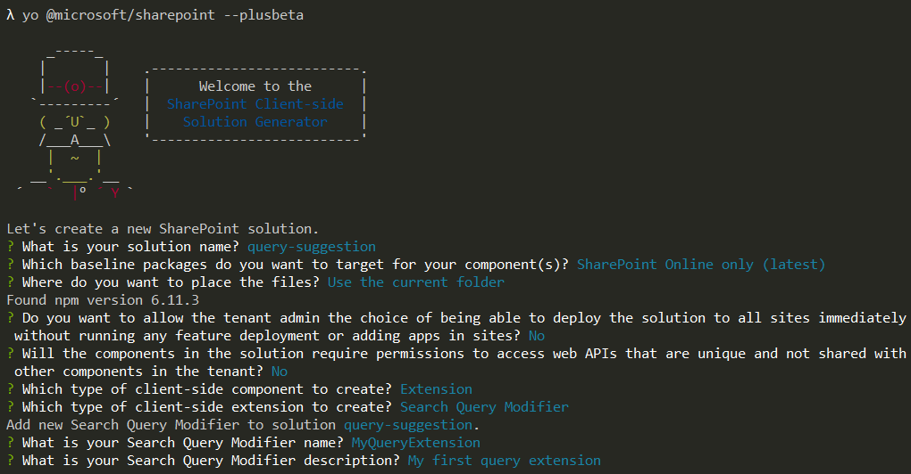

# Building a query suggestion extension using SharePoint Framework

Starting with the SharePoint Framework v1.10, you can also build a query suggestion extensions with SharePoint Framework.

Be sure you have completed the procedures in the following articles before you begin to understand the overall process of SharePoint Framework extension, as Query Suggestion extension is working in similar ways as Application Customizers:

* [Build your first SharePoint Framework Extension (Hello World part 1)](./build-a-hello-world-extension.md)
* [Use page placeholders from Application Customizer (Hello World part 2)](./using-page-placeholder-with-extensions.md)
* [Deploy your extension to SharePoint (Hello World part 3)](./serving-your-extension-from-sharepoint.md)

> [!NOTE]
> This feature was introduced as a developer preview feature. In order to use features in developer preview, ensure you use the `--plusbeta` version of the library (*see [this article for reference](https://docs.microsoft.com/sharepoint/dev/spfx/try-preview-capabilities)*)

> [!IMPORTANT]
> This lab requires that you are using at least version 1.10 of the SharePoint Framework as these capabilities are not available in earlier versions.

## Create a new solution project

1. Create a new project directory in your favorite location:

    ```shell
    md query-extension
    ```

1. Go to the project directory:

    ```shell
    cd query-extension
    ```

1. Create a new client-side web part solution by running the Yeoman SharePoint Generator:

    ```shell
    yo @microsoft/sharepoint --plusbeta
    ```

1. When prompted:

    * Accept the default **query-suggestion** as your solution name, and then select Enter.
    * Select **SharePoint Online only (latest)**, and then select Enter.
    * Select **Use the current folder** as the location for the files.
    * Select **N** as we want this extension to be explicitly installed on specific site given the automated configuration which will be applied
    * Select **N** on the question if solution contains unique permissions.  
    * Select **Extension** as the client-side component type to be created.
    * Select **Search Query Modifier** as the client-side extension to be created.

    > [!NOTE]
    > If the **Search Query Modifier** extension is not available, re-start the process and ensure that you used the `--plusbeta` switch when executing the yeoman generator as follows: `yo @microsoft/sharepoint --plusbeta`.

1. The next set of prompts asks for specific information about your web part:

    * Enter **MyQueryExtension** for the extension name, and then select Enter.
    * Enter **My first query extension** as the description of the extension, and then select Enter. 
    * Accept the default **No JavaScript web framework** option for the framework, and then select Enter to continue.

    

    At this point, Yeoman installs the required dependencies and scaffolds the solution files. Creation of the solution might take a few minutes. Yeoman scaffolds the project to include your **MyQueryExtension** extension, which can be used to modify runtime the provided search queries.

1. Next, enter the following to open the web part project in Visual Studio Code:

    ```shell
    code .
    ```

Notice how the structure looks similar as for the other SharePoint Framework solutions. Your extension has been created with the default values under the **extensions\myQueryExtension** folder

  


## Modifying the query extension code

Open file

Modify

Save


## Installing solution to SharePoint

Build

Package

Install to app catalog

Install to site

## Installing modern search open-source solution

PowerShell execute and test things

## Activating custom search experience

PowerShell execute and test things