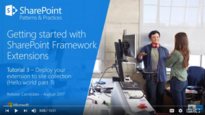
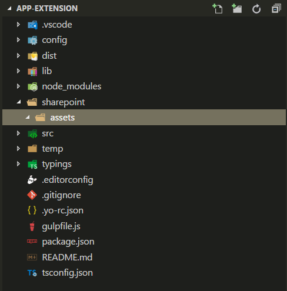
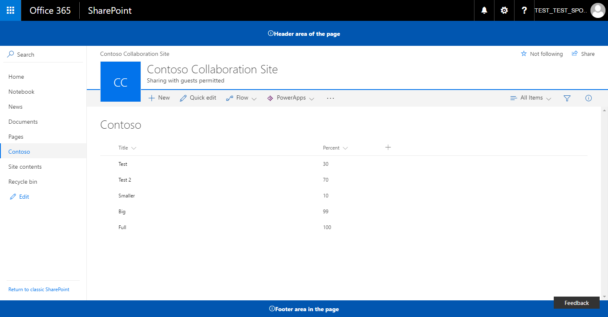

# Deploy your extension to SharePoint (Hello world part 3)

>**Note:** The SharePoint Framework Extensions are currently in preview and are subject to change. SharePoint Framework Extensions are not currently supported for use in production environments.

In this article, you will learn how to deploy your SharePoint Framework Application Customizer to SharePoint and see it working on modern SharePoint pages. This article continues with the hello world extension built in the previous article [Using page placeholders from Application Customizer (Hello World part 2)](./using-page-placeholder-with-extensions.md).

Be sure you have completed the procedures in the following articles before you begin:

* [Build your first SharePoint Framework Extension (Hello World part 1)](./build-a-hello-world-extension.md)
* [Using page placeholders from Application Customizer (Hello World part 2)](./using-page-placeholder-with-extensions.md)

You can also follow these steps by watching the video on the [SharePoint PnP YouTube Channel](https://www.youtube.com/watch?v=P_yWI0WVQIg&list=PLR9nK3mnD-OXtWO5AIIr7nCR3sWutACpV). 

<a href="https://www.youtube.com/watch?v=P_yWI0WVQIg&list=PLR9nK3mnD-OXtWO5AIIr7nCR3sWutACpV">

</a>

## Package the helloWorld Application Customizer
In the console window, go to the extension project directory created in [Build your first SharePoint Framework Extension (Hello World part 1)](./build-a-hello-world-extension.md)

```
cd app-extension
```
If gulp serve is still running, stop it from running by pressing `Ctrl+C`.

Unlike in **Debug** mode, in order to use an extension on modern SharePoint server-side pages, you need to deploy and register the extension with SharePoint in either `Site collection`, `Site`, or `List` scope. The scope defines where and how the Application Customizer will be active. In this particular scenario, we'll register the Application Customizer using the `Site Collection` scope. 

Before we package our solution, we want to include the code needed to automate the extension activation within the site, whenever the solution is installed on the site. In this case, we'll use feature framework elements to perform these actions directly in the solution package, but you could also associate the application customizer to a SharePoint site using REST or CSOM as part of the site provisioning, for example.

1. Install the solution package to the site where it should be installed, so that extension manifest is being white listed for execution
2. Associate the Application Customizer to the planned scope. This can be performed programmatically (CSOM/REST) or by using the feature framework inside of the SharePoint Framework solution package. You'll need to associate the following properties in the `UserCustomAction` object at the site collection, site or list level.
    * **ClientSideComponentId:** This is the identifier (GUID) of the Field Customizer, which has been installed in the app catalog. 
    * **ClientSideComponentProperties:** This is an optional parameter, which can be used to provide properties for the Field Customizer instance

> Notice, you can control the requirement to add a solution containing your extension to the site by using `skipFeatureDeployment` setting in **package-solution.json**. Event though you would not require solution to be installed on the site, you'd need to associate **ClientSideComponentId** to specific objects for the extension to be visible. 

In the following steps, we'll create a new `CustomAction` definition, which will then be automatically deployed with the needed configurations when the solution package is installed on a site. 

Return to your solution package in Visual Studio Code (or to your preferred editor).

We'll first need to create an **assets** folder where we will place all feature framework assets used to provision SharePoint structures when the package is installed.

* Create a folder named **sharepoint** in the root of the solution
* Create a folder named **assets** as a sub folder of the just created **sharepoint** folder

Your solution structure should look similar to the following picture:



### Add an elements.xml file for SharePoint definitions

Create a new file inside the **sharepoint\assets** folder named **elements.xml**

Copy the following xml structure into **elements.xml**. Be sure to update the **ClientSideComponentId** property to the unique Id of your Application Customizer available in the **HelloWorldApplicationCustomizer.manifest.json** file in the **src\extensions\helloWorld** folder.

We also set the **ClientSideComponentProperties** and pass JSON properties for this extension instance. Notice how the JSON is escaped so that we can set it properly within an XML attribute. 

Notice also that we use the specific location of `ClientSideExtension.ApplicationCustomizer` to define that this is an Application Customizer. Since by default this **elements.xml** will be associated to a *Web* scoped feature, this `CustomAction` will be automatically added to the `Web.UserCustomAction` collection in the site where the solution is being installed.

```xml
<?xml version="1.0" encoding="utf-8"?>
<Elements xmlns="http://schemas.microsoft.com/sharepoint/">

    <CustomAction 
        Title="SPFxApplicationCustomizer"
        Location="ClientSideExtension.ApplicationCustomizer"
        ClientSideComponentId="46606aa6-5dd8-4792-b017-1555ec0a43a4"
        ClientSideComponentProperties="{&quot;Top&quot;:&quot;Top area of the page&quot;,&quot;Bottom&quot;:&quot;Bottom area in the page&quot;}">

    </CustomAction>

</Elements>
```

### Ensure that definitions are taken into account within the build pipeline

Open **package-solution.json** from the **config** folder. The **package-solution.json** file defines the package metadata as shown in the following code:

```json
{
  "solution": {
    "name": "app-extension-client-side-solution",
    "id": "02d35a3e-5896-4664-874f-9fe9fdfe8408",
    "version": "1.0.0.0",
    "skipFeatureDeployment": false
  },
  "paths": {
    "zippedPackage": "solution/app-extension.sppkg"
  }
}

```

To ensure that our newly added **element.xml** file is taken into account while the solution is being packaged, we'll need to include a Feature Framework feature definition for the solution package. Let's include a JSON definition for the needed feature inside of the solution structure as demonstrated below.

```json
{
  "solution": {
    "name": "app-extension-client-side-solution",
    "id": "02d35a3e-5896-4664-874f-9fe9fdfe8408",
    "version": "1.0.0.0",
    "skipFeatureDeployment": false,
    "features": [{
      "title": "Application Extension - Deployment of custom action.",
      "description": "Deploys a custom action with ClientSideComponentId association",
      "id": "456da147-ced2-3036-b564-8dad5c1c2e34",
      "version": "1.0.0.0",
      "assets": {        
        "elementManifests": [
          "elements.xml"
        ]
      }
    }]
  },
  "paths": {
    "zippedPackage": "solution/app-extension.sppkg"
  }
}

```

## Deploy the extension to SharePoint Online and host JavaScript from local host

Now you are ready to deploy the solution to a SharePoint site and to have the `CustomAction` automatically associated on the site level.

In the console window, enter the following command to package your client-side solution that contains the extension, so that we get the basic structure ready for packaging:

```
gulp bundle
```

Next, execute the following command so that the solution package is created:

```
gulp package-solution
```

The command will create the package in the **sharepoint/solution** folder:

```
app-extension.sppkg
```

Next you need to deploy the package that was generated to the App Catalog.

Go to your tenant's **App Catalog** and open the **Apps for SharePoint** library.

Upload or drag and drop the `app-extension.sppkg` located in the **sharepoint/solution** folder to the App Catalog. SharePoint will display a dialog and ask you to trust the client-side solution.

Notice that we did not update the URLs for hosting the solution for this deployment, so the URL is still pointing to `https://localhost:4321`. Click the **Deploy** button.


Move back to your console and ensure that the solution is running. If it's not running, execute the following command in the solution folder:

```
gulp serve --nobrowser
```

Go to the site where you want to test SharePoint asset provisioning. This could be any site collection in the tenant where you deployed this solution package.

Choose the gear icon on the top navigation bar on the right and choose **Add an app** to go to your Apps page.

In the **Search** box, enter '**app**' and press *Enter* to filter your apps.


Choose the **app-extension-client-side-solution** app to install the solution on the site. When the installation is completed, refresh the page by pressing **F5**.

When the application has been successfully installed, you can see the header and footer being rendered just like with the debug query parameters.



## Next steps

Congratulations, you have deployed an extension to a modern SharePoint page from the app catalog! You can continue building out your Hello World extension in the next topic, [Hosting extension from Office 365 CDN (Hello world part 4)](./hosting-extension-from-office365-cdn.md), where you will learn how to deploy and load the extension assets from a CDN instead of localhost.
