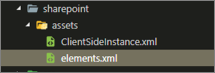
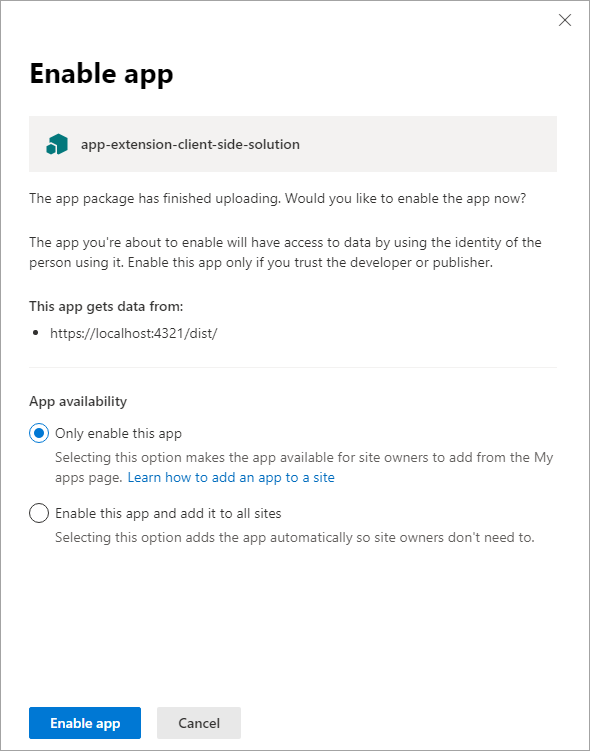
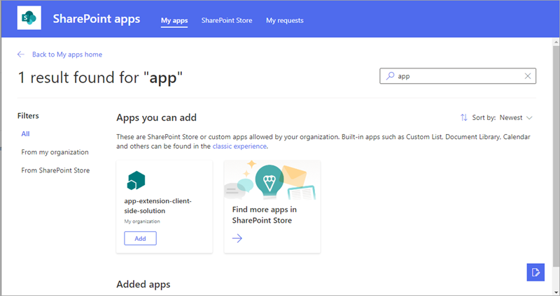

# Deploy your extension to SharePoint (Hello World part 3)

This article describes how to deploy your SharePoint Framework Application Customizer to SharePoint and see it working on modern SharePoint pages. This article continues with the Hello World extension built in the previous article [Use page placeholders from Application Customizer (Hello World part 2)](./using-page-placeholder-with-extensions.md).

Be sure you have completed the procedures in the following articles before you begin:

* [Build your first SharePoint Framework Extension (Hello World part 1)](./build-a-hello-world-extension.md)
* [Use page placeholders from Application Customizer (Hello World part 2)](./using-page-placeholder-with-extensions.md)

You can also follow these steps by watching the video on the [SharePoint PnP YouTube Channel](https://www.youtube.com/watch?v=P_yWI0WVQIg&list=PLR9nK3mnD-OXtWO5AIIr7nCR3sWutACpV). 

<a href="https://www.youtube.com/watch?v=DzHdVxLA3Pc">

</a>

## Package the Hello World Application Customizer
In the console window, go to the extension project directory created in [Build your first SharePoint Framework Extension (Hello World part 1)](./build-a-hello-world-extension.md).

```
cd app-extension
```
If gulp serve is still running, stop it from running by selecting Ctrl+C.

Unlike in **Debug** mode, to use an extension on modern SharePoint server-side pages, you need to deploy and register the extension with SharePoint in `Site collection`, `Site`, or `List` scope. The scope defines where and how the Application Customizer will be active. In this particular scenario, we'll register the Application Customizer by using the `Site collection` scope. 

Before we package our solution, we want to include the code needed to automate the extension activation within the site whenever the solution is installed on the site. In this case, we'll use feature framework elements to perform these actions directly in the solution package, but you could also associate the application customizer to a SharePoint site by using REST or CSOM as part of the site provisioning, for example.

1. Install the solution package to the site where it should be installed so that the extension manifest is being white listed for execution.

2. Associate the Application Customizer to the planned scope. This can be performed programmatically (CSOM/REST) or by using the feature framework inside of the SharePoint Framework solution package. You'll need to associate the following properties in the `UserCustomAction` object at the site collection, site, or list level.
    * **ClientSideComponentId:** This is the identifier (GUID) of the Field Customizer, which has been installed in the app catalog. 
    * **ClientSideComponentProperties:** This is an optional parameter, which can be used to provide properties for the Field Customizer instance.
   
   Note that you can control the requirement to add a solution containing your extension to the site by using the `skipFeatureDeployment` setting in **package-solution.json**. Even though you would not require the solution to be installed on the site, you'd need to associate **ClientSideComponentId** to specific objects for the extension to be visible. 
   
In the following steps, we'll review the `CustomAction` definition, which was automatically created for the solution as part of the scaffolding for enabling the solution on a site when it's being installed. 
   
1. Return to your solution package in Visual Studio Code (or to your preferred editor).

2. Extend the **sharepoint** folder and **assets** subfolder in the root of the solution to see the existing **elements.xml** file. 

   

<br/>

### Review the existing elements.xml file for SharePoint definitions

Review the existing xml structure in the **elements.xml** file. Note that the **ClientSideComponentId** property has been automatically updated based on the unique ID of your Application Customizer available in the **HelloWorldApplicationCustomizer.manifest.json** file in the **src\extensions\helloWorld** folder.

**ClientSideComponentProperties** has also been automatically set with the default structure and JSON properties for this extension instance. Note how the JSON is escaped so that we can set it properly within an XML attribute. 

The configuration uses the specific location of `ClientSideExtension.ApplicationCustomizer` to define that this is an Application Customizer. Because this **elements.xml** is associated to a *Web* scoped feature by default, this `CustomAction` is automatically added to the `Web.UserCustomAction` collection in the site where the solution is being installed.

To ensure that the configuration matches updates performed in the Application Customizer, update the **ClientSideComponentProperties** as in the following xml structure. Note that you should not copy the whole structure because it would cause a mismatch with your **ClientSideComponentId**.


```xml
<?xml version="1.0" encoding="utf-8"?>
<Elements xmlns="http://schemas.microsoft.com/sharepoint/">

    <CustomAction 
        Title="SPFxApplicationCustomizer"
        Location="ClientSideExtension.ApplicationCustomizer"
        ClientSideComponentId="46606aa6-5dd8-4792-b017-1555ec0a43a4"
        ClientSideComponentProperties="{&quot;Top&quot;:&quot;Top area of the page&quot;,&quot;Bottom&quot;:&quot;Bottom area in the page&quot;}">

    </CustomAction>

</Elements>
```

<br/>

### Ensure that definitions are taken into account within the build pipeline

Open **package-solution.json** from the **config** folder. The **package-solution.json** file defines the package metadata as shown in the following code:

```json

{
  "$schema": "https://dev.office.com/json-schemas/spfx-build/package-solution.schema.json",
  "solution": {
    "name": "app-extension-client-side-solution",
    "id": "98a9fe4f-175c-48c1-adee-63fb927faa70",
    "version": "1.0.0.0",
    "features": [
      {
        "title": "Application Extension - Deployment of custom action.",
        "description": "Deploys a custom action with ClientSideComponentId association",
        "id": "4678966b-de68-445f-a74e-e553a7b937ab",
        "version": "1.0.0.0",
        "assets": {
          "elementManifests": [
            "elements.xml"
          ]
        }
      }
    ]
  },
  "paths": {
    "zippedPackage": "solution/app-extension.sppkg"
  }
}


```

<br/>

To ensure that the **element.xml** file is taken into account while the solution is being packaged, default scaffolding adds needed configuration to define a feature framework feature definition for the solution package.

## Deploy the extension to SharePoint Online and host JavaScript from local host

Now you are ready to deploy the solution to a SharePoint site and have the `CustomAction` automatically associated on the site level.

1. In the console window, enter the following command to package your client-side solution that contains the extension so that we get the basic structure ready for packaging:

   ```
   gulp bundle
   ```

2. Execute the following command so that the solution package is created:

   ```
   gulp package-solution
   ```

   The command will create the package in the **sharepoint/solution** folder:

   ```
   app-extension.sppkg
   ```

3. You now need to deploy the package that was generated to the App Catalog. To do this, go to your tenant's **App Catalog** and open the **Apps for SharePoint** library.

4. Upload or drag and drop the `app-extension.sppkg` located in the **sharepoint/solution** folder to the App Catalog. SharePoint displays a dialog and asks you to trust the client-side solution.

   Note that we did not update the URLs for hosting the solution for this deployment, so the URL is still pointing to `https://localhost:4321`. 
   
5. Select the **Deploy** button.

   

6. Move back to your console and ensure that the solution is running. If it's not running, execute the following command in the solution folder:
   
   ```
   gulp serve --nobrowser
   ```
   
7. Go to the site where you want to test SharePoint asset provisioning. This could be any site collection in the tenant where you deployed this solution package.

8. Select the gear icon on the top navigation bar on the right, and then select **Add an app** to go to your Apps page.

9. In the **Search** box, enter **app**, and then select Enter to filter your apps.

   

10. Select the **app-extension-client-side-solution** app to install the solution on the site. When the installation is completed, refresh the page by selecting **F5**.

When the application has been successfully installed, you can see the header and footer being rendered just like with the debug query parameters.


## Next steps

Congratulations, you have deployed an extension to a modern SharePoint page from the app catalog! You can continue building out your Hello World extension in the next topic, [Host extension from Office 365 CDN (Hello World part 4)](./hosting-extension-from-office365-cdn.md), where you will learn how to deploy and load the extension assets from a CDN instead of from localhost.

> [!NOTE]
> If you find an issue in the documentation or in the SharePoint Framework, report that to SharePoint engineering by using the [issue list at the sp-dev-docs repository](https://github.com/SharePoint/sp-dev-docs/issues). Thanks for your input in advance.