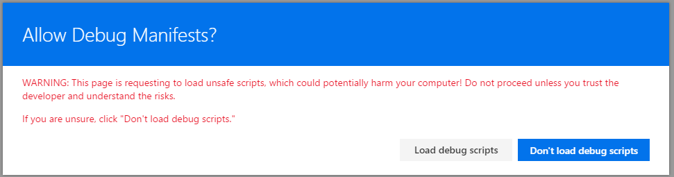

# Using page placeholders from Application Customizer (Hello World part 2)

>**Note:** The SharePoint Framework Extensions are currently in preview and is subject to change. SharePoint Framework Extensions are not currently supported for use in production environments.

Application Customizers also support you to access well known locations in the page, which you can modify based on your business and functional requirements. Typical scenarios would be for example dynamic header and footer experiences, which would be visible cross all the pages in SharePoint Online. 

This is similar model as using UserCustomAction collection in Site or Web object to associate custom JavaScript, which would be used to modify page experience. Key different or advantage with SPFx extensions is that you will have guaranteed elements in the page also in case of any html dom structure modifications with future changes in SharePoint Online.

In this article, we'll continue extending hello world extension built in the previous article [Build your first SharePoint Framework Extension (Hello World part 1)](./build-a-hello-world-extension.md) to take advantage of the page placeholders. 

## Get access to page placeholders

Application Customizer extensions are supported with `Site`, `Web` and `List` scopes. You can control the scope by deciding where or how the Application Customizer will be registered in our SharePoint tenant. When Application Customizer exists in the scope and is being rendered, you use following method in the code to get access on placeholder. Once you have received the placeholder object, you have full control on deciding what will be presented for end users. 

Notice that we are requesting well-known placeholder by using their well known identifier. In this case code is accessing header section of the page using `PageHeader` identifier. 

```ts
    // Handling header place holder
    if (!this._headerPlaceholder) {
      this._headerPlaceholder = this.context.placeholders.tryAttach(
        'PageHeader',
        {
          onDispose: this._onDispose
        });
    }
```

In following steps, we'll modify previously created hello word Application Customizer to access placeholders and to modify their content by adding custom html elements to them. 

Switch to Visual Studio code (or your preferred IDE) and open **src\extesions\helloWorld\HelloWorldApplicationCustomizer.ts.**

Add the `Placeholder` to the import section from `@microsoft/sp-application-base` by updating import as follows:

```ts
import {
  BaseApplicationCustomizer,
  Placeholder
} from '@microsoft/sp-application-base';
```

Add also following imports under the `strings` import on top of the file:
* We will create style definitions for the output in following steps
* `escape` is used to escape Application Customizer properties  

```ts
import styles from './AppCustomizer.module.scss';
import { escape } from '@microsoft/sp-lodash-subset'; 
```

Create a new file call **AppCustomizer.module.scss** under **src\extesions\helloWorld** folder. 

Update **AppCustomizer.module.scss** as follows:
* These are the styles used to output html for the header and footer placeholders.

```css
.app {
  .header {
    height:60px; 
    text-align:center; 
    line-height:2.5; 
    font-weight:bold;
    display: flex;
    align-items: center;
    justify-content: center;
  }

  .footer {
    height:40px; 
    text-align:center; 
    line-height:2.5; 
    font-weight:bold;
    display: flex;
    align-items: center;
    justify-content: center;
  }
}

```

Move back to **HelloWorldApplicationCustomizer.ts** and update **IHelloWorldApplicationCustomizerProperties** interface to have specific properties for Header and Footer as follows.

* If your command set uses the ClientSideComponentProperties JSON input, it will be deserialized into the BaseExtension.properties object. You can define an interface to describe it.

```ts
export interface IHelloWorldApplicationCustomizerProperties {
  Header: string;
  Footer: string;
}
```

Add following private variable inside of the **HelloWorldApplicationCustomizer** class. In this scenario, these could be also local variables in a `onRender` method, but if you'd want to share that to other objects, you'd define that as private variables. 

```ts
export default class HelloWorldApplicationCustomizer
  extends BaseApplicationCustomizer<IHelloWorldApplicationCustomizerProperties> {
  
  // These have been added
  private _headerPlaceholder: Placeholder;
  private _footerPlaceholder: Placeholder;
```

Update the `onRender` method with the following code:

* We use `this.context.placeholders.tryAttach` to get access on the placeholder
* Extension code should not assume that the expected placeholder is available
* Code expects a custom property called `Header`and `Footer`. If properties exist, they will be rendered inside of the placeholder.
* Notice that code path for both header and footer is almost identical in the below method, only different is the used variables and style definitions.

```ts
  @override
  public onRender(): void {

    console.log('CustomHeader.onRender()');
    console.log('Available placeholders: ',
      this.context.placeholders.placeholderNames.join(', '));

    // Handling header place holder
    if (!this._headerPlaceholder) {
      this._headerPlaceholder = this.context.placeholders.tryAttach(
        'PageHeader',
        {
          onDispose: this._onDispose
        });

      // The extension should not assume that the expected placeholder is available.
      if (!this._headerPlaceholder) {
        console.error('The expected placeholder was not found.');
        return;
      }

      if (this.properties) {
        let headerString: string = this.properties.Header;
        if (!headerString) {
          headerString = '(Header property was not defined.)';
        }

        if (this._headerPlaceholder.domElement) {
          this._headerPlaceholder.domElement.innerHTML = `
                <div class="${styles.app}">
                  <div class="ms-bgColor-themeDark ms-fontColor-white ${styles.header}">
                    <i class="ms-Icon ms-Icon--Info" aria-hidden="true"></i> ${escape(headerString)}
                  </div>
                </div>`;
        }
      }
    }

    // Trying footer placeholder
    if (!this._footerPlaceholder) {
      this._footerPlaceholder = this.context.placeholders.tryAttach(
        'PageFooter',
        {
          onDispose: this._onDispose
        });

      // The extension should not assume that the expected placeholder is available.
      if (!this._footerPlaceholder) {
        console.error('The expected placeholder was not found.');
        return;
      }

      if (this.properties) {
        let footerString: string = this.properties.Footer;
        if (!footerString) {
          footerString = '(Footer property was not defined.)';
        }

        if (this._footerPlaceholder.domElement) {
          this._footerPlaceholder.domElement.innerHTML = `
                <div class="${styles.app}">
                  <div class="ms-bgColor-themeDark ms-fontColor-white ${styles.footer}">
                    <i class="ms-Icon ms-Icon--Info" aria-hidden="true"></i> ${escape(footerString)}
                  </div>
                </div>`;
        }
      }
    }
  }

```

Add following method under the `onRender` method. In this case we simply output a console message, when extension is removed from the page. 

```ts
 private _onDispose(): void {
    console.log('[CustomHeader._onDispose] Disposed custom header.');
  }

```

Code is now ready to be tested in SharePoint Online. 

Switch to the console window that is running `gulp serve` and check if there are any errors. If there are errors, gulp reports them in the console and you will need to fix them before proceeding.

If you don't have solution running currently, execute following command and ensure that you don't have any errors.

```
gulp serve --nobrowser
```

Navigate to an out of the box modern list in SharePoint Online. This can be a list or a library for the initial testing. 

To test your extension, append the following query string parameters to the URL:

* Notice that the GUID used in this query parameter has to match on the ID attribute of your Application Customizer available from **HelloWorldApplicationCustomizer.manifest.json**.
* We also use Header and Footer JSON properties to provide parameters or configurations to the Application Customizer. In this case we simply output these values, but you could adjust the behavior based on the properties in actual production usage. 

```
?loadSPFX=true&debugManifestsFile=https://localhost:4321/temp/manifests.js&customActions={"5fc73e12-8085-4a4b-8743-f6d02ffe1240":{"location":"ClientSideExtension.ApplicationCustomizer","properties":{"Header":"Header area of the page","Footer":"Footer area in the page"}}}
```
Full URL to request would be something like following:

```
contoso.sharepoint.com/Lists/Contoso/AllItems.aspx?loadSPFX=true&debugManifestsFile=https://localhost:4321/temp/manifests.js&customActions={"5fc73e12-8085-4a4b-8743-f6d02ffe1240":{"location":"ClientSideExtension.ApplicationCustomizer","properties":{"Header":"Header area of the page","Footer":"Footer area in the page"}}}
```



Click "**Load debug scripts**" button to continue loading scripts from your local host.

You should now see the custom header and footer content in your page. 


## Next steps
Congratulations on building your own custom header and footer from Application Customizer. You can continue building out your Hello World Extension in the next topic [Deploy your extension to site collection (Hello world part 3)](./serving-your-extension-from-sharepoint.md). You will learn how to deploy and preview the Hello World extension in SharePoint site collection without using **Debug** query parameters. 
