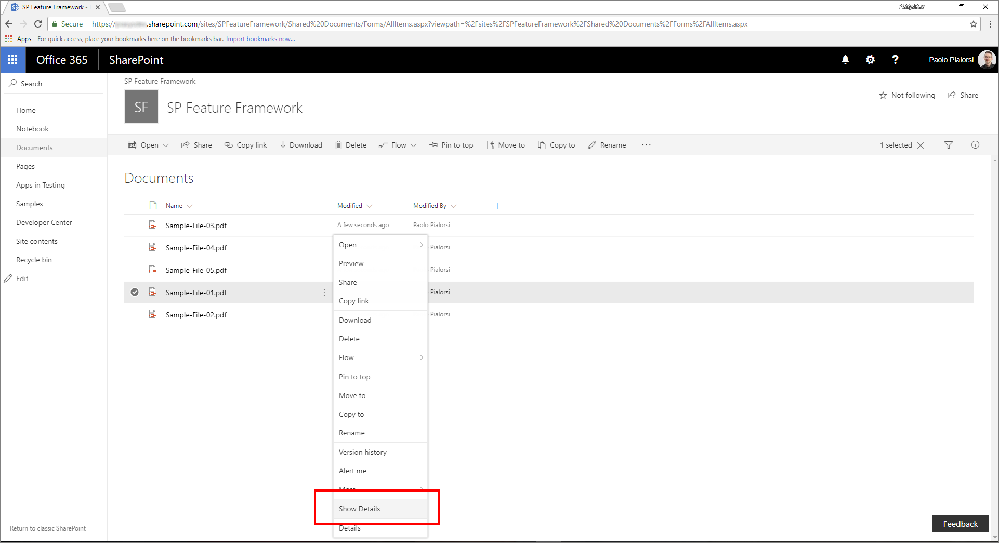
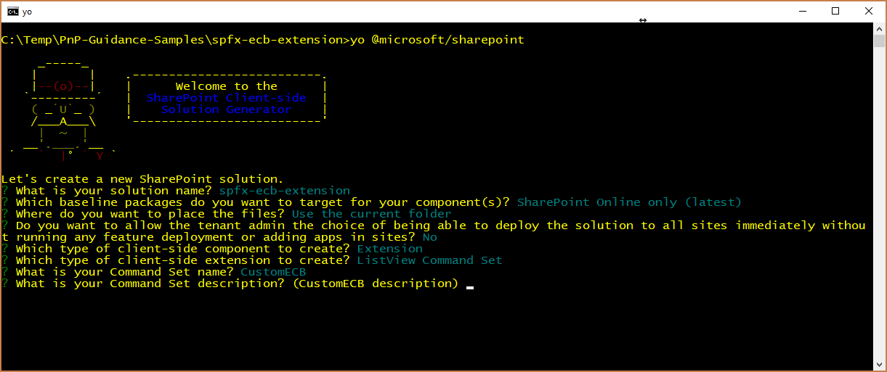
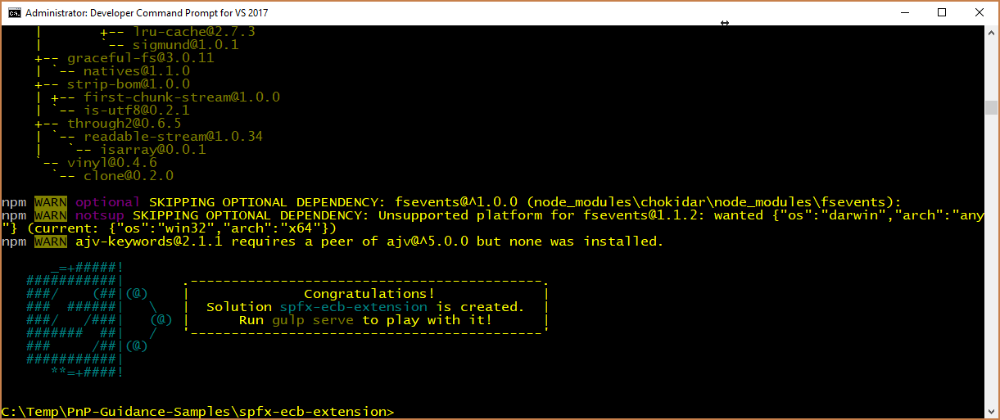
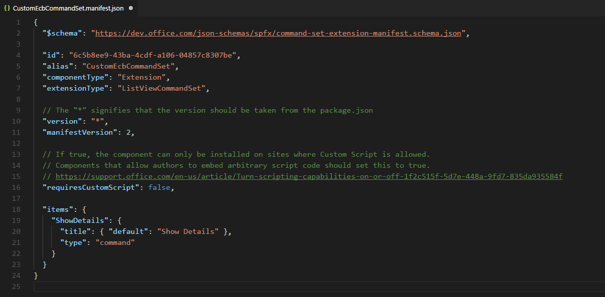
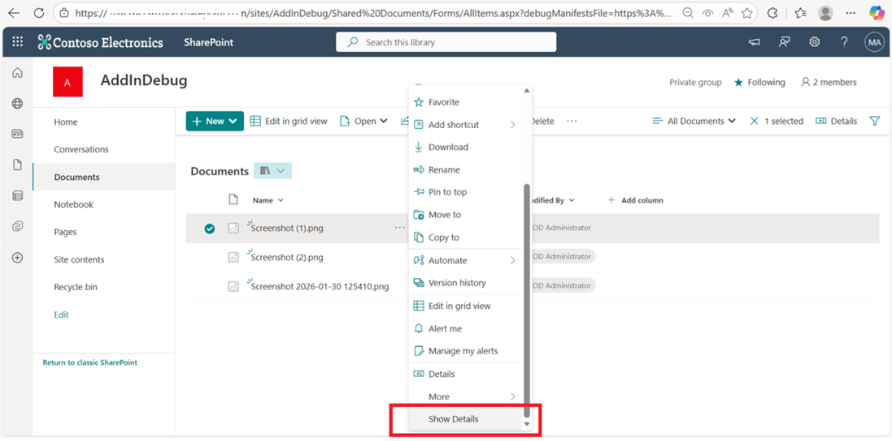
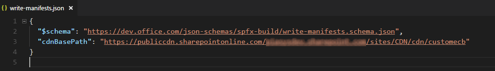
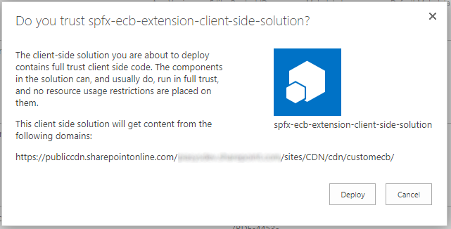
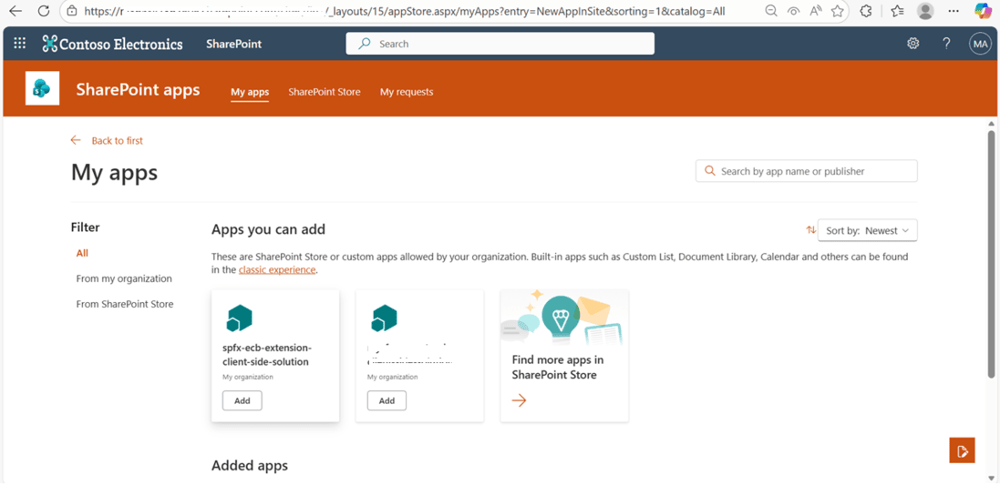

# Migrating from Edit Control Block (ECB) menu item to SharePoint Framework Extensions

During the last few years, most of the enterprise solutions built on top of Office 365 and SharePoint Online leveraged the site _CustomAction_ capability of the SharePoint Feature Framework to extend the UI of pages. However, within the new "modern" UI of SharePoint Online, most of those customizations are no longer available. Fortunately, with the new SharePoint Framework Extensions, you can provide similar functionality in the "modern" UI. 

In this tutorial, you learn how to migrate from the old "classic" customizations to the new model based on SharePoint Framework Extensions.

> [!NOTE]
> For more information about how to build SharePoint Framework Extensions, see [Overview of SharePoint Framework Extensions](../overview-extensions.md).

First, let's introduce the available options when developing SharePoint Framework Extensions:

* **Application Customizer**. Extend the native "modern" UI of SharePoint Online by adding custom HTML elements and client-side code to pre-defined placeholders of "modern" pages. At the time of this writing, the available placeholders are the header and the footer of every "modern" page.
* **Command Set**. Add custom ECB menu items or custom buttons to the command bar of a list view for a list or a library. You can associate any JavaScript (TypeScript) action to these commands.
* **Field Customizer**. Customize the rendering of a field in a list view by using custom HTML elements and client-side code.

The most useful option in our context is the Command Set extension.

Assume that you have a _CustomAction_ in SharePoint Online in order to have a custom ECB menu item for documents in a library. The scope of the ECB menu item is to open a custom page, providing the list ID and the list item ID of the currently selected item in the query string of the target page.

In the following code snippet, you can see the XML code defining that _CustomAction_ by using the SharePoint Feature Framework.

```XML
<?xml version="1.0" encoding="utf-8"?>
<Elements xmlns="http://schemas.microsoft.com/sharepoint/">
  <CustomAction Id="OpenDetailsPageWithItemReference"
                Title="Show Details"
                Description="Opens a new page with further details about the currently selected item"
                Sequence="1001"
                RegistrationType="List"
                RegistrationId="101"                
                Location="EditControlBlock">
    <UrlAction Url="ShowDetails.aspx?ID={ItemId}&amp;List={ListId}" />
  </CustomAction>
</Elements>
```

As you can see, the feature elements file defines an element of type _CustomAction_ to add a new item in the _EditControlBlock_ location (that is, ECB) for any document in any library (_RegistrationType_ is _List_ and _RegistrationId_ is _101_).

In the following figure, you can see the output of the previous custom action within the list view of a library.



Notice that the SharePoint Feature Framework ECB custom item works in a "modern" list. In fact, as long as you don't use JavaScript code, a list custom action still works in "modern" lists.

To migrate the previous solution to the SharePoint Framework, see the following steps.

> [!NOTE]
> Before following the steps in this article, be sure to [Set up your development environment](../../set-up-your-development-environment.md).

<a name="CreateCommandSet"> </a>

## Create a new SharePoint Framework solution

1. Open the command-line tool of your choice (for example, PowerShell, CMD.EXE, Cmder). Create a new folder for the solution named **spfx-ecb-extension**, and create a new SharePoint Framework solution by running the Yeoman generator with the following command:

2. When prompted by the tool, provide the following answers:

  * Accept the default name **spfx-ecb-extension** for your solution, and select Enter.
  * Select **SharePoint Online only (latest)**, and select Enter.
  * Select **Use the current folder**, and select Enter.
  * Select **N** to require the extension to be installed on each site explicitly when it's being used.
  * Select **Extension** as the client-side component type to be created.
  * Select **ListView Command Set** as the extension type to be created.
  * Provide **CustomECB** as the name for your Command Set.

  

  At this point, Yeoman installs the required dependencies and scaffolds the solution files and folders along with the **CustomFooter** extension. This might take a few minutes.

  When the scaffold is complete, you should see the following message indicating a successful scaffold:

  

3. To lock down the version of the project dependencies, run the following command:

  ```
  npm shrinkwrap
  ```

4. Start Visual Studio Code (or the code editor of your choice) and start developing the solution. To start Visual Studio Code, you can execute the following statement.

  ```
  code .
  ```

<a name="DefineCommandSetECB"> </a>

## Define the new ECB item

To reproduce the same behavior of the ECB menu item built by using the SharePoint Feature Framework, you need to implement the same logic by using client-side code within the new SharePoint Framework solution. To accomplish this task, complete the following steps.

1. Open the **CustomEcbCommandSet.manifest.json** file in the **src/extensions/customEcb** folder. Copy the value of the `id` property and store it in a safe place because you need it later.

2. Within the same file, edit the array of **items** in the lower part of the file to define a single command for the Command Set. Call the command **ShowDetails**, and then provide a title and a command type. In the following screenshot, you can see how the manifest file should look.

  

3. Open the **CustomEcbCommandSet.ts** file in the **src/extensions/customEcb** folder and edit the content according to the following code snippet:

  ```TypeScript
  import { Guid } from '@microsoft/sp-core-library';
  import { override } from '@microsoft/decorators';
  import {
    BaseListViewCommandSet,
    Command,
    IListViewCommandSetListViewUpdatedParameters,
    IListViewCommandSetExecuteEventParameters
  } from '@microsoft/sp-listview-extensibility';
  import { Dialog } from '@microsoft/sp-dialog';

  import * as strings from 'CustomEcbCommandSetStrings';

  export interface ICustomEcbCommandSetProperties {
    targetUrl: string;
  }

  export default class CustomEcbCommandSet extends BaseListViewCommandSet<ICustomEcbCommandSetProperties> {

    @override
    public onInit(): Promise<void> {
      return Promise.resolve();
    }

    @override
    public onListViewUpdated(event: IListViewCommandSetListViewUpdatedParameters): void {
      const compareOneCommand: Command = this.tryGetCommand('ShowDetails');
      if (compareOneCommand) {
        // This command should be hidden unless exactly one row is selected.
        compareOneCommand.visible = event.selectedRows.length === 1;
      }
    }

    @override
    public onExecute(event: IListViewCommandSetExecuteEventParameters): void {
      switch (event.itemId) {
        case 'ShowDetails':

          const itemId: number = event.selectedRows[0].getValueByName("ID");
          const listId: Guid = this.context.pageContext.list.id;

          window.location.replace(`${this.properties.targetUrl}?ID=${itemId}&List=${listId}`);

          break;
        default:
          throw new Error('Unknown command');
      }
    }
  }
  ```

  Notice the `import` statement at the very beginning of the file that references the `Guid` type, which is used to hold the ID of the current list. 
  
  Moreover, the interface `ICustomEcbCommandSetProperties` declares a single property called `targetUrl` that can be used to provide the URL of the target page to open when selecting the ECB menu item.

  Furthermore, the override of the `onExecute` method handles the execution of the custom action. Notice the code excerpt that reads the ID of the currently selected item, from the `event` argument, and the ID of the source list from the `pageContext` object.

  Lastly, notice the override of the `onListViewUpdated` method, which by default enabled the `'ShowDetails'` command only if a single item is selected.

  The redirection to the target URL is handled by using classic JavaScript code and the `window.location.replace` function. Of course, you can write whatever kind of TypeScript code you like inside the `onExecute` method. Just for the sake of making an example, you can leverage the SharePoint Framework Dialog Framework to open a new dialog window and interact with users.

  > [!NOTE]
  > For more information about the SharePoint Framework Dialog Framework, see [Use custom dialog boxes with SharePoint Framework Extensions](./using-custom-dialogs-with-spfx.md).

  <br/>

  In the following figure you can see the resulting output.

  

<a name="DebugCommandSet"> </a>

## Test the solution in debug mode

1. Go back to the console window and run the following command to build the solution and run the local Node.js server to host it.

  ```
  gulp serve --nobrowser
  ```

2. Open your favorite browser and go to a "modern" library of any "modern" team site. Append the following query string parameters to the **AllItems.aspx** page URL.

  ```
  ?loadSpfx=true&debugManifestsFile=https://localhost:4321/temp/manifests.js&customActions={"6c5b8ee9-43ba-4cdf-a106-04857c8307be":{"location":"ClientSideExtension.ListViewCommandSet.ContextMenu","properties":{"targetUrl":"ShowDetail.aspx"}}}
  ```

  In the previous query string, replace the GUID with the `id` value you saved from the **CustomEcbCommandSet.manifest.json** file. 
  
  Moreover, there is a `location` property that assumes the value of **ClientSideExtension.ListViewCommandSet.ContextMenu**, which instructs SPFx to render the Command Set as an ECB menu item. Following are all the options for the `location` property:
  
  * **ClientSideExtension.ListViewCommandSet.ContextMenu**.  The context menu of the item(s).
  * **ClientSideExtension.ListViewCommandSet.CommandBar**. The top command set menu in a list or library.
  * **ClientSideExtension.ListViewCommandSet**. Both the context menu and the command bar (corresponds to `SPUserCustomAction.Location="CommandUI.Ribbon"`).

  Still in the query string, there is a property called `properties` that represents the JSON serialization of an object of type `ICustomEcbCommandSetProperties` that is the type of the custom properties requested by the custom Command Set for rendering.

  Notice that when executing the page request, you are prompted with a warning message box with the title "Allow debug scripts?", which asks your consent to run code from localhost for security reasons. Of course, if you want to locally debug and test the solution, you have to allow it to "Load debug scripts."

> Alternatively, you can create serve configuration entries in the `config/serve.json` file in your project to automate the creation of the debug query string parameters as outlined in this document: [Debug SharePoint Framework solutions on modern SharePoint pages](https://docs.microsoft.com/en-us/sharepoint/dev/spfx/debug-modern-pages#debug-sharepoint-framework-extensions-on-modern-sharepoint-pages)

<a name="PackageAndHostCommandSet"> </a>

## Package and host the solution

If you are happy with the result, you are now ready to package the solution and host it in a real hosting infrastructure.
Before building the bundle and the package, you need to declare an XML Feature Framework file to provision the extension.

### Review Feature Framework elements

1. In the code editor, open the **/sharepoint/assets** sub-folder of the solution folder and edit the **elements.xml** file. In the following code excerpt, you can see how the file should look.

  ```XML
  <?xml version="1.0" encoding="utf-8"?>
  <Elements xmlns="http://schemas.microsoft.com/sharepoint/">
      <CustomAction
          Title="CustomEcb"
          RegistrationId="101"
          RegistrationType="List"
          Location="ClientSideExtension.ListViewCommandSet.ContextMenu"
          ClientSideComponentId="6c5b8ee9-43ba-4cdf-a106-04857c8307be"
          ClientSideComponentProperties="{&quot;targetUrl&quot;:&quot;ShowDetails.aspx&quot;}">
      </CustomAction>
  </Elements>
  ```

  As you can see, it reminds us of the SharePoint Feature Framework file that we saw in the "classic" model, but it uses the `ClientSideComponentId` attribute to reference the `id` of the custom extension, and the `ClientSideComponentProperties` attribute to configure the custom configuration properties required by the extension.

2. Open the **package-solution.json** file in the **/config** folder of the solution. Within the file, you can see that there is a reference to the **elements.xml** file within the `assets` section.

  ```JSON
  {
    "$schema": "https://dev.office.com/json-schemas/spfx-build/package-solution.schema.json",
    "solution": {
      "name": "spfx-ecb-extension-client-side-solution",
      "id": "b8ff6fdf-16e9-4434-9fdb-eac6c5f948ee",
      "version": "1.0.2.0",
      "features": [
        {
          "title": "Custom ECB Menu Item.",
          "description": "Deploys a custom ECB menu item sample extension",
          "id": "f30a744c-6f30-4ccc-a428-125a290b5233",
          "version": "1.0.0.0",
          "assets": {
            "elementManifests": [
              "elements.xml"
            ]
          }
        }
      ]
    },
    "paths": {
      "zippedPackage": "solution/spfx-ecb-extension.sppkg"
    }
  }
  ```

### Enable the CDN in your Office 365 tenant

Now you need to host the extension in a hosting environment. Office 365 CDN is the easiest way to host SharePoint Framework solutions directly from your tenant while still taking advantage of the Content Delivery Network (CDN) service for faster load times of your assets.

1. Download the [SharePoint Online Management Shell](https://www.microsoft.com/en-us/download/details.aspx?id=35588) to ensure that you have the latest version.

2. Connect to your SharePoint Online tenant by using PowerShell:
    
    ```powershell
    Connect-SPOService -Url https://[tenant]-admin.sharepoint.com
    ```
    
3. Get the current status of public CDN settings from the tenant level by executing the following commands one-by-one: 
    
    ```powershell
    Get-SPOTenantCdnEnabled -CdnType Public
    Get-SPOTenantCdnOrigins -CdnType Public
    Get-SPOTenantCdnPolicies -CdnType Public
    ```
    
4. Enable public CDN in the tenant:
    
    ```powershell
    Set-SPOTenantCdnEnabled -CdnType Public
    ```
    
    Public CDN has now been enabled in the tenant by using the default file type configuration allowed. This means that the following file type extensions are supported: CSS, EOT, GIF, ICO, JPEG, JPG, JS, MAP, PNG, SVG, TTF, and WOFF.

5. Open up a browser and move to a site collection where you'd like to host your CDN library. This could be any site collection in your tenant. In this tutorial, we create a specific library to act as your CDN library, but you can also use a specific folder in any existing document library as the CDN endpoint.

6. Create a new document library on your site collection called **CDN** and add a folder named **customecb** to it.
    
7. In the PowerShell console, add a new CDN origin. In this case, we are setting the origin as `*/cdn`, which means that any relative folder with the name of **cdn** acts as a CDN origin.
    
    ```powershell
    Add-SPOTenantCdnOrigin -CdnType Public -OriginUrl */cdn
    ```
    
8. Execute the following command to get the list of CDN origins from your tenant:
    
    ```powershell
    Get-SPOTenantCdnOrigins -CdnType Public
    ```
    
  Note that your newly added origin is listed as a valid CDN origin. Final configuration of the origin takes approximately 15 minutes, so we can continue provisioning the extension, which is hosted from the origin after deployment is completed. 

  

  When the origin is listed without the `(configuration pending)` text, it is ready to be used in your tenant. This indicates an on-going configuration between SharePoint Online and the CDN system. 

### Update the solution settings and publish it on the CDN

Next, you need to update the solution to use the just created CDN as the hosting enviroment, and you need to publish the solution bundle to the CDN. To accomplish this task, follow these steps.

1. Return to the previously created solution to perform the needed URL updates.
    
2. Update the **write-manifests.json** file (in the **config** folder) as follows to point to your CDN endpoint. Use `publiccdn.sharepointonline.com` as the prefix, and then extend the URL with the actual path of your tenant. The format of the CDN URL is as follows:
    
    ```
    https://publiccdn.sharepointonline.com/[tenant host name]/sites/[site]/[library]/[folder]
    ```
    
    

3. Save your changes.

4. Execute the following task to bundle your solution. This executes a release build of your project by using the CDN URL specified in the**write-manifests.json** file. The output of this command is located in the **./temp/deploy** folder. These are the files that you need to upload to the SharePoint folder acting as your CDN endpoint. 
    
    ```
    gulp bundle --ship
    ```
    
5. Execute the following task to package your solution. This command creates an **spfx-ecb-extension.sppkg** package in the **sharepoint/solution** folder and prepares the assets in the **temp/deploy** folder to be deployed to the CDN.
    
    ```
    gulp package-solution --ship
    ```
    
6. Upload or drag-and-drop the newly created client-side solution package to the app catalog in your tenant, and then select the **Deploy** button.

    

7. Upload or drag-and-drop the files in the **temp/deploy** folder to the **CDN/customfooter** folder created earlier.

<a name="InstallCommandSet"> </a>

## Install and run the solution

1. Open the browser and navigate to any target "modern" site.

2. Go to the **Site Contents** page and select to add a new **App**.

3. Select to install a new app **From Your Organization** to browse the solutions available in the app catalog.

4. Select the solution called **spfx-ecb-extension-client-side-solution** and install it on the target site.

    

5. After the application installation is completed, open the **Documents** library of the site and see the custom ECB menu item in action by selecting a single document.

Enjoy your new custom ECB menu item built by using the SharePoint Framework Extensions!

## See also

- [Overview of SharePoint Framework Extensions](../overview-extensions.md)
