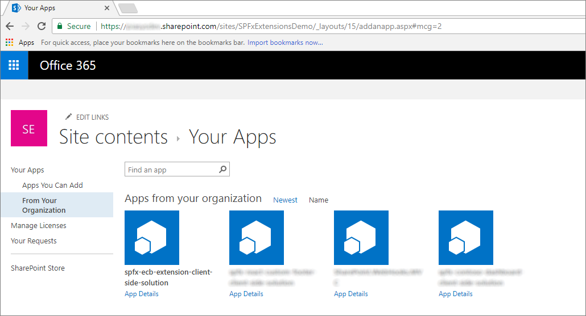

# Migrate Edit Control Block (ECB) menu items to SharePoint Framework extensions

During the last few years, most of the enterprise solutions built on top of Microsoft 365 and SharePoint Online leveraged the site `CustomAction` capability of the SharePoint Feature Framework to extend the UI of pages. With the "modern" UI of SharePoint, most of those customizations are no longer available. With SharePoint Framework extensions, you can provide similar functionality in the "modern" UI.

In this tutorial, you learn how to migrate a legacy "classic" customizations to the current model: SharePoint Framework extensions.

First, let's introduce the available options when developing SharePoint Framework extensions:

- **Application Customizer**: Extend the native "modern" UI of SharePoint by adding custom HTML elements and client-side code to pre-defined placeholders of "modern" pages. For more information on application customizers, see [Build your first SharePoint Framework Extension (Hello World part 1)](../get-started/build-a-hello-world-extension.md).
- **Command Set**: Add custom Edit Control Block (ECB) menu items or custom buttons to the command bar of a list view for a list or a library. You can associate any client-side action to these commands. For more information on command sets, see [Build your first ListView Command Set extension](../get-started/building-simple-cmdset-with-dialog-api.md).
- **Field Customizer**: Customize the rendering of a field in a list view by using custom HTML elements and client-side code. For more information on field customizers, see [Build your first Field Customizer extension](../get-started/building-simple-field-customizer.md).

The most useful option in our context is the Command Set extension.

Assume that you have a `CustomAction` in SharePoint Online to have a custom ECB menu item for documents in a library. The scope of the ECB menu item is to open a custom page, providing the list ID and the list item ID of the currently selected item in the query string of the target page.

In the following code snippet, you can see the XML code defining a `CustomAction` using the SharePoint Feature Framework.

```XML
<?xml version="1.0" encoding="utf-8"?>
<Elements xmlns="http://schemas.microsoft.com/sharepoint/">
  <CustomAction
      Id="OpenDetailsPageWithItemReference"
      Title="Show Details"
      Description="Opens a new page with further details about the currently selected item"
      Sequence="1001"
      RegistrationType="List"
      RegistrationId="101"
      Location="EditControlBlock">
    <UrlAction Url="ShowDetails.aspx?ID={ItemId}&amp;List={ListId}" />
  </CustomAction>
</Elements>
```

As you can see, the feature elements file defines an element of type `CustomAction` to add a new item in the `EditControlBlock` location (that is, ECB) for any document in any library (`RegistrationType` is `List` and `RegistrationId` is `101`).

In the following figure, you can see the output of the previous custom action within the list view of a library.


Notice that the SharePoint Feature Framework ECB custom item works in a "modern" list. In fact, as long as you don't use JavaScript code, a list custom action still works in "modern" lists.

To migrate the previous solution to the SharePoint Framework, see the following steps.

## Create a new SharePoint Framework solution

1. From the console, create a new folder for your project:

    ```console
    md spfx-ecb-extension
    ```

1. Go to the project folder:

    ```console
    cd spfx-ecb-extension
    ```

1. Create a new SharePoint Framework solution web part by running the Yeoman SharePoint Generator.

    ```console
    yo @microsoft/sharepoint
    ```

1. When prompted, enter the following values (*select the default option for all prompts omitted below*):

    - **What is your solution name?**: spfx-ecb-extension
    - **Which baseline packages do you want to target for your component(s)?**: SharePoint Online only (latest)
    - **Which type of client-side component to create?**: Extension
    - **Which type of client-side extension to create?** ListView Command Set
    - **What is your Command Set name?** CustomECB

    At this point, Yeoman installs the required dependencies and scaffolds the solution files and folders along with the **CustomFooter** extension. This might take a few minutes.

1. Start Visual Studio Code (or the code editor of your choice) and start developing the solution. To start Visual Studio Code, you can execute the following statement.

    ```console
    code .
    ```

## Define the new ECB item

To reproduce the same behavior of the ECB menu item built by using the SharePoint Feature Framework, you need to implement the same logic by using client-side code within the new SharePoint Framework solution. To accomplish this task, complete the following steps.

1. Open the file **./src/extensions/customEcb/CustomEcbCommandSet.manifest.json**. Copy the value of the `id` property and store it in a safe place because you need it later.
1. Within the same file, edit the array of `items` in the lower part of the file to define a single command for the Command Set. Call the command **ShowDetails**, and then provide a title and a command type. In the following screenshot, you can see how the manifest file should look.

    ```json
    {
      "$schema": "https://developer.microsoft.com/json-schemas/spfx/command-set-extension-manifest.schema.json",

      "id": "5d3bac4c-e040-44ed-ab43-464490d22762",
      "alias": "CustomEcbCommandSet",
      "componentType": "Extension",
      "extensionType": "ListViewCommandSet",

      "version": "*",
      "manifestVersion": 2,

      "requiresCustomScript": false,

      "items": {
        "ShowDetails": {
          "title": {
            "default": "Show Details"
          },
          "type": "command"
        }
      }
    }
    ```

1. Open the file **./src/extensions/customEcb/CustomEcbCommandSet.ts** and edit the content according to the following code snippet:

    ```TypeScript
    import { Guid } from '@microsoft/sp-core-library';
    import { override } from '@microsoft/decorators';
    import {
      BaseListViewCommandSet,
      Command,
      IListViewCommandSetListViewUpdatedParameters,
      IListViewCommandSetExecuteEventParameters
    } from '@microsoft/sp-listview-extensibility';
    import { Dialog } from '@microsoft/sp-dialog';

    import * as strings from 'CustomEcbCommandSetStrings';

    export interface ICustomEcbCommandSetProperties {
      targetUrl: string;
    }

    export default class CustomEcbCommandSet extends BaseListViewCommandSet<ICustomEcbCommandSetProperties> {

      @override
      public onInit(): Promise<void> {
        return Promise.resolve();
      }

      @override
      public onListViewUpdated(event: IListViewCommandSetListViewUpdatedParameters): void {
        const compareOneCommand: Command = this.tryGetCommand('ShowDetails');
        if (compareOneCommand) {
          // This command should be hidden unless exactly one row is selected.
          compareOneCommand.visible = event.selectedRows.length === 1;
        }
      }

      @override
      public onExecute(event: IListViewCommandSetExecuteEventParameters): void {
        switch (event.itemId) {
          case 'ShowDetails':

            const itemId: number = event.selectedRows[0].getValueByName("ID");
            const listId: Guid = this.context.pageContext.list.id;

            window.location.replace(`${this.properties.targetUrl}?ID=${itemId}&List=${listId}`);

            break;
          default:
            throw new Error('Unknown command');
        }
      }
    }
    ```

    Notice the `import` statement at the very beginning of the file that references the `Guid` type, which is used to hold the ID of the current list.

    The interface `ICustomEcbCommandSetProperties` declares a single property called `targetUrl` that can be used to provide the URL of the target page to open when selecting the ECB menu item.

    Furthermore, the override of the `onExecute()` method handles the execution of the custom action. Notice the code excerpt that reads the ID of the currently selected item, from the `event` argument, and the ID of the source list from the `pageContext` object.

    Lastly, notice the override of the `onListViewUpdated()` method, which by default enabled the `ShowDetails` command only if a single item is selected.

    The redirection to the target URL is handled by using classic JavaScript code and the `window.location.replace()` function. You can write whatever TypeScript code you like inside the `onExecute()` method. Just for the sake of making an example, you can leverage the SharePoint Framework Dialog Framework to open a new dialog window and interact with users.

    > [!NOTE]
    > For more information about the SharePoint Framework Dialog Framework, see [Use custom dialog boxes with SharePoint Framework extensions](./using-custom-dialogs-with-spfx.md).

    In the following figure, you can see the resulting output.

    

## Test the solution in debug mode

1. Go back to the console window and run the following command to build the solution and run the local Node.js server to host it.

    ```console
    gulp serve --nobrowser
    ```

1. Open your favorite browser and go to a "modern" library of any "modern" team site. Append the following query string parameters to the **AllItems.aspx** page URL.

    ```html
    ?loadSpfx=true&debugManifestsFile=https://localhost:4321/temp/manifests.js&customActions={"6c5b8ee9-43ba-4cdf-a106-04857c8307be":{"location":"ClientSideExtension.ListViewCommandSet.ContextMenu","properties":{"targetUrl":"ShowDetail.aspx"}}}
    ```

    In the previous query string, replace the GUID with the `id` value you saved from the **CustomEcbCommandSet.manifest.json** file.

    Moreover, there's a `location` property that assumes the value of **ClientSideExtension.ListViewCommandSet.ContextMenu**, which instructs SPFx to render the Command Set as an ECB menu item. Following are all the options for the `location` property:

    - **ClientSideExtension.ListViewCommandSet.ContextMenu**: The context menu of the item(s).
    - **ClientSideExtension.ListViewCommandSet.CommandBar**: The top command set menu in a list or library.
    - **ClientSideExtension.ListViewCommandSet**: Both the context menu and the command bar (corresponds to `SPUserCustomAction.Location="CommandUI.Ribbon"`).

    Still in the query string, there's a property called `properties` that represents the JSON serialization of an object of type `ICustomEcbCommandSetProperties` that is the type of the custom properties requested by the custom Command Set for rendering.

    Notice that when executing the page request, you're prompted with a warning message box with the title "Allow debug scripts?", which asks your consent to run code from localhost for security reasons. If you want to locally debug and test the solution, you have to allow it to "Load debug scripts."

    > [!NOTE]
    > Alternatively, you can create serve configuration entries in the **config/serve.json** file in your project to automate the creation of the debug query string parameters as outlined in this document: [Debug SharePoint Framework solutions on modern SharePoint pages](/sharepoint/dev/spfx/debug-modern-pages#debug-sharepoint-framework-extensions-on-modern-sharepoint-pages)

## Package and host the solution

If you're happy with the result, you're now ready to package the solution and host it in a real hosting infrastructure.

Before building the bundle and the package, you need to declare an XML Feature Framework file to provision the extension.

### Review Feature Framework elements

1. In the code editor, open the **/sharepoint/assets** subfolder of the solution folder and edit the **elements.xml** file. In the following code excerpt, you can see how the file should look.

    ```XML
    <?xml version="1.0" encoding="utf-8"?>
    <Elements xmlns="http://schemas.microsoft.com/sharepoint/">
        <CustomAction
            Title="CustomEcb"
            RegistrationId="101"
            RegistrationType="List"
            Location="ClientSideExtension.ListViewCommandSet.ContextMenu"
            ClientSideComponentId="6c5b8ee9-43ba-4cdf-a106-04857c8307be"
            ClientSideComponentProperties="{&quot;targetUrl&quot;:&quot;ShowDetails.aspx&quot;}">
        </CustomAction>
    </Elements>
    ```

    As you can see, it reminds us of the SharePoint Feature Framework file that we saw in the "classic" model, but it uses the `ClientSideComponentId` attribute to reference the `id` of the custom extension, and the `ClientSideComponentProperties` attribute to configure the custom configuration properties required by the extension.

1. Open the file **./config/package-solution.json** in the solution. Within the file, you can see that there's a reference to the **elements.xml** file within the `assets` section.

    ```JSON
    {
      "$schema": "https://developer.microsoft.com/json-schemas/spfx-build/package-solution.schema.json",
      "solution": {
        "name": "spfx-ecb-extension-client-side-solution",
        "id": "b8ff6fdf-16e9-4434-9fdb-eac6c5f948ee",
        "version": "1.0.2.0",
        "features": [
          {
            "title": "Custom ECB Menu Item.",
            "description": "Deploys a custom ECB menu item sample extension",
            "id": "f30a744c-6f30-4ccc-a428-125a290b5233",
            "version": "1.0.0.0",
            "assets": {
              "elementManifests": [
                "elements.xml"
              ]
            }
          }
        ]
      },
      "paths": {
        "zippedPackage": "solution/spfx-ecb-extension.sppkg"
      }
    }
    ```

## Bundle, package, and deploy the SharePoint Framework component

Prepare and deploy the solution for SharePoint Online tenant:

1. Execute the following task to bundle your solution. This creates a release build of your project:

    ```console
    gulp bundle --ship
    ```

1. Execute the following task to package your solution. This command creates an **\*.sppkg** package in the **sharepoint/solution** folder.

    ```console
    gulp package-solution --ship
    ```

1. Upload or drag-and-drop the newly created client-side solution package to the app catalog in your tenant, and then select the **Deploy** button.

## Install and run the solution

1. Open the browser and navigate to any target "modern" site.
1. Go to the **Site Contents** page and select to add a new **App**.
1. Select to install a new app **From Your Organization** to browse the solutions available in the app catalog.
1. Select the solution called **spfx-ecb-extension-client-side-solution** and install it on the target site.

    

1. After the application installation is completed, open the **Documents** library of the site and see the custom ECB menu item in action by selecting a single document.

Enjoy your new custom ECB menu item built by using the SharePoint Framework extensions!

## See also

- [Overview of SharePoint Framework extensions](../overview-extensions.md)
