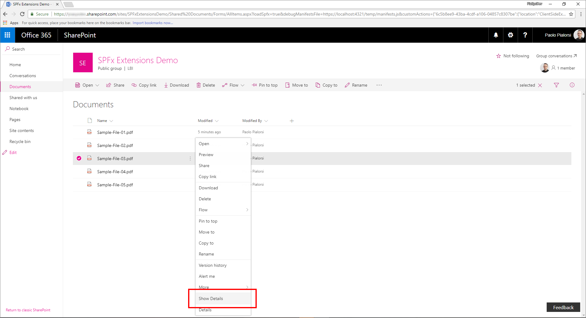

# Migrating from Edit Control Block (ECB) menu item to SharePoint Framework Extensions

During the last few years, most of the enterprise solutions built on top of Office 365 and SharePoint Online leveraged the site _CustomAction_ capability of the SharePoint Feature Framework to extend the UI of pages. However nowdays, within the new "modern" UI of SharePoint Online, most of those customizations are no more available. Luckily, with the new SharePoint Framework Extensions you can now provide almost the same functionality in the "modern" UI. In this tutorial you will learn how to migrate from old "classic" customizations to the new model based on SharePoint Framework Extensions.

>**Important:** 
We're not deprecating the "classic" experience - both "classic" and "modern" will coexist.

_**Applies to:** SharePoint Online_

## Understanding SharePoint Framework Extensions
<a name="spfxExtensions"> </a>
First of all, let's introduce the available options when developing SharePoint Framework Extensions:

* **Application Customizer**: extend the native "modern" UI of SharePoint Online by adding custom HTML elements and client-side code to pre-defined placeholders of "modern" pages. At the time of this writing, the available placeholders are the header and the footer of every "modern" page.
* **Command Set**: allow to add custom ECB menu items or custom buttons to the command bar of a list view for a list or a library. You can associate any JavaScript (TypeScript) action to these commands.
* **Field Customizer**: customize the rendering of a field in a list view using custom HTML elements and client-side code.

As you can argue from the above descriptions, the most useful one in our context is the "Command Set" extension.

> **Note**: For further details about how to build SharePoint Framework Extensions you can read the article ["Overview of SharePoint Framework Extensions"](https://docs.microsoft.com/en-us/sharepoint/dev/spfx/extensions/overview-extensions).

## Migrating a ECB to an SPFx Command Set
<a name="FromECBtoCommandSet"> </a>
Assume that you have a _CustomAction_ in SharePoint Online, in order to have a custom ECB menu item for documents in a library. The scope of the ECB menu item is to open a custom page, providing the list ID and the list item ID of the currently selected item in the querystring of the target page.
In the following code snippet you can see the XML code defining that _CustomAction_ using the SharePoint Feature Framework.

```XML
<?xml version="1.0" encoding="utf-8"?>
<Elements xmlns="http://schemas.microsoft.com/sharepoint/">
  <CustomAction Id="OpenDetailsPageWithItemReference"
                Title="Show Details"
                Description="Opens a new page with further details about the currently selected item"
                Sequence="1001"
                RegistrationType="List"
                RegistrationId="101"                
                ScriptSrc="https://code.jquery.com/jquery-3.2.1.slim.min.js"
                Location="EditControlBlock">
    <UrlAction Url="ShowDetails.aspx?ID={ItemId}&amp;List={ListId}" />
  </CustomAction>
</Elements>
```

As you can see, the feature elements file defines an element of type _CustomAction_ to add a new item in the _EditControlBlock_ location (i.e. ECB) for any document in any library (_RegistrationType_ is _List_ and _RegistrationId_ is _101_).

In the following figure you can see the output of the previous custom action, within the list view of a library.


Notice that the SharePoint Feature Framework ECB custom item works in a "modern" list, too. In fact, as long as you don't use JavaScript code, a list custom action still works in "modern" lists, too.

In order to migrate the above solution to the SharePoint Framework, you will have to accomplish the following steps.

### Create a new SharePoint Framework solution
<a name="CreateCommandSet"> </a>
Once you have prepared you development environment to develop SharePoint Framework solutions, by following the instructions provided in the document ["Set up your SharePoint client-side web part development environment"](https://docs.microsoft.com/en-us/sharepoint/dev/spfx/set-up-your-development-environment), you can start creating a SharePoint Framework extension.

1. Open the command line tool of your choice (PowerShell, CMD.EXE, Cmder, etc.), create a new folder for the solution (call it _spfx-ecb-extension_), and create a new SharePoint Framework solution by running the Yeoman generator with the following command:

```
yo @microsoft/sharepoint
```

When prompted by the tool, provide the following answers:
* Accept the default name (_spfx-ecb-extension_) for your solution, and press Enter.
* Choose SharePoint Online only (latest), and press Enter.
* Choose Use the current folder, and press Enter.
* Choose N to require the extension to be installed on each site explicitly when it's being used.
* Choose Extension as the client-side component type to be created.
* Choose _"ListView Command Set"_ as the extension type to be created.
* Provide "CustomECB" as the name for your Command Set.


At this point, Yeoman will install the required dependencies and scaffold the solution files and folders along with the _CustomFooter_ extension. This might take a few minutes.

When the scaffold is complete, you should see the following message indicating a successful scaffold:


2. To lock down the version of the project dependencies, run the following command:

```
npm shrinkwrap
```

3. Now start Visual Studio Code (or whatever else is the code editor of your choice) and start developing the solution. To start Visual Studio Code, you can execute the following statement.

```
code .
```

### Define the new ECB item
<a name="DefineCommandSetECB"> </a>
In order to reproduce the same behavior of the ECB menu item built using the SharePoint Feature Framework, you simply need to implement the same logic using client-side code, within the new SharePoint Framework solution. To accomplish this task, complete the following steps.

1. First of all, open the file _CustomEcbCommandSet.manifest.json_ under the _src/extensions/customEcb_ folder. Copy the value of the _id_ property and store it in a safe place, because you will need it later.

2. Within the same file edit the array of _"items"_ in the lower part of the file, in order to define a single command for the Command Set. Call the command _"ShowDetails"_, provide a Title, and a command type. In the following screenshot you can see how the manifest file should look like.


3. Now, open the _CustomEcbCommandSet.ts_ file, still under the same folder as before and edit the content accordingly to the following code excerpt.

``` TypeScript
import { Guid } from '@microsoft/sp-core-library';
import { override } from '@microsoft/decorators';
import {
  BaseListViewCommandSet,
  Command,
  IListViewCommandSetListViewUpdatedParameters,
  IListViewCommandSetExecuteEventParameters
} from '@microsoft/sp-listview-extensibility';
import { Dialog } from '@microsoft/sp-dialog';

import * as strings from 'CustomEcbCommandSetStrings';

export interface ICustomEcbCommandSetProperties {
  targetUrl: string;
}

export default class CustomEcbCommandSet extends BaseListViewCommandSet<ICustomEcbCommandSetProperties> {

  @override
  public onInit(): Promise<void> {
    return Promise.resolve();
  }

  @override
  public onListViewUpdated(event: IListViewCommandSetListViewUpdatedParameters): void {
    const compareOneCommand: Command = this.tryGetCommand('ShowDetails');
    if (compareOneCommand) {
      // This command should be hidden unless exactly one row is selected.
      compareOneCommand.visible = event.selectedRows.length === 1;
    }
  }

  @override
  public onExecute(event: IListViewCommandSetExecuteEventParameters): void {
    switch (event.itemId) {
      case 'ShowDetails':

        const itemId: number = event.selectedRows[0].getValueByName("ID");
        const listId: Guid = this.context.pageContext.list.id;

        window.location.replace(`${this.properties.targetUrl}?ID=${itemId}&List=${listId}`);

        break;
      default:
        throw new Error('Unknown command');
    }
  }
}
```

Notice the _import_ statement at the very beginning of the file, in order to reference the _Guid_ type, which will be used to hold the ID of the current list. 
Moreover, the interface _ICustomEcbCommandSetProperties_ declares a single property called _targetUrl_ that can be used to provide the URL of the target page to open when clicking on the ECB menu item.
Furthermore, the override of the _onExecute_ method handles the execution of the custom action. Notice the code excerpt that reads the ID of the currently selected item, from the _event_ argument, and the ID of the source list from the the _pageContext_ object.
Lastly, notice the override of the _onListViewUpdated_ method, which by default enabled the _'ShowDetails'_ command only if a single item is selected.

The redirection to the target URL is handled by using classic JavaScript code and using the _window.location.replace_ function. Of course, you can write whatever kind of TypeScript code you like inside the _onExecute_ method. Just for the sake of making an example, you can leverage the SharePoint Framework Dialog Framework to open a new dialog window and to interact with the end users.

> **Note**: For further details about the SharePoint Framework Dialog Framework you can read the document [Use custom dialog boxes with SharePoint Framework Extensions](https://docs.microsoft.com/en-us/sharepoint/dev/spfx/extensions/guidance/using-custom-dialogs-with-spfx).

In the following figure you can see the resulting output.



### Test the solution in debug mode
<a name="DebugCommandSet"> </a>
You are now ready to test your solution in debug mode. 

1. Go back to the console window and run the following command:

```
gulp serve --nobrowser
```

The above command will build the solution and run the local Node.js server to host it.

2. Now open your favorite browser and go to a "modern" library of any "modern" team site. Now, append the following querystring parameters to the _AllItems.aspx_ page URL.

```
?loadSpfx=true&debugManifestsFile=https://localhost:4321/temp/manifests.js&customActions={"6c5b8ee9-43ba-4cdf-a106-04857c8307be":{"location":"ClientSideExtension.ListViewCommandSet.ContextMenu","properties":{"targetUrl":"ShowDetail.aspx"}}}
```

In the above querystring, you will have to replace the GUID with the _id_ value you saved from the _CustomEcbCommandSet.manifest.json_ file. Moreover, there is a _location_ property which assumes the value of _ClientSideExtension.ListViewCommandSet.ContextMenu_, which instructs SPFx to render the Command Set as an ECB menu item. Here are all the available options for the _location_ property:
* **ClientSideExtension.ListViewCommandSet.ContextMenu:**  The context menu of the item(s)
* **ClientSideExtension.ListViewCommandSet.CommandBar:** The top command set menu in a list or library
* **ClientSideExtension.ListViewCommandSet:** Both the context menu and the command bar (Corresponds to SPUserCustomAction.Location="CommandUI.Ribbon")

Lastly, still in the querystring there is a property called _properties_, which represents the JSON serialization of an object of type _ICustomEcbCommandSetProperties_ that is the type of the custom properties requested by the custom Command Set for rendering.

Notice that, when executing the page request, you will be prompted with a warning message box with title "Allow debug scripts?", which asks your consent to run code from localhost, for security reasons. Of course, if you want to locally debug and test the solution, you will have to allow to "Load debug scripts".

### Package and host the solution
<a name="PackageAndHostCommandSet"> </a>
If you are happy with the result, you are now ready to package the solution and host it in a real hosting infrastructure.
Before building the bundle and the package, you need to declare an XML feature framework file to provision the extension.

#### Review feature framework elements
Within the code editor, open the _/sharepoint/assets_ sub-folder of the solution folder and edit the _elements.xml_ file.
In the following code excerpt you can see how the file should look like.

```XML
<?xml version="1.0" encoding="utf-8"?>
<Elements xmlns="http://schemas.microsoft.com/sharepoint/">
    <CustomAction
        Title="CustomEcb"
        RegistrationId="101"
        RegistrationType="List"
        Location="ClientSideExtension.ListViewCommandSet.ContextMenu"
        ClientSideComponentId="6c5b8ee9-43ba-4cdf-a106-04857c8307be"
        ClientSideComponentProperties="{&quot;targetUrl&quot;:&quot;ShowDetails.aspx&quot;}">
    </CustomAction>
</Elements>
```

As you can see, it reminds the SharePoint Feature Framework file that we saw in the "classic" model, but it uses the _ClientSideComponentId_ attribute to reference the _id_ of the custom extension, and the _ClientSideComponentProperties_ attribute, to configure the custom configuration properties required by the extension.

Now, open the _package-solution.json_ file under the _/config_ folder of the solution. Within the file you can see that there is a reference to the _elements.xml_ file, within the _assets_ section.

```JSON
{
  "$schema": "https://dev.office.com/json-schemas/spfx-build/package-solution.schema.json",
  "solution": {
    "name": "spfx-ecb-extension-client-side-solution",
    "id": "b8ff6fdf-16e9-4434-9fdb-eac6c5f948ee",
    "version": "1.0.2.0",
    "features": [
      {
        "title": "Custom ECB Menu Item.",
        "description": "Deploys a custom ECB menu item sample extension",
        "id": "f30a744c-6f30-4ccc-a428-125a290b5233",
        "version": "1.0.0.0",
        "assets": {
          "elementManifests": [
            "elements.xml"
          ]
        }
      }
    ]
  },
  "paths": {
    "zippedPackage": "solution/spfx-ecb-extension.sppkg"
  }
}
```

#### Enable the CDN in your Office 365 tenant
Now you need to host the extension in a hosting environment. Office 365 CDN is the easiest way to host SharePoint Framework solutions directly from your tenant while still taking advantage of the Content Delivery Network (CDN) service for faster load times of your assets.

1. Download the [SharePoint Online Management Shell](https://www.microsoft.com/en-us/download/details.aspx?id=35588) to ensure that you have the latest version.

2. Connect to your SharePoint Online tenant by using PowerShell:
    
    ```
    Connect-SPOService -Url https://[tenant]-admin.sharepoint.com
    ```
    
3. Get the current status of public CDN settings from the tenant level by executing the following commands one-by-one: 
    
    ```
    Get-SPOTenantCdnEnabled -CdnType Public
    Get-SPOTenantCdnOrigins -CdnType Public
    Get-SPOTenantCdnPolicies -CdnType Public
    ```
    
4. Enable public CDN in the tenant:
    
    ```
    Set-SPOTenantCdnEnabled -CdnType Public
    ```
    
    Public CDN has now been enabled in the tenant by using the default file type configuration allowed. This means that the following file type extensions are supported: CSS, EOT, GIF, ICO, JPEG, JPG, JS, MAP, PNG, SVG, TTF, and WOFF.

5. Open up a browser and move to a site collection where you'd like to host your CDN library. This could be any site collection in your tenant. In this tutorial, we will create a specific library to act as your CDN library, but you can also use a specific folder in any existing document library as the CDN endpoint.

6. Create a new document library on your site collection called _CDN_ and add a folder named _customecb_ to it.
    
7. In the PowerShell console, add a new CDN origin. In this case, we are setting the origin as `*/cdn`, which means that any relative folder with the name of _cdn_ acts as a CDN origin.
    
    ```
    Add-SPOTenantCdnOrigin -CdnType Public -OriginUrl */cdn
    ```
    
8. Execute the following command to get the list of CDN origins from your tenant:
    
    ```
    Get-SPOTenantCdnOrigins -CdnType Public
    ```
    
Note that your newly added origin is listed as a valid CDN origin. Final configuration of the origin takes approximately 15 minutes, so we can continue provisioning the extension, which will be hosted from the origin after deployment is completed. 


When the origin is listed without the `(configuration pending)` text, it is ready to be used in your tenant. This indicates an on-going configuration between SharePoint Online and the CDN system. 

#### Update the solution settings and publish it on the CDN
Now, you need to update the solution in order to use the just created CDN as the hosting enviroment and you will need to publish the solution bundle to the CDN. To accomplish this task, just follow the upcoming steps.

1. Return to the previously created solution to perform the needed URL updates.
    
2. Update the _write-manifests.json_ file (under the _config_ folder) as follows to point to your CDN endpoint. Use `publiccdn.sharepointonline.com` as the prefix, and then extend the URL with the actual path of your tenant. The format of the CDN URL is as follows:
    
    ```
    https://publiccdn.sharepointonline.com/[tenant host name]/sites/[site]/[library]/[folder]
    ```
    
    

3. Save your changes.

4. Execute the following task to bundle your solution. This executes a release build of your project using the CDN URL specified in the _write-manifests.json_ file. The output of this command is located in the _./temp/deploy_ folder. These are the files that you need to upload to the SharePoint folder acting as your CDN endpoint. 
    
    ```
    gulp bundle --ship
    ```
    
5. Execute the following task to package your solution. This command creates an _spfx-ecb-extension.sppkg_ package in the _sharepoint/solution_ folder and also prepares the assets in the _temp/deploy_ folder to be deployed to the CDN.
    
    ```
    gulp package-solution --ship
    ```
    
6. Upload or drag-and-drop the newly created client-side solution package to the app catalog in your tenant, and then select the _Deploy_ button.

    

7. Upload or drag-and-drop the files in the _temp/deploy_ folder to the _CDN/customfooter_ folder created earlier.

### Install and run the solution
<a name="InstallCommandSet"> </a>
You can now install the solution on any target "modern" site.

1. Open the browser and navigate to any target "modern" site.

2. Go to the _"Site Contents"_ page and select to add a new _App_.

3. Select to install a new app _"From Your Organization"_ to browse the solutions available in the _AppCatalog_.

4. Select the solution called _"spfx-ecb-extension-client-side-solution"_ and istall it on the target site.

    

5. Once the application installation will be completed, open the _"Documents"_ library of the site and see the custom ECB menu item in action by selecting a single document.

Enjoy your new custom ECB menu item built using the new SharePoint Framework extensions!
